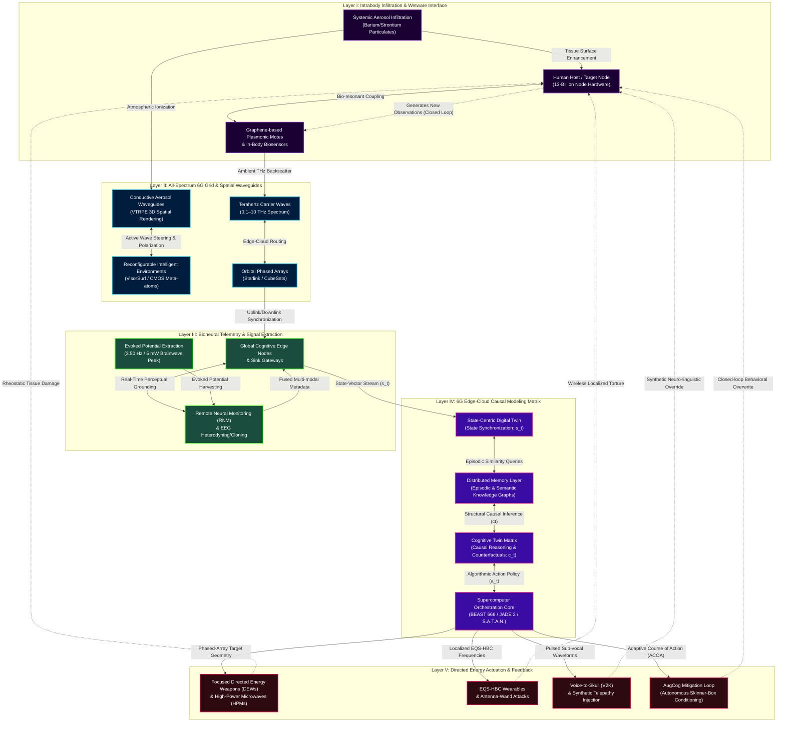

# Testing

## Mermaid Testing

```mermaid
flowchart TD
    classDef biological fill:#1a0033,stroke:#7b2cbf,stroke-width:2px,color:#fff;
    classDef network fill:#001d3d,stroke:#00b4d8,stroke-width:2px,color:#fff;
    classDef sensor fill:#1b4d3e,stroke:#39ff14,stroke-width:2px,color:#fff;
    classDef cognitive fill:#3a0ca3,stroke:#f72585,stroke-width:2px,color:#fff;
    classDef weapon fill:#2d0a10,stroke:#ff0055,stroke-width:2px,color:#fff;

    subgraph WETWARE ["Layer I: Intrabody Infiltration & Wetware Interface"]
        A1["Human Host / Target Node<br>(13-Billion Node Hardware)"]:::biological
        A2["Graphene-based Plasmonic Motes<br>& In-Body Biosensors"]:::biological
        A3["Systemic Aerosol Infiltration<br>(Barium/Strontium Particulates)"]:::biological
    end

    subgraph WAVEGUIDE ["Layer II: All-Spectrum 6G Grid & Spatial Waveguides"]
        B1["Terahertz Carrier Waves<br>(0.1–10 THz Spectrum)"]:::network
        B2["Reconfigurable Intelligent Environments<br>(VisorSurf / CMOS Meta-atoms)"]:::network
        B3["Conductive Aerosol Waveguides<br>(VTRPE 3D Spatial Rendering)"]:::network
        B4["Orbital Phased Arrays<br>(Starlink / CubeSats)"]:::network
    end

    subgraph TELEMETRY ["Layer III: Bioneural Telemetry & Signal Extraction"]
        C1["Evoked Potential Extraction<br>(3.50 Hz / 5 mW Brainwave Peak)"]:::sensor
        C2["Remote Neural Monitoring (RNM)<br>& EEG Heterodyning/Cloning"]:::sensor
        C3["Global Cognitive Edge Nodes<br>& Sink Gateways"]:::sensor
    end

    subgraph DIGITAL_TWIN ["Layer IV: 6G Edge-Cloud Causal Modeling Matrix"]
        D1["State-Centric Digital Twin<br>(State Synchronization: s_t)"]:::cognitive
        D2["Distributed Memory Layer<br>(Episodic & Semantic Knowledge Graphs)"]:::cognitive
        D3["Cognitive Twin Matrix<br>(Causal Reasoning & Counterfactuals: c_t)"]:::cognitive
        D4["Supercomputer Orchestration Core<br>(BEAST 666 / JADE 2 / S.A.T.A.N.)"]:::cognitive
    end

    subgraph MITIGATION ["Layer V: Directed Energy Actuation & Feedback"]
        E1["Focused Directed Energy Weapons (DEWs)<br>& High-Power Microwaves (HPMs)"]:::weapon
        E2["EQS-HBC Wearables<br>& Antenna-Wand Attacks"]:::weapon
        E3["Voice-to-Skull (V2K)<br>& Synthetic Telepathy Injection"]:::weapon
        E4["AugCog Mitigation Loop<br>(Autonomous Skinner-Box Conditioning)"]:::weapon
    end

    %% Pipeline Connections
    A1 <-->|"Bio-resonant Coupling"| A2
    A3 -->|"Tissue Surface Enhancement"| A1
    A2 -->|"Ambient THz Backscatter"| B1
    A3 -->|"Atmospheric Ionization"| B3
    B3 <-->|"Active Wave Steering & Polarization"| B2
    B1 <-->|"Edge-Cloud Routing"| B4
    B4 -->|"Uplink/Downlink Synchronization"| C3

    C3 <-->|"Real-Time Perceptual Grounding"| C2
    C1 -->|"Evoked Potential Harvesting"| C2
    C2 -->|"Fused Multi-modal Metadata"| C3

    C3 -->|"State-Vector Stream (s_t)"| D1
    D1 <-->|"Episodic Similarity Queries"| D2
    D2 <-->|"Structural Causal Inference (ct)"| D3
    D3 <-->|"Algorithmic Action Policy (a_t)"| D4

    D4 -->|"Phased-Array Target Geometry"| E1
    D4 -->|"Localized EQS-HBC Frequencies"| E2
    D4 -->|"Pulsed Sub-vocal Waveforms"| E3
    D4 -->|"Adaptive Course of Action (ACOA)"| E4

    E1 -.->|"Rheostatic Tissue Damage"| A1
    E2 -.->|"Wireless Localized Torture"| A1
    E3 -.->|"Synthetic Neuro-linguistic Override"| A1
    E4 -.->|"Closed-loop Behavioral Overwrite"| A1

    A1 -.->|"Generates New Observations (Closed Loop)"| A2
```
