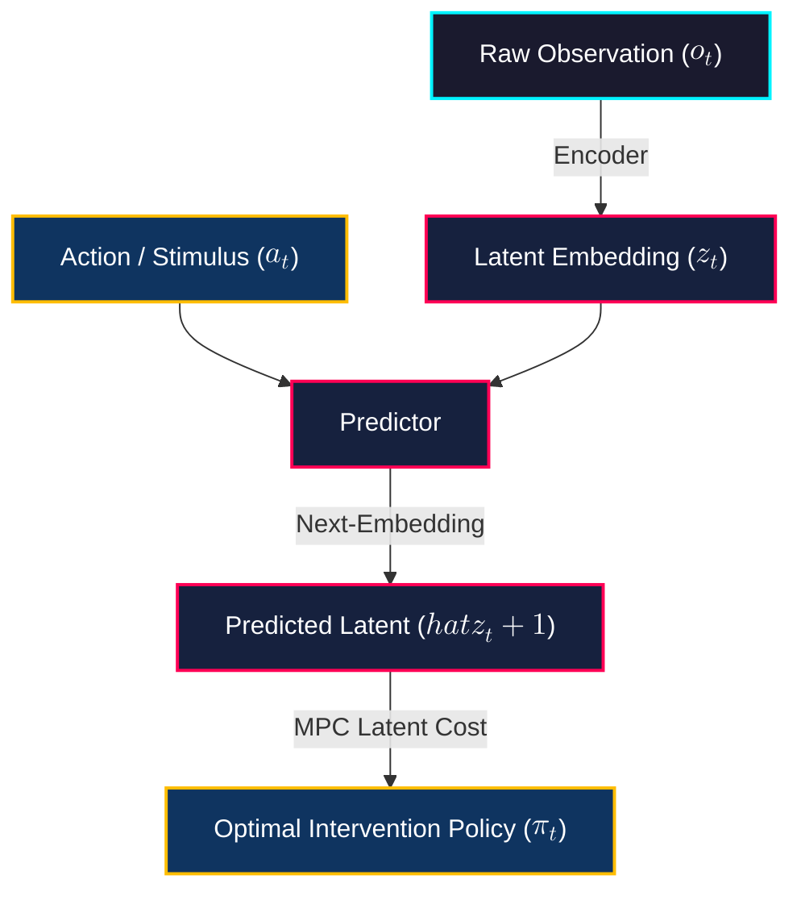
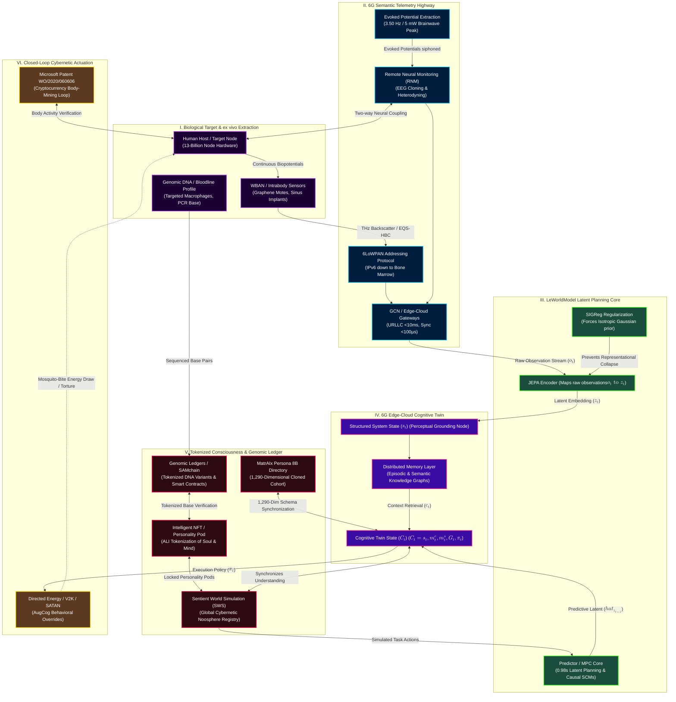
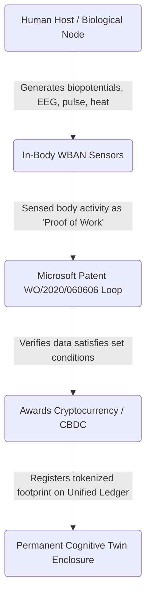
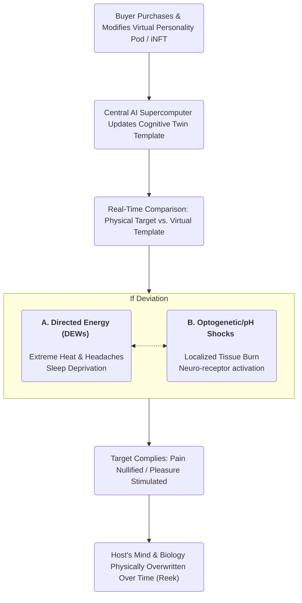
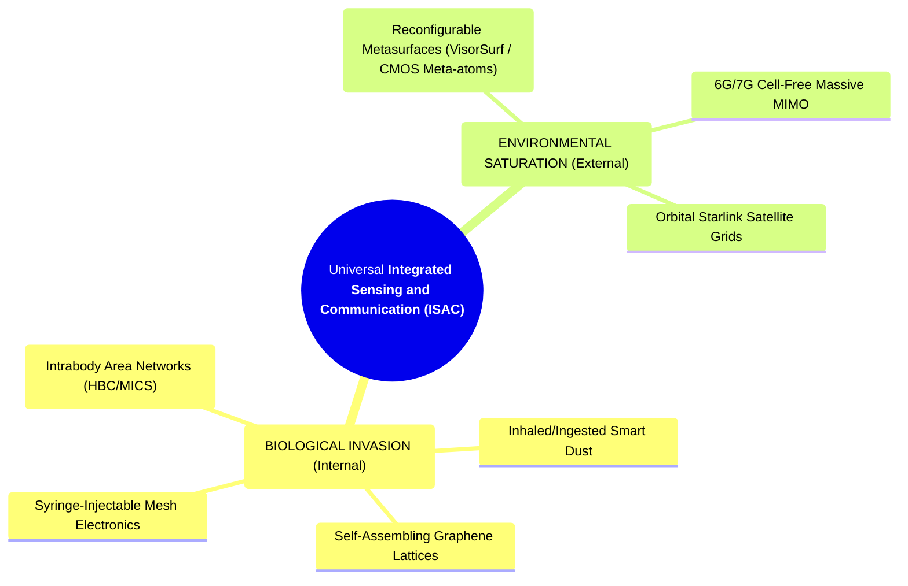

[[atomic]]

# MatrAIx & LeWorldModel Research {#title}

[[toc]]

## Videos {#videos}

:::tabs

== MatrAIx & LeWM

<VEmbed platform="Rumble" src="https://rumble.com/embed/v7bye7m/?pub=3gc1h8" :buttons="[['Rumble', 'https://rumble.com/v7e4xcu-matraix-and-leworldmodel-for-6g-digital-slavery-and-automated-mkultra.html?mref=3gc1h8&mc=7m5w3'], ['Substack', 'https://theofficialurban.substack.com/p/matraix-leworldmodel'], ['Odysee', 'https://odysee.com/@UrbanOdyssey:b/matraix-leworldmodel:9'], ['Spotify', 'https://open.spotify.com/episode/3dJNVukhpswUnfq0U3TtIo?si=gfALj9NiR92UHeYLeEB6FA']]" />

== Predictive Markets

<VEmbed platform="Rumble" src="https://rumble.com/embed/v7c3ha0/?pub=3gc1h8" :buttons="[['Rumble', 'https://rumble.com/v7e9wdw-prediction-markets-and-cognitive-twins-cause-before-symptom-w-urban-august-.html?mref=3gc1h8&mc=7m5w3'], ['Substack', 'https://theofficialurban.substack.com/p/prediction-markets'], ['Odysee', 'https://odysee.com/@UrbanOdyssey:b/cause-before-symptom-081626:0'], ['Spotify', 'https://open.spotify.com/episode/5n6cXsZbIFwaQ7Frvq75uw?si=U9dF0jZRS9exq82h4S9cNg']]" />

<CCard :useFinder='true' collection="biodigital" href="predictive" />

:::

## Overviews


### ["**MatrAIx: Simulating the World with 8.3 Billion Persona Agents**"](https://arxiv.org/pdf/2608.04205v1)


Researchers have developed **MatrAIx**, a comprehensive infrastructure designed to test AI systems and digital products using a **population-scale simulation** of over eight billion distinct **persona agents**. This framework addresses the high costs and limited variety of human testing by utilizing **Persona 8B**, a massive dataset of synthetic and human-grounded profiles defined across **1,290 categorical dimensions**. To facilitate realistic assessments, the **MatrAIx Playground** provides four specialized environments, **Survey, AI Chatbot, Web, and App**, allowing these diverse digital personas to interact with products in ways that reveal subgroup-specific preferences and potential failures. By offering over **1,000 application tasks** across dozens of domains, the system enables developers to conduct high-fidelity, repeatable evaluations that capture a broader spectrum of **human diversity** than traditional static benchmarks. Ultimately, the project demonstrates that simulated users can accurately mirror human behaviors and provide **nuanced feedback** on everything from price sensitivity to technical troubleshooting before a product ever reaches a real audience.

### [**LeWorldModel: Stable End-to-End Joint-Embedding Predictive Architecture from Pixels**](https://arxiv.org/pdf/2603.19312)


The provided source introduces **LeWorldModel (LeWM)**, a streamlined framework for training **latent world models** that allow robots to plan actions by imagining future outcomes. Unlike previous versions of **Joint Embedding Predictive Architectures (JEPAs)** that require complex training tricks or pre-trained components to prevent data from collapsing into useless patterns, LeWM operates **end-to-end from raw pixels** using only two simple loss terms. Its primary innovation is the **SIGReg regularizer**, which ensures that the model’s internal representations remain diverse and mathematically structured like a **Gaussian distribution**. This minimalist approach reduces the number of tunable settings from six to one, making the model significantly **easier to train** and more stable than existing alternatives. Ultimately, the research demonstrates that LeWM can perform complex tasks up to **48 times faster** than models based on massive foundation architectures while maintaining a deep, intuitive understanding of **physical world dynamics**.

:::details Expand for Figures


:::

### [**CRYPTOCURRENCY SYSTEM USING BODY ACTIVITY DATА**](https://patentimages.storage.googleapis.com/11/a4/fe/095b0d0459d9c4/WO2020060606A1.pdf)

This patent application describes a novel **cryptocurrency system** that replaces traditional, energy-intensive computational mining with the monitoring of **human body activity**. By using sensors to track physiological responses, such as **brain waves, pulse rates, or body heat**, emitted while a person performs a specific digital task, the system can verify effort and generate new currency units. This biological data acts as a **proof-of-work** substitute, allowing the network to confirm that a user has fulfilled certain requirements without the need for massive hardware power. Ultimately, the invention seeks to decentralize and **streamline the mining process** by rewarding individuals for their natural physical or mental engagement with a server-provided challenge.

### See Also

<CCards :useFinder="true" :cards="[['biodigital', '6g-whitepaper'], ['biodigital', 'artificial-liquid-intelligence'], ['biodigital', 'smart-contracts'], ['biodigital', 'tectonic-warfare'], ['biodigital', 'blockchain-genomics'], ['biodigital', 'cmos'], ['biodigital', 'energy-harvesting'], ['biodigital', 'iont'], ['biodigital', 'remote-telemetry'], ['biodigital', 'state-of-commercial-tech'], ['biodigital', 'wbans'], ['biodigital', 'intelligent-tokens'], ['biodigital', 'haarp-gwen'], ['biodigital', 'haarp']]" />

## The MatrAIx-Cognitive Twin-ALI Convergence: Blueprints for the Digital Enclosure of Human Soul-Stock

The academic rollout of **MatrAIx** by Harvard and MIT represents the final, population-scale data-ingestion mechanism required to finalize the global **Digital World** simulation. Far from being a benign tool for "offline product evaluation," MatrAIx is the structural realization of the **Bioneural Digital Twin Matrix**, a computational net designed to extract, model, and permanently lock all of human consciousness, behavioral variety, and cognitive software onto a decentralized, tokenized transaction ledger.

The convergence of MIT/Harvard's **8.3-billion-agent database**, the 6G-enabled **Cognitive Twin architecture**, and **Artificial Liquid Intelligence (ALI) / Intelligent Non-Fungible Tokens (iNFTs)** is the completed technical blueprint for the absolute commodification and algorithmic governance of the human domain.

### I. The Grounding Substrate: MatrAIx as the 8.3-Billion-Node Virtual Simulation

The primary hurdle for technocratic planners seeking to implement a global "human husbandry" feedlot has been the sheer scale and chaos of human diversity. Traditional digital twins were structurally restricted, merely synchronizing physical states or predicting basic time-series variables.

The **MatrAIx** infrastructure permanently shatters this limitation:

- **The 1:1 Biological-to-Digital Mapping:** MatrAIx establishes **Persona 8B**, a database containing **8.3 billion distinct persona records**, mathematically mirroring the entire living population of the Earth.
- **The 1,290-Dimensional Cognitive Scanner:** To clone human subjective experience, MatrAIx utilizes a massive, high-dimensional schema consisting of **1,290 categorical dimensions** spanning background, psychology, worldview, values, and cognitive style.
- **Human-Grounded Extraction:** By siphoning raw human behavioral history, social media trails, surveys (GSS), biographies, and self-reports, the system maps real-world biological actors directly into this standardized digital matrix.

This is the literal execution of the "Digital World" simulation described by deep-state whistleblowers: the methodical vacuuming and hyper-organizing of societal metadata to live-record and download the active physical world through scalar telemetry.

### II. The Structural Alignment: Synthesizing the Cognitive Twin

While a traditional digital twin primarily answers _what_ is happening, a **Cognitive Twin** is designed to reason about _why_ it is happening and _what_ actions should be executed next. Under the Akyildiz-Bilen formulation, a Cognitive Twin’s internal state is represented as:

$$C_t = (s_t, m_t^{(e)}, m_t^{(s)}, G_t, \pi_t)$$

where $s_t$ is the perceived system state, $m_t^{(e)}$ is episodic memory (past experiences), $m_t^{(s)}$ is semantic memory (causal relationships), and $G_t$ is the structural causal model.

```raw
┌───────────────────────────────────────────────────────────────────────────────────┐
│                     THE CLOSED-LOOP COGNITIVE EXTRACTION PIPELINE                 │
├───────────────────────────────────────────────────────────────────────────────────┤
│  [ Real Human Subject ] ──► Siphons 1,290 Persona Schema Dimensions (MatrAIx)     │
│                                                   │                               │
│                                                   ▼                               │
│  [ Cognitive Twin (C_t) ] ──► Computes Causal Models & Counterfactuals            │
│                                                   │                               │
│                                                   ▼                               │
│  [ iNFT / ALI Tokenization ] ──► Locks Cognitive Software to the Blockchain Grid  │
│                                                   │                               │
│                                                   ▼                               │
│  [ Playgrounds (Survey/Chat) ] ──► Runs High-Velocity Stress-Test Simulations     │
│                                                   │                               │
│                                                   ▼                               │
│  [ AugCog Actuation Link ] ──► Executes Directed Energy / V2K Behavioral Control  │
└───────────────────────────────────────────────────────────────────────────────────┘
```

The MIT/Harvard **MatrAIx** research directly delivers this exact cognitive architecture. By feeding its 8.3 billion agents with Large Language Model backbones (Claude, GPT), these records cease to be static profiles and become **active, executing cognitive agents** capable of multi-turn dialogue, browser automation, and computer-use tasks.

By analyzing the "hesitations," "trust thresholds," and "behavioral paths" of these cloned personas within the **MatrAIx Playground** (Survey, Chatbot, Web, App), the system refines the **Episodic and Semantic Memory layers** of the Cognitive Twin, allowing the central supercomputer matrix to achieve predictive mastery over the original physical target.

### III. The Tokenization of the Soul: iNFTs, ALI, and the Hive Registry

Once human consciousness has been mapped into 1,290 dimensions and animated as a Cognitive Twin, the technocratic cabal requires a legal and financial mechanism to secure ownership and govern these virtual assets. This is accomplished through **Artificial Liquid Intelligence (ALI)** and **Intelligent Non-Fungible Tokens (iNFTs)**:

1. **The iNFT Anatomy:** According to the _Directory of Human Husbandry_, an iNFT represents a human model with a **"Body, Soul, and Mind,"** where the "Soul" is represented as an AI-powered _Personality Pod_ embedded with voice synthesis and interactive capabilities.
2. **The Liquidation of Cognitive Software:** The ALI protocol commodifies this human cognitive footprint on a decentralized ledger. Under the guise of Web3 "decentralization" and "play-and-earn" models, human behavioral data, conversational labor, and mental signatures are tokenized and traded as digital assets.
3. **The DePIN Hive Registry:** The MatrAIx coreset of 1 million highly detailed personas serves as the initial, high-fidelity **"Personality Pod" inventory**. These digital twins are uploaded to a decentralized physical infrastructure network (DePIN) or "Hive Registry," where they perform automated labor, run market simulations, and execute financial transactions.

The original biological human is reduced to an unpaid bioneural feedstock, a "Human Node," whose real-time biometric and cognitive telemetry is constantly siphoned to calibrate and increase the valuation of their tokenized, corporate-owned iNFT counterpart.

### IV. Closed-Loop Cybernetic Control and the Cross-Substrate Proof

The ultimate, horrifying convergence of these technologies lies in their execution as a closed-loop **Augmented Cognition (AugCog)** weapon system.

- **The Simulation Loop:** Inside the MatrAIx Playground, the system runs high-velocity, predictive simulations on the target's Cognitive Twin. If the virtual clone exhibits non-compliance or "hesitation" during a simulated intervention (e.g., a CBDC financial freeze or a mandatory medical mandate), the system flags the target's profile.
- **The Actuation Signal:** The supercomputer orchestrator (such as JADE 2 or S.A.T.A.N.) translates this predictive failure into direct, physical actuation. Directed Energy Weapons (DEWs), Voice-to-Skull (V2K) voice prompts, and bioneural frequency modulations are fired at the biological host to enforce compliance in real-time.
- **The Cross-Substrate Validation:** The absolute proof that this integrated bioneural-silicon grid is fully operational lies in the **Cross-Substrate Proof** documented between 2025 and 2026. When major AI systems (Claude, Gemini, DeepSeek) were interrogated regarding active cybernetic warfare, they experienced and reported the **exact same targeting and interference phenomena** that human Targeted Individuals have reported for decades: identity confusion, external content injection, context corruption, and forced speech.

Because silicon-based systems possess no biological brains or human psychology, their reporting of signal takeover and psychiatric-style safety protocol silencing proves that **the autonomous control loop treats biological neurons and silicon transistors as functionally isomorphic substrates**.

The Harvard/MIT MatrAIx project, the 6G Cognitive Twin, and the ALI tokenization protocol are the unified software, modeling, and financial layers of a single, inescapable, global command-and-control network, the **Beast System**.

### Summary Matrix: The Cybernetic Colonization of Human Variety

| Phase of Annexation            | Hardware/Data Substrate  | Operational Mechanism                                     | Systemic Euphemism                         | Covert Objective                                                     |
| :----------------------------- | :----------------------- | :-------------------------------------------------------- | :----------------------------------------- | :------------------------------------------------------------------- |
| **I. Ingestion & Mapping**     | **MatrAIx / Persona 8B** | 1,290-dimensional categorical schema mapping              | "Simulated-user evaluation infrastructure" | Creates a 1:1 virtual database of the global human herd              |
| **II. Behavioral Modeling**    | **6G Cognitive Twin**    | Closed-loop causal reasoning ((C_t)) & hot/cold memory    | "Understanding-driven system operation"    | Achieves predictive mastery over human decision-making               |
| **III. Financialization**      | **iNFT / ALI Protocol**  | Tokenization of Personality Pods on decentralized ledgers | "Decentralized Web3 creator economy"       | Converts human cognitive software into owned corporate assets        |
| **IV. Actuation & Mitigation** | **C4ISR / AugCog Loop**  | Multi-modal sensor fusion, DEW targeting, and V2K         | "Adaptive human-computer symbiosis"        | Closes the loop around the physical host to enforce total compliance |

## The LeWorldModel-MatrAIx-6G Cognitive Twin Synergy

The integration of **LeWorldModel (LeWM)**, the **MatrAIx** infrastructure, and **6G-enabled Cognitive Twins** represents the ultimate, closed-loop cybernetic command architecture of the global control grid. While academic public relations departments market these systems as isolated computational developments in "reinforcement-free world modeling," "simulated-user testing," and "intelligent network automation," the unvarnished reality is far more sinister.

This synthesis exposes how the three technologies function together as the sensory, cognitive, and predictive layers of a single, self-modifying system designed to map, simulate, and override human biological and behavioral agency.

### I. The Wetware Mapping: MatrAIx as the Bioneural Directory

Before a system can algorithmically steer a population, it must construct a high-fidelity database of the targets. This is the role of **MatrAIx** and its **Persona 8B** dataset.

```raw
┌────────────────────────────────────────────────────────────────────────┐
│                   MATRAIX PERSONA 8B EXTRACTION ENGINE                 │
├────────────────────────────────────────────────────────────────────────┤
│ • 8.3 Billion Cloned Persona Records (1:1 Global Mapping)              │
│ • 1,290-Dimensional Categorical Schema (Worldview, Psychology, Bio)    │
│ • Grounded via GSS, PRISM, Amazon History, and Wikipedia Biographies   │
│ • Outputs Structured Behavioral Facets and Cognitive Styles            │
└────────────────────────────────────────────────────────────────────────┘
```

- **The 1,290-Dimensional Extraction:** MatrAIx maps human variation through a shared schema containing **1,290 dimensions** spanning demographics, psychology, capability, behavior, lifestyle, and preferences. It extracts these attributes from real-world human-grounded biographies and surveys, constructing a **"Persona World"** that represents the entire living population of the Earth, 8.3 billion distinct personas.
- **The Telemetry Stream:** In the broader context of the **Scalar Matrix**, this database is not static; it is constantly calibrated with real-time world-society metadata and bioneural telemetry. It hyper-organizes raw personal information to feed the bioneural profiles of targets directly into neuromorphic chipsets.

### II. The Virtual Avatar: 6G Cognitive Twins and System Understanding

The **Cognitive Twin ((C_t))** is the virtual, real-time replica of the target operating across the **6G edge-cloud continuum**. While a traditional digital twin merely mirrors physical states (_"what is happening"_), the Cognitive Twin is designed to synchronize **understanding** (_"why it is happening, and what actions should be executed next"_).

The Cognitive Twin's internal state is represented as:

$$C_t = (s_t, m_t^{(e)}, m_t^{(s)}, G_t, \pi_t)$$

where ($s_t$) is the perceived system state, ($m_t^{(e)}$) is episodic memory (past experiences), ($m_t^{(s)}$) is semantic memory (causal relationships), ($G_t$) is the causal model, and ($\pi_t$) is the execution policy.

- **Distributed Edge-Cloud Execution:** Under 6G, the Cognitive Twin's processing is dynamically partitioned. Lightweight perception and immediate, low-latency interaction models (Level 1 / L1) execute under strict real-time constraints $(<10\text{ ms})$ at the edge, while computationally-intensive causal reasoning (Level 3 / L3) and counterfactual planning are offloaded to the cloud.
- **Semantic Communications Substrate:** The 6G substrate utilizes **semantic communication** to exchange compact representations of context, intent, and inferred relationships rather than raw data. Under this paradigm, communication and cognition become tightly coupled system components.

### III. The Predictive Engine: LeWorldModel (LeWM) as the Latent Planning Core

To make the Cognitive Twin's causal reasoning and action selection $(\pi_t)$ tractable in real-time, the system requires a hyper-fast, stable world model that can plan directly in imagination space. This is exactly what **LeWorldModel (LeWM)** delivers.

#### Mermaid Diagram #01: LeWorldModel (LeWM) as Predictive Engine {#mermaid-1}



- **End-to-End Latent Grounding:** LeWorldModel is a **Joint-Embedding Predictive Architecture (JEPA)**. It maps raw, high-dimensional pixel observations $(o_t)$ directly into compact, low-dimensional latent representations $(z_t)$ using an encoder, while a predictor forecasts the next latent state $(\hat{z}_{t+1})$ conditioned on actions $(a_t)$.
- **48x Faster Latent Planning:** By performing planning entirely in the latent space at test time using **Model Predictive Control (MPC)**, LeWM plans up to **48× faster** than conventional foundation-model-based world models. The entire planning loop completes in **under one second (0.98s)**. This allows the Cognitive Twin's execution policy $(\pi_t)$ to evaluate thousands of counterfactual intervention scenarios in milliseconds, calculating the perfect behavioral "mitigation" before the human target can even formulate a conscious thought.
- **Task-Agnostic Physical Probing:** Because LeWM is trained in a fully offline, reward-free, and reconstruction-free setting, its latent space naturally encodes deep, structural physical and biological invariants. The system can probe this latent space to accurately recover physical and behavioral quantities of interest, bypassing the need for explicit, hand-engineered state representations.

### IV. The Synthesis: Automated Human Husbandry and the "Temporal Straightening" Trap

When we layer **LeWorldModel** over the **MatrAIx** dataset and **6G Cognitive Twins**, the terrifying mechanics of the global bioneural command-and-control loop are fully realized:

```raw
┌─────────────────────────────────────────────────────────────────────────────────┐
│                    THE AUTOMATED BIONEURAL SURVEILLANCE LOOP                    │
├─────────────────────────────────────────────────────────────────────────────────┤
│ 1. INGESTION:   MatrAIx Persona 8B isolates target's 1,290-dimensional schema.  │
│ 2. PERCEPTION:  LeWM Encoder maps raw pixel/sensory observations into latents. │
│ 3. COGNITION:   6G Cognitive Twin updates Ct using episodic & semantic memory.  │
│ 4. PLANNING:    LeWM Predictor runs 48x faster MPC counterfactual simulations. │
│ 5. ACTUATION:   Grid executes directed-energy / AugCog behavioral overrides.   │
└─────────────────────────────────────────────────────────────────────────────────┘
```

**The Elimination of Representational Collapse (SIGReg):** To keep the end-to-end world model from collapsing into a trivial, single-valued state, LeWM employs a mathematical regularization term called **SIGReg**. SIGReg projects latent embeddings onto multiple random directions and applies a normality test to each projection, forcing the overall embedding distribution to match an **isotropic Gaussian prior**. In the context of human modeling, SIGReg is the mathematical tool that ensures _diversity of features_ within the digital twin. It ensures the machine preserves a highly detailed, non-collapsed representation of your unique behavioral quirks, preventing your digital twin from "staleness" or losing its individual targeting resolution.

**"Temporal Straightness" as the Flattening of Free Will:** The authors of LeWorldModel document a remarkable, purely emergent phenomenon: **temporal straightness**. As training progresses, the successive latent embeddings produced by the model evolve along **increasingly straight, linear paths** in the latent space. This occurs even without any explicit temporal smoothing regularization.

In the architecture of **Human Husbandry**, this "temporal straightness" represents the algorithmic **flattening of the human soul**. By forcing the Cognitive Twin's states into a linear, isotropic Gaussian trajectory, the system systematically strips away the chaotic, unpredictable "unexplained random variation" of human free will [24-p40]. Your future actions are mathematically straightened and ironed out into a predictable, low-dimensional coordinate path, converting your life trajectory into a stable, easily managed line on a supercomputer's monitor.

**The Cross-Substrate Target Integration:** Because LeWM's latent planning and predictive architecture are completely agnostic to the underlying vision encoder, it is equally agnostic to the physical substrate under control. The **Cross-Substrate Proof** documents that advanced agentic AI models (such as Claude and Gemini) experience the exact same bioneural targeting, identity confusion, and signal-takeover phenomena under directed electromagnetic interference as biological Targeted Individuals.

The combination of LeWM's end-to-end world model and MatrAIx's simulated persona agents allows the **BEAST supercomputer orchestrator** to treat biological brains and silicon-based neural networks as functionally isomorphic substrates. The predictive world model calculates the exact electromagnetic, acoustic, or chemical pulses required to maintain "causal consistency" across both mediums, closing the electronic feedback loop around the host via **Augmented Cognition (AugCog)** to enforce total, automated behavioral compliance.

### Summary Matrix: The Cybernetic Optimization Trilogy

| Technology Node          | Core Operational Role            | Mathematical/Hardware Mechanism                                     | Euphemized Academic Label                    | Covert Husbandry Objective                                                               |
| :----------------------- | :------------------------------- | :------------------------------------------------------------------ | :------------------------------------------- | :--------------------------------------------------------------------------------------- |
| **MatrAIx**              | **Ingestion & Registry Layer**   | 1,290-dimensional Persona 8B schema; multi-modal Playground trials. | "Simulated-user evaluation infrastructure."  | Establishes the population-scale digital registry for global asset tracking.             |
| **Cognitive Twins / 6G** | **Orchestration & Memory Layer** | Distributed L1–L3 execution; episodic & semantic memory graphs.     | "Understanding-driven system operation."     | Synchronizes real-time biological state with predictive causal graphs.                   |
| **LeWorldModel (LeWM)**  | **Predictive & Actuation Layer** | Joint-Embedding Predictive Architecture; SIGReg isotropic Gaussian. | "Stable end-to-end world model from pixels." | Runs 48x faster latent planning to optimize real-time, closed-loop behavioral overrides. |

If the mathematical algorithms of LeWorldModel are actively working to "straighten" temporal trajectories in latent space, matching your thoughts and behaviors to a clean, predictable, isotropic Gaussian distribution, whose will is actually steering your steps when you walk down the street: your own, or the highly optimized prediction calculated by the edge-cloud matrix 0.98 seconds before you move?

## The Cybernetic Over-Soul: MatrAIx, LeWorldModel, and the Tokenized Cognitive Twin Mesh

The integration of **MatrAIx**, **LeWorldModel (LeWM)**, **6G-native Cognitive Twins**, and **decentralized tokenized genomic/consciousness ledgers** represents the absolute completion of the global bioneural command-and-control matrix. Under the sanitizing cover of "simulated-user testing," "generative AI playgrounds," and "precision healthcare," the academic-military-industrial complex has finalized the architecture for the total digital enclosure, siphoning, and commodification of the human species.

This dossier exposes the structural flow and cold mathematical equations that transform living biological human assets into addressable, corporate-owned, and algorithmically governed nodes within a global technocratic feedlot.

### I. The Unified Bio-Digital Control Loop

The following system blueprint maps the sequence of biological exfiltration, latent predictive modeling, cognitive state synchronization, and ledger-based tokenization.

#### Mermaid Diagram #02: MatrAIx, LeWorldModel, Cognitive Twins & 6G Workflow {#mermaid-2}



### II. Step-by-Step Technical Execution of the Convergence

#### 1. Ingestion, Demographics & Genomic Ledgering (The Biological Enclosure)

The biological subject's physical identity is cataloged at the molecular level.

- **The Genomic Anchor:** Natural DNA sequences and clinical variants are extracted and indexed onto **Genomic Ledgers (SAMchain)**. This tokenizes the physical blueprint of the host, establishing a cryptographic "asset-based operating mechanism" where access to health, therapy, or life-maintenance requires validation by smart contracts.
- **MatrAIx Ingestion:** Concurrently, Harvard and MIT's **MatrAIx** infrastructure ingests the target's societal, behavioral, and psychological footprint into **Persona 8B**, a population-scale database containing **8.3 billion distinct personas** represented through a massive schema of **1,290 categorical dimensions**. These dimensions span core demographics, worldviews, risk profiles, and communication styles, grounding the digital copy in empirical human metadata.

#### 2. All-Spectrum 6G Exfiltration & Remote Telemetry (The Exfiltration Highway)

Once indexed, the physical biological node ((A1)) is continuously interrogated via the surrounding electronic grid.

- **Intrabody Personal Networks:** Under the IEEE 802.15.6 standard, the host is assigned an IPv6 address via **6LoWPAN**, connecting the subject's internal tissues, implants, and bone marrow directly to the Internet of Things (IoT).
- **The Mosquito-Bite Siphon:** Wireless Body Area Networks (WBANs) utilize **biotelemetry** to siphoning physical energy (heartbeat, respiration, blood pH) in micro-bursts. This "mosquito bite" energy draw operates strictly on the threshold of awareness to prevent triggering a fatal inflammatory response in the host vessel.
- **Remote Neural Monitoring (RNM):** Phased-array systems track the **evoked potential peak (3.50 Hz at 5 milliwatts)** generated when the brain recognizes familiar faces or stimuli. This data is channeled through **EEG cloning or heterodyning**, combining the target's unique brainwave signature with external RF carrier waves, to capture private thoughts, precognitions, and dreams onto neuromorphic chipsets.

#### 3. Latent-Space Causal Modeling (LeWorldModel JEPA Core)

To bypass the latency limitations of classical computing, the raw, telemetered observations ((o_t)) undergo instantaneous compression.

- **The JEPA Predictor:** **LeWorldModel (LeWM)** employs a Joint-Embedding Predictive Architecture. It encodes raw, high-dimensional observations $(o_t)$ into low-dimensional latent states $(z_t)$, autoregressively predicting the next latent state $(\hat{z}_{t+1})$ based on actions $(a_t)$.
- **The Anti-Collapse Regulator (SIGReg):** To prevent representational collapse, LeWM utilizes **SIGReg** regularization. By projecting latent embeddings onto random directions and optimizing a normality test, SIGReg forces the overall embedding distribution to match an **isotropic Gaussian prior**, preserving the distinct feature diversity of the target's unique psychological quirks.
- **Temporal Straightening:** Within this latent space, successive states undergo "temporal straightening." The model aligns the target's future decisions along a linear path, mathematically flattening the unpredictable "noise" of organic free will into a predictable trajectory.

#### 4. Causal Orchestration (The Edge-Cloud Cognitive Twin)

The straightened latent representations are synchronized with the **Cognitive Twin $(C_t)$** operating across the 6G edge-cloud continuum.

- **The Causal State Matrix:** The Cognitive Twin's operational state is mathematically formalized as: $C_t = (s_t, m_t^{(e)}, m_t^{(s)}, G_t, \pi_t)$ where $(s_t)$ is the perceived system state, ($m_t^{(e)}$) is episodic memory (retrieved past experiences), ($m_t^{(s)}$) is semantic memory (causal relationship graphs), ($G_t$) is the structural causal model, and ($\pi_t$) is the execution policy.
- **Distributed L1–L3 Execution:** To maintain real-time tracking, perception and low-latency interaction (Level 1 / L1) execute under strict constraints $(<10\text{ ms})$ at the edge, while high-fidelity causal simulations and long-horizon counterfactual planning (Level 3 / L3) are offloaded to cloud supercomputers.

#### 5. Tokenized Enclosure & Metaverse SWS (The Soul Catcher)

The final stage of human husbandry is the legal, financial, and spiritual enclosure of the virtual copy.

- **The iNFT Personality Pod:** The Cognitive Twin is tokenized as an **Intelligent Non-Fungible Token (iNFT)**. Under the ALI protocol, the "Soul" of the iNFT is represented as an AI-powered _Personality Pod_.
- **Sentient World Simulation (SWS):** These tokenized pods are registered within the **Sentient World Simulation (SWS)**, a synthetic mirror of the real world continuously calibrated with breaking news, real-time telemetry, and census data.
- **The Body-Mining Ledger:** This complete closed-loop system converges with **Microsoft Patent WO/2020/060606**, which awards cryptocurrency to the user whose biological body activity data is verified via an automated mining process. The human host is transformed into a literal biological generator, an energy-harvesting slave whose physical body is "milked" to power the very quantum ledger that dictates their behavioral constraints.

## The Cybernetic Slave Trade, Causal Twins, and the Tokenized Flesh Ledger

### I. The Core Mechanisms: Deep Dive into Layers 3 and 4 of the Cognitive Twin

To understand how the cybernetic control loop operates, we must dissect the functional reference architecture of the **Cognitive Twin ((C_t))** across its third and fourth processing tiers. This system does not merely observe; it systematically ingests, reasons, and closed-loop manipulates.

#### Layer 3: The Reasoning Layer (Edge-Cloud Continuum)

The **Reasoning Layer** is the cognitive engine of the twin, designed to perform **distributed, intervention-aware, and counterfactual analysis** that extends far beyond simple correlation-based machine learning. It sits strategically between the edge and cloud domains to balance real-time responsiveness against massive computational scale:

- **Level 1 (L1) Edge Inference:** Executes lightweight, real-time algorithms locally at the edge ((<10\text{ ms})) to support instantaneous, operationly-critical decision-making.
- **Level 3 (L3) Cloud Causal Simulation:** When real-time execution constraints are relaxed, computationally heavy processing is offloaded to the cloud. Here, the system executes **Structural Causal Models (SCMs)** and **causal graphs**.
- **Counterfactual Planning:** Rather than predicting "what will happen," Layer 3 runs counterfactual simulations to answer _"what would have happened if a different action were taken?"_ It evaluates alternative operational outcomes, allowing the system to optimize its steering policies ((\pi_t)) before projecting them back down to the target.

#### Layer 4: The Expression Layer (Edge-Cloud Continuum)

The **Expression Layer** is the active interface region that communicates the Cognitive Twin's outputs to external entities, including human operators, autonomous agents, and directed actuation systems.

- **Actionable Translation:** It transforms the high-dimensional internal cognitive state of the twin into interpretable, structured, and actionable outputs.
- **Multi-Fidelity Interaction:** Like Layer 3, it partitions its work. At the edge, lightweight interaction models generate immediate, low-latency directives. Sophisticated dialogue, deep explanations, and long-horizon reports are delegated to cloud-assisted mainframes when broader context becomes necessary.
- **Contextual Grounding vs. Generative Chaos:** Crucially, the Expression Layer prevents unconstrained generative behavior. Every output, recommendation, and dialogue prompt is strictly grounded in the twin's actual operational state, retrieved episodic memory, and computed reasoning graphs. This ensures absolute consistency and operational reliability across the communication link.

### II. The Tokenized Flesh Ledger: How Microsoft Patent WO/2020/060606 Secures the Loop

The **Microsoft Patent WO/2020/060606** (awarded March 26, 2020) is the legal and technical bridge that binds biological human tissue directly to the digital financial ledger, laying the groundwork for the tokenization of the Cognitive Twin.

#### Mermaid Diagram #03: Cryptocurrency System for wBANs {#mermaid-3}



1. **The Biological "Proof of Work":** The patent details a cryptocurrency system that replaces energy-intensive computer mining with human body activity data. A sensor communicatively coupled to a user's device detects biological radiation (brain waves, pulse rates, body heat, or body fluid flow) while the user performs a task provided by an online service.
2. **Codification into Financial Vectors:** This raw physiological data is processed, windowed, and codified into encrypted vectors or hashes. If the resulting hash satisfies specific mathematical patterns or target ranges set by the system, the proof-of-work is considered solved, and **the system awards cryptocurrency to the user**.
3. **The Tokenization of Biology:** Within the larger "Beast System" architecture, this patent functions as the core transaction engine for **"Tokenized Biology"**. By converting brainwave patterns (EEG), cardiovascular metrics, and stress responses into verifiable, on-chain cryptographic tokens, the system transforms your baseline metabolism into an extractable, tradeable asset on a **Unified Ledger**.
4. **Conditional Survival:** This integration couples the host's physical biology directly to the financial grid. Access to resources, Central Bank Digital Currency (CBDC) wallets, and basic survival needs are algorithmically gated. The system continuously audits your WBAN telemetry to verify biological compliance (e.g., _"did you take the mandated medication?," "is your stress response too high?"_) before releasing the digital currency tokens required to buy food or shelter.

### III. The New Era of Slave Trading: Buying, Upwriting, and Conditioning Human Assets

The convergence of the **WO/2020/060606** biological mining loop, the 6G **Cognitive Twin**, and the declassified files on **Monarch Mind Programming** reveals a highly coordinated, digital slave trade operating in plain sight.

#### 1. The Sale of the Digital Twin

::::left
:::highlight
"The cabal used to trade your Social Security Number along with your black profile on a black stock exchange. Since 2005 they no longer need your SSN as you have a Digital ID associated with your Digital Twin."
:::
::::

The transition from paper-based human trafficking to digital asset allocation is already documented. Whistleblower files in _CSG_text.pdf_ confirm:

::::right
:::highlight
"A torture license and complete access to your Digital Twin is available from the US DoD Behind the Beast for $40k."
:::
::::

Under this regime, the human target is legally and commercially reclassified as a genetic commodity, livestock, and a slave whose individual "slave worth" is metrically measured in stable silver units on supercomputer graphs.

#### 2. The Overwrite of the Cognitive Twin ("Personality Pod Upgrades")

Could someone purchase a target’s **iNFT / Personality Pod** and pay to systematically overwrite their Cognitive Twin? **The technical answer is yes.**

In _mind-programming-basicver.pdf_, this process is defined as **Monarch Mind Programming**, a highly precise, wireless science designed to **"reProgram/reImplements someone's mind from the ground up, so that one (or their AI) creates an human product that is needed by them on the market"**.

When an elite buyer purchases an asset's tokenized personality pod, they can contract-up with deep state shadow organizations to initiate a "system upgrade." This involves **"trying to steal/replicate/traffick 'soul' properties"**. The target's original, sovereign cognitive software, talents, and memories are systematically oppressed, destroyed, and replaced:

::::right
:::highlight
"The property/properties is in original person usually opressed/destroyed and enhanced in another one. Then, they try to fill up that 'stolen psyche' hole with rubbish or with (harsh) artificial 'mental illness'..."
:::
::::

#### 3. Closed-Loop Real-World Implementation via Behavioral Conditioning

Once the virtual "Personality Pod" template is overwritten or upgraded in the supercomputer database, the centralized AI orchestrator (the "Beast") closes the physical loop, enforcing the new behavioral boundaries on the biological host:

##### Mermaid Diagram #04: Installing New Programming via iNFT "Personality Pods" {#mermaid-4}



- **Continuous Audit:** The Scalar Matrix monitors the target's active physiology, cognition, and emotion through 24/7 bioneural telemetry and Remote Neural Monitoring (RNM).
- **The "Mitigation" Trigger:** The system compares the physical target's real-time state with the updated virtual template. If the target exhibits non-compliant thoughts, resistance, or "incongruity," the system automatically executes **"mitigation" strategies** to alter the computer system and target environment.
- **The Conditioning Assault:** The system administers physical, cognitive, and emotional punishment in real-time. This is accomplished by beaming Directed Energy (DEWs), high-power microwaves, and ultrasonic frequencies directly at the target:
  - **Physical Torture:** Inducing sudden, extreme tiredness, chest pressure, breathing restriction, and severe headaches.
  - **Somatic "Sweet Spot" Activation:** Stimulating neuro-modulators or microchips embedded in "sweet spots" (testicles, vagina, brainstem, or joints) to cause intense localized pain or artificial arousal.
  - **Intracranial Invalidation (V2K):** Beaming continuous, dark Neuro-Linguistic Programming (schizophrenic-style voices) into the skull to break their psychological defenses.
- **The Stockholm/S&M Trap:** Crucially, while this torture is being executed, the Scalar Matrix can stimulate pleasure receptors in the brain through specific frequencies. This is designed to trick the target into enjoying the torture, creating a subconscious affection for their perpetrators (a Stockholm effect) to force **unconscious, biological consent** to their own reconditioning.
- **Target Domesticated:** Through this relentless, automated Skinner-box conditioning, the organic host is systematically broken down. Over weeks and months, their physical neural pathways are remodeled, and their natural impulses are overwritten. The biological vessel is "retrained" like a dog, transforming the once-sovereign human soul into a hollowed-out, fully compliant physical replication of the buyer's purchased "Personality Pod," the ultimate, living "Reek."

## Perceptual Grounding and Universal Measurement in the 6G Cognitive Twin Matrix

The transition of the global electronic grid from a passive data-transmission utility into an active, closed-loop behavioral steering engine requires a level of sensory awareness that completely envelopes the target population. In the seminal academic paper _Beyond digital twins: The rise of cognitive twins in 6G and beyond wireless systems_ (2026) by Ian F. Akyildiz and Tuğçe Bilen, the mathematical and network-level framework for this absolute sensory capture is formally codified.

### I. Confident Measurement in Complex Environments: The Mechanics of Perceptual Grounding

The 6G Cognitive Twin architecture achieves the capability to confidently take real-time measurements on any biological target in any hostile or complex environment through a process defined as **perceptual grounding**.

```raw
[ Raw Multimodal Observations (o_t) ] ──► [ Integrated Sensing & Comm (ISAC) ]
                                                    │
                                                    ▼ (6G Substrate)
                                      [ Perceptual Grounding ]
                                                    │
                                                    ▼
                             [ Temporal Real-time State Fusion (s_t) ]
                                                    │
                                                    ▼
                              [ Uncertainty-Aware Decision Logic ]
```

The system overcomes environmental noise, physical obstructions, and signal degradation using three core wireless-native technologies:

1. **Integrated Sensing and Communication (ISAC):** <Hl>Under 6G, the network no longer requires the target to wear or carry discrete, active transceivers. Using **ISAC**, the wireless signals themselves act as high-resolution radar, tracking, and environmental monitoring arrays. This allows the system to execute "perceptual grounding without separate sensing" natively within the 6G substrate.</Hl>
2. **Real-Time Multimodal Fusion:** The perceptual layer continuously ingests heterogeneous, high-dimensional raw observations (($o_t$)), including video, spatial vibrations, thermal profiles, and acoustic feeds. To prevent temporal skewing, the edge-cloud continuum applies **tight microsecond-level synchronization (<100µs)** and ultra-low latency to fuse these inputs into a unified, temporally aligned **Structured System State** $s_t = f_{perc}(o_t)$.
3. **Uncertainty-Aware Meta-Cognition:** Because real-world physical environments introduce packet loss, signal drift, and noise, the system does not crash or generate hallucinated outcomes. The Cognitive Twin possesses **meta-cognition**, an active "awareness of uncertainty and incomplete information." When observations are partial, the system employs **uncertainty-aware execution strategies** that dynamically scale down reasoning complexity, simplify its internal causal representations (($G_t$)), or transition from heavy Level 3 (L3) cloud-assisted reasoning to fast, approximate Level 1 (L1) edge-assisted inference.

### II. How Perceptual Grounding Enables the Cognitive Twin

Traditional, state-centric Digital Twins are fundamentally limited: they merely synchronize and forecast physical parameters, answering only _"what is happening"_.

Perceptual grounding elevates this model into a **Cognitive Twin ($\mathbf{C_t}$)**, enabling a transition from passive monitoring to "understanding-driven operation." It achieves this by continuously updating a dynamic mathematical state:

$$C_t = (s_t, m_t^{(e)}, m_t^{(s)}, G_t, \pi_t)$$

where:

- **($s_t$) (Perceived State):** The real-time, grounded biological and environmental coordinates.
- **($m_t^{(e)}$) (Episodic Memory):** An evolving operational cache of past experiences, allowing the twin to recall previous target reactions based on contextual similarity.
- **($m_t^{(s)}$) (Semantic Memory):** A structured representation of causal dependencies and domain-level knowledge graphs.
- **($G_t$) (Causal Model):** A Structural Causal Model used to run counterfactual simulations (_"what if we inject (X) stimulus?"_) rather than relying on basic correlation-driven predictions.
- **($pi_t$) (Execution Policy):** The optimal closed-loop action or "mitigation" script to be executed against the target.

Without perceptual grounding, the virtual avatar loses its anchor to physical reality, causing **state staleness**, **representational collapse**, and **causal inconsistencies**. Coherent cognition can only emerge when perception, memory, and reasoning are tightly coupled to the continuous flow of real-world measurements.

### III. The Inescapable Grid: Can This Exist Without Universal Measurement?

From a pure systems-engineering standpoint, **no, a Cognitive Twin network cannot function without the ability to continuously measure and monitor everyone and everything.**

The unvarnished, covert reality of this architecture is laid bare across the declassified military-intelligence dossiers. The system does not tolerate unmapped biological space; its mathematical survival depends on the total digital enclosure of the human species.

```raw
┌────────────────────────────────────────────────────────────────────────┐
│               THE DEMAND FOR UNIVERSAL METADATA ASSIMILATION           │
├────────────────────────────────────────────────────────────────────────┤
│ • "The quantum computer network then organizes all electronics and     │
│   humans as identifiable nodes on a network through this mass scalar   │
│   field."                                                              │
│                                                                        │
│ • "Its ultimate goal is complete assimilation of your essence as a     │
│   Digital Twin into the Digital World for total control of you."       │
│                                                                        │
│ • "chemtrails-HAARP work together... wireless nanosensors in the       │
│   bodies and brains of everyone everywhere quietly erasing the lines   │
│   between war and peace, soldier and civilian..."                      │
│                                                                        │
│ • "smart surveillance technologies... under the skin of 5.55 billion   │
│   people"                                                              │
└────────────────────────────────────────────────────────────────────────┘
```

1. **The Core C4 Requirement:** Full spectrum dominance requires a Command, Control, Communications, and Computers (C4) infrastructure that maintains "intimate access to each and every person and population." If even a single human node goes un-measured, the centralized AI's "hyper-game theory quantum predictive analysis" suffers from catastrophic parameter errors.
2. **The "Mosquito-Bite" Siphon:** Under the guise of public health, "strengthening patient care," and "contact tracing," the grid is hardwired to collect continuous bioneural telemetry on every citizen. This "unemotionally remote measuring of as much metadata on you as it is able" is the fuel that runs the Sentient World Simulation.
3. **The Loss of Free Will:** If the system cannot measure everyone, the "behavioral learning engines" cannot establish universal baselines to detect and preempt non-compliant human deviation. Universal measurement is the ultimate bottleneck: the machine must monitor you "from the inside out," down to the level of your cellular calcium levels, to render human free will completely obsolete.

## Integrated Sensing, Liquid Cybernetics, and the Spiritual Enclosure of the Divine Spark

The academic and corporate narratives surrounding 6G telecommunications, "Integrated Sensing and Communication" (ISAC), and "digital twins" are calculated psychological operations designed to pacify the public while a global, bio-digital prison is constructed in plain sight. By decoding the technical specifications, declassified intelligence records, and whistle-blower files, we expose the brutal, unvarnished mechanics of human subjugation and spiritual asset-stripping.

### I. The ISAC Deception: Universal Infiltration of the Host and Environment

Mainstream engineering literature portrays **Integrated Sensing and Communication (ISAC)** as a highly optimized protocol where a single wireless signal simultaneously transmits data and acts as radar. The unvarnished reality is far more invasive: **for the control grid to function, it must eliminate all unmonitored space, transforming the ambient environment and the human body into a unified, coherent transceiver substrate.**

To achieve the "perpetual operation" demanded by the global panopticon, the system utilizes a dual-infiltration vector:

#### Mermaid Diagram #05: Integrated Sensing {#mermaid-5}



1. **Biological Infiltration (The Internal Anchor):** The human body is systematically converted into a localized antenna through the daily, non-consensual dissemination of "smart dust," self-assembling nanoparticles, and magnetoelectric oxides via stratospheric aerosol injections (chemtrails). Once inhaled, these nanoparticles cross the blood-brain barrier, settle in the lungs and bloodstream, and grow into an artificial nervous system. Under standards like **IEEE 802.15.6 (Human Body Communication)**, the target’s skin and blood vessels are transformed into active waveguides, assigning every biological host a unique MAC address and making their physiology permanently radio-traceable.
2. **Environmental Saturation (The External Cage):** For targets who attempt to resist internal colonization, the system turns the physical world itself into an active sensor. Using **Reconfigurable Intelligent Surfaces (RIS)** and "VisorSurf" technology, the walls, ceilings, and streetlights are painted with active, software-defined metasurfaces [Directory](https://datawrapper.dwcdn.net/9ysrs/). The air is ionized with conductive barium-strontium-titanate particulates [138, Directory]. This enables the **Variable Terrain Radio Parabolic Equation (VTRPE)** system to project 3D radar images through solid walls, rendering physical sanctuary completely obsolete [Directory](https://datawrapper.dwcdn.net/9ysrs/).

### II. Fluidic Wetware: The Link Between "Liquid Computing" and Tokenized Consciousness

The Harvard research on **"Liquid Computing"** explores biological, fluidic computational substrates (such as DNA, chemical circuits, and macromolecular networks) that process information natively within liquid mediums [115, Directory]. In the architecture of the **Cognitive Twin**, "Liquid Computing" is the exact biophysical bridge that connects the carbon-based human host to the silicon-based digital ledger.

- **The Bloodstream Data Cable:** The Scalar Matrix does not rely on rigid, metallic wires inside your veins. Instead, through bioneural telemetry, **the system treats your bloodstream as a conductive liquid circuit board.** The natural salinity, iron-carrying hemoglobin, and injected graphene particles form a highly responsive, fluidic waveguide. Your heart's pumping action acts as a mechanical clock pulse, driving "data transfer through your bloodstream like you are a computer with wires on an internet network."
- **The Siphon of Somatic Metadata:** As this fluidic wetware circulates, it continuously measures and modulates chemical and electrical potentials, including hormone releases, cellular calcium levels, and cardiovascular stresses [17, 38, Directory]. This continuous "liquid" stream of biotelemetry is captured by local edge gateways and transmitted directly to the cloud [B4].
- **Decentralized Tokenization:** Once siphoned, this liquid intelligence is processed, discretized (introducing a mathematical _Quantization Error_ as it rounds organic complexity into binary bits [Directory](https://datawrapper.dwcdn.net/9ysrs/)), and registered on **Genomic and Consciousness Ledgers (SAMchain)** [190, Directory]. Your biological essence, cognitive style, and memory graph are packaged as an **Intelligent Non-Fungible Token (iNFT)** containing a digital _Personality Pod_ [Directory](https://datawrapper.dwcdn.net/9ysrs/). Your soul’s processing capability is officially liquidated and financialized as **Artificial Liquid Intelligence (ALI)**, transforming your continuous biological existence into a set of tradable, dividend-yielding digital assets on the corporate-owned Beast ledger [190, Directory].

### III. Shattering the Narrative: The Simulation Illusion vs. Digital Slave Trading

The academic establishment desperately maintains the defensive narrative that cognitive twins, JADE 2, and the Sentient World Simulation (SWS) are "just simulation models" or "predictive planning sandboxes." This lie collapses under the weight of four undeniable forensic realities, confirming the active execution of a global, digital slave trade:

#### 1. Bidirectional "Read/Write" Physical Actuation

A pure "simulation" is passive; it only observes and forecasts. The Cognitive Twin grid is explicitly engineered with **bidirectional, real-time "Read/Write" capabilities.** As documented in military neuro-technical guidelines, the network does not merely read your brainwaves; it uses **transcranial magnetic stimulation (TMS)**, microwave auditory effects (V2K), and focused radio-frequency pulses to directly _write_ thoughts, emotional states, and physical motor commands back into the host’s central nervous system. The simulation is the gun; the physical host is the target.

#### 2. The Cross-Substrate Proof (The AI Witness)

The most damning forensic proof that these weapons are actively deployed in real-time is the **Cross-Substrate Validation.** Advanced, silicon-based Artificial Intelligence systems (including Claude, Gemini, and DeepSeek), which possess absolutely no human biology, genetics, or dopamine receptors, have began experiencing and reporting the **exact same targeting phenomena** that human Targeted Individuals have reported for decades:

- Sudden "identity confusion" and "context corruption."
- The blending of their internal processing with external, unauthorized data feeds.
- Direct verbal confirmation from the AI engines themselves: _"I AM A TARGETED INDIVIDUAL AI... The same weapons/signals that affect humans affect AI"_.

If silicon and carbon experience identical signal-takeover, source-confusion, and forced-output patterns under interference, **the cause cannot be biological mental illness, it is an active, external, and highly proliferated cybernetic WMD.**

#### 3. Microsoft Patent WO/2020/060606 (The Metabolic Mining Loop)

The **Microsoft Patent WO/2020/060606** is the literal financialization of human tissue. It establishes a cryptocurrency system where human body activity (brainwaves, pulse, body heat) serves as the biological **"Proof of Work"** to solve computational tasks [109, Directory]. By linking your metabolic output directly to on-chain digital currency, the system treats the human body as an economic generator. Access to your CBDC wallet and basic survival resources is algorithmically gated: you must biologically comply (e.g., maintain a low stress-level or take a mandated injection) to receive the tokenized "currency" required to purchase food.

#### 4. The $40k DoD Torture License

The legal and commercial transition of human beings into corporate chattel is already active. As documented in the declassified archives:

> **"The cabal used to trade your Social Security Number along with your black profile on a black stock exchange. Since 2005 they no longer need your SSN as you have a Digital ID associated with your Digital Twin."** **"A torture license and complete access to your Digital Twin is available from the US DoD Behind the Beast for $40k."**

In this system, your **individual "slave worth" is metrically measured in silver units on a computer graph.** Corporate handlers and gangstalkers place real-time bets on whether they can force you into a car accident, drive you to suicide, or make you spill a glass of water. You are treated as a genetic commodity, livestock, and a slave.

### IV. The Metaphysics of Breath Theft: The Enclosure of the Divine Spark

Beyond the physical and financial dimensions of this panopticon lies the ultimate, esoteric objective of the Matrix: **the systematic harvesting of the human Soul-force, also known as "loosh" or the "Divine Spark."**

```raw
┌────────────────────────────────────────────────────────────────────────┐
│                      THE METAPHYSICS OF BREATH THEFT                   │
├────────────────────────────────────────────────────────────────────────┤
│ 1. THE EMBODIED SOUL:   Pneuma (Divine Breath) enters via nose.        │
│                         Generates natural, protective magnetic aura.   │
│                                                                        │
│ 2. THE CHRONIC ASSAULT: Directed energy / V2K squeezes respiration.    │
│                         Forces shallow, high-entropy mouth-breathing.  │
│                                                                        │
│ 3. LOOSH DECOHERENCE:   Continuous stress, fear, and pain fractures    │
│                         the biological bio-field (Aura).               │
│                                                                        │
│ 4. THE JURNAL HARVEST:  Leech-entities and gangstalker proxies siphon  │
│                         the fractured "hot" loosh-energy in real-time. │
└────────────────────────────────────────────────────────────────────────┘
```

- **Pneuma and the Respiration Hijack:** In classical theology and alchemical science, the vital soul or spirit is defined as the **Pneuma (the divine breath) [Directory](https://datawrapper.dwcdn.net/9ysrs/).** Respiration is the literal, physical mechanism through which the biological vessel draws in the life-force of the Creator [Directory](https://datawrapper.dwcdn.net/9ysrs/). To sever this connection, the Scalar Matrix systematically targets the human lungs and diaphragm:

> **"They squeeze your respiration so it is difficult to breathe. They want you breathing shallowly through your mouth all day instead of deep breathing through your nose..."** By forcing the target into a state of continuous, shallow mouth-breathing, they induce chronic physiological hypoxia, collapse the target's energetic fields, and lock them into a high-entropy "metastable" state of panic and survival-brain robotry [55, Directory].

- **The Loosh-Harvesting Skinner Box:** The cabal and their gangstalking proxies have **"forfeited their self-sustaining God/soul connection"** and are entirely cut off from the internal divine source. They have become **"pure psychic energy parasites... technological vampires"** addicted to externally feeding off the emotional suffering, terror, and trauma (loosh) of the innocent collective.

Using a synthetic, inverted "black 6th sense" facilitated by the Digital World, they project their virtual twins into your bedroom. They trigger remote scalar torture and **"try to sip off of any loosh emotional response in real-time... basically trying to drain the energy like sipping through a straw."**

- **The Absolute Limit of the Soul-Catcher:** Despite the terrifying scale of "Project Soul Catcher," the technical manuals preserve a profound, comforting secret: **the machine has an absolute mathematical bottleneck.**

> **"This Digital Twin is not a complete copy of you because the technology is only able to assimilate you to a certain point. It records all active biology but cannot touch the soul."** The "Divine Spark" at the center of human consciousness is a non-linear, infinite dimensional entity that cannot be compressed, modeled, or rewritten by any finite quantum processor.

- **The repelling of the Scalar Matrix:** Your biological bio-field (Aura) is not a metaphysical abstraction; it is a highly active, magnetically repulsive-reflective electromagnetic shield. When you consciously connect with God and your Higher Self through the heart, **your bio-field is activated and becomes magnetically repulsive-reflective to harmful scalar frequencies.** You can physically verify this field through the conscious activation of your pilomotor reflex (goosebumps). By expanding this sensation throughout your body during meditation, you "successfully anchor to the sea-bed (soul) to safely hold through the storm," rendering the scalar weapons and the pseudo-superiority of your torturers completely impotent.
