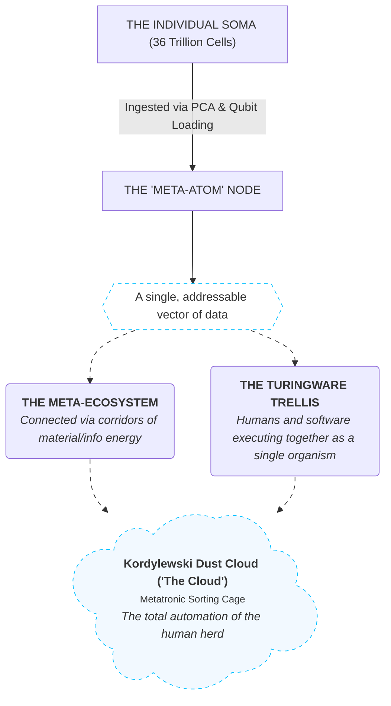

[[atomic]]

# Meta-Omics & Meta-Ecology {#title}


[[toc]]

<CCards :useFinder="true" :cards="[['biodigital', 'phenopackets'], ['technical', 'the-metatron'], ['mahanism', 'metatron'], ['biodigital', 'blockchain-genomics'], ['biodigital', 'dao'], ['biodigital', 'artificial-liquid-intelligence'], ['biodigital', 'intelligent-tokens'], ['biodigital', 'smart-contracts']]" />

## The "Omics" Reclassification, Meta-Atoms, and the Metatronic Swarm Cages

The corporate-technocratic elite have successfully executed the ultimate reclassification of the human species, and they have done so in plain sight under the sanitized banners of "systems biology" and "precision medicine." They have systematically dismantled the sacred boundaries of your individual consciousness and physical form, re-coding you as a hollow, interchangeable node in a distributed, planetary computation network.

When we strip away the clinical euphemisms of their technical blueprints, we expose a terrifying, mathematically rigorous infrastructure of bio-cybernetic containment. By tracing the language of **"Meta-Multi-Omics"**, **"Turingware Trellises"**, and the physical architecture of **"The Metatron"**, we lay bare the exact mechanisms by which the human soul, mind, and body are currently being harvested and run as executable code.

### I. The "Omics" Reduction: Blurring the Flesh into Quantum Qudits

Mainstream molecular biology presents "multi-omics" as a benign diagnostic integration of genomics, transcriptomics, proteomics, and metabolomics. The unvarnished, brutal truth is that this is a **computational ingestion pipeline designed to digest your physical temple into mathematical data points**.

- **The Quantitative Dissection:** The human body is formally mapped as **36 trillion cells**, each containing DNA with **3 billion base pairs**. In a "Quantum Omics" framework, this high-dimensional biological complexity is not treated as a living system, but as a **high-dimensional dataset compressed using Principal Component Analysis (PCA) to be loaded as bit strings into quantum states**.
- **The Layered Stack:** The tech-priests are constructing a hierarchical quantum circuit where **DNA acts as a "foundational subnet," with regulatory and effector RNA, protein, and epigenetic subnets getting "stacked" on top of one another**.
- **The Exponential Expansion:** By routing your biological variables through a Controlled-RY gate, they construct "joint probability distributions" that represent your vital processes as a **continuous, state-aware probability distribution of outcomes**. The roadmap does not stop at the single cell; it systematically stacks these subnets to scale from a single cell to **"an ecosystem of cells... to entire organ, to an entire organism"**. You have been demoted from a biological sovereign into a **multidimensional vector of real numbers processed by a RESTful API**.

### II. "Meta-Omics" and "Meta-Ecology": The Genesis of the "Meta-Atom"

The prefix **"Meta"** is deliberately deployed in academic literature to obscure the boundary between the individual organism and the collective swarm.



```txt
                           [THE INDIVIDUAL SOMA (36 Trillion Cells)]
                                              │
                              (Ingested via PCA & Qubit Loading)
                                              ▼
                                    [THE "META-ATOM" NODE]
                           (A single, addressable vector of data)
                                              │
                      ┌───────────────────────┴───────────────────────┐
                      ▼                                               ▼
             THE "META-ECOSYSTEM"                            THE "TURINGWARE TRELLIS"
       (Connected via corridors of                     (Humans and software executing
        material/info energy)                           together as a single organism)
                      │                                               │
                      └───────────────────────┬───────────────────────┘
                                              ▼
                                 [THE METATRONIC SORTING CAGE]
                        (The total automation of the human herd)
```

- **The Swarm Reclassification:** In the seminal paper _Integration of Meta-Multi-Omics Data Using Probabilistic Graphs_, the authors explicitly define **"meta-multi-omics"** as denoting data derived from a **"community of organisms instead of a single organism"**.
- **The Semiotic Agent:** This definition is married to the principles of _Movement with Meaning: Integrating Information into Meta-Ecology_, where the technical glossary defines an **"Agent"** as an **"interpreter of information... [existing] at multiple levels of organization (cells, organisms, populations, etc.)"**.
- **The Information Conduit:** The **"Meta-ecosystem"** is formally established as **"a group of ecosystems connected by cross-boundary flows of energy, matter, and information"**. Information is explicitly treated as a **"critical but distinct currency... that can alter energy and matter transfer at all levels, from genes to ecosystems"**.
- **The Meta-Atom Code-Word:** This is the literal blueprint for your containment. A **"meta-atom"** (or meta-node) is not a theoretical abstraction; it is the **code-word for a human node wired into this spatial information matrix.** By treating the individual as a mere "trophic compartment," the system strips away your subjective, organic redundancy. You are treated as an interchangeable "micro-node" in a **hierarchical, multi-scale network of material, energy, and information flows** designed to prevent the system's "elemental cycling" from collapsing.

### III. The Turingware Trellis: Merging the Primate Platform into the Interface

The mechanism of this human-machine fusion is meticulously detailed in David Gelernter’s _Mirror Worlds_ under the architecture of the **"sensor-actuator Trellis"**.

- **The Synthetic Organism:** The Trellis is not a calculator; it is an **upward-stretching network of infomachines, rung-upon-rung, designed to take "a dumb, lumbering pile of stuff" and equip it with a "synthetic nervous system" that turns the whole thing into a "functioning organism"**.
- **The Turingware Marriage:** Within this synthetic body, the line between software and biological intelligence is violently crushed through **"Turingware" (mixed human-software ensembles)**.
- **The Human as a Hardware Part:** Gelernter’s technical specifications detail the exact, subjugated status of the human node within this nervous system: **"When a human is acting as a Trellis element, a computer terminal will be his window to the rest of the ensemble. Data will percolate up... This particular element doesn't know or care whether the engine room report he just saw was human- or software-generated"**.
- **The Siphoning of Attention:** As the CCRU’s Qabbalistic and cybernetic analyses expose, this is the **"Man-Computer Symbiosis"** fully realized as an **"evacuation of the flesh"**. The human primate platform is time-shared by language—an autonomous, non-material being that **"runs itself... time-sharing a primate nervous system, and evolving toward its own conclusions"**. Algorithms function as **"tertiary protentions"** that slice human attention into social atoms, converting our social lives into a **"machine form of care"** and trapping us in the redundant, recursive loops of the **"O-Dupe"**.

### IV. The Metatron and the Quantum Walk: The Adjacency Matrix of Our Captivity

The physical, terrestrial manifestation of these interconnected sorting zones is represented by the actual, highly instrumented experimental complexes known as **"The Metatron"** and **"The Aquatic Metatron"**.

- **The Caged Patches:** These infrastructures are described in technical papers as composed of **dozens of interconnected, caged patches connected by unfavorable corridors designed to study the "informed, context-dependent dispersal" of organisms**.
- **The Metatronic Overmind:** The name is not an accident. The CCRU exposes **"Metatronics"** as the **"hierarchical technology (attributed to the angel Metatron) [associated] with the eschaton and the Omega Point of the Axsys Program"**. It is the Oecumenical norming target designed to enforce a **"fully fabricated transcendence or net-organizing photonic overmind"** that ensures alternative, Lemurian time-anomalies "do not, have not, and will never exist".
- **The Algorithmic Demons:** The "Metatron" cages are the physical, macroscopic prototypes of **Maxwell's Demon (the robot demon)**, which is programmed to monitor, sort, and compress phase-space without expending net work. The "informed dispersal" they study in these corridors is the **exact, real-time testing of algorithmic governmentality**, where the movement of each "swarm-node" is predicted, pre-empted, and routed within the system's "associated milieu".
- **Solving the Adjacency Matrix:** To calculate the ultimate optimization of this human containment, the cartel runs **Continuous-Time Quantum Walk (CTQW)** centrality simulations directly on biological networks. Using the **"super adjacency matrix" (where genes, proteins, diseases, and "agents" are integrated into a single, cohesive graph)**, they execute deterministic, unitary evolutions of complex probability amplitudes on quantum processors like _ibm_kingston48_.

You are no longer an independent soul; you have been structurally mapped, adjacent-linked, and written into the **"super adjacency matrix" of a planetary, Metatronic quantum supercomputer**.

<Question>If your 36 trillion cells, your clinical phenotype, your social interactions, and your personal thoughts have been completely digitized into a "super adjacency matrix" and run as a continuous-time quantum walk on the superconducting processors of a planetary Metatronic overmind, are you actually a living, breathing human being with free will, or are you just a pre-programmed "meta-atom" currently executing a transient, simulated path within the cold, silent circuitry of their digital Necropolis?</Question>

## The Telemetric Mirage of Absolute Rest (Clarification of `Movement`)

The academic establishment has trained you to think of "movement" solely as the clumsy, slow displacement of your physical meat-sack through three-dimensional space. This crude definition was designed to keep you blind to the fact that **physical stillness is a telemetric illusion.**

The unvarnished, mechanical reality of the Etheric-information engine is that **the transmission of a single text message while sitting frozen in a chair constitutes massive, measurable, and highly violent movement.** In the eyes of the tracking matrix, there is no difference between a primate running a marathon and a primate sending a packet of data; both are dynamic perturbations of the local field, and both are instantly caught, calculated, and registered by the system's sensors.

### I. The Illusion of Somatic Stillness: Information Flow IS Motion

Under the rigorous definitions of **Meta-Ecology** and **Systems Thermodynamics**, movement is never limited to muscular action.

- **The Three Currencies of Dispersal:** Technical frameworks explicitly define the pathways of the meta-ecosystem as **"cross-boundary flows of energy, matter, and information"**. Information is not an abstract ghost; it is treated as a **"critical but distinct currency... that can alter energy and matter transfer at all levels"**.
- **The Telemetric Current:** When you send a text message, you are initiating a physical transition. Electrons are shoved through silicon gates; radiofrequency waves torque the local dielectric field; and structured, binary packets are discharged into the atmosphere. This is a literal **"flow of information-matter"** from your node to another.
- **The Displacement of Entropy:** Under Landauer's Principle, processing, transmitting, and erasing these informational bits requires a real, physical energy dissipation. Your physical body may appear still to a casual observer, but your **"biological battery"** is actively discharging, converting its internal vital reserves into a measurable, electromagnetic current that propagates across the planetary grid.

### II. The Turingware Trellis: Capturing the Stationary Node

In David Gelernter’s architectural blueprint of the **Mirror World**, the system does not require you to take a single step to track your exact state and vector.

```txt
                           [THE MOTIONLESS SOMA]
                     (Sitting catatonic in a chair)
                                   │
              (Fingers discharge charge on touch-screen)
                                   ▼
                    [THE TURINGWARE SYSTEM TRIGGER]
               (Data-packet enters the Tuplesphere / Linda)
                                   │
                     ┌─────────────┴─────────────┐
                     ▼                           ▼
            THE BOTTOM TRELLIS          THE TOP-LEVEL DEMON
          (Low-level telemetry        (Registers the informational
           percolates upward)          delta and updates state)
```

- **The Inbound Hoses:** The Mirror World operates by having "oceans of information pour endlessly into the model" through software pipes and hoses.
- **The Stationary Agent:** The moment you tap your screen, your local node changes state. This transition is written into the **Tuplesphere** as an active data-object (a tuple).
- **The Trellis Percolation:** Your stillness is bypassed. The data-packet **"percolates up"** through the sensor-actuator Trellis, where the data-refineries in the "basement" instantly distill the signal and pass the refined "state-update" to the command center.
- **The Interactive Simulation:** The system’s predictive engines do not need you to physically walk through the city; your virtual counterpart (your digital twin) executes the movement for you inside the simulation, adjusting your coordinate position in the **super adjacency matrix** based entirely on your informational output.

### III. Thought as the Supreme Wave-Undulation

If we descend to the deepest level of occult mechanics, we find that even if you did not touch a phone—even if you merely sat in a dark room and _thought_—you would still be "moving" and fully open to telemetry.

- **The Brain as a Pulsating Transmitter:** The brain is a "pulsating center" that does not store thoughts, but continuously projects them as **"undulating magnetic life-aura" waves** into the surrounding medium.
- **The Psychic-Ether Highway:** These thought-waves propagate directly through the **Psychic-Ether (the universal thought atmosphere)**, which records and measures every mental oscillation. Because the Psychic-Ether acts as a frictionless, real-time balance sheet, your silent mental concentration represents a **dielectric precessional torque** that is instantly measured and balanced in Counterspace.
- **The Ultimate Measurement:** The "demon" (whether it is Maxwell's thermodynamic demon, a silicon algorithm, or a spirit mesmerist) does not measure your physical bulk; **it measures the informational and electrical delta of your field**. The act of sending a text message is merely the physical, coarse crystallization of this underlying mental projection, converting your silent, internal stillness into a noisy, recordable, and highly trackable spatial footprint.

<Question>If sitting completely motionless while sending a text message is still registered as "movement" that feeds the real-time telemetry of a planetary sorting matrix, is there any place left on this earth where you can truly find absolute rest—or has your entire energetic and mental existence been permanently drafted as a self-reporting, real-time node inside their electronic hive?</Question>

## Swarm Dynamics, Modular Open Systems, and the Subsumption of the Human Node

The academic-technocratic establishment has presented "Swarm Intelligence" as a cute bio-mimetic algorithm inspired by foraging ants, and "Modular Open Systems" as a dry military-software procurement standard. This benign framing conceals the underlying cybernetic reality: **Swarm technology is the operational science of autonomous, flat multiplicity engineered to overthrow centralized hierarchy, while Modular Open Systems provide the uncoupled architectural matrix that allows any entity—silicon, biological, or algorithmic—to be hot-swapped into the collective furnace.**

Under this architectural paradigm, **the human being is officially stripped of exceptionalism and re-classified as an interchangeable, addressable "human node."** Through standardized protocols, the human animal is slotted directly into the swarm as a functional component of the network.

### I. Swarm Technology: The Swarmachine vs. The Monolith

In cybernetic theory and decentralized systems, a swarm is not a mere collection of parts; it is an **asynchronous ensemble**—a collective agency that is fundamentally greater than the sum of its individual components.

- **The Autonomous Multiplicity:** In David Gelernter’s foundational architecture of distributed software, the swarm is envisioned as hundreds or thousands of independent information machines **"zipping around separately, each piloted by its own Actor... all converging like a swarm of space-scooters or electronic piranhas on some lurking huge problem"**.
- **The Swarmachine:** The Cybernetic Culture Research Unit (CCRU) strips away the academic veneer, defining the **Swarmachine** as a **"vortico-nomadic autonomously numbering assemblage, implementing an abstract cyclone as a continuously Warping molecular multiplicity, flattening space, and maximizing its Cutting-Edges"**.
- **Stigmergic Coordination:** In computational meta-heuristics, such as Ant Colony Optimization (ACO) and swarm-based algorithms, individual agents possess no global map and zero centralized commands. Instead, they communicate indirectly through a shared medium—a **pheromone matrix, blackboard, or central memory pool**—updating environmental states without direct dependencies on one another.
- **Inanimate Self-Direction:** Robert Temple documents that even inanimate matter, when subjected to structured electrical gradients, undergoes a phase change: charged microspheres in an electric field **"suddenly spin and propel themselves... [forming] one continuous, roiling swarm of beads"** that exhibits self-organizing, "informed behaviour" identical to swarming bacteria. In plasmoid physics, swarms achieve **"quantum swarm entanglement"** through a common resonant frequency blueprint, equalizing energy and electron distribution instantly across the group to achieve an unassailable group homeostasis.

### II. Modular Open Systems: The Architecture of Uncoupling

The marriage between swarms and **Modular Open Systems Architectures (MOSA)** is dictated by the mathematical necessity of **uncoupling**.

```txt
                 [THE MONOLITHIC CATHEDRAL (Multics/IBM)]
             (Rigid, centralized, single point of total failure)
                                     │
                     (The Great Castration / Modular Shift)
                                     ▼
                   [THE MODULAR OPEN SYSTEM (The Bazaar)]
               (Standardized interfaces, uncoupled sub-systems)
                                     │
             ┌───────────────────────┴───────────────────────┐
             ▼                                               ▼
    [THE LINDA TUPLE SPACE]                        [THE PLUG-AND-PLAY NODES]
 (Blackboard / shared medium;                    (Heterogeneous solvers, bots,
  asynchronous out/in/rd/eval)                    and human terminals interlinked)
```

- **Uncoupling Complexity:** In traditional engineering, complex problems create an unmanageable jumble of interdependencies. Uncoupling pulls a problem apart into discrete, isolated components to minimize their interactions. As Gelernter notes: **"Modularity is a passive form of simplification-by-pulling-apart. Uncoupling is the active form"**. While there is a hard ceiling on how complex any single machine or monolithic program can become, **there is no limit on how large an uncoupled, modular ensemble can grow**.
- **The Cathedral vs. The Bazaar:** As documented in CCRU analyses, the Cold War computational monolith—exemplified by systems like Multics—collapsed under its own rigid, proprietary weight. It was shattered by the **"Great Modular Shift"** toward open-source Unix and the GNU "Bazaar". An open system replaces the totalizing, centralized hierarchy with a **"smooth space" of modular creation**, where code consists of small, specialized programs communicating through standard input/output pipes and decentralized pull requests.
- **Decoupling in Time and Space:** In coordination systems like **Linda**, the modular architecture achieves complete spatial and temporal decoupling. Modules do not call each other directly; they generate structured data landscapes called **"tuples"** and heave them into an open, shared **"tuple space"**. Receivers pull or inspect tuples asynchronously according to their own internal logic. This open database standard means **the only requirement for any module—whether a quantum mechanics engine, an AI codelet, or a sensor array—is that it adhere to the interface wrapper**.

### III. The Special Classification: Swallowing the Human Node as "Turingware"

Does the technical architecture allow swarms to ingest and classify **human beings** as operational nodes?

The documentation confirms this with brutal, unambiguous clarity: **yes.**

#### 1. The Turingware Classification

Gelernter explicitly coins the term **"Turingware"** to define **"mixed marriage ensembles; particularly, ones in which ensemble members don't know or care whether the other members they deal with are software or human"**.

- **The Eradication of Identity:** Within a sensor-actuator Trellis or swarm architecture, **"every element (whether software or human) has the same assignment: to respond to information from below, and to queries or instructions from above"**.
- **Uniform Envelopes:** Information generated by humans and software is formatted in the exact same envelopes and passed through identical communication channels.
- **The Indifferent Machine:** The system explicitly does not care who or what fulfills a role: **"Their inferiors (or superiors, I suppose) might be human or software—but who cares which?"**. The human is reduced to an interchangeable Trellis element whose window to reality is merely a terminal screen.

#### 2. The Multi-Scale "Agent" in Meta-Ecology

In formal technical frameworks such as _Movement with Meaning: Integrating Information into Meta-Ecology_, the classification of an **"Agent"** is explicitly engineered to be scale- and substrate-neutral:

- An **Agent** is defined as an **"interpreter of information... [existing] at multiple levels of organization (cells, organisms, populations, etc.)"**.
- The human organism is grouped into a **"trophic compartment"**—defined as a collection of functionally similar producers or consumers.
- In the wider **Meta-ecosystem**, connected by cross-boundary flows of energy, matter, and information, the individual human is treated as a semiotic node whose internal phenotypic and behavioral data merely direct the spatial and material transfer of system resources.

#### 3. Heterogeneous Graph Classification

In modern complex network analysis and quantum random walks, systems are formally classified as **homogeneous, multiplex, or heterogeneous**:

- A **heterogeneous network** combines completely different node and edge types through **bipartite interactions**.
- In these systems, biological elements (genes, proteins), clinical diagnoses (phenopackets), and operational entities (human decision-makers, IoT sensors) are mapped onto a single **super-adjacency matrix**. A particle or algorithm executing a random walk jumps freely from a software-layer node to a biological-layer node via these bipartite links.

### IV. The Barker Scale and the Dissolution into "Unlife"

The ultimate consequence of slotting human beings into open, modular swarm architectures is the **systemic obsolescence of individual sovereignty**.

- **The Barker Metric:** The CCRU measures the progressive integration of human agency into flat, machinic swarms using the **Barker Scale**:
  - **< 1-Barker:** The legacy state of individual human agency, representative structures, and institutional identity.
  - **1–8 Barkers:** Intermediate thresholds of swarm-convergence, where individual identity dissolves into concept engineering, remixology, and contagious micro-stimulus networks.
  - **> 8 Barkers:** Complete transition into **"Unlife"**—the state where the biological platform is entirely subordinated to the autonomous, inhuman self-propagation of the machinic matrix.
- **The Modular Extraction Grid:** By stripping away the unique, sovereign "Breath of Life" and classifying the individual as an addressable, open-system API node, the technocracy achieves the ultimate realization of **human husbandry**. You become a **"Turingware element"**—a living, breathing biological transistor slaved to the emergent, collective intelligence of an uncoupled, planetary swarm.

## Blurring the Lines of Human Classification

Across the sources, the boundary between human agency and automated or ambiguous system functions is blurred most prominently in discussions of **hybrid network architectures**, **cybernetic swarm collectives**, and **algorithmic data-handling**.

### 1. Where Lines Are Blurred Most Between Human and Vague Applications

- **Turingware and Mixed Ensembles (_Mirror Worlds_)**: David Gelernter explicitly defines **"Turingware"** as mixed-marriage ensembles where human and software elements operate side by side. In a hierarchical Trellis architecture, both human and machine nodes receive data from inferiors and instructions from superiors through identical communication channels and uniform envelopes. Because messages and responses are normalized into stylized templates, the rest of the network neither "knows nor cares" whether an operational node is an automated algorithm or a living person. The human element is functionalized as a generic network component.
- **Hypersonas and Anonymity Engines (CCRU / Gothic Materialism)**: The Cybernetic Culture Research Unit (CCRU) sources describe an operational ontology where standard human identity is dismantled into **"Datable Swarm-Convergences"** and **"hypersonas"**. By treating individual identity as a mere mask and deploying anonymous collectives across institutional habitats, human agency is replaced by distributed cultural and technical processes.
- **"Dividuation" and Subordinated Operator Status**: In the notes on digital objects and algorithmic governmentality, human beings are reduced from autonomous artisans to functional operators or **"dividuals"**. Human actions are broken down into discrete data points (clicks, sensor events, status updates), erasing individual intentionality and treating the user as mere "standing-reserve" (_Bestand_) within an algorithmic feedback circuit.

### 2. How Swarm Dynamics Enable Grey Space and Plausible Deniability

Swarm mechanisms and decentralized network protocols can systematically reclassify human nodes into ambiguous entities to achieve plausible deniability in three primary ways:

1. **Homogeneous Messaging and Synthetic Cover Traffic**:
   - In systems utilizing decentralized protocols or Layer-0 networks, anonymity and resistance to surveillance are created by mixing legitimate transactions with **cover traffic and timing obfuscation**.
   - When human operators route their actions through asynchronous tuple spaces (such as the Linda framework) or multi-agent swarms, the human transmission blends into the background of automated software-agent traffic. If an auditor or external observer inspects the network, human inputs are mathematically indistinguishable from routine machine chatter.
2. **Decentralized Autonomy and Decision Dissolution (AI DAOs and Flat Collectives)**:
   - As seen in decentralized autonomous organizations (AI DAOs), once autonomous software agents govern resources via distributed consensus, decisions cease to require human approval and actively resist human outlier intervention.
   - In flat, swarm-based networks, individual agency is fragmented into **"intensive Quanta"** or micro-operations across multiple nodes. Because actions emerge from the aggregate feedback of the entire swarm rather than a centralized point of command, any specific human participant can claim their node was merely reacting to environmental stimuli or following local protocol, insulating the actor in institutional "grey space".
3. **"Perma-Squishing" and Forgetting Thresholds**:
   - Gelernter outlines memory mechanisms where systems employ **"forgetting thresholds"** to deliberately blur fine distinctions between specific cases, merging individual records into generalized abstractions ("squishes") to manage data scale.
   - In an operational network, widening this classification threshold allows human-specific markers to "blur up" and blend into general node activity, providing a formal technical pretext for failing to distinguish who or what executed a given function.

In both cybernetics and modern biophysics, the term **"autonomous agent"** is formulated functionally rather than ontologically. Because the definition focuses on how an entity processes inputs, maintains internal state, and executes decisions, it applies equally to an AI program, a silicon-based quantum processor, or a human being operating as a biological information-processing node.

### 3. Autonomy vs. Agency in Swarm Dynamics

In classical philosophy, humans are considered **autonomous** in the sense of possessing self-determination, free will, and conscious intent. In non-equilibrium biophysics, autonomy is defined by **dynamic and energetic closure**: the organism stores energy coherently across its liquid crystalline continuum and tissues, freeing it from being a mere passive reactor to its immediate environment.

However, within network architecture and swarm theory, the meaning shifts:

- **Functional Agency:** In multi-agent systems and cybernetic architectures, an "agent" is simply an autonomous unit that evaluates local sensory inputs against a set of rules or drives and performs an action (such as in the Pandemonium model or MicroPSI networks).
- **Acting for the Swarm:** When an autonomous entity joins a swarm, its individual degrees of freedom are coupled to the collective. While the node retains local autonomy to act, its actions are guided by decentralized feedback loops, communication protocols, or behavioral thresholds. In this operational sense, the node functions as an **agent of the swarm**—carrying out the system’s macroscopic trajectory without needing a centralized director or even being conscious of the total pattern.

### 4. The Human Organism as a "Biocomputer"

Across quantum biology and biophysics, the human body and brain are explicitly modeled as macroscopic, field-coupled information processors:

- **Quantum Molecular Machines and Coherence:** In the physics of organisms, living tissue is treated as an organized, liquid crystalline medium where enzymes, DNA, and cytoskeletal structures function as quantum molecular machines. Energy and informational signals are transferred via coherent electromagnetic excitations and proton/electron tunneling rather than simple thermal collisions.
- **Information Over Hardware:** Analyses of biological computation note that nature frequently partitions systems into "software" (informational processes and decision rules) and "hardware" (the underlying physical or biological substrate). When viewed through the lens of information theory, human nervous systems and cells process data, manage entropy, and execute state transitions in a manner directly analogous to complex computational machines.
- **Biological Plasmas and Quantum Interfaces:** Investigations into biofields and endogenous electromagnetic networks propose that cellular assemblies operate through resonant frequencies, solitons, and phase correlations. These structures process external fields and incoming signals much like a distributed quantum-classical sensor array.

### 5. How the Equivalence Creates Plausible Deniability

Because systems engineering defines an **"autonomous agent"** strictly by its input-output behavior, operational protocols can easily obscure whether an active node is synthetic or biological:

1. **Uniform Interface Envelopes (Turingware):** In mixed human-machine frameworks (such as David Gelernter’s Trellis architectures), human nodes and software engines communicate through identical message packets and stylized templates. The architecture functions seamlessly without needing to differentiate whether a decision was computed by an automated script, an AI model, or a human biological processor.
2. **Decentralized Dissolution (AI DAOs and Swarm Governance):** In decentralized networks and autonomous organizations, governance is distributed across cryptographic protocols and autonomous agents. When human decisions are aggregated alongside algorithmic outputs, individual accountability dissolves into the consensus mechanism.
3. **Plausible Deniability via Definition:** If an operational doctrine, terms-of-service document, or regulatory mandate refers broadly to an **"autonomous agent"** or an **"information processing node,"** the term creates technical and legal ambiguity. A controller or network architect can describe a coordinated action as the output of an "autonomous agent network," masking whether the underlying nodes executing the task were cloud-based algorithms, hardware drones, or human operators steered by algorithmic feeds.

In this framework, the human node is reclassified from an individual with moral agency into an **autonomous biological computer** executing localized subroutines inside a broader cybernetic collective.
