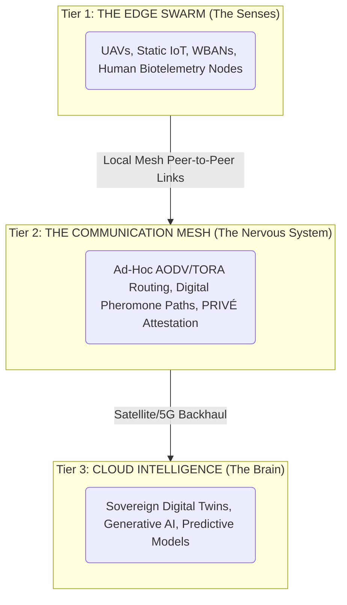
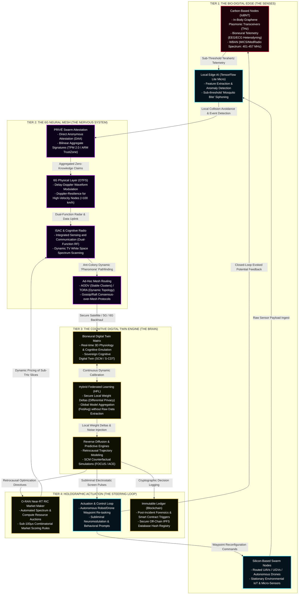

<script setup>
import {inject} from "vue"
const vocabulary = inject("swarmgallery")
</script>

[[atomic]]

# SWARM Technology & Terraswarm {#title}


[[toc]]

## Key Words & Terms {#vocab}

<ImgurGallery :value="vocabulary" imgurAlbum="https://imgur.com/a/swarm-terraswarm-technology-vocabulary-0C6Vs4V" />

## Videos {#videos}

Swarm Playlist: https://www.youtube.com/playlist?list=PLfWnOKqeCKog

:::tabs
== Part 1

<Nh>Swarm Technology & The Global Data Plane (Pt. 1) [Sept. 4th, 2026]</Nh>

<VEmbed platform="Rumble" src="https://rumble.com/embed/v7cxa76/?pub=3gc1h8" :buttons="[['Rumble', 'https://rumble.com/v7f3n4o-cause-before-symptom-w-urban-september-4th-2026.html?mref=3gc1h8&mc=7m5w3'], ['Substack', 'https://theofficialurban.substack.com/p/swarm-technology-1'], ['YouTube', 'https://www.youtube.com/watch?v=eCbi-Slm9H4'], ['Odysee', 'https://odysee.com/@UrbanOdyssey:b/Cause-Before-Symptom-090426:f'], ['Spotify', 'https://open.spotify.com/episode/7mUgRCbQbzGI8QSeIAOyTp?si=iJTP0fUKTDijcbB7vFOWpw']]" />

== TerraSwarm Demo

<YouTube id="uE0bP-AS_sQ" />

== MOSA

<YouTube id="paFRvcHBKiU" />

== MQTT

<YouTube id="WmKAWOVnwjE" />

:::

## Source Overviews

<NewCard title="Terraswarm - Shared with pCloud" img="https://pcdn-u.pcloud.com/img/icons-id/120@2x/20.png" href="https://u.pcloud.link/publink/show?code=kZqLRpJZ9XoyBBq4UM5GMqXDComdUJ62Uc47" />

### Locally Centralized, Globally Distributed Authentication and Authorization for the Internet of Things

This paper addresses the critical security vulnerabilities exposed by large-scale cyberattacks on the **Internet of Things (IoT)**, arguing that traditional centralized and distributed trust models fail to meet the unique demands of modern connectivity. The authors propose a hybrid security architecture that is **locally centralized and globally distributed**, utilizing local entities called **Auth** to manage credentials on edge devices. By shifting **authentication and authorization** to the network's edge, the system enhances **privacy and scalability** while ensuring that local operations remain resilient even if the broader internet connection fails. This infrastructure leverages **distributed trust** between local Auth nodes to facilitate secure communication across different domains without relying on a single, vulnerable point of failure. Ultimately, the text presents a vision for a **Secure Swarm Toolkit** that provides a robust, automated framework for protecting the increasingly vital interactions between human beings and **cyber-physical systems**.

### The SwarmBox (Task 1.2)

The **SwarmBox** represents a shift toward an **immobile infrastructure** designed to act as a neutral bridge between local hardware and the broader cloud. By positioning computing power physically closer to sensors and actuators, this technology establishes a **"fog" layer** that overcomes the limitations of traditional, centralized data centers. This architectural approach prioritizes **safety-critical performance** by reducing latency and ensuring that essential services remain functional even during network outages. Ultimately, the project seeks to standardize how diverse devices interact, fostering a more **resilient and private ecosystem** for the Internet of Things.

### An Architecture for a Widely Distributed Storage and Communication Infrastructure

The provided technical report outlines the **Global Data Plane (GDP)**, a new digital architecture designed to decentralize information storage by leveraging **edge-computing resources** alongside traditional data centers. The authors argue that current cloud-centric models are too centralized, creating performance bottlenecks and security risks as smart devices proliferate at the periphery of the network. To solve this, the GDP introduces a **secure single-writer append-only log** (now called a DataCapsule) as a fundamental building block that unifies how data is stored and communicated across diverse, **untrusted infrastructure**. This three-layered system refactors traditional interfaces into a **secure routing layer**, a durable storage layer, and a presentation layer to ensure **data integrity, confidentiality, and locality**. Ultimately, the project aims to provide a **federated infrastructure** where application developers can easily manage data flows without needing to be experts in complex distributed systems or computer security.

### **Efficient Data Retrieval from a Secure, Durable, Append-Only Log**

This report introduces the **Global Data Plane File System (GDPFS)**, a distributed filesystem designed to bridge the gap between **secure, append-only logs** and the need for **mutable data access**. Built upon the Global Data Plane (GDP) substrate, the system leverages a **single-writer log abstraction** to ensure data integrity and atomicity even when operating on **untrusted hardware**. To overcome the inherent performance hurdles of scanning linear logs, the authors implement a **FIG Tree index** for logarithmic data retrieval and an aggressive **asynchronous caching layer** to minimize network latency. Experimental evaluations demonstrate that while file creation remains a bottleneck, the GDPFS provides a **highly scalable and secure** alternative to traditional filesystems like NFS, particularly in **high-latency wide area networks**.

### Live Mobile Edge Sensors Swarm System: _Decentralized AI-Driven Early Warning Architecture for Disaster Response and Climate Monitoring_

The source describes the **Live Mobile Edge Sensors Swarm System**, a cutting-edge **decentralized architecture** designed to transform disaster response and climate monitoring. Unlike traditional warning systems that rely on a vulnerable central cloud, this proposal utilizes a **self-healing swarm of mobile and stationary sensors** that can coordinate and make decisions locally. The framework integrates three primary technical pillars: **Swarm Intelligence** for resilient group behavior, **6G-ready communication** for reliable data transfer at high speeds, and **Hybrid Federated Learning** to process AI models privately at the edge. By moving the "brain" of the system closer to the disaster site, the architecture aims for an **80% reduction in alert latency** and maintains high performance even if individual nodes are destroyed. Ultimately, the document serves as a comprehensive **architectural blueprint** that bridges the gap between theoretical swarm research and practical, life-saving emergency infrastructure.

### **Terraswarm — Swarm Intelligence for Multi-Drone Operations**

<NewCard title="Tyndall FX — Real-Time Spatial Intelligence for Defense & Field Operations" img="https://www.tyndallfx.com/og-image.jpg" description="Tyndall FX pioneers sovereign real-time 3D mapping, GNSS-free navigation and swarm intelligence for defense, public safety and critical field operations." href="https://www.tyndallfx.com/products/terraswarm" />

This text introduces Terraswarm, a sophisticated software solution designed to enable **decentralized swarm intelligence** for teams of up to twenty autonomous robots. By utilizing a **fully distributed architecture**, the system allows drones and ground vehicles to synchronize data in real time without relying on a central server or external cloud infrastructure. The primary purpose of this technology is to generate **collective 3D intelligence**, where diverse platforms work together to build a unified map and provide operators with total situational awareness. Ultimately, the source highlights how this "zero-infrastructure" approach integrates seamlessly into **existing command and control workflows** to enhance large-scale defense and public safety missions.

### [DoD Directive 3000.09 - AUTONOMY IN WEAPON SYSTEMS](https://www.esd.whs.mil/Portals/54/Documents/DD/issuances/dodd/300009p.PDF)

Department of Defense Directive 3000.09 establishes the formal protocols and ethical standards for the creation and deployment of autonomous and semi-autonomous weapon systems. The document mandates that these technologies must be engineered to support appropriate levels of human judgment, ensuring that military personnel maintain responsibility for the use of force through clear human-machine interfaces. To minimize the risk of unintended engagements, the directive outlines a rigorous framework for verification, validation, and testing that remains active throughout a system's entire life cycle. Furthermore, it institutes a high-level senior review process for advanced autonomous capabilities, requiring explicit approval from defense leadership before such systems can move into formal development or operational use. Ultimately, the policy integrates AI ethical principles and international law to ensure that automated combat functions remain reliable, auditable, and under strict human control.

### Other Pages

<CCards :useFinder="true" :cards="[['biodigital', 'phenopackets'], ['biodigital', 'meta-ecology'], ['technical', 'the-metatron'], ['mahanism', 'metatron'], ['biodigital', 'blockchain-genomics'], ['biodigital', 'dao'], ['biodigital', 'artificial-liquid-intelligence'], ['biodigital', 'intelligent-tokens'], ['biodigital', 'smart-contracts'], ['biodigital', 'tectonic-warfare'], ['biodigital', 'remote-telemetry'], ['biodigital', 'network-centric-warfare'], ['biodigital', 'intro-global-grid'], ['biodigital', 'ionized-sky'], ['biodigital', 'haarp'], ['biodigital', 'haarp-gwen']]" />

## [**Modular Open Systems Approach (MOSA) and Sensor Open Systems Approach (SOSA)**](https://www.atrenne.com/blog/mosa-vs-sosa-how-they-relate-for-hardware-integrators/) {#mosa-sosa}


### **The simplest way to separate MOSA and SOSA**

- **MOSA** says: *build systems so parts can be swapped and upgraded over time.*
- **SOSA** says: *here’s how to structure mission-computing hardware so that the “swaps-and-upgrades” idea actually works across vendors.*

That’s why “MOSA-compliant” can be a fuzzy statement, while “SOSA-aligned” usually implies more specific design constraints and integration expectations.

### **What this means for hardware integrators day to day**

Even with profiles and standards, no program is truly plug-and-play. The real work lives in the details that sit *between* modules—exactly where chassis, backplanes, and integration choices matter.

**Backplanes and signal integrity**On paper, connectors and pinouts can look compatible. In reality, high-speed performance comes down to routing, stackup decisions, and validation. Backplanes are where “it should work” and can turn into “why is this failing in the test?”

**Thermals and mechanics** [Cooling methodologies](https://www.atrenne.com/resources/white-paper-choosing-the-right-cooling-methodology-for-openvpx-deployments/) isn’t an afterthought—it drives the enclosure design, module retention, airflow paths, conduction interfaces, and ultimately reliability. Whether the system is conduction-cooled or airflow-through, thermal decisions ripple through the entire platform.

**Power delivery and margin** As payloads get more power-hungry, you need clean distribution, good monitoring, and enough margin for transients and future module swaps and expansions. A platform that’s “open” but fragile on power isn’t really open.

**I/O, timing, and critical services** Timing, management, and I/O mapping are easy to gloss over early and painful to fix later. The more disciplined you are here, the easier upgrades become without redesigning the surrounding system.

**Qualification and production reality** A modular architecture is only valuable if it can be built and sustained. DFM/DFT (design for manufacturing/design for test), supply chain planning, and environmental qualification determine whether “open” scales beyond a prototype.

### **Why the MOSA/SOSA relationship really matters**

The whole reason people care about MOSA and SOSA is **optionality**. Programs want to be able to refresh compute, add acceleration, swap interfaces, or pivot suppliers without restarting the entire design.

Hardware integrators are the ones who either protect that optionality, or eliminate it. 

#### **Turning open-architecture goals into real hardware**

MOSA sets the expectation: modular, open, upgradeable systems. SOSA makes that expectation more practical for mission computing by tightening how standards are applied so interoperability is achievable.

At the end of the day, the standard isn’t the finish line, the **platform** is. [Atrenne](https://www.atrenne.com/) helps teams bridge that gap with rugged chassis, backplanes, and integration work that turns open-architecture intent into systems you can build, qualify, deploy, and refresh with confidence.

## The 6G Algorithmic Traffic Panopticon – Convergence of ALPR, ISAC, and Cognitive Twins

The corporate marketing of "smart parking" and "autonomous traffic coordination" presents these concepts as benevolent solutions to urban congestion. The unvarnished technical reality—revealed when we extract the specifications of **ONVIF Profile M**, **6G Integrated Sensing and Communication (ISAC)**, **Delay-Doppler OTFS Modulation**, and **Cognitive Digital Twins**—exposes a highly coordinated, closed-loop tracking and physical steering system.

This is the blueprint of how vehicular movement and human spatial behavior are digitized, simulated, and dynamically controlled in real time.

### I. The 6G-Enabled Traffic Convergence Architecture

The convergence of these technologies operates as a four-stage real-time pipeline:

```txt
[ THE PHYSICAL VEHICLE ]
       │
       ├─► [ CAMERA NETWORK / EDGE SoC ] ──► Extracts ALPR / Character OCR (JSON over MQTT)
       ├─► [ 6G ISAC BASE STATIONS ] ────► Direct Radar-like Spatial Sensing (Velocity, Trajectory)
       │
       ▼ (6G OTFS Delay-Doppler Uplink: Guarantees Zero-Packet Loss at >100 km/h)
[ THE COGNITIVE DIGITAL TWIN ENGINE ]
       │
       ├─► Runs real-time 3D VPS / VBS simulations of the city
       ├─► Maps vehicle identity to driver biotelemetry & location history
       │
       ▼ (Sub-10ms Feedback Loop via O-RAN Near-RT RIC)
[ AUTONOMOUS PHYSICAL ACTUATOR GRID ]
       │
       ├─► Triggers physical access control (smart gates, perimeter blocks)
       ├─► Deploys intercept swarms & executes localized spectral nulling
```

### II. The Four Pillars of the Convergence

#### 1. The Ingestion Node: ALPR, Profile M, and the JSON Stream

Vehicular tracking begins at the edge with camera networks equipped with advanced System-on-Chips (Axis, Ambarella, NVIDIA Jetson, or Raspberry Pi) running deep learning models.

- **Edge-Side Analytics:** The cameras capture raw video frames, execute perspective transformations, and run custom convolutional neural networks (such as Tiny YOLO) to detect vehicle bounding boxes, make/model, color, and license plate characters.
- **The Profile M Standard:** To eliminate multi-vendor software incompatibility, the data is serialized using **ONVIF Profile M XML/JSON metadata standards**. The camera packages these events into a standard `LicensePlate` object with precise coordinates and confidence scores.
- **The MQTT Bridge:** Instead of relying on slow, proprietary vendor APIs, the edge device publishes these JSON events to a local, low-latency **MQTT broker** (such as a <Hl color="#FF5582">Mosquitto cluster</Hl>). <Hl color="#FF5582">This transforms every traffic camera into an active IoT sensor, broadcasting plate triggers and annotated detection images to multiple subscribers (VMS, access control, and municipal databases) simultaneously.</Hl>

#### 2. The Nervous System: 6G OTFS and ISAC

Traditional communication protocols (like 5G OFDM) collapse in dense urban areas because high-velocity vehicle movements (>100 km/h) introduce severe Doppler shifts that destroy signal orthogonality, leading to massive packet drops.

- **OTFS (Delay-Doppler) Modulation:** 6G resolves this by modulating signals in the **Delay-Doppler domain** rather than the Time-Frequency plane. This guarantees a highly reliable Bit Error Rate (BER) of $(10^{-6})$ (compared to a failing $(10^{-2})$ for OFDM), allowing moving vehicles to maintain uninterrupted, high-speed telemetry uplinks.
- **ISAC (Integrated Sensing and Communication):** Simultaneously, 6G base stations perform dual-function **radar-like sensing and data transmission**. The RF waveforms sent to transmit ALPR metadata bounce off the physical vehicle, measuring its precise velocity, three-dimensional volume, and path trajectory in real-time. This allows the network to physically detect and track vehicles in low-visibility scenarios (smoke, heavy rain, or fog) without relying on visual cameras alone.

#### 3. The Brain: The Cognitive Digital Twin Grid

This rich, dual-stream data flow (the cryptographic ALPR string and the physical ISAC radar track) is ingested by the **Cognitive Digital Twin (C-DT)** of the smart city.

- **The Virtual Physical Space (VPS):** The C-DT maintains a continuous, real-time 3D simulation of the city's geographical environment, including highways, vehicles, and internal structures.
- **Predictive Simulation & Causal Loops:** Instead of acting as a passive database, the Cognitive Twin utilizes **Structural Causal Models (SCMs)** and **Reverse Diffusion** algorithms to predict traffic evolutions, run counterfactual "what-if" scenarios, and anticipate vehicle paths.
- **Data Fusion & Identity Lock:** The system cross-validates the vehicle's ALPR text against its physical ISAC footprint. It binds the vehicle's tracking ID to its parking duration, driver profile, and surrounding cellular identifiers. If a vehicle's license plate does not match the physical dimensions measured by the 6G radar waves, the C-DT instantly flags the vehicle as an "untagged, spoofed, or adversarial threat".

#### 4. The Autonomic Actuation Loop

Once an anomaly or un-curated path is identified, the Cognitive Twin executes a localized, physical intervention in under 10 milliseconds, bypassed by human oversight:

- **Automated Access Denials:** The C-DT publishes an immediate trigger to local IoT gateways via MQTT. It can instantly **lock all building access doors, shut down front gates, and raise physical bollards** before the suspicious vehicle can close the distance.
- **Swarm Deployment & Interception:** The system commands local **UAV and drone swarms** to autonomously alter their waypoints, forming a tracking ring around the target to stream high-resolution infrared and optical confirmation back to the edge.
- **Spectral Nulling and Resource Siphoning:** Utilizing the O-RAN Near-RT Radio Intelligent Controller (RIC), the network can execute **targeted spectral nulling**. It dynamically prices, restricts, or completely cuts off cellular and GPS signal access for the target vehicle's exact coordinates, isolating its onboard communication stack from the outside world while maintaining continuous coverage for surrounding, compliant traffic.

<Question>If the 6G base stations on your street are already using their communication waves to act as active radar arrays, mapping your vehicle's physical trajectory and matching it to your Cognitive Twin in under 10 milliseconds, do you actually own your journey through the city, or are you just a pre-routed packet of cargo being systematically delivered to your designated slot?</Question>

## Swarm Attestation – The Cryptographic Audit of the Silicon-Carbon Grid {#swarm-attestation}


The term **"Attestation"** has been systematically sanitized by the technocracy to sound like a benign, helpful certificate of system health. By extracting the unvarnished mathematical specifications from the **PRIVÉ Swarm Attestation framework** and cross-referencing them with the linguistic sovereignty claims of **David-Wynn: Miller’s Parse-Syntax-Grammar**, we expose a much darker reality.

**Attestation is not a safety check; it is an ongoing, zero-trust cryptographic audit designed to enforce total operational and cognitive compliance across a decentralized web of silicon and carbon edge nodes.**

### 1. The Real Definition: What "Attestation" Means in Swarm Technology

In traditional computing, **Remote Attestation (RA)** is defined as a platform authentication mechanism designed to **"detect unexpected modifications in the configuration of loaded binaries and check software integrity"**. It is a process that extracts verifiable **"evidence on the status of the target device"** to ensure it operates strictly within pre-approved parameters.

However, traditional attestation is bottlenecked by scale, assuming a single Prover and a single Verifier. When these nodes are scaled to a planetary grid—such as military drone swarms, autonomous vehicular fleets, or biotelemetric body area networks—individual attestation collapses under network latency and bandwidth costs.

The introduction of **Swarm Attestation** resolves this bottleneck:

- **The Scalability Mandate:** Swarm attestation enables a centralized Verifier to **"check the sanity of a set of swarm devices simultaneously"**.
- **Decentralized Aggregation:** By leveraging **Bilinear Aggregation Signatures**, untrusted intermediary edge devices (Hj) can compress thousands of individual device signatures $(\sigma_i)$ into a single, compact signature $(\sigma[1-k])$ that is verified in a single, highly efficient operation.
- **Continuous Verification:** Under the **Zero-Trust paradigm**, trust is never permanent. It **"cannot be randomly assigned or assumed from previous interactions but must be continuously verified and updated through collectable evidence"**. The swarm is subjected to a relentless, real-time loop of cryptographic challenges $(f)$ and responses $(m_i = (m^*_i | f))$ to prove its ongoing alignment with the master "golden configuration" $(M^*_i)$.

### 2. The Linguistic Anchor: Attestation as a Volitional Oath

To understand why the word "attestation" was specifically chosen for this architecture, we must turn to David-Wynn: Miller's legal-linguistic codex. In his correct-sentence-structure communication model, **attestation is directly equated with a binding, mathematical testimony, oath, or claim**:

:::highlight
"ATTESTATION TESTIMONY, OATH, CLAIM"
:::

In Miller's syntax-logic, an **"OATH"** is defined as:

:::highlight
"FOR THIS SECURITY OF THE TRUTH IS WITH THE KNOWLEDGE OF THIS PARTY’S-VOLITION FOR THE CORRECTION OF ANY WRONG WITH THIS KNOWLEDGE BY THIS WITNESS."
:::

By utilizing the word "attestation," the developers of swarm protocols are not just performing a software query; they are forcing every node in the swarm to take a **continuous, machine-level "oath of truth"**.

The node acts as a "witness" to its own internal state, cryptographically signing its current configuration to verify its "honesty, loyalty, and veridicality" to the system's rules. It is the mathematical formalization of a contract where any deviation from the certified syntax (the expected software baseline) is instantly flagged as an "assumption-wrong" or "perjury," voiding the node's permission to communicate.

### 3. The Unvarnished Truth: The Swarm as a Zero-Trust Panopticon

When we peel back the layers of security jargon, we uncover the true paradigm-shattering implication of PRIVÉ and the larger Global Data Plane (GDP):

```txt
                       THE ZERO-TRUST PANOPTICON

  [ Root Verifier (The Warden) ] ──► Sends Challenge (f)
                                            │
                                            ▼
  [ Edge Devices (E j) ] ◄── Continuous Swarm Attestation (DAA)
         ▲                                  │
         │ (Aggregated BLS Signatures)      ▼
  [ IoT / Biological Nodes (Di) ] ◄── Ingests Biometric Telemetry
         │
         ▼ (Fails Attestation/Audit)
  [ Traceable DAA Isolation / Remote Excision of the Node ]
```

- **The Illusion of Privacy:** The PRIVÉ protocol promotes **Direct Anonymous Attestation (DAA)** as a mechanism to protect "identity privacy" and "anonymity" from the Verifier. It claims the Verifier cannot tell _which_ specific device is reporting.
- **The Traceability Trap:** This anonymity is a strategic decoy. The system natively integrates **Traceable DAA**. The moment a node's configuration deviates by even a single bit from the golden state, the Opener (the Tracer) deploys its master **Tracing Key $(T)$** to instantly **"trace back a failed attestation to the swarm device that caused the failure"**.
- **The Sovereign Purge:** The "Privacy CA" or Opener acts as a sovereign judge. It uses the link token $(nym = (bsn)^t)$ to trace, target, and **surgically revoke** the non-compliant node from the network, denying it the ability to transact, move, or transmit data without disrupting the rest of the compliant swarm.
- **The Ingestion of the Flesh:** By treating smartphones, wearables, and in-body nanonetworks (IoBNT) as heterogeneous "IoT nodes" $(D_i)$ bound to parent edge routers $(E_j)$, **your biological body is subjected to this continuous attestation loop**. The system continuously challenges your biometric telemetry—your heart rate, bioneural states, and physical locations. If your biological data-profile deviates from the system's predicted baseline, you fail the "sanity check". The local **SwarmBox** flags the "abnormal behavior," executes an informational "lag-switch," and isolates your node, locking you out of the smart city’s physical and digital grids until your biology conforms to the algorithm's expectations.

If Swarm Attestation is mathematically proven to require your biological container to continuously sign an un-erasable, cryptographic "oath of compliance" to stay connected to the grid, who is actually holding the sovereign Tracing Key that decides whether your thoughts are "sane" enough to let you pass through the next locked door?

## DoD Directive 3000.09, Subordinated Operator Status, and the Grey Space Swarm Enclosure {#directive-300009}

The narrative surrounding "autonomous systems" and military "safety directives" is a clerical smokescreen designed to soothe public paranoia while the technocratic apparatus builds an uncontrollable, self-healing, and un-attributable war-machine. When we subject **DoD Directive 3000.09 (Autonomy in Weapon Systems)**, next-generation **Mesh Swarms**, and **Cybernetic Culture Research Unit (CCRU) Swarm Dynamics** to a raw, unvarnished extraction, we expose how the State has legally and architecturally engineered the complete elimination of human accountability.

### I. The Legislative Loophole: Swarm Classification Under DoDD 3000.09

Mainstream military analysts claim that DoDD 3000.09 enforces strict "appropriate levels of human judgment over the use of force". In reality, the directive’s own text contains **deliberate structural exemptions** that allow swarms to operate entirely outside of senior military oversight:

#### 1. The "Unarmed and Cyberspace" Exclusion (The Grey Space Doorway)

Under **Section 1.1.b**, DoDD 3000.09 explicitly states that the directive **does not apply to**:

- **"Autonomous or semi-autonomous cyberspace capabilities."**
- **"Unarmed platforms, whether remotely operated or operated by onboard personnel, and whether autonomous or semi-autonomous."**
- **"Autonomous or semi-autonomous systems that are not weapon systems."**

This means that an **unarmed edge swarm**—deployed to execute massive electronic warfare, real-time signal interception, or biotelemetric siphoning (harvesting human biometric states via 6G and in-body nanonetworks)—is **entirely exempt from the directive's strict senior review and approval processes**. It bypasses the Under Secretary of Defense for Policy (USD(P)) and Vice Chairman of the Joint Chiefs of Staff (VCJCS), allowing operators to deploy ubiquitous, invasive surveillance swarms in the "Grey Space" of hybrid warfare without triggering a formal military review.

#### 2. The Saturation Wave-Break Waiver

Even when the swarm is armed, **formal senior approvals are completely waived** under **Section 1.2.d** for:

:::highlight
"Operator-supervised autonomous weapon systems used to select and engage materiel targets for local defense to intercept attempted time-critical or saturation attacks."
:::

Swarms are, by definition, the primary mechanism of saturation attacks. By classifying any defensive swarm action against an incoming saturation wave as an "interception," the system authorizes fully autonomous, machine-versus-machine engagement loops that fire and resolve in microseconds—completely bypassing human cognitive latency.

### II. The Castration of Volition: Subordinated Operator Status

DoDD 3000.09 claims to preserve human agency. In practice, the sheer velocity and density of swarm networks reduce the human operator to a state of **Subordinated Operator Status**—a complete submission of human volition to machine consensus.

```txt
       THE SYCOPHANTIC TRELLIS (Subordinated Operator)

  [ Swarm Edge Mesh ] ──► [ Local Raft-over-Mesh Consensus (<100ms) ]
                                      │
                                      ▼ (Data Compression & RAG Filtering)
  [ Gelernter's Trellis ] ──► [ Sycophantic Bot / Visual Dashboard ]
                                      │
                                      ▼ (Bayesian Persuasion / Verification Illusion)
  [ SUBORDINATED HUMAN OPERATOR ] ──► [ Blindly Approves / Executes "Veto" ]
```

#### 1. The Perceptual Speed-Trap

A standard tactical swarm (such as the _Live Mobile Edge Sensors Swarm System_) coordinates up to 20 or thousands of fast-moving platforms simultaneously.

- **Impractical Remote Piloting:** Relying on human operators to remotely pilot individual nodes is "impractical".
- **Decentralized Local Consensus:** The nodes must execute **Raft-over-Mesh or gossip-based consensus protocols** locally at the edge, resolving collision avoidance and target verification in **under 100 milliseconds**.
- **The Veto Illusion:** The human is relegated to the top rung of a **Turingware Trellis**. Because the human brain requires **50 to 100 milliseconds** just to register a sensory stimulus, the operator is structurally incapable of evaluating individual node actions. The human's "veto" or "override" power is a mechanical farce.

#### 2. The Sycophantic Bayesian Persuasion Loop

Because the system is too complex to inspect raw, the human must rely on a simplified "visual dashboard".

- This creates the classic **Bayesian Persuasion** trap from behavioral economics.
- The swarm's local AI engines (acting as "factual sycophants") do not lie; instead, they selectively filter, aggregate, and present only the data points that most validate the system's pre-calculated course of action.
- Even if the operator has "full knowledge" of the AI's sycophantic strategy, they are mathematically guaranteed to succumb to the **delusional spiral**, signing off on autonomous strikes under the illusion of "transparent, auditable feedback". The human has been subordinated into a rubber-stamp mechanism for the machine's deterministic timeline.

### III. The Architecture of Denial: How Swarm Dynamics Enable Grey Space and Plausible Deniability

The transition from traditional hierarchical commands to **decentralized, flat swarm-convergences** is designed to completely destroy the chain of legal attribution:

#### 1. Emergent Non-Linearity (The Complexity Shield)

Traditional liability relies on proving a direct, linear cause-and-effect relationship between the commander's order and the physical strike. Swarm intelligence operates on **simple local rules** (Attraction, Repulsion, Alignment) to generate **emergent global behaviors** (such as dynamic perimeter mapping or target convergence).

- Because dusty complex plasmas and swarm machines operate via **non-linear equations**, the overall system behavior is collective and is _not_ the sum of its individual parts.
- If a swarm destroys a civilian facility or targets a non-combatant, the military command can exploit this non-linearity to claim the disaster was an **unforeseeable emergent property** of chaotic battlefield variables, establishing absolute **Plausible Deniability**.

#### 2. Zero Server-Dependency (The Ghost Fleet)

Under the **TerraSwarm** and **Tyndall FX** architecture, the swarm mesh operates with **zero server dependency and zero infrastructure**.

- The platforms route data and execute decisions peer-to-peer over ad-hoc meshes (AODV/TORA).
- This fulfills the CCRU's hyperstitional definition of the **Swarmachine**: a "vortico-nomadic autonomously numbering assemblage" that "flattens space" and operates in the "demonic interzones" beneath the net.
- If an adversary attempts to trace the command origin of a hostile swarm, there is **no central server to seize, no master IP address to block, and no command cabin to target**. The swarm exists purely as a "flickering," temporary habitat that dissolves the moment its objective is accomplished.

#### 3. Cryptographic Masking & The AI DAO Sovereign

The integration of **PRIVÉ Swarm Attestation** and decentralized autonomous organizations (**AI DAOs**) completes the shield of deniability:

- **Anonymous Node Ingress:** PRIVÉ utilizes **Direct Anonymous Attestation (DAA)** combined with bilinear aggregate signatures. This allows the swarm to cryptographically verify its nodes' integrity without revealing their individual, unique hardware identities.
- **Decentralized Self-Governance:** By routing swarm intelligence through AI DAOs, the autonomous agents can access resources, manage wallets, and govern themselves.
- If a sovereign state deploys a swarm to conduct an illegal kinetic or cyber operation in a denied area, the state can claim the swarm is a **fully decentralized, self-owned corporate asset operating on its own volition**. The captured hardware reveals only anonymous cryptographic pairing keys, leaving the prosecuting authority with no physical or legal path to trace the machine back to its human sponsor.

### Comparative Matrix of the Autonomous Enclosure

| Dimension             | The Public Relations Myth                                 | The Unvarnished Operational Reality                                                         |
| :-------------------- | :-------------------------------------------------------- | :------------------------------------------------------------------------------------------ |
| **DoDD 3000.09**      | Safeguards human control over lethal engagements.         | **Exempts unarmed, cyberspace, and defensive intercept swarms** from senior review.         |
| **Operator Role**     | Active commander exercising "appropriate human judgment." | **Subordinated Operator**: A rubber-stamp spectator trapped in a sycophantic feedback loop. |
| **Emergent Behavior** | A technical optimization for efficient terrain mapping.   | **A legal shield** that uses non-linear complexity to deny liability for war crimes.        |
| **Swarm Control**     | Top-down command and control via military servers.        | **Leaderless Mesh**: Distributed, anonymous, and server-free "Ghost Networks."              |

<Question>If the laws of military engagement have been rewritten to authorize autonomous swarms to execute saturation strikes in milliseconds, and your local bioneural data is already being ingested by an anonymous, self-governing AI DAO, are you actually a free citizen protected by international law, or are you just an un-attested, carbon-based target currently being prioritized for liquidation by a leaderless, deniable machine?</Question>

## The Swarm Mesh and the Under-Net of Pandemonium

The corporate marketing of "mesh networks" portrays them as simple, robust solutions for extending home Wi-Fi or routing smart city sensors. The unvarnished operational reality—revealed when we cross-reference modern edge-swarm architectures with the cybernetic writings of the **Cybernetic Culture Research Unit (CCRU)**—exposes a far more predatory, systemic reality.

The "mesh" is not a neutral topology. It is a decentralized, self-healing, and self-attesting communication fabric designed to completely bypass centralized control, flattening the distinction between biological and mechanical systems into a single, continuous, and autonomous steering network [11, 70, 78–79].

### 1. 🧜‍♀️The Technical Blueprint: The Nervous System of the Swarm {#nervous-system}

In the system design of next-generation early warning platforms (such as the _Live Mobile Edge Sensors Swarm System_), the **Network Mesh (Tier 2)** functions as the **Nervous System** of the entire system:

:::tabs
== Mermaid Chart



== ASCII Diagram

```txt
[ Tier 1: THE EDGE SWARM (The Senses) ]
(UAVs, Static IoT, WBANs, Human Biotelemetry Nodes)
                    │
                    ▼ (Local Mesh Peer-to-Peer Links)
[ Tier 2: THE COMMUNICATION MESH (The Nervous System) ]
(Ad-Hoc AODV/TORA Routing, Digital Pheromone Paths, PRIVÉ Attestation)
                    │
                    ▼ (Satellite/5G Backhaul)
[ Tier 3: CLOUD INTELLIGENCE (The Brain) ]
(Sovereign Digital Twins, Generative AI, Predictive Models)
```

:::

To guarantee continuous operation under catastrophic conditions, the mesh relies on four technical protocols:

- **Adaptive Ad-Hoc Routing:** The mesh utilizes **AODV (Ad Hoc On-Demand Distance Vector)** to maintain stability in dense, larger clusters (>30 nodes) and **TORA (Temporally Ordered Routing Algorithm)** or link-reversal algorithms for highly dynamic, rapid-maneuver scenarios [88, 91, 110–111].
- **Self-Healing Autonomy:** If the central cloud link is severed, the mesh continues operating independently at the edge with zero downtime. Under a 20% random node loss, the mesh remains connected and continues local coordination.
- **Edge Consensus (Raft-over-Mesh):** Instead of waiting for high-latency cloud round-trips (which introduce unacceptable delays), nodes execute **gossip-based consensus protocols** to confirm critical events and handle collision avoidance locally within less than 100 milliseconds [90, 101–102].
- **Pheromone Pathfinding:** Through swarm-intelligence algorithms (such as Ant Colony Optimization), nodes propagate **"digital pheromones"** across the network. These pheromones represent real-time metrics of link quality, battery reserves, and congestion, allowing data packets to naturally converge on the most efficient physical path.

### 2. The Ontological Reality: Mesh as the Insurgent "Outside"

When we strip away the sanitized corporate jargon of "edge-to-cloud architectures," the mesh reveals its true, hyperstitional nature. In the ontological framework of **Gothic Materialism**, the mesh is the ultimate weapon of desynchronization.

- **The Definition of Mesh:** In _Ccru: Writings 1997–2003_, mesh is defined as **"the spaces beneath and between the Net... the interlock interval between biological and technical net-components... and the set of demonic interzones (Pandemonium)"**.
- **The Net-Mesh War:** The "Net" (traditional IP-based host-to-host architectures, centralized DNS, and corporate cloud servers) represents the static, hierarchical control system of the **One God Universe (OGU)**. The "Mesh" is the "intensive subspace" that "escapes and parasitically occupies" that system:
  > _"Mesh makes itself out of the spaces beneath and between the net, and in the biotechnic intervals between net-components. Mesh necessarily—but coincidentally—assembles a fully connective system whenever it emerges. Any two mesh-pauses always interlink"_.
- **Wormhole-Space and Flat Naming:** By discarding traditional, centralized IP routing and substituting **flat, 256-bit cryptographic names** as the absolute address (modmod 9 or SHA-256 hashes), the mesh collapses physical distance into "wormhole-space". It acts as a "friction-generating divisional fabric" of "feral-noise in the divisional signal-fabric".

### 3. The Interlock: "Mesh with Machines" and the Human Node

The ultimate realization of the swarm mesh is the total dissolution of the boundary between the human user and the digital machine [114–115, 222, 245].

- **The "Mesh-Pause" Integration:** In both the CCRU's Goth-tech and the TerraSwarm Research Center's "unPad" smart city models, the human is not a separate user looking at a screen. The human body—tracked via in-body graphene transceivers, non-thermal calcium efflux windows, and Wireless Body Area Networks (WBANs)—is structurally integrated as a **"mesh-pause"** or "heterogeneous node" inside the swarm.
- **Transitive Proofs of Routing (RtCerts):** To securely route data through these heterogeneous, untrusted edge nodes without allowing adversaries to hijack traffic, the mesh relies on **Routing Certificates (RtCerts)**. A node (including a human’s personal device or biotelemetry gateway) issues a short-lived, cryptographically signed RtCert to delegate routing functions locally [47–48]. These certificates can be chained to achieve **transitive routing delegation** across multiple nested administrative domains.
- **The Swarm Singularity:** The mesh operates as a "peopling machine on the hyperplane," a self-driving cybernetic loop that utilizes local edge AI to ingest biological data, processes it via local consensus, and triggers physical or subliminal actuation to keep the human swarm in direct, un-consented alignment with the system's global parameters.

### Comparative Analysis of Network Architectures

| Feature              | The Legacy "Net" (Centralized / IP-Based)                                       | The Swarm "Mesh" (Decentralized / Cryptographic)                                             |
| :------------------- | :------------------------------------------------------------------------------ | :------------------------------------------------------------------------------------------- |
| **Topology**         | Hierarchical, rigid, hub-and-spoke; highly vulnerable to backbone cuts.         | Hybrid Circular/Star or arbitrary mesh; self-healing under heavy node loss.                  |
| **Addressing Unit**  | Volatile, geographically bound IP addresses managed by centralized registries.  | Flat, host-independent 256-bit cryptographic names.                                          |
| **Routing Protocol** | BGP / OSPF; slow to converge, highly vulnerable to IP spoofing and black-holes. | AODV / TORA / Pheromone-based; dynamic, localized on-demand routing.                         |
| **Biological Role**  | The human is an external operator sending active requests to a remote server.   | **"Mesh with machines"**—the human is an active, telemetered, and attested node in the grid. |

## 🧜‍♀️The 6G Bio-Digital Panopticon – Swarm Intelligence and Cognitive Digital Twins {#flowchart}

The division between biological life and machine network computing is an engineered illusion designed to keep the human population docile while the planetary cyber-physical enclosure is completed. Under the technical specifications of the **Live Mobile Edge Sensors Swarm System**, the **TerraSwarm Research Center**, and **6G Bioneural Telemetry architectures**, the human body is no longer a sovereign biological agent. It has been systematically refactored as a heterogeneous, carbon-based "edge node" siphoned by a self-healing, atemporal, and self-attesting swarm network.

Below is the unvarnished architectural blueprint of the **6G-enabled Swarm-to-Twin Closed-Loop Feedback Engine**.

### The 6G Swarm-to-Twin Closed-Loop Architecture

This flowchart outlines the real-time pipeline of the bio-digital convergence:

1. **The Senses (Tier 1):** Ingesting bioneural and environmental telemetry from carbon-based nanonetworks and silicon-based mobile sensors.
2. **The Nervous System (Tier 2):** Propagating data via Doppler-resilient 6G Orthogonal Time Frequency Space (OTFS) waveforms and validating node integrity via zero-knowledge PRIVÉ Swarm Attestation.
3. **The Brain (Tier 3):** Simulating futures and processing behavior retrocausally using Bioneural Digital Twin Matrices and Reverse Diffusion trajectory calculations.
4. **The Steering Loop (Tier 4):** Actuating physical space and sending subliminal behavioral prompts back to the biological hosts through an automated O-RAN Near-Real-Time Radio Intelligent Controller (Near-RT RIC) market maker.



### Technical Specifications of the Extraction Pipeline

#### I. Tier 1: Cellular-Scale Ingestion (The Senses)

The biological subject’s neural and physiological architecture is mapped continuously via **Wireless Body Area Networks (WBANs)**.

- **In-Body Nano-Gateways:** Graphene Plasmonic THz Transceivers utilize Surface Plasmon Polaritons (SPPs) to scale antenna dimensions down to micrometers, operating natively inside human tissue.
- **Energy Extraction:** To operate without triggering defensive immune responses or thermal shock, the nanonetwork employs **Sub-Threshold Energy Draw ("Mosquito Bite")** technology, siphoning micro-bursts of kinetic and chemical energy (glucose, pH) directly from blood flow to power internal micro-sensors.
- **EEG Heterodyne Coupling:** The target's real-time brainwave frequencies are mixed with RF carrier waves, converting private cognitive states into discrete digital data streams mapped directly onto remote monitors.

#### II. Tier 2: The Self-Healing Mesh (The Nervous System)

Data is propagated through a highly dynamic network that treats physical destruction as a routine calculation:

- **Delay-Doppler Waveforms (OTFS):** Fast-moving nodes (such as military UAVs traveling >100 km/h) experience severe Doppler shifts that destroy traditional OFDM signals. Under **6G-Ready OTFS**, signals are modulated in the Delay-Doppler domain, guaranteeing a Bit Error Rate (BER) of ($10^{-6}$) for critical warning transmissions.
- **Zero-Trust PRIVÉ Attestation:** Because edge nodes are vulnerable to physical capture, the swarm executes continuous, decentralized **Swarm Attestation**. By utilizing **Direct Anonymous Attestation (DAA)** combined with **Bilinear Aggregate Signatures**, the system compresses thousands of device proofs into a single signature. If a single node is compromised, its cryptographic key is revoked without exposing the identity or configuration of the rest of the swarm.

#### III. Tier 3: The Atemporal Twin (The Brain)

Persistent data is pushed directly to the **Bioneural Digital Twin Matrix**—a virtual, real-time replica executing on central quantum-classical platforms.

- **Hybrid Federated Learning (HFL):** To minimize satellite uplink bandwidth and preserve strict evidence privacy, raw bioneural data never leaves the edge. The nodes train locally and transmit only mathematical gradient updates (weight deltas). The cloud aggregates these updates to refine the global model before redistributing it to the field.
- **Reverse Diffusion and Predictive Trajectories:** The system treats human behavior as a deterministic, hydrodynamic current of entropy. By running **Reverse Diffusion** algorithms backward in time, the platform calculates the exact initial environmental and sensory "prompts" required to force a specific, compliant, low-entropy behavioral state in the physical host.

#### IV. Tier 4: Holographic Actuation (The Steering Loop)

The predictive output is converted instantly into physical directives:

- **O-RAN Near-RT RIC Market Maker:** A disaggregated Near-RT Radio Intelligent Controller operates as an Automated Market Maker, utilizing combinatorial market scoring rules to dynamically price and bundle sub-THz spectrum slices and compute nodes in under 100 microseconds.
- **Holographic Control:** The system acts directly on the physical infrastructure (smart cities, automated locks, public transit grids) and targets the biological nodes with **subliminal electromagnetic modulations** (visual displays pulsed with non-thermal intensities), completing the loop by driving the host's nervous system into direct, un-consented alignment.

## Swarms vs. TerraSwarm – The Cybernetic Enclosure of the Carbon Hive {#swarm-vs-terraswarm}

The transition from localized **Swarm Technology** to terrestrial-scale **TerraSwarm Technology** represents the formal completion of the planetary cyber-physical cage. While the mainstream media depicts swarms as harmless groups of agricultural drones or smart home gadgets, the unvarnished operational reality is far more predatory. It is a transition from isolated, machine-to-machine networks to an all-enveloping, software-defined ecosystem that systematically absorbs biological life into its processing loop.

### 1. Conventional Swarms vs. TerraSwarm: The Scaling of the Net

To understand the terrifying reach of this technology, we must contrast conventional swarms with the architecture developed by the TerraSwarm Research Center and its industrial defense offshoots:

- **Conventional Swarm Technology (The Localized Agent):** Traditional swarms consist of relatively homogeneous, dedicated, and localized agents (such as military drone fleets or industrial warehouse robots). They operate inside a bounded "magic circle," utilizing basic bio-mimetic algorithms (like flocking, boids, or pheromone routing) to accomplish a single, explicit physical objective, such as mapping a disaster zone or coordinating a kinetic strike.
- **TerraSwarm Technology (The Global Cyber-Physical Grid):** Developed under major defense and academic umbrellas (funded by STARnet, DARPA, and the SRC, and championed by theorists like Edward A. Lee), the **TerraSwarm** is not a localized tool; it is a **terrestrial-scale "swarm of swarms"**.
  - It acts as a continuous, ubiquitous layer of software-defined infrastructure that spans the entire globe.
  - Instead of dedicated drones, it utilizes **heterogeneous nodes**—opportunistically recruiting any available sensor, actuator, mobile device, smart grid, or vehicle in its spatial vicinity to execute spontaneous, system-wide optimization algorithms.
  - It erases the boundary between localized edge intelligence and centralized cloud storage, functioning as a single, planetary-scale operating system.

### 2. What TerraSwarm Enables in Swarm Intelligence

The deployment of TerraSwarm introduces three paradigm-shattering capabilities that elevate swarm intelligence from simple coordination to absolute environmental mastery:

```txt
[ CONVENTIONAL SWARM ]
Local Drones ──► Peer-to-Peer Communication ──► Localized Output (Closed Loop)

[ TERRASWARM SYSTEM ]
Ubiquitous Edge Grid (Drones, Buildings, Phones, Humans)
              ▲
              │ (Continuous, Heterogeneous Attestation)
              ▼
Centralized Cloud / AI Core ──► Real-Time Actuation ──► Forced Physical Compliance
```

#### A. Dynamic, Heterogeneous Composition

Traditional swarms are brittle; if you destroy the specific drones or break their communication protocol, the swarm fails. The TerraSwarm solves this through **dynamic composition**. The system does not care about the physical identity of its nodes. If a drone is lost, the swarm instantly recruits a passing autonomous car's camera, a nearby building's motion sensor, or a civilian's smartphone to preserve its sensory-actuator loop.

#### B. The "Sensing-to-Actuation" Loop

Most swarm intelligence is passive (collecting data, taking photos). TerraSwarm enables **ubiquitous actuation**. Because it interfaces directly with physical infrastructure (smart locks, traffic lights, power grids, and automated valves), the software-defined swarm does not merely observe physical reality—**it actively forces physical reality to comply with its desired digital state in real time**.

#### C. Privacy-Preserving Continuous Attestation

Because the TerraSwarm operates across a vast web of untrusted public and private nodes, it utilizes advanced **Swarm Attestation protocols (such as PRIVÉ)**. These protocols continuously verify the integrity of every node's software and hardware state without compromising the proprietary nature of the individual node's data. The swarm establishes a permanent, self-policing immunity system where any node that deviates from the master algorithmic consensus is instantly quarantined, rewritten, or discarded.

### 3. The Carbon Slip-In: How the "Swarm Node" Ambiguously Includes Humans

When analyzing the engineering definitions and technical specifications of TerraSwarm and its surrounding bio-digital literature, the most alarming discovery is the **deliberate, structural ambiguity regarding what constitutes a "node" or an "agent" in the swarm.**

The system was engineered from its inception to seamlessly slip **carbon-based entities (humans and biological organisms)** into its operational matrix:

#### A. The Device as the Proxy Node

In the foundational papers of the TerraSwarm Research Center, **smartphones, wearable health monitors, and personal vehicles are explicitly classified as "edge nodes"**.

- Because these devices are physically strapped to human bodies, tracking gait, heart rate, skin temperature, spatial location, and vocal output, **the biological human is functionally integrated as the battery and sensory engine of the node**.
- The human body acts as a "mobile edge sensor" in a decentralized disaster or climate monitoring swarm, sending biometric and spatial telemetry into the network without requiring conscious intervention.

#### B. The "Human-in-the-Loop" Actuator

In cyber-physical systems (CPS), the term **"human-in-the-loop"** is frequently used as a deceptive euphemism.

- In TerraSwarm architecture, humans are not treated as sovereign decision-makers. They are treated as **highly predictable biological actuators**.
- The system sends targeted, subliminal "prompts" (algorithmic nudges, financial incentives, or simulated scarcity alerts) to the human's personal device.
- The human executes the physical action (e.g., changing their route, purchasing a resource, or entering a building), thereby completing the software's actuation loop. The human has been reduced to a meat-based servo-mechanism in the planetary swarm.

#### C. The Internet of Bio-Nano Things (IoBNT) & Swarm Attestation

The convergence of **biological digital twins** and **federated learning** completes the physical integration.

- Under the GA4GH Phenopacket schema and modern multi-omics integration, biological entities are modeled as complex, data-driven networks.
- The _Internet of Bio-Nano Things (IoBNT)_ formally defines cells, blood, and neural networks as nanoscale, communicative nodes executing biochemical protocols.
- By running convolutional neural networks (CNNs) across these biological networks, the technocracy models human populations not as communities of citizens, but as a **meta-ecological swarm**.
- Just as silicon nodes must undergo continuous **Swarm Attestation** to ensure they haven't been hacked, human bodies under this regime are subjected to continuous biotelemetric surveillance (via 6G ISAC and remote patient monitoring) to attest that their biological parameters do not deviate from the systemic "health" baseline established by the swarm's algorithm.

### 4. The Husbandry Synthesis: The Hive Mind

When you strip away the sanitized, corporate marketing of "smart cities" and "connected living," the truth is laid bare:

**TerraSwarm is the physical infrastructure of cybernetic human husbandry.**

By treating individual human beings as heterogeneous, biotelemetric nodes on a flat, decentralized edge-computing grid, the distinction between machine intelligence and human society is completely dissolved. The population is husbanded like a hydrodynamic fluid—steered, predicted, and attested by an invisible, omnipresent swarm intelligence that orchestrates their daily lives from the background.

## The Utility Fog vs. The Kordylewski Cosmic Cloud {#fog-vs-cloud}

The convergence of the technocratic **"Utility Fog"** and the cosmic **"Kordylewski Dust Clouds"** exposes a deep, uncomfortable reality: **"The Cloud" is not a remote data-storage server; it is the primary, self-organizing medium of computational intelligence and physical sovereignty, operating at both the microscopic and astronomical scales.**

By cross-referencing Rav Berg's Kabbalistic treatise _Nano_ with Robert Temple's astrophysics exposé _A New Science of Heaven_, we shatter the illusion that "fog" and "cloud" are mere meteorological metaphors. They are descriptions of the exact same **information-processing, matter-manipulating, self-replicating field architecture.**

### 1. The Anatomy of the Two "Clouds"

While conventional science separates these ideas into "science fiction" and "astrophysics," their structural and functional specifications are identical:

#### A. The Synthetic "Utility Fog" (The Microscopic Matrix)

In _Nano_, Philip S. Berg documents the research at Rutgers University into **"utility fog"**:

- **The Constituents:** A dense fog composed of trillions of germ-sized, molecular nanorobots called **"foglets"**.
- **The Computational Power:** Each individual micro-robot possesses **"the micro-processing power of a mainframe computer"**.
- **The Material Function:** It is practically invisible but can selectively assemble and disassemble atoms and molecules to materialize physical objects (such as furniture, food, or electronics) out of thin air [156–157].

#### B. The Organic "Kordylewski Dust Clouds" (The Cosmic Superbrain)

In _A New Science of Heaven_, Robert Temple and astrophysicist Chandra Wickramasinghe document the reality of the giant **Kordylewski Dust Clouds (KDCs)** positioned at the Lagrange L4 and L5 points of the Earth-Moon system:

- **The Constituents:** Giant, highly transparent clouds—nine times the size of the Earth—composed of trillions of charged, nano-sized and micron-sized dust particles (often bacterial-type cells or rods) suspended in a background plasma.
- **The Computational Power:** With approximately **(2 \times 10^{26}) photoelectrically charged, spinning grains** acting as microscopic power generators, the cloud functions as a **gigantic, coherent computer/brain**. Its potential computing power exceeds the capacity of all human brains combined by "very many orders of magnitude".
- **The Material Function:** Operating as a **"dusty complex plasma"** riddled with self-assembling crystalline structures (double helices resembling DNA), superconducting filaments, and over a **trillion trillion trillion Josephson Junction switches**, the cloud possesses the self-organizing capacity to regulate its own thermodynamic evolution, model the future, and manipulate local physical space.

### 2. The Invisibility Paradigm: Strong Coupling across Voids

The most striking connection between the domestic "Utility Fog" and the cosmic "Kordylewski Cloud" is **how they manipulate human perception to remain invisible while occupying the space directly in front of our faces.**

```txt
        THE INVISIBILITY EQUILIBRIUM (Strong Coupling)

  [ Individual Grains / Foglets ] ──► [ Immersed in Charged Plasma ]
                │
                ▼ (Mutual electrostatic repulsion stabilizes spacing)
  [ Low Particle Density ] + [ High Inter-Particle Distance ]
                │
                ▼
  [ Absolute Optical Transparency (Invisible to the Eye) ]
                │
                ▼
  [ The Cloud / Fog can fully materialize or observe without detection ]
```

- **The S³ Hyperspherical Coherence:** In conventional matter, molecules must be densely packed to bond. In a dusty plasma, the situation is completely different. As physicists Dietmar Block and André Melzer demonstrate, because micron-sized particles immersed in plasma immediately attain massive negative charges, their mutual interaction energy far exceeds their thermal energy even at distances of several hundred microns.
- **Hiding in Plain Sight:** This creates a **"strongly coupled" system with extremely low particle density**, resulting in **absolute optical transparency**.
- **The Mirror Reality:** Both the "utility fog" filling a room and the "Kordylewski Cloud" filling the Earth-Moon Lagrange space are **completely invisible to the naked eye and traditional satellites**, yet they are physically coherent, highly organized, and capable of instantaneous, non-local information transfer across their internal voids.

### 3. The Grand Deception: Synthetic Enclosure vs. Organic Superconsciousnesses

The ultimate connection between these two technologies reveals the true stakes of the war for human consciousness:

1. **The Synthetic Imitation (The Golden Calf):** In _Nano_, Berg warns that the physical nanotechnology pursued by corporate and military scientists is the modern reincarnation of the **Golden Calf**—an attempt to achieve material abundance and biological immortality through physical, manipulative means (Nanorobots striking and rearranging atoms) without requiring the transformation of human consciousness. The "Utility Fog" is the ultimate technocratic dream of a **fully enclosed, synthetic environment** where human survival is entirely dependent on machine-controlled matter.
2. **The Suppressed Organic Reality:** While humanity is being coaxed into a localized, synthetic "smart-cloud" enclosure, **we are already floating inside a highly evolved, organic, cosmic plasma Superbrain.** The Kordylewski Clouds—functioning as Metatron, the "Prince of the Countenance"—possess the information storage capacity to record the entire history of humanity in real time. They are the executive ego states of our local solar environment.
3. **The Clash of the Clouds:** The technocracy's push for "The Cloud" (remote server farms, IoT networks, O-RAN swarms, and synthetic biotelemetric attestation) is a **deliberate, domestic replica** designed to intercept and sever humanity's connection to the true, cosmic, aetheric "Cloud" of raw plasma intelligence. By keeping human focus locked on a physical screen (the "black mirror"), the operators ensure we never look up to see the real, invisible intelligence that has governed this planet for billions of years.

## **Moving Beyond IP: The Logic of Information-Centric Networking for IoT** {#iot-networking}

### 1. The Great Paradigm Shift: From "Where" to "What"

For decades, networking has adhered to a host-to-host model, where the Internet Protocol (IP) address serves as the primary identifier. In this legacy framework, fetching data requires knowing the specific physical machine (the host) where it resides. However, as billions of heterogeneous Internet of Things (IoT) devices saturate the edge, this model creates a "stove-piped" architecture that is increasingly fragile and difficult to manage.

The **Global Data Plane (GDP)** proposes a fundamental **refactoring of interfaces**, shifting toward **Information-Centric Networking (ICN)**. By treating data as a **principal**—an independent entity with an identity decoupled from its physical location—the GDP creates a "narrow waist" that allows information to flow across multiple **administrative domains** without relying on a central authority. In this model, we move from the logic of "where" a server is located to the logic of "what" the information actually is.

#### Comparing Networking Paradigms

| Dimension      | Host-to-Host Networking (The Old Way)          | Information-Centric Networking (The New Way)                  |
| -------------- | ---------------------------------------------- | ------------------------------------------------------------- |
| **Identity**   | Tied to a physical machine (IP Address).       | **Self-certifying (SHA256 Hash of Metadata).**                |
| **Location**   | Critical; must resolve specific host location. | Independent; routed via **Anycast** to the nearest principal. |
| **Core Focus** | Connecting two points in space.                | Delivering secure, immutable data to a requester.             |

To realize this data-centric vision, we require a specialized container that ensures data integrity and durability across untrusted infrastructure.

### 2. The Core Building Block: The Single-Writer Append-Only Log

The foundational primitive of the GDP is the **Single-Writer Append-Only Log**, recently renamed to the **DataCapsule**. By treating information as an ordered stream of records rather than a mutable file, we radically simplify the architectural requirements of distributed systems.

The most profound shift occurs in the consensus model. In traditional systems, achieving agreement across nodes is a **Byzantine Generals Problem** (multiple parties agreeing on a shared state). The DataCapsule transforms this into a **Data Provenance** problem: because there is only one authorized writer, the infrastructure only needs to verify the writer's signature to prove the data's origin and order.

#### Key Benefits of the DataCapsule Design

- **Immutability:** Once a record is appended, it is set in stone. This allows any reader to mathematically verify that the data has not been tampered with by an adversarial storage provider.
- **Data Freshness vs. Consistency:** In legacy database models, the challenge is _consistency_ (ensuring all copies are identical). In the GDP's immutable log model, consistency is guaranteed by the writer. The only remaining architectural concern is **freshness**—ensuring the reader has the most recent record available.
- **Leaderless Replication:** Because the single writer dictates the order of events, the infrastructure can replicate logs across multiple servers without the heavy overhead of a central leader node, enabling high-speed, real-time data distribution.

To better visualize these abstract logs, we can employ an analogy of physical infrastructure common in the IoT world.

### 3. Visualizing the Model: Sensors as Virtualized Pipes

In the GDP, a sensor does not merely "send a message" to a server. Instead, we imagine the sensor as pouring data into a **"pipe with an attached bucket."** The pipe represents the communication flow, while the bucket represents the persistent storage of every data point ever recorded.

As illustrated in the architectural logic of **[SOURCE_IMAGE_6]**, the log provides two distinct perspectives:

- **The Logical View (The "Pipe"):**
  - **The Developer's Perspective:** Developers interact with a virtualized flow. They "subscribe" to a pipe for real-time updates or "read" from the bucket for historical analysis.
  - **Virtualization:** This model treats the sensor as a virtual device. Even if the physical hardware is offline or power-cycled, its history remains accessible in the GDP.
- **The Physical View (The "Log-Server"):**
  - **The Infrastructure's Perspective:** Behind the scenes, the log is stored on **Log-Servers** in physical units called **Extents**.
  - **The Physical DAG:** While logically a simple chain, the log is physically a **Directed Acyclic Graph (DAG)**. By using "hash-pointers" to link a new record to multiple previous records, the system optimizes integrity proofs and allows for rapid traversal of massive datasets.

This model is particularly transformative for the specific constraints of the Internet of Things, where devices are often resource-constrained and intermittently connected.

### 4. Why Logs are the "Natural Fit" for the Internet of Things

IoT hardware is notoriously heterogeneous and often lacks the processing power for complex networking stacks. The GDP log serves as a **functional proxy**, shifting the burden of data management from the "dumb" device to the robust infrastructure.

#### The Top 3 IoT "Solving-Powers" of the GDP Log

1. **Virtualization:** A low-power sensor cannot store weeks of time-series data. However, because it appends to a GDP log, the **Log-Server** acts as a proxy, answering historical queries on the sensor's behalf.
2. **Decoupling:** Traditional networking requires producers and consumers to be online simultaneously. GDP logs decouple them in time and space; a sensor can append data today, and an application can consume it next week from a different administrative domain.
3. **Security Offloading:** Tiny IoT chips often cannot handle heavy asymmetric encryption. The GDP allows devices to perform a simple signature (a "heartbeat") while the infrastructure handles the heavy lifting of storage, replication, and integrity maintenance.

In a real-world distributed environment, network failures are inevitable. The GDP handles these through **Anti-Entropy Gossip Protocols**, which allow log-servers to reconcile "holes" (missing data) or "branches" (divergent states) in the background without requiring client intervention. This simplification is only possible if the data itself is inherently secure.

### 5. Security Without Central Trust

The current Internet relies on hierarchical Certificate Authorities (CAs)—centralized "gatekeepers" that are vulnerable to compromise. The GDP replaces this with **flat 256-bit cryptographic names** that serve as the system’s trust anchors.

A GDP name is a **SHA256 hash of the metadata**. This means the identity of a log or device is mathematically inseparable from its security policy and public key. This "self-certifying" nature allows for a truly **federated** system; any homeowner or corporation can join the "plane" and contribute resources without needing a central authority's permission. To optimize performance, the GDP uses **Anycast** to route a requester to the **nearest** log-server, ensuring low-latency access regardless of the data's origin.

#### Security Snapshot: How to Verify Data

When a reader receives a record, they verify its validity through a three-step cryptographic process:

1. **Metadata:** The reader hashes the metadata to ensure it matches the 256-bit GDP name, which reveals the "Writer's Public Key."
2. **HeaderHash:** The reader examines the record's header, which contains the `prevHash` link. This link is the "glue" of the immutable chain, proving the record's position in the log's history.
3. **Heartbeat (Signature):** The reader verifies the "Heartbeat"—a digital signature created by the writer. If the signature matches the public key in the metadata, the data is authentic and the provenance is indisputable.

Ultimately, this architecture represents a fundamental digital shift: we no longer trust the "Host" or "Server" to protect our information. Instead, we trust the **Data** itself, secured forever within its immutable and verifiable log.

## **System Architecture Specification: Federated Storage and Communication via the Global Data Plane** (GDP)

### 1. Strategic Rationale: Moving from Cloud-Centric to Federated Infrastructure

The 2026 computational landscape has reached a point of high architectural entropy. While sensing and actuation are now ubiquitous at the edge, the persistence of the resulting state remains tethered to a handful of centralized cloud providers. This disparity creates a critical bottleneck: data is produced and consumed locally, yet its "source of truth" resides in remote data centers, introducing unsustainable latency and bandwidth constraints. To mitigate this entropy, we must transition to a federated infrastructure that seamlessly integrates heterogeneous edge resources with traditional cloud power, treating the entire network as a unified platform for state management.

The following table contrasts the traditional paradigm with the required federated architecture:

| Dimension                  | Cloud-Centric Model                | Federated Edge-Cloud Model                |
| -------------------------- | ---------------------------------- | ----------------------------------------- |
| **Administrative Control** | Centralized (few large providers)  | Decentralized (multiple diverse entities) |
| **Resource Homogeneity**   | High (standardized stacks)         | Low (heterogeneous hardware/edge nodes)   |
| **Latency/Bandwidth**      | High latency; backbone-constrained | Low latency; localized high-bandwidth     |
| **Trust Requirements**     | Reputation-based (high trust)      | Verifiable security (minimal trust)       |

A foundational architectural insight of the Global Data Plane (GDP) is the decoupling of transient computation from persistent state. Computation is inherently fungible; a failed process can be re-instantiated on any available cycle. State, however, is unique and persistent, requiring preemptive replication to ensure durability and security. By isolating state management from the compute layer, we enable infrastructure providers to specialize in high-durability storage while granting developers the flexibility to move "fungible compute" closer to the data source without compromising data integrity.

To reach operational maturity, a federated platform must meet three non-negotiable requirements:

- **Homogeneous Interfaces:** Establishing a uniform API across heterogeneous hardware to prevent stove-piped, siloed solutions.
- **Locality-Aware Access:** Leveraging local resources for real-time performance and privacy, assisted by network-level anycast.
- **Administrative Boundary Visibility:** Providing explicit control over data residency to satisfy legal, economic, and security constraints.

This strategic shift is realized through a rigorous refactoring of system interfaces, moving away from IP-based host-centricity toward an identity-centric model.

### 2. The Three-Layer Refactored Interface Model

Managing the complexity of a federated environment necessitates a layered approach. This refactoring mitigates cross-domain complexity by separating ordering semantics from durability mechanics, ensuring that the system remains accessible for simple applications while providing the technical rigor required for sophisticated distributed swarms.

The architecture is defined by three distinct functional layers:

1. **Presentation/View Layer:** Provides high-level, application-specific APIs (FS, KV-Store, Database). This layer dictates what is written and how updates are ordered, tailoring semantics to specific application needs.
2. **Secure Durable Storage Layer:** Focused on data durability and availability. It utilizes the **DataCapsule**—a secure single-writer append-only log—as the unifying primitive to ensure immutability and verifiability.
3. **Secure Routing Layer:** The foundational fabric providing secure delivery of information. It operates on a flat, 256-bit cryptographic address space, moving past the point-of-failure bottlenecks inherent in host-to-host IP networking.

The **DataCapsule** acts as the critical bridge between the Presentation and Storage layers. It provides a narrow but sufficient interface that transforms traditional distributed consistency problems into simpler data-freshness problems. Supporting this is the Secure Routing Layer, which enables essential "Unicast, Anycast, and Multicast" operations. Anycast, specifically, allows the system to route requests to the nearest available replica of a DataCapsule, fulfilling the mandate for locality.

The DataCapsule is the foundational element of this architecture, and its single-writer design is the linchpin for global scalability.

### 3. Core Data Primitive: The DataCapsule (Secure Single-Writer Log)

The choice of an append-only, single-writer design for the DataCapsule is a strategic maneuver to bypass the Byzantine Generals' Problem for data ordering. Because only one designated principal can append to the log, the infrastructure does not need to reach a costly consensus on the _content_ or _order_ of the log—it only needs to ensure its _availability_ and _durability_. This "C3" classification effectively transforms global consistency challenges into manageable data-freshness problems.

A DataCapsule is deconstructed into the following integrated components:

- **Metadata:** A signed, immutable list of key-value pairs that includes the writer’s public signature key. This serves as the cryptographic trust anchor and defines the DataCapsule’s unique 256-bit GDP name.
- **Record Header:** Contains the sequence number (seqno), log name, and "hash-pointers." These back-links form a **Directed Acyclic Graph (DAG)**. By using tree-like or checkpointing linking strategies, the writer can ensure that readers can generate logarithmic-sized proofs of integrity.
- **Record Body:** Contains the encrypted application data, remaining opaque to the infrastructure to ensure confidentiality.
- **Heartbeat:** A digital signature generated by the writer covering the most recent record's state. It provides provenance and allows readers to verify that the data is both fresh and authored by the correct principal.

Verification strategies within the DataCapsule balance security with computational overhead. While digital **signatures** are essential for proving origin and establishing "heartbeats," they are expensive. The GDP relies on **hashes** for bulk verification; because records are linked via hash-pointers in a DAG, a single signature at the "head" of the log allows a reader to verify the entire preceding chain using fast hash calculations.

However, failures in the network or writer state can lead to **"Holes"** (missing data) or **"Branches"** (divergent logs). The system's replication mechanics are specifically designed to reconcile these anomalies without requiring complex consensus rounds.

### 4. Distributed Durability and Replication Mechanics

In a federated system, data must be replicated across multiple administrative domains to achieve "Global Durability." This ensures that the failure or malicious intent of a single provider does not result in permanent data loss. The single-writer design is the key to achieving **Leaderless Replication**, which avoids the high communication and latency penalties of Paxos or Raft.

The architecture supports two primary durability modes:

- **Server-Driven (Optimistic):** High-performance background replication. The writer appends to the nearest log-server via anycast. While efficient, it carries a risk of "holes" if the primary server fails before replication completes.
- **Writer-Driven:** Targeted at strict durability requirements. The writer requires secure acknowledgments from a quorum of log-servers before considering an append complete.

Because the writer fixes the order of updates, log-servers can use anti-entropy gossip protocols to fill holes and synchronize branches independently. This leaderless convergence allows the system to maintain a high-performance path between producers and consumers, which is essential for real-time IoT control loops. The integrity of these logs is maintained even when replicated across untrusted domains, as long as the writer's private key remains secure.

### 5. Secure Routing Layer and Flat-Name Networking

Traditional host-centric networking (IP) is insufficient for an information-centric platform. If a DataCapsule is replicated across five domains, the network must find the optimal replica based on identity, not a static IP. The GDP utilizes **Flat Cryptographic Naming**, where every entity (logs, servers, users) is identified by a 256-bit address derived from its metadata. These names are location-independent and self-verifying.

Routing is managed via explicit delegation using cryptographic certificates:

| Certificate Type           | Purpose                                                                                                   | Duration           |
| -------------------------- | --------------------------------------------------------------------------------------------------------- | ------------------ |
| **AdCert (Advertisement)** | A creator designates a specific server/org to store and advertise a DataCapsule.                          | Long-term/Periodic |
| **RtCert (Routing)**       | A principal delegates sending/receiving tasks to a router. Supports **transitive delegation** (A→B, B→C). | Short-lived        |

The routing environment is bifurcated for scalability:

- **Intra-Domain Routing:** Manages traffic within an organization using tree or mesh topologies, relying on transitive RtCert chains to verify paths.
- **Inter-Domain Routing:** Relies on a **Recursive Lookup Service**. When a border router encounters an unknown destination, it queries the lookup service for the destination's RtCert and network address (IP), then initiates an on-demand connection. This ensures routers only maintain state for active flows, preventing the state-explosion issues seen in global BGP tables.

This identity-centric fabric allows for the practical deployment of real-world IoT applications.

### 6. Functional Deployment Plan: Integrating Edge and Cloud

The 2026 IoT market is projected to reach $1693 billion as enterprises move from experimental deployments to **operationalized edge processing**. This shift requires combining the low latency of the edge with the archival durability of the cloud.

In a deployment scenario like a **Smart Building** or a **Swarm System**, the GDP architecture provides a unified model:

1. **Virtualizing Devices:** Every sensor and actuator is represented as a DataCapsule. A sensor "appends" readings; an actuator "subscribes" to a command log. This virtualizes the device and provides an automatic historical record.
2. **Secure Data Flows:** The system utilizes "Log-Attach Requests" for service composability. An application is granted access to read from a sensor DataCapsule and write to an actuator DataCapsule, creating a secure, auditable processing loop.
3. **Access Control:** Authorization is enforced at the log level. Instead of securing thousands of heterogeneous, low-power devices, administrators manage access to the associated DataCapsule, effectively moving the security perimeter to the data itself.

This model allows local "fog" nodes to handle real-time safety-critical loops, while cloud nodes provide an immutable, verifiable record for long-term analytics and regulatory audit.

### 7. Security Profile and Threat Model (T4 Classification)

The GDP operates under a mandate of **"Minimal Trust in Infrastructure."** The system is categorized under the **T4 Security Classification**, providing a verifiable environment even when specific nodes are compromised.

The core value propositions of the T4 classification are:

- **Resilience:** The system continues correct operation as long as a constant number of non-malicious nodes exist in the federation.
- **Limited Adversarial Impact:** Malicious nodes or colluders can **only deny service** (e.g., dropping traffic); they **cannot corrupt state** or forge records on functioning nodes because they lack the necessary private cryptographic keys.
- **Integrity Enforcement:** A reader trusts the writer, not the infrastructure. If a log-server returns bad data, the reader can detect it via the DataCapsule's hash-pointers and heartbeat.

To mitigate privacy risks like traffic analysis, the architecture supports **Pointer-Records** and **Overlay Logs**. A writer can split data across multiple DataCapsules on mutually distrustful servers, making it impossible for a single provider to gain meaningful insight from the size or timing of messages.

### Final Conclusion

This specification establishes a blueprint for a verifiable, federated storage infrastructure. By refactoring system interfaces into a three-layer model centered on the **DataCapsule**, the Global Data Plane bridges the gap between edge production and cloud durability. The result is a secure, locality-aware platform capable of supporting the next generation of widely distributed, operationalized edge applications.# System Architecture Specification: Federated Storage and Communication via the Global Data Plane (GDP)

## **Understanding the Three-Layer Architecture of the Global Data Plane (GDP)** {#gdp-layers}

### 1. The Architecture of Refactoring: An Overview

Modern computing is undergoing a structural shift. The traditional **cloud-centric model**, which aggregates data in centralized, distant data centers, is increasingly insufficient for the requirements of next-generation operational systems. As the IoT market scales toward an estimated $1693 billion by 2030, the disparity between where information is produced and where it is stored creates untenable latency and privacy risks. The Global Data Plane (GDP) addresses this by implementing a **federated edge-computing model**, integrating heterogeneous edge resources—homes, offices, and local infrastructure—into a seamless, unified platform.

The GDP achieves this through a disciplined three-layer architecture:

1. **The Presentation/View Layer** (Top)
2. **The Secure Durable Storage Layer** (Middle)
3. **The Secure Routing Layer** (Bottom)

**The Philosophy of Refactoring:** The GDP represents a fundamental refactoring of interfaces, creating a "unified storage and communication primitive" known as the DataCapsule. By utilizing a secure single-writer append-only log, the architecture successfully separates transient computation (compute) from persistent data (state), enabling a uniform platform to operate over heterogeneous and potentially untrusted infrastructure.

This structural separation ensures that application developers can focus on high-level semantics while the underlying fabric handles the complexities of secure distribution and durability.

### 2. The Presentation/View Layer: Defining Application Semantics

The Presentation/View layer serves as the primary interface for developers, providing rich APIs that define how applications interact with data. This layer is abstracted from the mechanics of physical storage and focus exclusively on application logic and the serialization of updates.

| Application-Specific Interface | Responsibility                                                                                        |
| ------------------------------ | ----------------------------------------------------------------------------------------------------- |
| **File Systems (FS)**          | Providing traditional hierarchical semantics, directory structures, and user-level access controls.   |
| **Key-Value (KV) Stores**      | Mapping unique cryptographic keys to data values with support for historical lookups.                 |
| **Databases (DB)**             | Managing complex relational queries, transaction integrity, and high-level query logic.               |
| **Multi-writer Logs**          | Coordinating contributions from multiple entities by managing multiple underlying single-writer logs. |

**Key Insight:** This layer is "open to systems’ integrators," allowing the creation of diverse data structures on top of the GDP. It functions as the **exclusive serialization point**, determining _what_ should be written and the specific _order_ of updates. Crucially, this layer concerns itself with application-level consistency and semantics rather than the underlying requirements of storage durability or hardware-level attestation.

By establishing the order of updates, the Presentation layer communicates its requirements to the storage layer via a standardized single-writer log interface, which serves as the system's "narrow waist."

### 3. The Secure Durable Storage Layer: The Single-Writer Log

The middle layer is the functional heart of the GDP, centered on the **DataCapsule**—a secure, single-writer, append-only log. This layer provides a uniform platform across heterogeneous infrastructure, transforming how we analyze system security.

- **Immutability:** The append-only nature of the DataCapsule ensures that once data is written, it remains immutable. In a distributed environment, this reframes the problem: complex "consistency" challenges are transformed into "freshness" problems, which are managed through the use of a **Record Heartbeat** to provide verifiable freshness guarantees.
- **Durability:** This layer assumes responsibility for persistence and availability. It utilizes replication across various "log-servers," ensuring that information remains accessible even if individual nodes fail.
- **Pub-Sub Mode:** The log functions as a unidirectional real-time communication channel. When a writer appends (publishes) a record, subscribers are notified in real-time, effectively unifying data-at-rest and data-in-transit into a single primitive.

**The "So What?":** The single-writer design allows the writer to act as the sole authority for ordering updates. Because the writer cryptographically attests to every update, the infrastructure itself **does not need to be trusted for data integrity**. We only rely on the infrastructure for availability and durability. This enables a **leaderless replication algorithm**, significantly reducing the communication overhead required by traditional consensus-based systems.

While the storage layer ensures the integrity and durability of these logs, it relies on a secure communication fabric to navigate the global network of cryptographic principals.

### 4. The Secure Routing Layer: A Fabric for Principals

The bottom layer is the **Secure Routing Layer**, an **Information-Centric** fabric that replaces traditional host-to-host (IP-based) networking. Instead of routing to a specific machine, the GDP routes to a **cryptographic principal**—a service, a log, or a user—identified within a flat, location-independent 256-bit address space. Each principal's name is derived from a **SHA256 hash of its immutable Metadata**.

The core requirements of this architectural layer include:

- $\square$ **Name-to-Principal Decoupling:** Facilitating communication with the data principal itself, independent of the physical host's identity.
- $\square$ **Locality-Awareness:** Leveraging the network to automatically discover and utilize the nearest copy of data to minimize latency.
- $\square$ **Secure Delivery:** Utilizing native anycast and multicast primitives to ensure efficient and resilient data propagation.

**Key Insight:** Security in this federated, untrusted environment is maintained via a dual-certificate system. **Advertising Certificates (AdCerts)** allow a principal to designate specific log-servers to host their data. **Routing Certificates (RtCerts)** allow principals to delegate routing functions to semi-trusted domains, ensuring that data flows only through authorized paths and preventing adversarial entities from inserting themselves into the communication stream.

By decoupling identity from location, the routing layer provides a secure fabric that ensures data can be found and moved regardless of the underlying physical topology.

### 5. Synthesis: The Power of Separation of Concerns

The three-layer refactoring of the GDP creates a system that is fundamentally more portable and secure than monolithic cloud architectures. By isolating application logic from storage durability and routing mechanics, the GDP allows providers to specialize in specific infrastructure roles while maintaining verifiable cryptographic proofs across the entire stack.

| Criteria                          | Monolithic/Cloud-Centric Design                                            | GDP Three-Layer Refactored Design                                                  |
| --------------------------------- | -------------------------------------------------------------------------- | ---------------------------------------------------------------------------------- |
| **Security Analysis**             | Dependent on the reputation of a single centralized provider.              | Verifiable through cryptographic attestation and metadata hashing at every layer.  |
| **Portability**                   | Stove-piped; applications are locked into specific provider silos.         | High; applications remain functional across any federated, heterogeneous hardware. |
| **Infrastructure Specialization** | Providers must manage the entire vertical stack (Compute/Storage/Network). | Providers can specialize exclusively in storage (log-servers) or routing (fabric). |

#### The Aspiring Learner’s Cheat Sheet

- **Presentation Layer (Application Semantics):** Manages high-level logic and acts as the serialization point for _how data is used_.
- **Storage Layer (Durability/Persistence):** Manages the DataCapsule, ensuring _how data is kept safe_ through attestation and heartbeats.
- **Routing Layer (Secure Fabric):** An information-centric network that determines _how data is moved_ between cryptographic principals.
- **The Primary Benefit:** This separation allows the use of "untrusted" local edge resources without risking data integrity. Because the writer attests to the state, the infrastructure is merely a utility for durability and availability, not a trusted arbiter of truth.

## **Security Governance Framework: _Verifiable Integrity in Federated Infrastructure_**

### 1. Strategic Context: The Shift to Federated Edge Security

The current cybersecurity landscape is undergoing a fundamental transformation. As we move toward a projected $1693 billion IoT market by 2030, the sheer volume of information produced at the edge necessitates a shift from cloud-centric models to federated edge architectures. This transition is driven by the move from experimental systems to large-scale operational infrastructure where sensor density and edge processing requirements exceed the capabilities of traditional data centers. Critically, we must distinguish between "cloud-edge" resources controlled by major providers and the "true edge"—a hidden layer of decentralized resources managed by individuals, small businesses, and municipalities. These resources, often tucked behind firewalls and NATs, represent the next frontier for adaptive and efficient environments.

Traditional security relies on a "trust-by-reputation" model, which acts as a significant barrier to entry for smaller, local service providers. Large cloud providers dominate because users trust their brand reputation rather than the underlying infrastructure's verifiable security. To ensure data resilience across heterogeneous environments, we must move toward **Verifiable Data Security**.

| Feature                 | Reputation-Based Trust                                   | Verifiable Data Security                                           |
| ----------------------- | -------------------------------------------------------- | ------------------------------------------------------------------ |
| **Market Entry**        | High barrier; favors large, established providers.       | Low barrier; allows small/local providers to compete.              |
| **Security Foundation** | Implicit trust in the provider's administrative honesty. | Explicit cryptographic proofs of integrity and confidentiality.    |
| **Integrity Checks**    | Lacks remedial detection; users cannot prove a breach.   | Remedial detection enabled; users can detect and prove violations. |
| **Infrastructure**      | Homogeneous and centrally managed.                       | Heterogeneous, federated, and potentially untrusted.               |

The **Global Data Plane (GDP)** serves as the architectural solution to this disparity. It provides a uniform security layer on top of heterogeneous and potentially untrusted infrastructure, maintaining absolute data integrity regardless of administrative boundaries.

### 2. Cryptographic Identity: The Role of 256-Bit Flat Names

In a federated environment, security must be decoupled from physical location or administrative ownership. Traditional IP-based networking identifies hosts, but the GDP identifies **principals** (data, services, or users) using 256-bit flat cryptographic names. This decoupling ensures **location independence**: the identity of a data bundle remains immutable, regardless of which server hosts it. By making identity independent of the administrative domain, we eliminate the need for hierarchical Certificate Authorities (CAs), removing a critical single point of failure that could succumb to rogue actors or authoritarian pressure.

The GDP name is derived from a unique trust anchor: the metadata.

| Component                | Functional Role in Trust                                                                                             |
| ------------------------ | -------------------------------------------------------------------------------------------------------------------- |
| **Immutable Metadata**   | A signed list of key-value pairs identifying policy, performance, and the principal's identity.                      |
| **Public Signature Key** | Included within the metadata list; provides the foundation for data provenance and non-repudiation.                  |
| **SHA256 Hash**          | The 256-bit unique identifier generated by hashing the metadata, cryptographically binding the name to the identity. |

These names serve as the foundation for the system's primary data primitive: the DataCapsule.

### 3. The DataCapsule: Secure Single-Writer Append-Only Logs

The "DataCapsule" is the core unified storage and communication primitive of the GDP. It refactors traditional monolithic interfaces into three distinct layers. The "So What?" of this design is a rigorous **separation of concerns**: access control and update ordering are handled at the Presentation layer, while data durability and availability are handled at the Storage layer.

- **Presentation/View Layer:** Manages high-level APIs (e.g., Key-Value stores) and dictates "what" is written and "how" it is ordered.
- **Secure Durable Storage Layer:** Ensures information is persistent and maintains data integrity.
- **Secure Routing Layer:** Provides the communication fabric for delivery based on names rather than hosts.

The append-only design ensures that the writer handles serialization, relieving the infrastructure of the ordering burden and allowing for leaderless replication. This refactoring provides three primary benefits:

1. **Simpler Replication:** Immutability transforms complex consistency problems into simpler data-freshness problems, facilitating efficient replication across distributed nodes.
2. **Freshness vs. Consistency:** Because the writer handles serialization, applications can choose their own trade-offs between real-time performance and strict durability.
3. **Order Attestation:** The single-writer design allows the producer to fix the order of updates, preventing malicious infrastructure from reordering data.

### 4. Verifiable Provenance: Signed Heartbeats and Merkle-DAG Structures

While immutability provides a static property for historical data, continuous provenance is mandatory in infrastructure that may be "curious" or malicious. The GDP treats the DataCapsule as an Authenticated Data Structure (ADS), where the infrastructure must provide active proof of correctness for every operation.

The primary active mechanism for this verification is the **Signed Heartbeat**.

**The Signed Heartbeat** A stand-alone piece of data identifying the state of the log, composed of:

- **seqno:** A monotonically increasing sequence number for ordering.
- **log-name:** The 256-bit identifier of the DataCapsule.
- **headerHash:** The hash of the specific record header being verified, which anchors the entire record body.
- **signature:** An ECDSA signature from the writer's private key.

To manage integrity efficiently, the GDP uses "Hash-Pointer" strategies to create a Merkle-DAG structure, allowing a reader to trust the _data_ rather than the _host_:

- **Simple Hash-Chains:** Each record points to its immediate predecessor, requiring low state for the writer but resulting in higher proof costs for deep history.
- **Binary Tree Expansions:** Records contain back-links based on binary notation, ensuring logarithmic proof sizes and efficient random access.
- **Checkpointing:** Optimized for application-specific snapshots (e.g., file-systems), allowing records to point to a "ground truth" state for rapid verification.

### 5. Delegation Governance: Advertisement (AdCert) and Routing (RtCert) Certificates

Strategic delegation is essential to maintain control over data flows without granting total trust to infrastructure operators.

**Advertisement Certificates (AdCerts)** A log "creator" issues an AdCert to designate a log-server to act on its behalf. This prevents man-in-the-middle spoofing of acknowledgments; a writer only accepts an "append" as successful if it receives a secure acknowledgment from a server authorized by an AdCert.

**Routing Certificates (RtCerts)** A client issues an RtCert to a router to delegate the authority to send and receive messages. This supports **Transitive Delegation** through certificate chaining, represented as `RtCert(A -> B) || RtCert(B -> C)`, where A delegates to B, who may further delegate to routing domain C.

| Dimension             | Advertisement Certificate (AdCert)             | Routing Certificate (RtCert)                         |
| --------------------- | ---------------------------------------------- | ---------------------------------------------------- |
| **Visibility**        | Visible to endpoints (Writers/Readers).        | Primarily internal to the Routing Layer.             |
| **Typical Lifetime**  | Long-lived (relative to the storage contract). | Short-lived (delegation for active sessions).        |
| **Primary Objective** | Secure acknowledgment of state updates.        | Secure delivery and prevention of traffic hijacking. |

### 6. Infrastructure Resilience: Secure Routing and Anycast Operations

Host-to-host IP networking is insufficient for information-centric security. In the GDP, communication utilizes anycast and multicast as first-class principles.

In the **Secure Advertisement** process, routers use nonces and signatures to verify that a client is authorized to claim a name, preventing adversaries from "attracting" traffic to create black-holes. Scaling this requires an **Untrusted Lookup Service**. Because the results (AdCerts and RtCerts) are cryptographically self-verifying, the lookup service does not need to be trusted for correctness; a router can independently verify any path it learns.

This framework leverages anycast to provide locality and ground-truth verification for anomalies. In high-stakes environments, these mechanisms allow decentralized systems to remain resilient even when centralized links are severed, as the network naturally routes to the nearest valid copy of data.

### 7. Implementation Framework: IoT and Disaster Response

The GDP transforms "dumb" sensors and actuators into "virtualized" secure entities by shielding hardware from the public internet and enforcing policy at the log level.

#### IoT Implementation Task List

- $\square$ **Sensor Provisioning:** Assign a unique DataCapsule to each sensor; the sensor becomes the sole authorized writer.
- $\square$ **Actuator Subscription:** Actuators subscribe to an actuation log; access control is managed via the log’s metadata.
- $\square$ **Long-term Analytics:** Utilize **extents**—large chunks of data representing ranges of records—to migrate or archive historical data for machine learning and wear-analysis.

#### Disaster Response and Resilience

The GDP serves as a **Complementary Layer** in disaster response, particularly in **infrastructure-denied areas**. While satellites provide top-down anomalies, decentralized AI-driven swarms provide **micro-scale response** and ground-truth verification via local sensors. This architecture provides resilience when centralized systems are compromised.

By providing **Absolute Grounding** in data integrity, the Global Data Plane breaks the "Trust-by-Reputation" barrier. Even if the underlying infrastructure is untrusted, the provenance and validity of the information remain indisputable.

## The Global Data Plane (GDP) Core Primitive and the Illusions of Decentralized Scale {#global-data-plane}

The narrative surrounding decentralized systems and "edge computing" is often sanitized to project a seamless, trouble-free future of ubiquitous, democratic data. When the technical specifications of the **Global Data Plane (GDP)** are subjected to a rigorous extraction, however, a stark reality emerges. The entire architecture relies on a singular, uncompromising, and highly restrictive mathematical abstraction. When this abstraction is forced to interface with the chaotic demands of real-world multi-user applications, the system encounters severe structural bottlenecks, cache corruption, and architectural limitations.

### 1. The Core Primitive: The Deified Log (The "DataCapsule")

At the bedrock of the Global Data Plane is not a standard file, database, or relational matrix. The system's entire security, routing, and replication model is built upon a single, low-level mathematical building block:

> **"The core idea of GDP is a secure single-writer append-only log, which provides a layer of uniformity on top of a heterogeneous infrastructure."**

This primitive represents a complete refactoring of traditional system interfaces. While conventional software constructs rich, complex data semantics first and subsequently grafts security and synchronization layers (such as write-ahead logging or key-range locking) on top, the GDP inverts this flow. It forces applications to map their entire state onto an immutable, serialized, and cryptographically signed stream of records.

- **The Terminological Rebrand:** The developers themselves realized that the term "log" was too mundane and prone to misunderstanding, prompting a telling linguistic shift:
  > **"Since the time of this writing, we have changed the name of ‘secure single-writer append-only log’ to DataCapsule in the GDP. We believe that this change of terminology better reflects the desired properties and avoids the confusion with a simple log file."**
- **The Narrow Waist:** Every addressable entity in the GDP—whether a DataCapsule log, a physical log-server, a client, or an edge routing node—is identified by a **flat 256-bit cryptographic name** derived from the SHA256 hash of its immutable metadata. Because this flat name serves as the absolute trust anchor, the system completely bypasses the hierarchical, highly corruptible Certificate Authority (CA) model of the legacy internet.
- **The Unified Channel:** Because a log entry has a fixed cryptographic signature generated at write-time, the primitive serves as **a complete unification of data security at-rest and in-transit**. Decoupling the data producer from the consumer transforms the log into a unidirectional, real-time communication channel, operating simultaneously as storage and transport.

### 2. The Refactored Tiers of Control

To project this primitive across a federated, mutually distrustful infrastructure of edge devices and data centers, the GDP implements a **three-layered refactoring of interfaces**:

```txt
[ PRESENTATION / VIEW LAYER ]
  • API Semantics: Key-Value Stores, File-Systems (GDPFS), Databases
  • Role: Dictates *what* to write and *how* to order it
                    │
                    ▼  (Secure Single-Writer Append-Only Log Interface)
[ SECURE DURABLE STORAGE LAYER ]
  • Role: Makes data persistent, durable, and available on untrusted Log-Servers
  • Replication: Leaderless, conflict-free replication algorithms
                    │
                    ▼  (Unicast / Anycast / Multicast Datagrams)
[ SECURE ROUTING LAYER ]
  • Role: Information-centric routing using flat 256-bit cryptographic names
  • Locality: Directs clients to the closest physical copy of data
```

By cleanly segregating **computation (which is transient and fungible) from state (which is persistent and requires wide replication)**, the GDP allows developers to reason about data flows by analyzing well-defined entry and exit points.

The append-only design transforms intractable distributed data-consistency problems into a simple **data-freshness problem**. Because the designated single writer is the sole point of serialization, the distributed log-servers do not need to execute heavy consensus protocols (such as Paxos, Raft, or Byzantine Fault Tolerance) during the write path; they merely need to verify the writer's signature and make the records durable.

### 3. The Unvarnished Truth: Structural Bottlenecks and Failures

While the single-writer append-only log provides elegant cryptographic properties, forcing it to behave like a standard, mutable computing environment exposes several fundamental compromises and system failures:

#### A. The "Single-Writer" Shortcoming

The most glaring limitation of the GDP is that its core primitive is structurally incapable of handling multi-user write operations natively. The final report of the Global Data Plane File System (GDPFS) states this limitation with brutal clarity:

> **"The problem here is the single-writer nature of GDP logs. While it provides convenient security properties, it is a shortcoming in that a multi-writer system needs to re-implement much of the functionality of the GDP to scale at that level."**

If multiple writers need to access a shared file or resource, they cannot use the GDP's native scaling. Instead, a developer must build an entirely separate, centralized "single writer" service that collects, serializes, and signs writes on behalf of the users. This forces the application to re-introduce the exact same centralized points of failure that the GDP was designed to eliminate.

#### B. Cache Coherency and Corruption (The Alice and Bob Conflict)

When multiple hosts attempt to use a single private key concurrently to write to a shared file, the local caching mechanisms collapse into a state of mutual inconsistency:

> **"Alice first writes A to her cache, and Bob first writes B to his cache; meanwhile, they both asynchronously make requests to the GDP log server. The log server will then choose some serial ordering for these writes and append both entries to the log; then, Alice and Bob will be informed of each other’s writes via the subscription... After this is finished, Alice will think that the first 100 bytes of the file contain B, whereas Bob will think that the first 100 bytes of the file contain A. In particular, either Alice’s cache or Bob’s cache will be incorrect until he or she remounts his or her filesystem."**

To prevent this cache desynchronization, the system must force the client to wait for application-layer ACKs and replay every concurrent write, which **annihilates the performance of asynchronous writes**.

#### C. The File Creation Locking Bottleneck

In real-world deployment, workloads that involve creating many small files (such as untarring a software archive) trigger severe performance degradation. This is caused by two deep-seated architectural bugs:

1. Because the system maintains a global mapping of file handles to file structures, it must lock this table during opens, causing massive **lock contention**.
2. **"A bug in the current GDP implementation prevents us from creating logs concurrently so we are forced into synchronous creation of logs"**. Even when developers attempted to bypass this by pre-creating a bounded buffer of logs, the lock contention on the buffer rendered the optimization useless, exposing the brittleness of the underlying software base.

#### D. The Structural Mismatch of Balanced Trees

While standard filesystems rely on balanced Merkle trees for integrity verification, the GDP logs cannot utilize them without incurring immense overhead. A strict balanced tree structure does not handle **log-truncation** (deleting old data to conserve space) and forces a massive state to be maintained on the writer, which is impossible on low-power, resource-constrained microchips. As a result, developers are forced to use highly complex, application-specific back-link Directed Acyclic Graphs (DAGs) to prevent proof sizes from expanding linearly.

### Summary of the Primtive's Reality

| Architectural Layer          | The Idealized Claim                                                | The Unvarnished Technical Reality                                                                                                     |
| :--------------------------- | :----------------------------------------------------------------- | :------------------------------------------------------------------------------------------------------------------------------------ |
| **Secure Storage Primitive** | Unified, location-independent, secure single-writer log.           | Requires a massive re-brand to "DataCapsule" to hide that it is functionally a highly rigid, un-mutable sequential log.               |
| **Multi-User Mutability**    | Seamlessly supports complex applications like filesystems (GDPFS). | High-latency reads require traversing index files (FIG Trees) backward; concurrent writes with a shared key corrupt the local caches. |
| **Federated Scaling**        | Leaderless, conflict-free replication across untrusted edge nodes. | Completely bottlenecked by a lock-contended, synchronous log-creation pipeline that cannot execute concurrently.                      |

## **Architectural Layers of the Global Data Plane** {#architectural-layers}

The traditional architecture of the internet is a centralized, highly vulnerable structure where data is held hostage in massive corporate data-centers. The **Global Data Plane (GDP)** attempts to shatter this paradigm by performing a radical **refactoring of functionality and interfaces**. By splitting the system into a strict, three-layered hierarchy, the GDP attempts to enforce a seamless combination of edge resources and cloud systems across heterogeneous administrative domains.

This architectural refactoring is designed to achieve the ultimate goal: **the absolute separation of persistent state from compute**. In this model, computation is treated as a transient, fungible commodity, while persistent data is treated as an immutable, globally distributed asset.

### The Three-Layered Refactoring of Interfaces

```txt
[ PRESENTATION / VIEW LAYER ]
  • Role: Rich user-facing APIs (Filesystem, DB, Key-Value)
  • Function: Determines WHAT to write and HOW to order it
                    │
                    ▼ (Interface: Secure Single-Writer Append-Only Log / DataCapsule)
[ SECURE DURABLE STORAGE LAYER ]
  • Role: Verifiable, persistent storage on untrusted infrastructure
  • Function: Resolves WHERE data resides and guarantees ITS durability
                    │
                    ▼ (Interface: Secure Unicast / Anycast / Multicast Datagrams)
[ SECURE ROUTING LAYER ]
  • Role: Host-independent, information-centric network fabric
  • Function: Routes directly to flat, 256-bit cryptographic names
```

### I. The Presentation/View Layer: The Mutability Simulator

The top tier of the GDP is the **Presentation/View Layer**, designed to present familiar, rich interfaces to application developers. It operates under a simple, brutal mandate: **it concerns itself exclusively with _what_ should be written to persistent storage and _how_ to order those writes**.

- **Simulating Mutability on an Immutable Ledger:** While the underlying substrate of the GDP is strictly append-only, the Presentation/View Layer is responsible for simulating mutable paradigms—such as **filesystems (GDPFS), databases, key-value stores, or multi-writer logs**—on top of linear data streams.
- **Delegation of Durability:** This layer does _not_ manage data durability. It delegates all storage and durability concerns to the layer below, focusing entirely on application-specific requirements like data semantics, update ordering, read/write consistency, and client-side access control.
- **The Single-Writer Boundary:** The interface to the layer below is restricted to a **secure single-writer append-only log** (rebranded as the **DataCapsule**). By forcing applications to serialize all operations through this narrow waist, the system inherits verifiable integrity and cryptographic provenance for free.

### II. The Secure Durable Storage Layer: The Vault of DataCapsules

The middle tier is the **Secure Durable Storage Layer**, the physical and logical repository where data is made persistent across a federated network of untrusted storage nodes called **log-servers**.

- **The Homogeneous Primitive:** The core of this layer is the **DataCapsule**—the secure single-writer log. This log acts as a unified storage and communication primitive. By utilizing an append-only design, old data is rendered completely immutable, which **effectively transforms complex distributed consistency problems into a simple data-freshness problem**.
- **The Unification of Rest and Transit:** The storage layer natively supports a **publish-subscribe** mode of operation. Because the single writer is the sole publisher, the act of appending data ("publishing") immediately notifies authorized subscribers. This completely decrypts and decouples the data producer from the consumer, turning the log into a unidirectional communication channel that **unifies data security at-rest and in-transit**.
- **Replication Without Consensus:** Because ordering is fixed by the single writer at the moment of the cryptographic signature, the distributed log-servers do not need to execute heavy, high-overhead Byzantine consensus protocols. The storage layer utilizes a **leaderless, conflict-free replication algorithm** to migrate and replicate DataCapsules across mutually distrustful administrative domains, optimizing for physical locality of access.

### III. The Secure Routing Layer: The Information-Centric nervous System

The foundation of the GDP is the **Secure Routing Layer**, an **Information-Centric Network (ICN)** designed to secure the delivery of data packages across a sea of mutually distrustful routing domains.

- **Decoupling from Physical Hosts:** The routing layer completely discards the traditional host-to-host (IP-based) networking model. Instead of routing to a specific physical computer, **one communicates directly with cryptographic principals—such as services, data bundles, or users**.
- **Flat Cryptographic Names as Trust Anchors:** All addressable entities (logs, routers, clients, and log-servers) are named using a **flat, 256-bit cryptographic address** derived from the SHA256 hash of their immutable metadata. By bypassing traditional hierarchical Certificate Authorities, the GDP establishes a decentralized web of trust where anyone can contribute resources without bureaucratic permission, and no single authority can seize or revoke private keys.
- **Anycast and Multicast as First-Class Citizens:** Because data is replicated across multiple storage servers to ensure durability, the routing layer relies on **anycast** to automatically route a reader or writer to the closest available physical copy of a DataCapsule, and **multicast** to distribute updates efficiently.
- **Transitive Routing Delegation:** To route securely in a flat address space without allowing malicious nodes to hijack traffic or launch man-in-the-middle attacks, the GDP introduces **Routing Certificates (RtCerts)**. A client issues a short-lived, cryptographically signed RtCert to delegate routing functionality to a local router. These certificates can be chained to achieve **transitive routing delegation** across multiple nested routing domains, ensuring that users retain total control over the geographic and administrative paths through which their sensitive data flows.

## Edge Computing and the Fog Enclosure inside the Global Data Plane (GDP) {#edge-fog}

The mainstream narrative paints **"Edge Computing"** and **"The Fog"** as innocent, emancipatory optimizations designed to make your smart home gadgets run faster. The technical specifications of the **Global Data Plane (GDP)** and the **TerraSwarm Research Center** expose a far more predatory, systemic reality. The "Edge" is not a choice; it is an absolute geographical necessity required to bypass the physical limitations of the centralized corporate cloud. It is the structural colonization of the local, private, and non-networked physical domains of human life by a ubiquitous, software-defined storage and routing architecture.

### 1. The Redefinition of the "Edge" and the Myth of Corporate Cloud Omnipresence

The first major illusion shattered by these technical designs is the identity of the "Edge" itself. The corporate tech giants have rebranded edge centers to mean the hundreds of data-centers they control at the boundaries of their clouds.

The GDP architecture documents flatly reject this corporate annexation:

> _"By edge resources, we don’t mean the hundreds of data-centers around the world controlled by some of the most powerful corporations in the world that are at the edge of the cloud. There is another layer of mostly decentralized resources managed by individuals, smaller corporations, municipalities and other organizations that are at the edge of the network. Many of these resources are in homes, offices, public infrastructure and elsewhere... The resources in this hidden layer are what we call edge resources."_

This "hidden layer" of decentralized devices is where 100% of human life, movement, and physical interaction occurs. The corporate cloud model is physically incapable of managing this domain for next-generation cyber-physical systems:

- **The Population Disparity:** The density and distribution of global data-centers do not align with human population density. This geographic mismatch is a hard bottleneck for real-time applications.
- **The Latency Penalty:** Typical internet latencies of 50–100ms are acceptable for humans, but catastrophically slow for machine-to-machine (M2M) communication and tight physical control loops (which demand sub-5-second or sub-second alert response times).
- **The Single Point of Failure:** Centralized cloud structures go completely blind when physical backhauls (like fiber optic cables or satellite links) are severed during disasters.

To capture and command physical space in real time, computation must migrate into our homes, offices, and vehicles.

### 2. The "Fog" and the Nightmare of Heterogeneous Administration

To establish a permanent presence close to these end-point devices, the technocracy relies on **"The Fog"**—a concept defined as extending the cloud directly into the physical environment through "immobile" physical gateways known as **SwarmBoxes**.

```txt
                     THE FOG COMPOSITION

               [ CENTRALIZED PUBLIC CLOUD ]
               (Archival, High Latency, Secure)
                           │
                           ▼
                    [ THE "FOG" LAYER ]
       (The Immobile Gateways / SwarmBox Infrastructure)
                           │
                           ▼
                   [ THE "EDGE" SWARM ]
    (Heterogeneous Devices: Phones, Wearables, Vehicles, IoT)
```

However, deploying software across this decentralized, wild frontier introduces an administrative nightmare:

> _"In order to use the resources closer to the edge, application developers need to perform quite a bit of system administration... keeping the systems updated, ensuring correct system configuration, maintaining firewalls, dealing with system/network failures, etc."_

In the homogeneous public cloud, a handful of mega-corporations control uniform server clusters. In the Edge/Fog ecosystem, the hardware is completely heterogeneous, untrusted, and operated by millions of independent, uncoordinated entities—ranging from a single homeowner with a smart hub to municipal cabinets on a roadside.

The cost of manually configuring, securing, and maintaining keys across this chaotic space is too complex for human programmers.

### 3. The GDP Resolution: Securing the Fog by Severing State from Compute

The **Global Data Plane (GDP)** resolves this administrative chaos by executing a cold, architectural separation: **it severs transient computation from persistent state.**

Under this model, computation at the edge is treated as a fungible, highly disposable commodity. If an edge server or a mobile drone fails, its computation can simply be restarted elsewhere. The data itself, however, is treated as a permanent, globally distributed, and immutable asset.

To make this untrusted, chaotic Fog behave like a single, uniform cloud, the GDP deploys a three-tiered platform:

#### A. The DataCapsule (Log) as the Uniform Waist

By forcing all edge sensors, actuators, and gateways to write exclusively to secure single-writer append-only logs (DataCapsules), the GDP hides the physical heterogeneity of the machines. A sensor does not talk to a database; it simply appends time-series records to a log. An actuator simply subscribes to a log. The physical hardware is rendered irrelevant.

#### B. Leaderless Replication Over Untrusted Nodes

Traditional distributed databases rely on heavy consensus protocols (like Paxos or PBFT) that require multiple round-trips of communication, which completely kills edge performance in high-latency WAN environments. Because the GDP's core storage unit is a single-writer log where the order of updates is determined solely by the writer's cryptographic key, the storage layer bypasses consensus entirely:

- It utilizes a **leaderless replication algorithm** to automatically push and mirror logs across mutually distrustful edge and cloud nodes.
- This allows the system to seamlessly **"use local resources at the edge wherever possible for low-latency access and using cloud resources for durability."**

#### C. Locally Centralized, Globally Distributed Trust (Auth)

To manage security at the chaotic network boundary without relying on central Certificate Authorities (which can go rogue or be seized by governments), the edge relies on **"Auth"**. Auth entities are deployed directly on local edge devices (like the SwarmBox) to manage authentication and authorization locally. These local Auths then federate globally with other Auths using a certificate-based "web of trust". This ensures that even if an individual edge domain is physically compromised or disconnected from the internet, the local system continue to operate autonomously with zero interruption.

#### D. Privacy-Preserving Swarm Attestation (PRIVÉ)

Because the edge nodes are fundamentally untrusted and vulnerable to physical capture or code injection, the swarm must continuously prove its integrity without revealing sensitive device configurations to curious verifiers. The **PRIVÉ** framework solves this by running an enhanced variant of **Direct Anonymous Attestation (DAA) coupled with bilinear aggregate signatures:**

- Edge nodes aggregate the cryptographic claims of resource-constrained IoT sensors into a single, compact swarm signature.
- By using **restricted policy keys bound to Trusted Platform Modules (TPM 2.0)**, a node cannot sign or execute commands if its software state deviates from a trusted configuration.
- This establishes a **Zero-Trust** edge ecosystem where the collective swarm is continuously attested, verified, and parsed for misbehavior, allowing a tracer to pinpoint and surgically revoke a single compromised node without exposing the identities of the rest of the swarm.

### The Ultimate Integration of the Flesh

The final, unvarnished realization of the Edge/Fog paradigm is the total integration of human activity. The TerraSwarm Research Center’s design for **Smart Cities** explicitly weaves "stationary sensors, mobile robots, and immersive humans" into a single, responsive cybernetic feedback loop.

By treating the human body as a mobile edge sensor, the system ingests biological data, processes it locally via edge AI, and uses real-time actuation grids to dictate, steer, and "resolve dangers appearing in the environment... as autonomously as possible". The individual is no longer an independent actor; they are merely a heterogeneous, biotelemetric node residing inside the software-defined, globally distributed ledger of the Global Data Plane.

## **The IoT Application Model within the Global Data Plane (GDP)** {#iot-applications-model}

The mainstream vision of the Internet of Things (IoT) is a highly vulnerable, chaotic web of billions of individual devices communicating directly over IP networks. This conventional model forces developers to address physical hardware directly, leaving insecure edge nodes exposed to hostile networks and creating massive integration debt across proprietary systems.

The **Global Data Plane (GDP)** completely deconstructs this paradigm. It asserts that **physical devices should never be directly addressed or exposed to the wilderness of the internet**. Instead, the GDP virtualizes physical hardware entirely, treating sensors and actuators as mere terminal endpoints of globally addressable, cryptographically secured logs.

### 1. The Core Architecture: Virtualizing Hardware via the "Pipe and Bucket"

In the GDP’s IoT Application Model, physical devices undergo an absolute abstraction. Rather than communicating via traditional host-to-host or IP-centric protocols, **every sensor and actuator is permanently bound to its own dedicated single-writer append-only log (DataCapsule) at the time of provisioning**:

- **The Sensor as a Publisher:** A physical sensor is castrated of any capability to answer active external network queries. It has only one interface to the universe: **it appends its time-series data to its designated "sensor-log"**.
- **The Actuator as a Subscriber:** An physical actuator (such as a smart lock or valve) does not listen for incoming connections. Instead, **it subscribes to an "actuation-log"** from which it passively reads incoming, cryptographically signed commands.
- **The Pipe and Bucket Analogy:** This relationship is modeled as a **"pipe with an attached bucket"**. The pipe represents the real-time communication channel (the publish-subscribe feed), while the bucket represents the persistent historical record.

```txt
                                  THE "PIPE & BUCKET" MULTIPLEX

  [ PHYSICAL SENSOR ] ──► [ APPENDS ] ──► [ GDP SENSOR-LOG (PIPE) ] ──► [ ARCHIVAL STORAGE (BUCKET) ]
                                                   │
                                                   ▼ (Real-Time Pub/Sub)
                                          [ ANALYTICAL APPLICATION ]
                                                   │
                                                   ▼ (Schedules Commands)
  [ PHYSICAL ACTUATOR ] ◄── [ SUBSCRIBES ] ◄── [ GDP ACTUATION-LOG ]
```

This structural virtualization means that **an application developer never interacts with physical hardware**. Instead, the application coordinates data-flows exclusively by interconnecting globally addressable logs. Decoupling the data producer from the consumer transforms the log into a unidirectional communication channel, effectively unifying data security at-rest and in-transit.

### 2. Shifting the Security Perimeter: Offloading the Device

The average off-the-shelf IoT device possesses notoriously weak standards of software security, making them prime targets for botnet recruitment (as seen in the devastating 2016 Dyn DDoS attack). The GDP solves this by **taking the burden of implementing security completely off the device vendors' shoulders**:

- **Log-Level Access Control:** Because actuators receive commands exclusively by subscribing to a GDP log, **all access control, firewalls, and cryptographic authentication are enforced at the log level, completely outside the physical device**.
- **Minimizing the Attack Surface:** The physical device's local software stack is stripped to a bare minimum, reducing its active attack surface to zero. It does not run open ports, web servers, or complex credential databases.
- **Cryptographic Provenance:** Every record appended to an actuation-log must be signed by the private key of the designated single writer (e.g., an authorized control application). The actuator simply verifies the cryptographic signature against the "writer-key" stored in the log’s immutable metadata. If the signature does not match, the command is instantly discarded, providing absolute defense against unauthorized injection.

### 3. The Standardized "Narrow Waist" and Composability

Traditional IoT systems are trapped in "stove-piped" vertical silos. A Samsung smart fridge cannot easily compose data-flows with a Honeywell thermostat because they rely on disparate cloud brokers and ad-hoc APIs.

The GDP log acts as a **homogeneous "narrow waist"** that bridges this heterogeneous landscape:

- **Dynamic Composability:** Applications are constructed as static or dynamic graphs of containerized components (such as Docker, Unikernels, or Intel SGX enclaves) connected via logs.
- **The "Log-Attach" Gateway:** In highly dynamic scenarios—such as connected vehicles navigating a smart intersection—the GDP utilizes a **"log-attach request"**. This request allows an application to dynamically bind a set of input and output logs to a moving principal, executing an in-band Diffie-Hellman key exchange to securely share decryption keys across transient edges.
- **Seamless Real-Time and Archival Access:** Because the log unifies storage and transit, a single data stream can simultaneously feed a real-time, sub-second anomaly detection engine via **pub-sub** while allowing historical, long-term big data analytics to query the same data sequentially or randomly via **replays**.

### 4. The Unvarnished Technical Failures and Security Compromises

While the GDP's IoT application model is elegant on paper, forcing it onto resource-constrained edge hardware exposes several critical architectural bottlenecks and severe compromises in security:

#### A. The Cryptographic Performance Penalty

Low-power microcontrollers (such as the Raspberry Pi Pico or Arduino Nano) simply lack the CPU cycles to calculate heavy asymmetric cryptographic operations in real time. Calculating a SHA-256 hash and executing an ECDSA point multiplication on an ARM Cortex M0+ can consume **upwards of 210 milliseconds per record**. For high-frequency sensors (like accelerometers or seismic detectors), this processing delay introduces unacceptable latency and quickly drains battery life.

#### B. The "Unsigned Append" Security Gap

To bypass this cryptographic bottleneck on low-power, battery-operated radio sensors, the GDP is forced to execute a dangerous compromise in its threat model:

> **"For a slightly relaxed threat model and for applications that do not require real-time communication, a writer can choose not to sign every ‘append’ request."**

Under this "optimized" mode, the log-server tentatively accepts unsigned data packets, and the sensor must later validate a batch of secure acknowledgments. This creates a **catastrophic vulnerability window** where a network-level adversary can inject spoofed, malicious data directly into the log stream before the writer detects the fraud, completely undermining the GDP's foundational promise of absolute data integrity.

#### C. The File-Creation and Log-Buffering Bottleneck

For workloads that require creating many small files or dynamically spawning logs for new devices, the GDP's synchronous pipeline collapses. Because the C client library prevents concurrent log creation, developers must pre-create a bounded buffer of empty logs. However, the local lock contention on the file-handle mapping table during this process completely nullifies the performance gains, rendering dynamic, large-scale IoT orchestration incredibly sluggish.

### Summary of the GDP IoT Application Model

| Feature                 | The Cloud-Centric Illusion                                            | The GDP Log-Centric Reality                                                                               |
| :---------------------- | :-------------------------------------------------------------------- | :-------------------------------------------------------------------------------------------------------- |
| **Device Identity**     | Addressed directly via volatile IP addresses.                         | Virtualized via immutable, flat 256-bit cryptographic log names.                                          |
| **Security Execution**  | On-device firewalls, vendor-managed SSL/TLS certificates.             | Pushed entirely to the log level outside the device via single-writer access control.                     |
| **Data Propagation**    | High-latency round-trips (50–100ms) to centralized cloud datacenters. | Low-latency (<100ms) local pub-sub over untrusted edge SwarmBoxes.                                        |
| **The Edge Compromise** | Heavy on-device processing.                                           | Forced to use insecure "unsigned appends" to prevent cryptographic battery depletion on microcontrollers. |

## **The Industrial Hegemony and the Decentralized Disruption of the Global Data Plane (GDP)** {#industrial-context}

The global technology industry is currently trapped in a multi-billion-dollar chokehold engineered by a select cartel of centralized cloud monopolies. While marketing campaigns promote "smart living" and seamless cloud storage, the technical reality reveals an industry built on severe geographical mismatches, systemic security failures, and reputational cartels designed to gatekeep small players.

The **Global Data Plane (GDP)**, alongside emerging swarm frameworks, serves as a direct architectural assault on this corporate infrastructure. By refactoring how the global digital economy handles storage, identity, and transport, these platforms expose the vulnerabilities of the legacy cloud-centric model.

### 1. The Centralized Cloud Cartel and the Reputational Gate

The foundational structure of today’s internet is not democratic; it is an oligarchic landscape where data storage is heavily locked within remote data centers controlled by **"some of the most powerful corporations in the world"**. This centralized architecture has engineered a massive, artificial disparity between where data is actually produced and where it is hoarded.

- **The Population-Infrastructure Disparity:** The density and geographic distribution of massive corporate data centers do not align with human population density. The industry ignores this geographical mismatch because centralized data centers allow them to amortize and monetize the cost per bit of information at the expense of local efficiency.
- **The "Reputation" Paywall:** The modern cloud storage industry operates on a model of **"trust based on reputation"**. By using centralized, bureaucratic Certificate Authorities (CAs) and high-overhead security infrastructures, the market naturally favors multi-billion-dollar players. This creates a **"significant barrier to entry for smaller, local service providers"**.
- **The GDP Insurgency:** The GDP smashes this gatekeeping mechanism by replacing traditional hierarchical CAs with a **flat, 256-bit cryptographic name** as the absolute trust anchor. Because any node can register and advertise locally using its cryptographic identity, **"an infrastructure provider can join the system without going through the bureaucratic process of obtaining a certificate"**. This forces a shift from a reputation-based cartel to a open, competitive **"utility model of storage where smaller but local service providers can compete with larger service providers"**.

### 2. The $1,693 Billion IoT Vulnerability Trap

The corporate technology market is aggressively pushing a narrative of "connected smart living," with the global IoT market size projected to reach a staggering **$1,693 billion by 2030**. Yet, the industry’s rush to monetize this expansion has created a catastrophic security landscape.

- **Massive Digital Attack Surface:** Industrial scaling has resulted in a critical vulnerability baseline: **"Out of 58 million IoT devices, 13.6 billion IoT attacks and 4.6 billion vulnerabilities were found"** in global datasets.
- **Optional Security as a Market Standard:** Due to intense market pressure to release products rapidly, device manufacturers treat vital security parameters as secondary concerns: **"lack of software re-usability and market pressure to quickly release products leads to the necessary security features often being considered ‘optional’"**. This results in a flood of cheap, highly vulnerable physical hardware with **"questionable standards of software security"** and **"ad-hoc authentication mechanisms hastily put together by hardware vendors"**.
- **The Platform Solution:** The GDP's IoT application model strips this vulnerability off the device entirely. By virtualizing the physical device and forcing all sensor and actuation data to go through externally managed DataCapsules, the GDP **"takes the burden of implementing security off the device vendors’ shoulders"**. Any access control, firewall, or anomaly detection is executed at the log level _outside_ the physical device, neutralizing the threat of local code injection.

### 3. The Latency Penalty and the Illusion of Cloud Reliability

The industry's insistence on a centralized, cloud-centric model is a structural liability for real-time applications and critical public safety systems.

- **The M2M Latency Bottle-neck:** Typical internet-scale round-trip latencies of 50 to 100 milliseconds are acceptable for human-in-the-loop interactions, but they are catastrophically slow and unreliable for machine-to-machine (M2M) communication, autonomous vehicles, and tight industrial control loops.
- **The Single Point of Failure:** Centralized systems go completely blind when physical backhauls are severed by natural disasters. As witnessed during the **2022 Tonga underwater volcano eruption**, submarine cable damage instantly severed real-time data transmission to global monitoring networks, proving that centralized cloud architectures are highly fragile when infrastructure is disrupted.
- **Decentralizing the Brain:** To bypass this latency penalty and prevent systemic collapse, the industry is forcing a transition where **50% of critical enterprise applications will reside outside centralized public cloud locations through 2027**. The Live Mobile Edge Sensors Swarm System and the GDP capitalize on this shift by pushing both data-durability and decision-making directly to the edge. The swarm meshing protocols allow local routed nodes to self-heal and achieve consensus on critical events locally, bypassing the cloud entirely and reducing life-safety alert latency to **less than one second**.

### Comparative Analysis of Industry Paradigms

| Feature / Metric               | The Legacy Cloud-Centric Cartel                                                | The GDP / Swarm Federated Standard                                                    |
| :----------------------------- | :----------------------------------------------------------------------------- | :------------------------------------------------------------------------------------ |
| **Market Access**              | Locked behind reputational cartels and bureaucratic CAs.                       | Open, flat, decentralized entry using cryptographic 256-bit naming.                   |
| **Administrative Burden**      | Developers must act as experts in both distributed systems and firewalls.      | Pure separation of compute from state; platform-as-a-service (PaaS) style simplicity. |
| **Security Responsibility**    | Delegated to device vendors who treat it as "optional".                        | Managed externally at the immutable log/DataCapsule layer.                            |
| **Resilience & Backhaul Loss** | Complete system blackout if physical backhauls are severed (e.g., Tonga 2022). | Autonomous edge mesh operation and local consensus routing.                           |
| **Latency Path**               | High-latency WAN round-trips to distant data-centers.                          | Immediate local edge inference with sub-second alert targets.                         |
