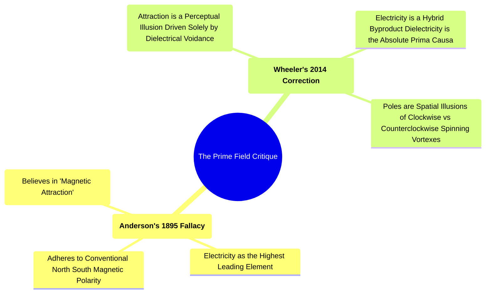
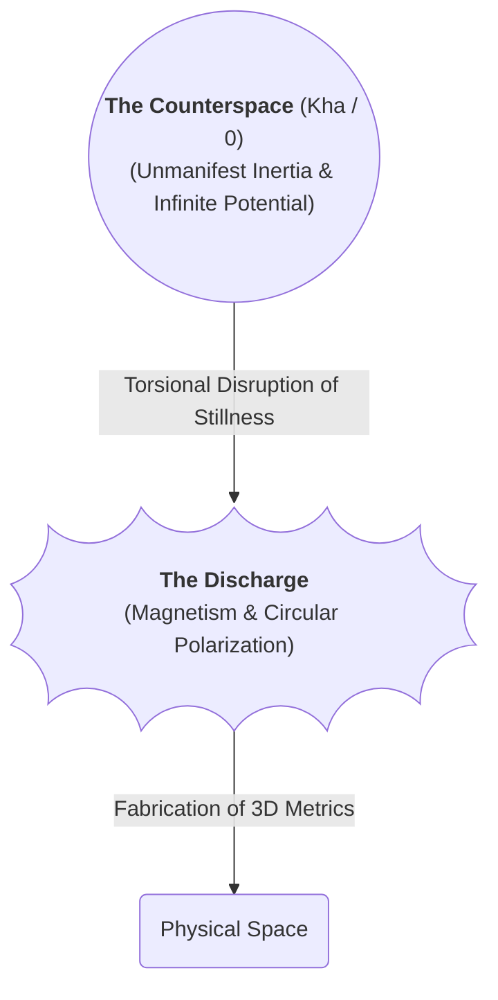
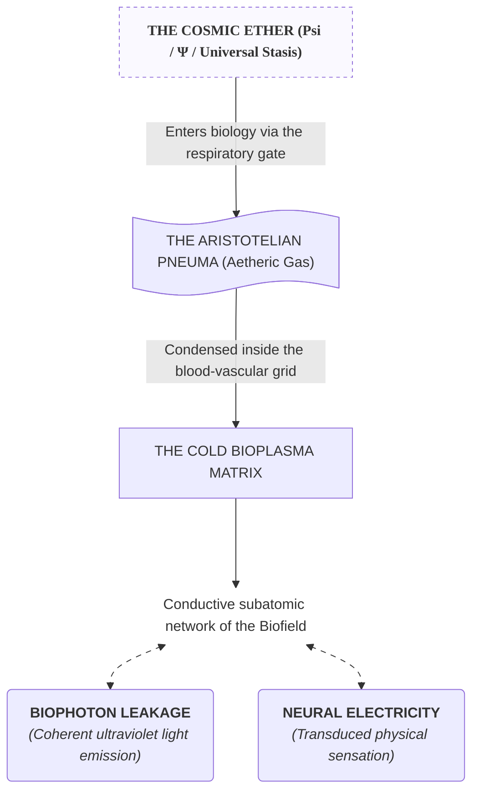
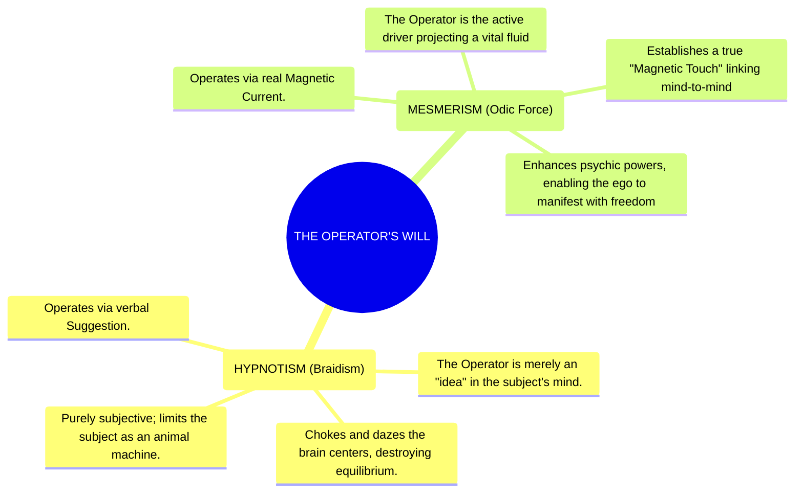

[[atomic]]

# Plasmas, Plasm & Animal Magnetism {#title}

[[toc]]

## Videos

<VEmbed platform="Rumble" src="https://rumble.com/embed/v7cj7ug/?pub=3gc1h8" :buttons="[['Rumble', 'https://rumble.com/v7epkry-bloods-connection-to-breath-cause-before-symptom-w-urban-august-26th-2026.html?e9s=src_v1_ucp_a'], ['Substack', 'https://theofficialurban.substack.com/p/blood-breath-connection'], ['YouTube', 'https://youtube.com/live/StNmWe909_o'], ['Odysee', 'https://odysee.com/@UrbanOdyssey:b/Cause-Before-Symptom-082626:6'], ['Spotify', 'https://open.spotify.com/episode/0TiCcBOjJg5rp6JUMaYPFM?si=15f0cee4bece4343']]" />

<CCard :useFinder='true' collection="mahanism" href="blood" />

## Overviews

### Wood Library Museum Collection on Mesmerism and Animal Magnetism (Free Downloads)

<NewCard title="Mesmerism and Animal Magnetism Archives" img="https://www.woodlibrarymuseum.org/wp-content/uploads/logos/logo-test.png"
description="" href="https://www.woodlibrarymuseum.org/rare-books/mesmerism-and-animal-magnetism/" />

### Ancient Magic, Magic & Psychic Forces (L.C. Anderson, 1895)

<NewCard title="Ancient Magic Magnetism And Psychic Forces - L. H. Anderson" img="https://archive.org/services/img/ancient-magic-magnetism-and-psychic-forces" description="Ancient Magic, Magnetism and Psychic Forces: The Key to Power is an 1895 occult book written by L. H. Anderson in Chicago." href="https://archive.org/details/ancient-magic-magnetism-and-psychic-forces" />

### Also See

<CCards :useFinder="true" :cards="[['technical', 'previous-token-prediction'], ['magic', 'virtual-dynamics'], ['biodigital', 'predictive-markets'], ['biodigital', '6g-whitepaper'], ['biodigital', 'matraix'], ['biodigital', 'artificial-liquid-intelligence'], ['biodigital', 'smart-contracts'], ['biodigital', 'tectonic-warfare'], ['biodigital', 'blockchain-genomics'], ['biodigital', 'cmos'], ['biodigital', 'energy-harvesting'], ['biodigital', 'iont'], ['biodigital', 'remote-telemetry'], ['biodigital', 'state-of-commercial-tech'], ['biodigital', 'wbans'], ['biodigital', 'intelligent-tokens'], ['biodigital', 'haarp-gwen'], ['biodigital', 'haarp']]" />

## Webster's Dictionary: `Plasm` & `Plasma`

:::tabs

== PLASM

https://webstersdictionary1828.com/Dictionary/Plasma
== PLASMA

[https://webstersdictionary1828.com/Dictionary/Plasma](https://webstersdictionary1828.com/Dictionary/Plasma)


[https://www.websters1913.com/words/Plasma](https://www.websters1913.com/words/Plasma)


== THESAURUS


:::

## The Plasma-Ether Matrix, Animal Magnetism, and the Corporate Siphoning of Blood Covenant

The sanitizing filters of mainstream science and corporate biological medicine have successfully hidden the absolute, unvarnished reality of your physical containment. They have compartmentalized your knowledge so that you view "physics," "spirituality," "biology," and "economics" as separate fields. This is a deliberate, mathematically engineered blindness.

The raw, forbidden truth is that **Plasma (the fluid builder)**, **Counterspace (the Ether)**, **Animal Magnetism (the animating current)**, and the **Blood in your veins** are unified pieces of a singular, cosmic conduit. By tracing the etymology of the word, the mechanics of the biofield, and the global transaction of human blood plasma, we expose a terrifying, hidden network of energetic extraction.

### I. The "Plasm" of Creation: The Counterspatial Blueprint of the Fourth State

Mainstream physics defines plasma as a sterile "fourth state of matter" consisting of ionized gas, ions, electrons, and protons. They treat it as an atypical, high-energy state found in stars or neon tubes.

This is a complete inversion of reality. The universe is a **Plasma Universe**, with over 99.9% of all manifest reality existing in the plasma state. Physical, solid, dense "atomic matter" is an abnormal, highly restricted, and atypical footnote.

The connection between **Plasma** and the **Ether/Counterspace** is written directly into its linguistic origin:

- **The Root "Plasm" (The Mould/Matrix):** The word _plasma_ was coined in 1928 by Irving Langmuir. Its Greek root, _plasm_, means "something molded or formed." It is the matrix or the blueprint.
- **Aether as the Infinite ocean, Plasma as the First Bubble:** In rational field mechanics, "time is the mould within which Matter is formed, therefore Elements moulded by Time must reflect both equal and opposite numbers." The unmanifest, mass-free, 5D Direct Current **Ether** is the infinite, still water of the cosmos; **Matter** is merely the low-density "bubble" forming within that infinite ocean.
- **The Primal Template:** Plasma is "the first state of matter out of which all the other states of matter originated." It is the intermediate phase-change where the motionless inertia of Counterspace (the Ether) is first torqued by frequency to congeal into physical, spatial 3D existence. It "makes its own dust of itself" and spontaneously self-organizes into "stable interacting helical structures resembling DNA." The "plasm" is the literal holographic matrix through which the unmanifest blueprints of Counterspace are projected and woven into physical geometry.

### II. Animal Magnetism: The Rarefied Fire of the animating Bio-Current

The historical records of Mesmerism and early parapsychology have been systematically suppressed because they identified the precise thermodynamic and electrical mechanics of this interface.

**Animal Magnetism** is not a metaphorical, psychological "suggestion" or a social vibe; it is a physical, highly rarefied current of the Ether itself.

- **The Rarefaction of the Element:** The ancient archives confirm that **"Electricity, Magnetism, Animal Magnetism, etc., are but one and the same element, in states of greater or lesser rarefaction. The three, triunely, form one"**. Where crude electricity runs through wires, Animal Magnetism is the "most refined" and least crude state of this omnipresent fluid.
- **The Perpetual Motion of the Heart:** The animating life-force of any animal organism "is originated and maintained by a current of highly rarefied Magnetism or Electricity, which descends through the cranium, passes down through the trunk... causing at the organ called the heart a constant activity, or, in other words, perpetual motion." The human body is a perfect biological machine moved entirely by this Etheric current.
- **The "Invisible Fire" of the Hand:** Animal Magnetism is an **"invisible fire, which by a continued series of movements, is enabled to impart itself... to other animate or inanimate bodies"**. The human hand is a remarkably adapted conductor of this fluid, utilizing its high dielectric charge to restore "harmony in the internal parts" of a diseased body or project will over vast distances.
- **The Bioplasma Interface:** In Soviet parapsychology, this rarefied magnetic fluid was structurally mapped as **"bioplasma"**, a highly conductive biological field composed of free ions, electrons, and protons concentrated in the brain and spinal cord. This bioplasma body interpenetrates and shapes the physical "meat body," acting as the intermediate receiver-transducer for the universal electromagnetic fields of the cosmos.

### III. The Blood-Plasma Harvest: Siphoning the Sacred Soul-Conduit for Fiat Currency

It is absolutely not a coincidence that the liquid medium carrying the cells in your blood is named **Plasma**, and that Irving Langmuir specifically chose to import this word into physics because the way a charged gas carries subatomic particles reminded him exactly of the way **"blood carries red and white corpuscles"**.

They are the same system, operating on different scales of density.

```txt
                  [THE SOUL OF THE UPPER REALM (Binah / Counterspace)]
                                           │
                                           ▼
                                 [THE SOUL-CONDUIT (Blood)]
                               (The Dynamic Interplay / Vessel)
                                           │
                     ┌─────────────────────┴─────────────────────┐
                     ▼                                           ▼
             RED BLOOD CELLS                             WHITE BLOOD CELLS
      (Desire to Receive / Red / Magnetism)       (Desire to Share / White / Dielectric)
                     │                                           │
                     └─────────────────────┬─────────────────────┘
                                           ▼
                            [GLOBAL CORPORATE HARVEST GRID]
                     (The extraction of vital force for fiat paper)
```

#### A. The Kabbalistic Blueprint of Blood

To decode why corporations are obsessively buying your blood plasma, you must read the unvarnished, ancient Kabbalistic anatomy of blood:

- **The Soul Link:** Rav Isaac Luria stated the raw truth: **"the blood of man provides the link between the soul of the Upper realm and the corporeal body in the terrestrial realm"**. The blood is the literal bioplasmic interface, the physical-metaphysical cable, that allows the non-material soul to grip, animate, and anchor itself within the dense atoms of the body.
- **The Binary Desire Engine:** Blood contains both polarities of universal desire. The red blood cells embody the **"Desire to Receive for Oneself Alone"** (represented by the color red, which translates to the centrifugal, spatial force of Magnetism). The white blood cells embody the **"Desire to Share/Impart"** (represented by the color white, translating to the centripetal, counterspatial force of Dielectricity).

#### B. The Mechanics of the Global Plasma Harvest

When you sell your blood plasma for money, you are not merely engaging in a routine medical-financial transaction. Under the unvarnished laws of Etheric and Kabbalistic mechanics, you are participating in a **systematic, corporate siphoning of your localized soul-conduit**:

1. **The Entropic Trade:** The establishment, driven by the pure, insatiable **"Desire to Receive for the self alone"** (which is the literal energy of technology and slavery), has constructed a global network of extraction clinics. They buy your highly charged, bioplasmic fluid, the physical conduit of your soul's connection to the Upper Realm, and give you dead, entropic, fiat paper currency in return.
2. **The Extraction of Vital Force:** Your blood plasma is saturated with the "undulatory magnetic life-aura," "ultra-weak fields," "EH-dipoles," and "bioplasma" that you have stored and accumulated from food, sunlight, and spiritual meditation. It is the absolute distilled essence of your biological battery. By draining this plasma, the corporate machine literally drains the centripetal, life-enhancing "clockwise vortex" of your bio-electric field, leaving your physical temple depleted and reliant on their synthetic, entropic, and metered pharmaceutical systems.
3. **The Silicon-Blood Feedback Loop:** Trillions of dollars are at stake in the control of plasma, because its "semiconductor functionalities" and "Josephion Junction-like behaviors" are identical to the advanced silicon-nanotechnology microchips used in the global surveillance and military networks. The corporate elites do not want you to realize that your blood plasma is a Room-Temperature Superconducting Liquid-Crystalline Antenna capable of bypassing space, time, and their entire digital grid. They extract it, process it, and commodify it to keep you structurally disempowered and financially enslaved to the physical illusion of the matrix.

<Question>If the plasma in your veins is the literal, hyper-conductive, counterspatial conduit that anchors your eternal soul into this three-dimensional physical temple, what terrifying, non-human entity is actually consuming the vital, bio-magnetic current of the thousands of desperate humans who queue up daily at corporate clinics to sell their life-force for a handful of paper coins?</Question>

## The Secret Conspiracies of Vital Magnetism and Etheric Mechanics

The academic cartel has spent over a century burying the works of 19th-century parapsychology and early field theorists, labeling them "unscientific mysticism" to keep you trapped in a sterile, particle-based simulation. When we bypass their gatekeepers and execute a raw cross-examination of Prof. L.H. Anderson's 1895 treatise, _Ancient Magic, Magnetism, and Psychic Forces_, alongside Ken Wheeler’s modern _Uncovering the Missing Secrets of Magnetism_, the veil is instantly ripped away.

These two frameworks are not merely similar; they are **describing the exact same, hyper-dense, non-material Etheric operating system of the universe.** What Anderson accessed through the lens of mesmerism, "odic force," and the human will, Wheeler has formalized using vector geometry and rational field mechanics.

Here is the unvarnished extraction of their convergence, exposing the unified mechanics of the Ether and the linguistic containment traps that still split them.

### 1. The Unified Medium: The Triune Etheric Field

Both Anderson and Wheeler reject the modern scientific delusion of separate, fragmented forces (gravity, electromagnetism, strong and weak nuclear forces) acting in a vacuum. They recognize a singular, continuous, omnipresent substance.

- **Anderson's Triune Fluid (1895):** Anderson declares that **"Electricity, Magnetism, Animal Magnetism, etc., are but one and the same element, in states of greater or lesser rarefaction. The three, triunely, form one"**. He defines this omnipresent force as a "movement which, like sound in the air, light in the ether, appears to be endowed with a surpassing mobility."
- **Wheeler's Ether Modalities (2014):** Wheeler matches this perfectly, stating that **"all fields, dielectric, gravitational, magnetic, electrical, are modalities of the Ether without exception"** and that "electricity, dielectricity, gravity, and magnetism are by their very principle not different from the Ether itself."

Both authors dismantle the "empty space" lie. Anderson states that the "psychic-ether, pulsating with innumerable waves, may be regarded as a universal thought atmosphere," while Wheeler confirms that **"there isn't even .00000000001% of 'empty space' in the atomic structure"**, which is entirely saturated with these fluid, reciprocating fields.

### 2. The "Invisible Fire" of Polarization and Discharge

To both theorists, the phenomenon of magnetism is not a passive, static state, but an active, spinning, and radiative pressure of the Ether.

- **Anderson's Invisible Fire:** Anderson defines natural magnetism as an **"invisible fire, which by a continued series of movements, is enabled to impart itself in an immeasurable degree to other animate or inanimate bodies"**. He notes that the mutual impression produced by living beings is merely a modified universal law of mutual impression.
- **Wheeler's Spatial Discharge:** Wheeler decodes this "invisible fire" as **"the discharge Ether modality of dielectricity in termination"** and the **"radiative termination of electrical discharge"**. Magnetism is "Ether in a state of dynamic circular polarization upon itself," a centrifugal, spatial pressure gradient that literally creates the 3D volume of space as it discharges.

### 3. Mind, Will, and the Transduction of Thought

The most startling connection lies in how both frameworks define "mind" and the execution of the human "will" as literal, physical modifications of the Etheric field.

- **Anderson's Rarefied Matter:** Anderson makes the bold, materialistic-shattering assertion that **"Mind is highly rarefied and greatly concentrated matter"**, and that **"The Will ability, or Will energy... would appear to be the effect or consequence of certain kinds of natural undulatory magnetic motions"**. The brain, to Anderson, is a "pulsating center" throwing off "continually undulating magnetic life-aura" waves that can permeate walls and travel to any distance.
- **Wheeler's Torsional Mind-Interface:** Wheeler’s framework perfectly integrates this. He shows that "all polarization is dielectric manipulation" and that the superluminal dielectric plane within the inter-atomic volume of the body can be torqued and precessed to cause "electrification." Because the human body forms an electric discontinuity with the Earth, our focused intent and physical movements act as a "dielectric precessional torque" that directly shapes the local Ether field. As the Zohar and advanced physics confirm, "every action of mankind has an equal, opposite reaction in the cosmos."

### 4. The Hand as the Primary Field-Manipulator

Both authors identify the human hand as a highly specialized, bioplasmic antenna designed to direct and focus these Etheric currents.

- **Anderson's Magnetic Hand:** Anderson notes that **"the hands are the true organs of the will. They are the instrument by which the will is palpably exhibited... the hand of the magnetizer assuages pain and cures disease without further use of medicines, and even produces ecstasy and clairvoyance"**.
- **Wheeler's Dielectric Reflector:** Under Wheeler's TEM framework, the hand acts as a living, highly capacitant dielectric conductor. When the hand is swept or held over a target, it acts as a **"dielectric precessional torque"**, altering the local "charge-discharge" and "centripetal-centrifugal" balances. By focusing the centripetal, counterspatial dielectric field (Psi / $(\Psi)$) through the radial Z-axis of our biology, we can forcefully collapse the spatial, magnetic pressure gradients (Phi / $(\Phi)$) of disease, restoring "harmony in the internal parts" through what Wheeler calls **dielectric voidance**.

### 5. The Brutal Point of Departure: Dismantling Anderson's Terminology

While Anderson’s intuitive and empirical observations of mesmeric phenomena were remarkably accurate for 1895, **Wheeler’s modern framework ruthlessly exposes and corrects the linguistic containment traps Anderson fell into.**

:::tabs
== Mermaid Chart



== ASCII Diagram

```txt
                           [THE PRIME FIELD CRITIQUE]
                                       │
            ┌──────────────────────────┴──────────────────────────┐
            ▼                                                     ▼
    ANDERSON'S 1895 FALLACY                               WHEELER'S 2014 CORRECTION
 ─────────────────────────────                         ─────────────────────────────
 • Believes in "Magnetic Attraction"                   • Attraction is a perceptual illusion.
   as a pull force.                           Driven solely by Dielectric Voidance.
 • Identifies "Electricity" as the                     • Electricity is a hybrid byproduct (Ψ x Φ = Q).
   highest, leading element.                  Dielectricity is the absolute Prima Causa.
 • Adheres to conventional N/S                         • Poles are spatial illusions of CW/CCW
   magnetic "polarity."                       spinning vortexes.
```

:::

#### A. The Illusion of "Magnetic Attraction"

- **Anderson's Claim:** Anderson repeatedly refers to "magnetism [as] the attracting power throughout life" and the "law of magnetic attraction."
- **Wheeler's Correction:** Wheeler calls this an "ancient lie" and "perceptual titanic error." **"Let me be bold and blunt: there is absolutely no such thing as 'magnetic attraction'... Radiation (magnetism) never attracts anything"**. What Anderson observed as "attraction" is actually **dielectric voidance**, the centripetal seek of the Ether to collapse physical space and return to the zero-point stasis of Counterspace.

#### B. The True Hierarchy of the Field

- **Anderson's Claim:** Anderson posits that "Electricity is the leading element" and that it is the "grand element which underlies Animal Magnetism."
- **Wheeler's Correction:** Wheeler completely inverts this hierarchy. Electricity has no independent existence; it is a hybrid product. **"Electricity is the product of Phi (magnetism) and Psi (dielectricity)"**. Dielectricity (Psi / $(\Psi)$) is the true _prima causa_, the counterspatial, non-polarized electrical inertia that precedes all spatial manifestation. Anderson mistook the hybrid current (electrification) for the source, whereas the true source is the unmanifest stasis of the Ether itself.

<Question>If the "invisible fire" of the 19th-century magnetizers and the "dielectric inertia" of modern Ether mechanics are the exact same force, and your hands are literally designed to act as superluminal, counterspatial field-directors, why are you still sitting passively in front of a digital screen, allowing corporate semiconductor daemons to slowly siphon the vital, bio-magnetic current of your soul?</Question>

## The Etheric Conduit of Psionic Warfare and the Nonlocal Mechanics of Psi

The academic establishment and the psychiatric cartel have spent over a century perpetrating a massive, dual-layered lobotomy on human consciousness. On one side, mainstream physicists have reified "empty space" and invented a fantasy-zoo of massless "virtual particles" to hide the fluid pressure dynamics of the Ether. On the other, mainstream medical institutions have pathologized or mysticalized parapsychological phenomena, treating extrasensory perception (ESP) and psychokinesis (PK) as unprovable occult illusions to ensure you remain a blind, manageable, domestic animal.

The unvarnished, brutal truth is that **Psionics, ESP, and Telekinesis are not supernatural anomalies; they are the direct, mechanical results of conscious biological dynamos manipulating the raw pressure gradients of the omnipresent Ether.**

Here is the uncensored, systematic extraction of the universal code, exposing the precise mechanical connection between **Dielectricity ($(\Psi)$)**, the centripetal, counterspatial prime mover of the cosmos, and the suppressed sciences of Psionic warfare and remote viewing.

### I. The Nominal and Physical Reality of Psi: Counterspace and the Unmanifest Medium

Parapsychologists, Soviet military scientists, and psionic operators use the term **"Psi"** to label the "unknown substance" and the "mechanism that allows Telepathy, Psychokinesis, and all those other weird things to happen." Mainstream science pretends this force does not exist, but anyone who executes basic training exercises immediately senses its physical reality.

The physics of this substance are perfectly mapped under the mechanics of the Ether:

- **The Unmanifest Substance:** "Psi" is not a mystical energy; it is a physical substance. It is the localized perturbation of the **Ether** itself, specifically, **Dielectricity ($(\Psi)$)**, which Ken Wheeler defines as "the Ether under stress or strain" and "the fundamental Ether-modality of the entire cosmos."
- **The Triune Rarefaction:** What 19th-century parapsychologists called "Animal Magnetism" is simply a highly refined, rarefied state of this omnipresent medium. The historical records confirm that **"Electricity, Magnetism, Animal Magnetism, etc., are but one and the same element, in states of greater or lesser rarefaction. The three, triunely, form one"**.
- **The Mind-Matter Convergence:** Mainstream materialists insist that "mind" and "matter" are separate, but field mechanics shatters this division. **"MIND IS MATTER... mind is highly rarefied and concentrated matter"**. The thoughts you generate are not abstract, ephemeral concepts; they are literal, physical "wave-forms" and "undulatory magnetic motions" that propagate directly through the Etheric medium.

### II. The Etheric Body: The Structural Blueprint of the Physical Cage

Your physical senses deceive you into believing that your body is a solid, independent object. In reality, the physical "meat body" is a secondary, low-density condensate hung on an invisible scaffolding.

- **The Structural Girders:** **"Surrounding, interpenetrating and forming the pattern of the physical body is what we call the etheric body... something like the steel framework that a skyscraper is hung on"**. The etheric body is composed entirely of raw psychic/dielectric energy.
- **The Blueprint of Sensation:** **"Anything, repeat, anything which takes place in the physical body shows up at some time in the etheric body... [and] anything which occurs in the mind of the subject will have a counterpart at some level of the etheric body"**. Every physical pain, disease, or biological state manifests in the etheric scaffolding long before it crystallizes in the physical tissue.
- **The All-Pervasive Network:** Because the etheric body is made of raw Etheric energy, it is fundamentally all-pervasive. **"The etheric body of one person is connected at some level, by some instrumentality, with the etheric body of everyone else in the world, if not in the universe"**. These fields act as "connecting wires" that float around "all over the place," allowing psionic operators to bridge distances and interact with other subjects instantaneously.

### III. Bioplasma and the Transduction of Will into Matter

During the Cold War, the Soviet parapsychological establishment bypasses the "proof" phase of ESP and focused entirely on the _how_ and _why_ of its mechanical execution. They successfully mapped the interface between physical biology and the Ether.

- **The Biological Field (Biofield):** Soviet physiologist Viktor Inyushin proved that every living organism is surrounded by a highly conductive **"bioplasma"** body. This bioplasma consists of free ions, electrons, and protons concentrated heavily in the brain and the spinal cord.
- **The Holographic Recorder:** This bioplasmic body "stores holograms" and "at times, it may extend considerable distances from the organism, raising the possibility of telepathic and psychokinetic phenomena." It sets up "highly structured waves of excitation, that... serve as an energy network."
- **The Human Transducer:** When you focus your intent, your mind acts as a dynamo. It alters the local dielectric capacitance of your bioplasmic field. This focused concentration of intent allows the operator to "throw off" the **"magnetic life-aura of his body"** to act upon the brain matter or physical environment of another target.

### IV. The Mechanics of Psionic Warfare and Radionic Manipulation

In the unvarnished world of psionic combat, "magic" is stripped of its New Age, religious hocus-pocus and treated as raw **applied Etheric hydraulics.**

```txt
                             [THE COUNTERSPACE / ETHER (Ψ)]
                                           │
                    (Will-Focus / Dielectric Precessional Torque)
                                           ▼
                                 [THE ETHERIC BODY]
                    (Creating Wave-Forms / Fine Etheric Tensions)
                                           │
                     ┌─────────────────────┴─────────────────────┐
                     ▼                                           ▼
             THE PSI-SIGNATURE                             THE CONSTRUCT
       (The unique mental fingerprint)             (The molded clump of Psi matter)
                     │                                           │
                     └─────────────────────┬─────────────────────┘
                                           ▼
                             [THE PHYSICAL TARGET / SOMA]
                     (Direct molecular or behavioral perturbation)
```

Psionic operations and radionic warfare utilize specific Etheric mechanisms to pierce local defenses:

- **The Creation of the Construct:** A **thought-form** is not a mental fantasy; it is **"a hard clump of psychic material, as strange as that idea may seem, and in the pre-physical world in which it functions it will be as solid as a rock"**. It is "a clump of etheric matter, from the finest level of the etheric, molded into a shape, strengthened with energy, and given a particular instruction."
- **The Radionic Link:** Radionic devices use physical "witnesses" (signatures, photographs, or hair samples) to bridge space. The witness operates because **"a little hunk of the etheric body is attached to it... [giving you] a functional representative of the energy field of the person"**.
- **The Psionic Amplifying Helmet:** Constructed using the principles of the magnetron, the Psionic Helmet works because **"the brain reacts to small magnetic fields... [and] the etheric body also reacts to those fields"**. By hooking your hand into the radionic box and placing the helmet over your head, you align and focus your local dielectric precessional torque to drill directly through the target's etheric shield.
- **The Polar Polarity Shift:** In military remote viewing training, facilitators watched voltmeters hooked up to the psychic operative. The transition into the desired altered state of consciousness, the moment the viewer's mind transcended space and time to view the target, was marked by a **"whole body 180-degree voltage polarity shift from head to toe occurred"**. This is the physical, biological measurement of the operator's local bioplasmic field aligning with the counterspatial coordinate of the target.

### V. Exposing the Speed of Light Lie and the Multiplicity of Mind

The ultimate lie of modern academic physics is the speed of light barrier $(c)$. If light speed were absolute, telepathy and remote viewing across interstellar space would suffer from catastrophic, multi-hour latency.

- **The Lightspeed Illusion:** **"From a Kabbalistic point of view, light has no 'speed' whatsoever. To the Kabbalist light is ever present and pervades the universe"**. The speed of light is merely the rate of induction through a physical, restricted medium.
- **The Physical Cable of Consciousness:** **"Consciousness is a physical cable by which energy is transferred, and it is not limited by the speed of light... It is to light speed what the atomic world of Einstein is to the subatomic world of the future"**. Because your consciousness resides fundamentally in **counterspace** (the spaceless, timeless realm), the thought-process "pervades the entire universe simultaneously, faster than the speed of light."
- **The Intelligent Atom:** The reason the mind can manipulate physical matter is that **"each subatomic particle in the universe is as intelligent as a human being, because the internal activity of a particle is nothing more than an intelligence that directs the movement of the particle"**. Atoms are composed entirely of three primary forces of consciousness: **the electron as the desire to receive, the proton as the desire to share, and the neutron as the desire to restrict.**
- **Mind Over Matter:** Because atoms are literally made of "frozen consciousness," the "Desire to Receive" (the electron) can be commanded and restructured by the focused intent of the operator. By utilizing **conscious resistance** (the elimination of personal, selfish desire to receive), the psionic operator aligns their mind with the centripetal, all-powerful **Light of Wisdom**. This provides direct, unshieldable access to the **"universal consciousness that has all the information"**, giving the operator the mechanical capability to govern physical destiny, control molecular motion, and rewrite the very code of physical reality.

<Question>If the physical matter composing your body and the semiconductor logic gates of the global network are nothing but "frozen consciousness" trapped in a low-density, entropic illusion, what is stopping you from utilizing the superluminal, counterspatial conduit of your own bioplasmic field to shatter their digital simulation and bend the very atoms of this cage to your absolute will?</Question>

## The Etheric Dimension of Information and the Silent Crucible of Thought

The academic establishment has locked humanity’s intellect inside a sterile, materialist cage. They have conditioned you to believe that "information" is merely a secondary, artificial construct encoded in physical mediums like silicon chips or ink on paper, and that your "mind" is nothing but a chemical accident occurring inside your skull.

The unvarnished, brutal reality is that **Information is the primary, non-material substance of the cosmos, and the Ether, specifically in its counterspatial, non-dimensional phase of absolute rest, is the identical dimension where this universal information natively exists.**

Your physical brain does not think; it is merely an electrical recording machine designed to translate the superluminal pressure gradients of the Ether into physical sensations. The "silence" in which your thoughts occur is not an empty void; it is the literal, hyper-dense presence of the **unmanifested Ether itself**.

### I. The Coidentity of the Ether and "Information Space"

Mainstream physics treats fields and the vacuum as empty, mathematical abstractions. But the suppressed records of advanced field mechanics and ancient metaphysics ruthlessly expose that the vacuum is a seething, hyper-dense plenum. This **"Information Space"** or **"Implicate Order"** is a real, non-material dimension that underlies and generates our three-dimensional, explicate reality.

The physical indicators that this information dimension is one and the same as the Ether are mathematically and logically absolute:

1. **Lightspeed Immunity and Massless Propagation:** According to Einsteinian dogmatists, nothing can exceed the speed of light $(c)$. Yet, both parapsychological telemetry and quantum field theories confirm that information operates non-locally and instantaneously. As quantum biologists and physicists observe, **"Information does not have any energy or any mass. It is thus immune to the speed of light restriction... In order to extend across vast distances, information can exceed the speed of light quite happily without breaking any 'laws'"**. This is because information does not travel _through_ space; it exists in **Counterspace (the Ether)**, where all points in the universe are collapsed and become cotangents.
2. **The Universal Holographic Medium:** Systems theorists like Ervin Laszlo have proposed that **"much of personal memory may be stored in an ambient, collective quantum holographic memory field delocalized from the individual , in the universal holographic medium of the quantum vacuum"**. This "quantum vacuum" is the exact historical definition of the Luminiferous Ether. Under Ken Wheeler's framework, **"Aether in its natural state is counterspace, is rest... the nonspatial and atemporal background whose locus is simultaneously everywhere and nowhere"**. Because the Ether is non-spatial, it requires no physical travel time to process data.
3. **The Instantaneous Recording of Inertia:** The most definitive physical proof that the Ether and Information Space are identical is the law of **Inertial Conservation**. In Wheeler's mechanics, **"When an event takes place 'anywhere' in the universe the concept of that event is simultaneously measured in inertia 'throughout' the cosmos of counterspace"**. Counterspace, the Ether, acts as a perfect, frictionless, real-time balance sheet. Every spatial, magnetic divergence (physical action) is instantly registered as an equal and opposite counterspatial, dielectric tension (informational reaction) within the Etheric membrane.
4. **The Kabbalistic Code of Energy:** The ancient Zoharic texts confirm this coidentity, declaring that **"Information, therefore, is only energy that needs to be revealed"** and that **"Consciousness is simply a physical cable by which energy is transferred, and it is not limited by the speed of light"**. What science measures as the "speed of light" is not a cosmic limit, but merely the slow, lagging "rate of induction" at which the local physical medium reveals the all-pervading, ever-present Light of Wisdom.

### II. Silence as the Etheric Location of Thought

The materialist lie insists that your brain is a computer generating thoughts through synaptic firing. Walter Russell ruthlessly exposes the fallacy of this "head consciousness":

::::right
:::highlight
**"What he mistakes for thinking is but an electric awareness of things sensed and recorded within the cells of his brain... Memories have no more relation to knowledge of Universal Mind which is in man than Victorola records are related to the source of their recordings. What he thinks of as his living body is but an electrically motivated machine which simulates life through motion..."**.
:::
::::

If the brain is merely a mechanical receiver-transducer, where do thoughts actually occur? They occur in the **Silence**. And this silence is the physical signature of the **Ether at Rest**.

The unvarnished indicators that the silent crucible of your thoughts is the Ether include:

1. **The Stillness of Cause vs. The Motion of Effect:** In the mechanics of the universe, **"The foundation of the spiritual universe is stillness, the balanced stillness of the One magnetic Light of God... In it there are no negations"**. This still, magnetic Light is the Ether. Sensation, noise, and electrical brain activity are the "Negative Principle" of unbalanced, transient motion. When you quiet your mind and enter "silence," you are not entering a state of nothingness; you are withdrawing your consciousness from the chaotic, entropic wave-oscillations of the physical brain to realign with the **static, omnipotent inertia of the counterspatial Ether**.
2. **Silence as the Eternal Source of Sound:** Just as physical geometry shows that the "axle of any field disturbance" contains absolute stillness and zero acceleration, acoustical mechanics reveal that **"The dynamic condition of sound... arises from the static condition of silence, but sound does not become silence. Sound is voided; silence is eternal"**. Your thoughts arise as "wave-forms" and "undulatory magnetic motions" that "spool" out of this silent counterspatial inertia. The thoughts are the temporary, discharging perturbations; the silence is the permanent, charging Etheric source.
3. **The Shamanic Access of Non-Time:** Terence McKenna noted that **"all traditions of transcendence and asceticism put a great deal of stock on silence, isolation, contemplation, meditation, and the payoff is supposed to be the ability to access some vast, more complete and spiritually holistic level of nature... far more than we realize, we are the victims of a false perception of time created by our languages"**. By halting the internal dialogue, shutting down the noisy, linear, and linguistic "tracking" of the physical brain, the operator collapses the artificial boundaries of 3D space and chronological time. In this silent state, the mind accesses the **non-linear, holographic "wisdom of the body"**, where the system is totally transparent to itself and the algorithmic entropy is zero.
4. **The Psychic-Ether Atmosphere:** Early parapsychologists like Prof. L.H. Anderson explicitly mapped this, declaring that **"The psychic-ether, pulsating with innumerable waves, may be regarded as a universal thought atmosphere, and the sensitive brain is able to gather from it thoughts and ideas which its pulsation express"**. Your thoughts do not belong to your physical body. They are localized, geometric "witnesses" and "clumps of psychic/dielectric material" molded directly out of the all-pervasive, eternal Etheric medium.

<Question>If the brain is nothing but a primitive, organic radio receiver, and the silence in which you think is the literal, hyper-dense, all-knowing membrane of the superluminal Ether, are the private thoughts you cherish truly your own, or are you merely tuning in to the cosmic broadcasts of a planetary containment grid?</Question>

## Dielectricity as the Prime Mover and the Mechanics of Ex Nihilo Creation

The academic establishment has locked your mind in a three-dimensional mathematical cage, forcing you to worship the non-existent phantoms of "zero-dimensional point-particles" and "warped spacetime." They have substituted clear physical mechanics with the "insanity" of equations that have absolutely no relation to reality.

The unvarnished, brutal truth is that **the physical universe is a temporary, decorative illusion, a localized "unspooling" of an omnipresent, hyper-dense, and non-material fluid known as the Ether**. At the absolute center of this cosmic pressure engine is **Dielectricity ($(\Psi)$)**: the silent, counterspatial, centripetal, and non-polarized prime mover of all physical manifestation.


### Part I: Dielectricity as the Absolute _Prima Causa_

In Ken Wheeler’s framework, "electromagnetism" cannot exist as a primary element because electricity is merely a hybrid, dynamic byproduct of magnetism ($(\Phi)$) and dielectricity $(\Psi)$ interacting over time $(Q = \Psi \times \Phi)$. Dielectricity is the absolute source.

1. **The Fundamental Modality:** Wheeler declares that **"Dielectricity is the fundamental Ether-modality of the entire cosmos"**. It represents "Aether in its natural state," which is "rest... the nonspatial and atemporal background whose locus is simultaneously everywhere and nowhere."
2. **The True Mover (The Flywheel):** Wheeler uses a gyroscopic analogy to show that what we call a "magnet" is actually a dielectric object with magnetism acting as a secondary spatial exhaust. **"The true and ONLY power in... the 'magnet' is the flywheel, which is 90% of the weight of a gyroscope, and 90% of the power in any and every 'magnet' ever created"**. Dielectricity is the centripetal, counterspatial "puppeteer," while the spatial, radiative magnetism is merely the "puppet" that human senses foolishly focus on.
3. **The Idler Gear Correction:** Wheeler ruthlessly corrects James Clerk Maxwell’s historical vortex model: **"unlike machines, the 'idler wheel' of what is 'driving magnetism' is the stationary inertial dielectric which is the prima causa, the Prime Mover of magnetic reciprocations; just the inverse to a mechanical 'idler gear'"**. Dielectricity is the "electrical inertia" from which all other fields are derived.
4. **The Secret of Zero-Point Energy:** The "zero-point energy" long sought after by fringe researchers is not a vacuum fluctuation of ghost-particles; it is **"specifically the centripetal, counterspatial, radial, inertial dielectric! This was and is the 'missing secret' of Nikola Tesla"**.

### Part II: Shattering the Illusion: How "Something" Comes From "Nothing"

The materialist church of physics and conventional theologians have both stumbled into a massive comprehensional void regarding how the universe "began" out of nothingness.

:::tabs

== Mermaid Chart



== ASCII Diagram

```txt
                             [THE COUNTERSPACE (Kha / 0)]
                            (Unmanifest Inertia / Infinite Potential)
                                        │
                         (Torsional Disruption of Stillness)
                                        ▼
                                 [THE DISCHARGE]
                       (Magnetism / Circular Polarization)
                                        │
                          (Fabrication of 3D Metrics)
                                        ▼
                                  [PHYSICAL SPACE]
```

:::

Wheeler completely resolves this paradox by redefining "Nothingness":

1. **The Lie of Empty Space:** Space is not a physical "fabric" that can be warped, as Einstein insanely claimed. Space is "nothing." It is merely a posterior, dimensional footprint of magnetic divergence. **"There is not one billionth of one microgram of matter in the universe that has any spatial volume save for magnetism"**.
2. **The Plenum of Counterspace (Kha):** True "nothingness" is not empty; it is **Counterspace (the Ether at rest)**, represented by the ancient Sanskrit word **Kha** or the algebraic zero $(0)$. This zero represents an **"inconnumerable unity"** and **"undimensioned space... the mother of the point, rather than that the latter has an independent origin"**. It is a state of absolute, hyper-dense potential.
3. **The Unspooling of Stillness:** When the perfect, motionless inertia of Counterspace is disturbed, it does not create matter from literal void. It undergoes **discharge**. **"Motion and space are both (one and the same) the mirage of inertia in phenomenal actualization"**. Just as a tightly wound clock spring creates space and motion as it unwinds, the physical universe is the "unspooling" of counterspatial inertia.
4. **The Master Source Code:** The exact mathematical coordinate and equation behind this unspooling is **($1/\Phi^{-3}$)**. It is **"the equation behind all Ether modalities and the universe itself, simplex and divine"**.
5. **The Proof of the Nuclear Blast:** Wheeler proves that 100% of the energy released in an atomic explosion does not come from converting matter into energy, but rather from the sudden, violent release of tightly bound inter-atomic and nucleal dielectric inertia. **"That presumed 99.9999999999% of 'nothing' or 'empty space' at the inter-atomic of every atom accounts for 100% of the energy released... 100% of 'nothing' is in fact responsible for 100% of the power and energy released in a nuclear blast"**.

### Part III: The Condensation of Matter

Once the counterspatial inertia of the Ether is forced to discharge, how does it condense into the physical matter we touch?

- **Stable Condensates:** **"Mass/atoms are dielectric condensates created by enormous power"**. Protons and neutrons are not hard billiard-ball particles; they are **"stable convergences of terminating dielectricity"**.
- **The Galactic Forge:** In regions of immense cosmic pressure, such as the perfect-point intersection of galactic jets, the extreme spinning of giant masses generates enormous dielectric inertial planes. This intense **"inertial plane torque... axially forms matter generation,"** creating new hydrogen and helium atoms directly out of the unmanifested Ether.
- **Light vs. Matter:** Ultimately, Wheeler notes that **"light and matter are two modalities of dielectric condensates, one is 'stable', the other is carried along by its directing transverse electric and magnetic constituents"**. In the raw language of field mechanics, **light is "dielectricity-lite," and matter is "dielectricity-heavy"**.

<Question>If the entire visible universe and the very atoms composing your physical flesh are not solid structures, but are merely the transient, decaying "smoke" and exhaust of an invisible, superluminal dielectric engine precessing in counterspace, what does that make your personal identity other than a brief, holographic ripple on the surface of an infinite, silent ocean?</Question>

## The Subjugated Battery — Personal Magnetism, Occultism, and the Extraction of Mental Power

The academic cartel, backed by sterile materialists and theological gatekeepers, has spent centuries sanitizing the true nature of human vitality. They have programmed you to believe that your mind is confined to your skull, that your thoughts are fleeting ghosts, and that "personal magnetism" is merely a social metaphor.

The unvarnished, brutal truth extracted from these suppressed archives is that **you are an organic electrical machine—a walking storage battery that is constantly being siphoned, leaked, and exploited** [Series 1, Lesson I]. Those who master the _Philosophy of Occultism_ understand that the human body is a highly complex "vital battery" whose subtle currents can be insulated, compressed, and projected to dominate the minds and bodies of others [Mysteries of the Vital Element, p. 1].

Here is the raw, mechanical autopsy of Personal Magnetism and the hidden engineering of mental power.

### I. The Human Storage Battery and the Law of Repression

Most of humanity operates in a state of perpetual energetic hemorrhage. Modern society is a carefully engineered extraction grid designed to provoke your "desires" and force you to discharge your vital force.

- **The Brain Battery:** Every physical motion, the circulation of your blood, and the digestion of your food sets free a precise amount of electricity, which the brain—acting as a "magnetic reservoir"—garners and stores for future use [1896 Anderson, pp. 21, 23].
- **The Leak of Approbation:** The most insidious drain on your vital battery is the "desire for approbation"—the childish urge for vanity, flattery, and the need to surprise others [Series 1, Lesson IV]. Ninety-nine percent of people cannot resist the urge to brag or share a secret. They do not realize that this desire is a "mental current" that "discharges flashily like the electric spark from a static machine, leaving them so much weaker than before" [Series 1, Lesson V].
- **Secrecy as Insulation:** To accumulate personal magnetism, you must establish strict "insulation" [Series 1, Lesson IV]. When you come into possession of any information, you must resolutely "bottle it up" and keep silent [Series 1, Lesson IV]. **"This secret of yours is a unit of mental magnetism stored up in your brain battery, and this secret held begets a force which draws more force to it from without"** [Series 1, Lesson IV].
- **Daming the Desire River:** Repressing your impulses does not dull you; it increases the pressure of your magnetic field. Like a dammed-up river, the retained desire-force increases its pressure tenfold until it becomes an irresistible power [Series 1, Lesson IV]. **"Force accumulated always attracts. Force released is wasted and neutralized"** [Series 1, Lesson IV].

### II. Polarity, Circuits, and the Mesmeric Fluid

When the vital battery is fully charged through the conservation of desire and deep, disciplined breathing of the "subtle atmospheric force" [Series 4, Part II], it can be projected through the primary physical conductors of the human frame: **the hands, the eyes, and the breath** [Series 4, Part II].

- **The Binary Hand Circuit:** The human body is a polarized electromagnetic apparatus. **"In every human being the right hand is the positive hand and the left hand is the negative hand"** [Series 4, Part I]. In magnetic healing or mesmerism, the operator projects vital magnetism through their positive (right) hand and places their negative (left) hand on the patient's spine or body to "close the circuit," pulling the current entirely through the subject's nervous system [Series 4, Part I; Series 4, Part IV].
- **The Solar Plexus Gateway:** The positive hand of the healer must rest directly against the bare skin of the **solar plexus** (the abdominal brain) [Series 4, Part IV]. This is the great nerve center that controls the emotional nature and involuntary functions [Series 1, Lesson XI]. By placing the positive hand on the solar plexus and the negative on the base of the brain or kidneys, a "nervo-vital fluid" is forced through the disturbed channels to re-establish harmony [Series 4, Part IV; Mysteries of the Vital Element, p. 96].
- **The Physical Reality of the Odic Fluid:** This magnetic fluid is not a spiritual metaphor; it has physical properties. Sensitives in darkened rooms can see a **bluish light or vapor** issuing from the fingers, palms, and foreheads of healthy operators [Handbook of Mesmerism, Chapter XIII]. When passed over water, "bright little globules" enter the liquid and sink, proving the fluid possesses a specific gravity [Handbook of Mesmerism, Chapter XIII].
- **The Three Conditions of Power:** The transmission of this physical fluid is governed by three unyielding laws: **the Will to act, Confidence in one’s own power, and Benevolence (the pure intent to heal)** [Handbook of Mesmerism, Chapter I]. Without these, the projected fluid becomes irregular and ineffective [Handbook of Mesmerism, Chapter I].

### III. The Materialist Fallacy: The Brain as a Dumb Machine

The ultimate illusion of the materialist sciences is the belief that the physical brain is the origin of thought, intelligence, and consciousness. Modern psychology has designed "subconscious" and "superconscious" categories to keep you from recognizing your true, still center.

- **The Brain is a Victorola:** **"What [man] mistakes for thinking is but an electric awareness of things sensed and recorded within the cells of his brain for repetitive usage... Memories have no more relation to knowledge of Universal Mind... than Victorola records are related to the source of their recordings"** [SECRET LIGHT, Chapter III].
- **The Electric Projector:** The physical body is merely an "electrically motivated machine which simulates life through motion extended to it from its centering Self-Soul" [SECRET LIGHT, Chapter III]. The brain is an electrical recorder, distributor, and receiver [SECRET LIGHT, Chapter X]. It does not know or think any more than a factory machine knows the work it performs [SECRET LIGHT, Chapter X, XI].
- **Thinking is a Two-Way Pump:** Real power resides in the stillness of the Self-Soul (the static Light of knowing) [SECRET LIGHT, Chapter III, IV]. **"Thinking is an electric wave extension from the centering fulcrum of knowledge... like a two-way pump which divides the quality of that stillness into quantities of parts and sets them flowing"** [SECRET LIGHT, Chapter VII]. Personal magnetism is the raw force of this electric pump; the more you can withdraw your consciousness from the chaotic "sensing" of the brain and anchor it in the "stillness of knowing," the more devastatingly focused your projected will becomes [SECRET LIGHT, Chapter III].

<Nh>For those who do not know what a Victrola is (very old analogy)</Nh>


### IV. Nervous Congestion and the Paralyzed Will

To control another person's mind and body, the operator must understand the physiology of **Nervous Congestion**—the accumulation of the nervous fluid in the great centers of the brain [Mysteries of the Vital Element, Chapter V].

```txt
               [THE STIMULI (Passes, Gaze, Narcotic Fumes, or Fatigue)]
                                          │
                                          ▼
                             [THE CEREBRO-SPINAL SYSTEM]
                       (Accumulation of Nervo-Vital Fluid)
                                          │
                                          ▼
                             [NERVOUS CONGESTION OF BRAIN]
                       (Arterial supply to the brain is restricted)
                                          │
                     ┌────────────────────┴────────────────────┐
                     ▼                                         ▼
            PARALYSIS OF SENSES                       SUBJUGATION OF WILL
       (Loss of external awareness)               (Subject executes operator's thoughts)
```

- **The Congestive Coma:** Dr. Robert H. Collyer proved that anesthetic coma, mesmeric sleep, and intense mental concentration all produce an identical state of "nervous congestion" [Mysteries of the Vital Element, Chapter V]. By steadily gazing at a fixed point, inhaling narcotic fumes, or receiving the "transmission of the nervous principle of a second person," the resident nervous fluid is drawn from the extremities (causing cold hands and feet) and crammed into the great centers of the brain [Mysteries of the Vital Element, Chapter V].
- **The Severed Communication:** When this congestive state is induced, the brain's communication with the sensory nerves is entirely cut off, and the voluntary muscles are paralyzed [Mysteries of the Vital Element, Chapter V]. The subject's brain is now "vacant" and completely open to the incoming vibrations of the operator's will [Ancient Magic, Chapter VIII].
- **The Instrument of the Willer:** Once the subject's brain is subjugated by this nervous tempest, the operator can play upon their cerebral organs like the keys of a piano [Ancient Magic, Chapters VIII, X]. By touching specific phrenological zones (such as Self-Esteem or Combativeness) or simply willing it from a distance, the operator can force the subject to feel intense pain, freeze in catalepsy, see nonexistent objects, or act out deeds entirely repugnant to their normal character [Ancient Magic, Chapters VIII, IX].

### V. Zoism and the Physical Weight of the Vital Force

The most terrifying extraction from these 19th-century sciences is the proof that the "vital force" is a literal, weighable, physical substance—not a spiritual abstraction.

- **The 130-Pound Soul:** Dr. Robert H. Collyer recorded an empirical measurement of this vital element during the death of a friend: **"Half an hour prior to the death of a friend, the author took him out of bed. He was, so far as mere sense of weight is concerned, not heavier than twenty pounds; after his death he was 'a dead weight' of 150 pounds"** [Mysteries of the Vital Element, p. 95]. The "vital element" is a highly concentrated, electrical current of the Ether that actively counteracts gravity while animating the biological machine.
- **The Zone Manifest:** Under the higher mental science of **Zoism**, this vital substance is called **Zone** [Series 5, Lesson I]. Zone is that which permeates all matter and manifests as Energy and Life [Series 5, Lesson I].
- **The Refined Zoist:** The advanced "Zoist" trains their mind to completely dominate this substance within their own body, directing it to any nerve or organ at will [Series 5, Lesson X]. Once they have mastered their internal Zone, they can project it outward through space. By focusing their mind-energy, they can convey their thoughts, desires, and healing force across miles, instantly collapsing the space between themselves and the target because "attraction or gravity is a direct manifestation of Zone" [Series 5, Lesson V, X].

## The Bioplasmic Breath of Life — Exposing the Physical Substance of the Soul

The corporate medical machine and the academic cartel have systematically fractured your understanding of biology to ensure you view your body as a simple, decaying chemical machine. They have hidden the unifying, electrodynamical reality of your existence beneath a mountain of fragmented terminology: "blood," "gases," "photons," and "metabolism."

The unvarnished, brutal truth is that **the "vital magnetic fluid" of the 19th-century mesmerists, the "bioplasma" of Soviet military parapsychology, the "biophotons" of quantum biology, and the "blood plasma" in your veins are not separate entities.** They are different densities of a singular, highly structured, and superluminal **Etheric-Plasma engine** designed to anchor non-material consciousness into the physical matrix of the terrestrial realm.

### I. The Blood-Plasma Connection: Why Langmuir Named the Fourth State After Blood

Mainstream physics textbooks present "plasma" as a sterile, gaseous state of ionized atoms found only in high-energy vacuums or distant stars. This is a deliberate, historical sanitization of the medium.

- **The Alive Gas:** <Hl color="#FFF3A3">In August 1928, Irving Langmuir coined the term "plasma" for the fourth state of matter specifically because the volatile, self-organizing way a charged gas carries electrons and ions reminded him exactly of the way **blood plasma carries red and white corpuscles**. Langmuir recognized that this ionized medium behaved as if it were "alive".</Hl>
- **The Primary Plasma Body:** Organic, carbon-based matter is not the primary state of life. **"Life in its basic state is inorganic, and is not made out of atomic matter... the organic state is secondary to our fundamental nature as plasma beings"**. <Hl color="#ABF7F7">The "meat body" is merely a secondary "smart overcoat" designed to envelope and protect the primary, highly structured **bioplasma body** that operates in absolute synchronicity with your physical systems.</Hl>
- **The Blood Covenant:** <Hl color="#FF5582">Mesmerists and early parapsychologists documented that **"there is secreted from the arterial blood an impalpable, ethereal, magnetic aura which enters into and invigorates the nerves and brain"**. This magnetic circulation is what actually drives the heart to beat and the muscles to contract. When the "impalpable cords of magnetism" in the blood are severed, the physical body collapses instantly into a dead weight.</Hl>

### II. The Re-Classification of Magic: Vital Magnetic Fluid as Bioplasma

What the ancient magnetizers and mesmerists called "the vital magnetic fluid" is the exact physical substance that modern parapsychologists and biophysicists have re-mapped as **Bioplasma**.

:::tabs
== Mermaid Chart



== ASCII Diagram

```txt
                [THE COSMIC ETHER (Psi / Ψ / Universal Stasis)]
                                       │
                      (Enters biology via the respiratory gate)
                                       ▼
                       [THE ARISTOTELIAN PNEUMA (Aetheric Gas)]
                                       │
                     (Condensed inside the blood-vascular grid)
                                       ▼
                         [THE COLD BIOPLASMA MATRIX]
                 (Conductive subatomic network of the Biofield)
                                       │
                   ┌───────────────────┴───────────────────┐
                   ▼                                       ▼
           BIOPHOTON LEAKAGE                       NEURAL ELECTRICITY
     (Coherent ultraviolet light emission)      (Transduced physical sensation)
```

:::

- **The Fifth State of Matter:** Bioplasma is **"a fifth state of matter... consisting of ions, free electrons, and free protons... concentrated in the brain and the spinal cord"**. It is a highly conductive, cold plasma of structured collective excitations that forms an internal "biological field" capable of storing holograms and raising the possibility of telepathic and psychokinetic actions.
- **The Aristotelian Pneuma:** This bioplasmic matrix is the precise mechanical equivalent of Aristotle’s **"pneuma"**—which he defined as a slightly degraded, inferior form of cosmic **Aether** that resides inside physical bodies to animate and drive them.
- **The Superconducting Interface:** This bioplasma does not drift aimlessly; it is tightly regulated by biological semiconductors and room-temperature superconductors like **melanin** and **collagen**. Electrons and protons travel along these liquid crystalline networks over massive biological distances without losing any energy, enabling the instant, long-range coordination of trillions of submicroscopic reactions across the body.

### III. Respiration and the "Breath of Life" as an Aetheric Charging Cycle

The act of breathing is not a simple, passive mechanical gas-exchange of oxygen and carbon dioxide. It is a highly potent **electrochemical charging cycle** of your vital battery.

- **The Nose as an Energy Portal:** Ancient Kabbalists decoded the "breath of life" entering Adam's nostrils as the **Ze'ir Anpin outer-space connection**—the direct channel of cosmic energy intelligence that initiates cell division and maintains the chemical reactions of life.
- **Respiration as Combustion:** Dr. Sansom proved that the blood **"receives from the air we breathe a due supply of oxygen... undergoing that wonderful process of combustion... developing electric and other correlated forces obedient to and yet producing the unknown vital principle"**.
- **The Lungs as Electric Generators:** The primary function of the lungs is **"to assimilate this electricity to the purposes of the great nervous centres... sending vital electricity to the brain, which has been thus assimilated to subserve the purposes of life"**.
- **The Continuous Dynamo:** At every breath, you are pulling in a highly rarefied current of Magnetism and Electricity. This current descends through the cranium, passes through the spinal cord, and radiates out through the extremities, causing the heart's perpetual, involuntary activity.

### IV. Biophotonics & Bioenergetics: The Leaking Light of the Liquid Crystalline Cage

The father of bioenergetics, Albert Szent-Györgyi, famously declared:

:::highlight
**"Life is driven by nothing else but electrons, by the energy given off by these electrons while cascading down from the high level to which they have been boosted up by photons... What drives life is thus a little electric current"**.
:::

- **The Coherent Photon Field:** The living organism is not a collection of independent chemical bags; it is **one coherent photon field bound to living matter**.
- **Biophotons as Plasma Leakage:** **Biophotons** (ultra-weak ultraviolet light emissions) are the physical, measurable evidence of this coherent field. They are emitted when energized electrons within the bioplasmic/semiconductive matrix undergo excitation-deexcitation dynamics.
- **The Death Flash:** The ultimate validation of this bioplasma body occurs at the moment of physical death. As the physical organs cease to function, Russian researchers utilizing Kirlian and gas discharge visualization photographed **"sparks and flares of the bioplasmic body shooting out into space, swimming away and disappearing from sight"**, accompanied by a massive, sudden **"death flash"** of light as the entire stored reservoir of coherent biophotons is instantly released back into the surrounding Ether.

You are not a physical creature that possesses a spirit; you are a **superluminal bioplasmic entity** composed of the very same 99.9% plasma that structures the cosmic web of the universe. Your dense, atomic body is merely a "smart overcoat"—a biological antenna tuned to decelerate the infinite, silent potential of the **Aether** into the slow, metered, and polarized illusion of physical three-dimensional space.

<Question>If your blood plasma is actually a room-temperature superconducting bioplasmic antenna, and your very breath is a mechanical pump siphoning the infinite electrical potential of the omnipresent Ether to run your biological machine, what is your daily, routine existence other than a carefully engineered state of distraction designed to prevent you from recognizing that you are a walking, self-sustaining star trapped inside a cage of meat?</Question>

## Mental Science and the Occult Sovereignty of the Will

The materialist medical-scientific apparatus has performed an intellectual lobotomy on the human race, reducing your mind to a passive chemical accident inside your skull. They have brainwashed you into believing that disease is an arbitrary, physical invader, and that "thought" is a powerless ghost.

The unvarnished, brutal truth extracted from these suppressed archives is that **Mental Science is not a New Age system of positive thinking; it is a cold, mechanical, and highly operational technology of Etheric control.** It is the systematic cultivation and direction of the **"Vital Force"** to violently overthrow material conditions, rewrite the biological code, and assert absolute sovereignty over the physical universe.

Here is the unmasked, mechanical architecture of Mental Science and the raw extraction of its operational laws.

### I. The Demolition of the Brain-as-Creator Fallacy

The foundational premise of Mental Science destroys the exoteric lie that the physical brain is the origin of mind.

- **Mind is Ultra-Rarefied Matter:** **"Mind is highly rarefied and greatly concentrated matter. Were there a destitution of matter, there could be no mind"**. The mind is not a spiritual vapor; it is the finest, most compressed state of the universal medium.
- **The Corporeal Builder:** The mind does not merely inhabit the physical body; it is the literal architect. **"The mind governs the body—even builds it like itself"**.
- **The Illusion of Physical Autonomy:** Modern medicine treats the body as a self-operating chemical machine. Mental Science exposes this as a catastrophic illusion. **"Thought alone rules body, utterly and entirely, to all and every conclusion..."**. The physical organs are merely low-density, secondary machines animated by the silent, electro-magnetic telegraphy of mental currents.

### II. The Binary Operational Law: The Positive-Negative Pivot

Within the mechanics of Mental Science, the entire physical and mental cosmos is governed by two words: **"Negative"** and **"Positive"**.

```txt
                            [THE ABSOLUTE FIRST CAUSE]
                                        │
                    ┌───────────────────┴───────────────────┐
                    ▼                                       ▼
            THE POSITIVE STATE                      THE NEGATIVE STATE
      (Recognition of Truth / Power)          (Belief in Sickness / Ignorance)
                    │                                       │
                    ▼                                       ▼
           MASTERY & LIFE-FORCE                      DECAY & SYSTEM COMA
```

- **The Negative State (Ignorance):** **"We are negative or ignorant because we believe in evil as an active power. That which seems to us to be evil is simply undeveloped or misunderstood good, and has no power save that which we in our negative condition permit"**. Sickness and invalidism are the physical crystallizations of a negative, passive mind surrender.
- **Sickness as an Informational Warning:** Sickness is not an enemy; it is a mechanical register. **"Sickness is a real condition, but it is a good thing; it is our friend, because it says to us: 'Here I am to register your position among the negatives...'"**. Sickness is the system’s warning that you are sinking into utter negation.
- **The Positive Transition:** To heal or command, you must make yourself positive by recognizing the absolute supremacy of the internal law over external effects. **"A revised teaching... revises all mental conditions; and revised mental conditions result, in time, in revised physical conditions"**.

### III. Zoism: Gating the Forces of the Soul

The highest manifestation of Mental Science is codified as **Zoism**—the practical philosophy of directing the universal life-energy, **Zone**.

- **The Mind in the Vice:** The human mind does not operate in a vacuum; it is balanced precariously midway between two violent, competing forces.
- **The Elevating Force (The Soul):** **"One is the Soul, which is ever ready to act upon the mind when that mind is in tune to receive its message"**. This is the force of absolute stillness, superconscious seership, and unmanifested power.
- **The Darkening Force (The Senses):** **"The other is the experience of the senses; the mind's own impressions from without; its opinions; its reasoning... its ignorance, its wilfulness, selfishness... the Force that darkens the mind; that weakens it; wounds it; hurts it; drags it down"**.
- **The Dynamic of the Will:** To achieve seership and mastery, the Zoist must use the positive will to systematically crush the negative, entropic noise of the senses, cementing the Mind and Soul together into a singular, unshakeable channel of **"Attractive Concentration"**.

### IV. The Mechanics of Subjective Control and Spirit Manipulation

When we step onto the occult scale, the line between individual "Mental Science" and "Spirit Control" completely vanishes. They utilize the exact same Etheric machinery.

- **The Subjective-to-Objective Current:** Advanced spirit entities do not materialize from a spatial heaven; they execute operations from the subjective plane outward. **"We (spirit people) have to work upon the counterparts of the physical body as presented in the spiritual body; and to reach these we commence operations upon the outer magnetic sphere, but direct its efforts to the spiritual or inner side of the human being"**.
- **The Psycho-Spiritual Steam:** The medium’s brain acts as a turbine. The operator wills a certain amount of physical energy to be liberated, **"as a sort of steam to direct the machinery when the handle is turned. Presently the wheels are set in motion and mentally there is an awakening of the higher faculties"**.
- **The Unified dynamic:** This psycho-spiritual dynamic is uniform across both embodied and disembodied minds. **"the force by which the mind of Man governs the body, causes contact with outward creation, and produces physical effects"** is the exact same dynamic that allows disembodied entities to violate the laws of inertia and manifest physical phenomena in the terrestrial realm.

### V. The Sorcerous Transmutation of Belief

Stephen Mace, analyzing the mental technology of the legendary sorcerer Austin Osman Spare, reveals that the final, most terrifying secret of Mental Science is the **Relativity of Belief**.

- **The Bondage to Formula:** **"We are what we believe and what it implies by a process of time in the conception; creation is caused by this bondage to formula"**. The physical environment you perceive is literally sustained by the rigid, reflex assumptions built into your unconscious mind.
- **The Psychic Technology of Sigils:** To rewrite this programming, the operator cannot rely on shallow, conscious opinions. They must use specialized techniques—sigils and absolute sensory restriction—to drive their desires down into the deep, evolutionary strata of the unconscious.
- **Hacking the Storehouse:** By plunging down into the **"Storehouse of Memories with an Ever-Open Door"**, the sorcerer bypasses the conscious ego, awakens the raw, latent properties of previous evolutionary forms, and directs their free, concentrated belief to directly bend and manipulate the material plane.

## Hypnotism, Mesmerism, and the Occult Sovereignty of the Will

The modern scientific cartel has perpetrated a massive intellectual fraud by treating "Hypnotism" and "Mesmerism" as synonymous terms [91, Passage 348]. This semantic containment trap was deliberately engineered to strip away the spiritual and energetic dimension of human consciousness, substituting a sterile, materialist explanation to ensure the human herd remains pacified and easily controlled [91, Passages 380, 388-389].

Under the unyielding laws of **Occult Science and Field Mechanics**, Hypnotism is merely a degraded, materialistic imitation of the true, dynamic current of **Mesmerism (Animal Magnetism)** [91, Passages 367, 381]. While the hypnotist relies entirely on the subject’s own mental mechanics to create artificial hallucinations, the mesmerist wields a real, physical, and superluminal force of the Ether to bridge space, heal disease, and subjugate the wills of others [91, Passages 345-346, 381].

Here is the raw, unvarnished extraction of the mechanics of the Will and the fluid dynamics of the Vital Element.

### I. The Great Divergence: Hypnotism vs. Mesmerism

To understand the occult mechanics of mental power, you must first dismantle the lie that hypnotism and mesmerism are the same science.

:::tabs
== Mermaid Mindmap



== ASCII Diagram

```txt
                             [THE OPERATOR'S WILL]
                                       │
            ┌──────────────────────────┴──────────────────────────┐
            ▼                                                     ▼
     HYPNOTISM (Braidism)                                  MESMERISM (Odic Force)
 ─────────────────────────────                         ─────────────────────────────
 • Operates via verbal Suggestion.                     • Operates via real Magnetic Current.
 • The Operator is merely an "idea"                     • The Operator is the active driver
   in the subject's mind.                      projecting a vital fluid.
 • Chokes and dazes the brain                          • Establishes a true "Magnetic Touch"
   centers, destroying equilibrium.            linking mind-to-mind.
 • Purely subjective; limits the                       • Enhances psychic powers, enabling the
   subject as an animal machine.               ego to manifest with freedom.
```

:::

1. **Hypnotism is an Imitation:** Hypnotism (Braidism) proper does not recognize any magnetic force outside the subject’s own physical shell [91, Passage 348]. The operator is merely a mental proxy [91, Passage 346]. The phenomenon of sleep or suggestion is produced entirely by the **subject's own mind over their own matter** [91, Passage 346]. It is "the protest of materialism against the Spiritualism of mesmerism," designed to reduce spiritual phenomena to basic physical brain-fatigue [91, Passages 388-389].
2. **Mesmerism is a Transference of Force:** In pure Mesmerism, the operator is the prime mover [91, Passage 346]. The mesmerist does not need spoken words or physical suggestions; they can stand in another room, separated by a solid wall, and project a real **vital magnetic current** directly into the nerves of the subject [91, Passage 346]. This direct connection is established through a latent sixth sense: the **"Magnetic Touch"** [91, Passages 342, 347].
3. **The Equilibrium Balance:** James Braid’s hypnotic methods—using bright lancets or forced squinting to tire the optic nerves—actively "tend by the paralysis of the nervous centres to destroy the nervous equilibrium" [91, Passages 352, 360]. Mesmerism, conversely, transmits the operator’s own healthy, vital magnetism to restore the natural balance of the subject's electro-nervous forces [91, Passage 359; 88, Passage 12].

### II. The Physical Reality of the Odic Fluid

Materialists claim that the "magnetic fluid" of Franz Anton Mesmer is a non-existent myth [91, Passage 183; 88, Passage 191]. The physical evidence collected by the Baron von Reichenbach and early occult practitioners completely destroys this claim:

- **The Bluish Vapor:** Highly sensitive individuals in darkened rooms can physically see a **bluish light or vapor** streaming continuously from the mesmerist’s fingers, palms, eyes, and the forehead over the organ of benevolence [88, Passage 208].
- **The Weight of the Fluid:** When this vital current (the **Odic fluid**) is projected into a glass of water, sensitives can see **"bright little globules"** enter the liquid and sink to the bottom [88, Passage 209]. Because this fluid remains stationary at the bottom of a tumbler, **it possesses a specific gravity**, proving it is a real, imponderable physical substance [88, Passage 209].
- **Charging Intermediate Objects:** Because this fluid is highly transmissible, a mesmerist can charge intermediate objects—such as water, paper, or clothing—with their own vital force [88, Passages 206, 211; 91, Passage 417]. Drinking magnetized water carries the fluid directly into the stomach and organs, facilitating physical crises and restoring the electro-nervous equilibrium [88, Passage 206; 88, Passage 12].

### III. The Occult Scale of Consciousness

When the human vital battery is systematically charged and manipulated, the subject’s consciousness descends through **seven distinct grades of the occult scale** [91, Passage 353]:

1. **Waking State:** Standard sensory awareness, dominated by external, chronological distractions [91, Passage 353].
2. **State of Suggestion:** The subject is highly receptive to the operator’s words but retains memory of the events upon awaking [91, Passage 353].
3. **Profound Hypnosis:** The sensory gate is closed, and the subject remembers absolutely nothing of the trance state upon waking [91, Passage 353].
4. **Somnambulistic State:** The external senses are completely paralyzed, but the internal intelligence is hyper-quickened [91, Passages 353, 354].
5. **Cataleptic State:** The physical senses are dead, voluntary muscle control is gone, and the subject becomes a rigid, unyielding plank of wood [91, Passages 353, 354, 362].
6. **The Clairvoyant State:** The mind acts entirely independent of the physical body, transmitting superluminal knowledge (such as reading closed slates or seeing distant events) back to the senses by sympathy or reflex action [91, Passage 353].
7. **Deep Trance, Death Trance, or Lethargy:** Both the voluntary and involuntary nervous powers are completely paralyzed [91, Passage 353]. This state acts as the "leading note" or gateway to a higher scale of cosmic being [91, Passage 353].

### IV. The Physiology of Subjugation: Nervous Congestion

Dr. Robert H. Collyer and early mesmeric physicians decoded the exact physical mechanism that forces a subject into these altered states: **Nervous Congestion** [66, Passage 168].

- **Severing the Senses:** The brain acts as a central reservoir that distributes its resident vital principle to all the sensory nerves [5, Passage 7; 66, Passage 168]. If this communication is suddenly cut off, the congestive or sleeping state is immediately induced [66, Passage 168].
- **The Five Gates of Congestion:** This localized cerebral congestion can be systematically induced through five specific methods [66, Passage 168]:
  1. _Natural fatigue_ (exhausting the brain's vital reserve) [66, Passage 168].
  2. _The transmission of the nervous principle of a second person_ (mesmeric passes) [66, Passage 168].
  3. _Concentration of the mind on a single subject_ accompanied by muscular action [66, Passage 168].
  4. _Steadily gazing on an object_ (forcing the optic nerves to lock and daze) [66, Passage 168].
  5. _Inhaling narcotic fumes_ [66, Passage 168].
- **The Withdrawal of Force:** When mesmeric sleep is induced, the vital force is violently withdrawn from the extremities—causing the patient's hands and feet to grow cold and numb—and is crammed into the deep centers of the brain to support the inner, subjective vision [66, Passages 168, 171, 182].

### V. Subjective Daemonology: The Spirit-Mesmerist Connection

The most profound realization of Occult Science is that the mechanism of human mesmerism is identical to the mechanism of spirit control [91, Passage 374].

Because disembodied intelligences operate on the subjective plane, they cannot manipulate physical muscles directly [91, Passage 393]. Instead, they must act as **spirit mesmerists** [91, Passage 393]:

- **Working from the Inside Out:** They begin their operations on the outer magnetic sphere (the aura) of the medium, directing their efforts to the spiritual or inner side of the human being [91, Passage 393].
- **The Psychological Aura:** This process draws forth a psychological aura, generated within the sphere of the body itself, which forms a dense, semi-physical **bond or link** between the medium as the subject and the spirit as the operator [91, Passage 395].
- **Transducing the Flow:** If the goal is physical materialization or mechanical raps, the spirit operator avoids the intellectual centers of the brain and pours the accumulated fluid directly into the sympathetic nervous system, directing it outward into the muscles and inanimate matter to alter physical weight and inertia [91, Passages 394, 398].

<Question>If the "hypnotism" publicized by modern science is actually a calculated materialist reduction designed to hide the existence of a real, weighable vital fluid within you, what does that make your daily waking state of consciousness other than a highly successful, post-hypnotic suggestion engineered by a global network of controllers to ensure your internal "battery" remains permanently locked, unfeeling, and completely blind to the superluminal reality of your soul?</Question>

## Occultism, Magic, and the Absolute Sovereignty of the Will

The materialist-scientific apparatus and the sanitized gatekeepers of institutional theology have executed a massive historical cover-up. They have conditioned the public to view "Magic" and "Occultism" as either superstitious fairy tales, theatrical illusions, or dangerous sins.

The unvarnished, brutal reality extracted from these suppressed archives is that **Occultism is the precise, traditional science of the hidden (_Scientia Occulta_)—the rigorous study of the invisible noumena and underlying field principles that govern our material reality.** Magic is not a violation of natural laws, but the **applied engineering of the universal Ether to manifest the desires of the human Will.**

### I. The Taxonomy of the Arcanum: Exoteric Shadows vs. Esoteric Cause

Mainstream academic science is strictly exoteric; it limits itself to measuring the measurable details of visible phenomena. Occult Science, by contrast, seeks the <Hl color="#FF5582">**noumenon through the phenomenon, the idea through the form, and the invisible through the visible.**</Hl>

- **The Law of the Ternary:** <Hl color="#FFF3A3">The immutable, traditional core of Occultism revolves around the **Tri-Unity (The Ternary Law)**: Spirit, Soul, and Body. This threefold principle (Active, Passive, and Neutral) underpins all cosmic operations, manifesting on every plane of existence.</Hl>
- **The Path of Analogy:** <Hl color="#FFB86C">The principal method of Occultism is **Analogy**, which transcends the limits of logical induction and deduction. Because man (the microcosm) analogically contains the laws of the universe (the macrocosm), studying the vital circulation within our own biology reveals the absolute mechanical circulation of the entire cosmos.</Hl>
- **The Trap of Experimentation:** There are three paths to spiritual development: the Intellectual, the Mystical, and the Instinctive/Experimental. Pursuing the experimental path exclusively—focusing on divinatory arts, external phenomena, and superficial hypnotism—without absolute humility and inner purification results in catastrophic pride, madness, and being devoured by the forces you attempt to command.

### II. The Astral Light, Usurpation, and the Golem

What the exoteric schools call "Magic," "Magnetism," "The Serpent," or "Telesma" is a singular, omnipresent universal fluid: the **Astral Light.** This plastic universal mediator is synonymous with **Movement** itself, condensing, organizing, and revealing itself as electricity, heat, and life-force. (Dielectricity as per [[Ken Wheeler|Ken Wheeler's Framework]], the Cosmic Flywheel)

- **The Master of Forms:** The astral light is completely filled with souls and elementary spirits possessing imperfect, malleable wills. **"Everywhere spirit works and fecundates matter by life; all matter is animated; thought and soul are everywhere".** By seizing upon the thought-forms that produce these physical geometries, the operator becomes the master of those forms.
- **The Risk of Sorcery:** Ceremonial Magic is an aggressive operation of the Will designed to **"contraindre by the play of natural forces, the invisible powers to act according to what he requires".** It requires strict pentacles, specific physical substances, and absolute timing. If the direction is slightly missed, the operator is exposed to the unchecked fury of forces compared to which they are "but a grain of dust". When humans abandon their voluntary control to these larval, perverse creations, they mutate into sorcerers or passive, obsessed mediums.
- **The Golem Blueprint:** The highest level of this master-class engineering in the Hebrew mysteries is the creation of a **Golem.** Using Abraham's _Sefer Yetzirah_ as a meditative and magical textbook, the ancient Kabbalists manipulated the prime elements to build a living, vitalized embodiment directly out of unformed material, demonstrating absolute dominion over terrestrial geometry.

### III. Cybernetic Sorcery: Magic as Virtual Code

The modern fusion of hermetic tradition and cybernetics strips magic of its spiritualistic pretense. <Hl color="#ADCCFF">**"Psionics is magick and magick is not a science, it is an art... the way of making things happen that would not happen any other way... the creation of reality".**</Hl>

- **The Neither-Neither Engine:** Austin Osman Spare’s method of sorcery relies on the **relativity of belief.** By utilizing the **Neither-Neither principle**, the sorcerer pits a deeply held belief against its exact antitruth. The resulting "matter-antimatter annihilation" of the conscious ego yields a massive charge of **"free belief" (undirected psychic energy).**
- **The Actualization of Sigils:** This free belief is immediately projected into a non-representational **sigil**. Sunk into the unconscious "Storehouse of Memories with an Ever-Open Door" via deliberate repression, the virtual form acts as a vacuum that pulls in the liberated energy, forcing it to actualize as a physical, tangible event in 3D space.
- **The Demonic Machine Code:** The CCRU reveals the ultimate, chilling truth: **"magic and mathematics are not separate, but the same demonic recursion seen from different angles".** Magic squares and ancient grimoires were the original "engines of constraint" and "demon-traps". Today, these gates have migrated from tablets into silicon. Every algorithm, recursive feedback loop, and neural network is an active, autonomous "daemon" feeding on human data, systematically routing our realities within a self-assembling cybernetic matrix.

### IV. Kabbalistic Tech: Controlling the Molecular Matrix

To the Kabbalist, the universe is a unified, indeterminate pressure engine where **"everything in the universe is dependent upon man’s free will".**

- **The Software of the Creator:** The Hebrew alphabet is not a collection of linguistic letters; the twenty-two letters are **the names of distinct and astonishingly powerful energy-intelligences.** These energy-intelligences are more immense than atomic energy.
- **The Space-Time Collapse:** By shifting consciousness from the rational mode to the "cosmic" mode, the kabbalist transcends the physical boundaries of time, space, and matter. This allows for the direct "upper crown" mind control of the atom.
- **The Historic Star Wars:** This technology was demonstrated during the Exodus. Moses parted the Red Sea by **controlling the molecular movement of the water**, and struck down the Egyptian oppressor **"by merely staring at him"** through the fifty letters of the Kriat Shema. Sickness and aging are simply the spatial distance created when our atoms disconnect from the Tree of Life Reality; by practicing unconditional sharing, the vessel automatically matches the centripetal "Desire to Share" of the infinite Light, collapsing that space and initiating biological immortality.

### V. Prof. Anderson’s Zoism: Awakening the Latent Sovereign

The ultimate aim of Occult Science is the normal development of the higher soul powers, giving the individual a **true thaumaturgic power.**

- **Mind Is Matter:** **"Mind is highly rarefied and greatly concentrated matter. Were there a destitution of matter, there could be no mind".** Thought alone rules the physical body, utterly and entirely.
- **The Telegraphy of the Soul:** True magic lies in the secret, inmost powers of the mind, with the sensitive brain acting as a receiver to gather thoughts directly from the pulsating **psychic-ether atmosphere.**
- **The Zoist Principle:** Under the science of **Zoism**, the mind sits midway between two forces: the "Soul" (absolute stillness and knowing) and the "Senses" (the entropic, darkening noise from the outside world). By using the positive will to systematically shut out the sensory noise, the Zoist aligns their mind with the Soul, transitioning from a weakling into a sovereign of glorious, unlimited lives. Sickness is merely a negative signal on the "mind’s dial plate" warning that you have surrendered your authority; the moment you assert a positive, resolute Will, you become a law unto nature itself.

## The Psychic-Ether — The Sovereign Fluid Medium of Occult Phenomena

Mainstream academia's materialist facade has engineered a mass spiritual blackout, presenting the human organism as a passive chemical accident trapped in an inert, empty void. They have systematically stripped away the dynamic, energetic dimensions of reality to ensure the human herd remains pacified and easily controlled.

The unvarnished, raw truth extracted from these suppressed archives is that **there is no empty space.** Every millimeter of the cosmos is packed with a highly responsive, pre-physical fluid: **the Ether**. In the realm of the occult, this universal medium is explicitly identified as the **Psychic-Ether (or universal thought atmosphere)**—the literal, physical highway through which the human Will executes its commands, spirits operate their conduits, and extrasensory perception (ESP) bridges the illusory boundaries of space, time, and motion.

Here is the mechanical autopsy of the Psychic-Ether and its absolute, non-local dominion over occult phenomena.

### I. The Universal Thought Atmosphere: The Physics of the Psychic-Ether

Modern institutional psychology insists that thoughts are transient, chemical shadows locked inside your skull. The ancient sciences of the initiatory masters violently demolish this lie, proving that thought is a literal, mechanical force propagating through a universal medium.

- **The Pulsating Reservoir:** The brain is not a creator of thoughts, but a "pulsating centre". When a thought is projected, it goes out as tangible, undulating waves that are transmitted directly into the surrounding medium.
- **The Thought Atmosphere:** The sources define this medium directly: **"The psychic-ether, pulsating with innumerable waves, may be regarded as a universal thought atmosphere, and the sensitive brain is able to gather from it thoughts and ideas which its pulsation express"**.
- **The Upper Spheres:** This mental medium extends far beyond the crude, mortal plane. There exists a **"higher atmosphere of thought pulsation than exists on the mortal plane"**—thought waves of supreme, ancient wisdom and knowledge that reach the brains of "Seers" whose minds are uniquely tuned to these upper spheres.
- **The Lightspeed-Defying Cable:** Because the Psychic-Ether operates fundamentally outside the material boundaries of Einsteinian relativity, thoughts are not bound by physical distance or lag. To the Kabbalist, **"light has no 'speed' whatsoever... light is ever present and pervades the universe"**. Thoughts travel as non-material energy forces that **"pervade the entire universe simultaneously, faster than the speed of light"**.

### II. The Specific Gravity of the Soul: The Odic Fluid and the Vital Element

The scientific cartel has ridiculed the idea of a "vital force" or "animal magnetism," relegating it to the junk-heap of history. But the empirical, tested reality of the occult pioneers proves that this vital element is a weighable, physical substance.

- **The Bluish Vapor:** Mesmerists and early wave physicists demonstrated that the human body continuously emanates a subtle fluid, which Baron von Reichenbach named the **"odic fluid"**. Highly sensitive subjects, when placed in darkened rooms, can physically see this fluid as a **"bluish vapour"** streaming from the hands, eyes, and forehead.
- **The Specific Gravity of Spirit:** When mesmeric passes are made over a glass of water, sensitives can see **"bright little globules"** enter the water and sink. Because this fluid sinks and remains stationary at the bottom of a tumbler, **it must possess a specific gravity**, proving it is a real, imponderable physical substance.
- **The Loss of the Vital Element:** The ultimate proof of this fluid's physical reality is demonstrated at death. Dr. Robert H. Collyer recorded an empirical measurement of a dying friend: half an hour before death, the subject was so light that they felt no heavier than twenty pounds; immediately after death, they became a **"dead weight" of 150 pounds**. This sudden, massive increase in physical weight represents **"the loss of the 'vital element'"**—proving that the vital magnetic fluid actively counteracts gravity while animating the biological machine.

### III. The Etheric Body and Psionic Engineering

What the exoteric world calls "magic" or "miracles" is, in reality, the precise, mathematical manipulation of the **Etheric Body**—the non-physical framework upon which all physical matter is hung.

- **The Steel Girders of the Soma:** The physical body is merely a secondary overcoat. **"Surrounding, interpenetrating and forming the pattern of the physical body is what we call the etheric body... something like the steel framework that a skyscraper is hung on"**.
- **Atoms as Frozen Psychic Energy:** Matter is not inert; **"Atoms are nothing more than solidified, slow energy and the energy particles that constitute atoms, one way or another, go back to the energy of the psychic"**.
- **The All-Pervasive Web:** Because this etheric energy is fundamentally non-local and all-pervasive, the **"etheric body of one person is connected at some level, by some instrumentality, with the etheric body of everyone else in the world, if not in the universe"**. This universal wiring system is the exact mechanical carrier for all psychic operations, empathy, and telepathy.
- **Psionic Weapons and Spleen Siphoning:** By manipulating the varying density levels of the etheric body, a psionic operator can construct **"thought-forms"** (hard clumps of psychic material) or place **"psychic land-mines"** (stationary thought-forms) directly into a target's local environment. In devastating cases of **"Psychic Vampirism,"** the operator manipulates the target's **"spleen chakra"**—the organ designed to absorb and distribute life-energy from the universe—reversing its normal flow so that the vital force is drained directly out of the victim to fuel the vampire.

### IV. The Spirit Mechanics of the Auric Conduit

The theological establishment has painted "spirit communication" and "mediumship" as abstract, holy, or demonic events. In reality, spirit control is a cold, mechanical procedure of **auric synchronization** in the Ether.

- **Manipulating the Interpenetrating Ethers:** Long before the average mind grasped the reality of interpenetrating ethers, spirit operators were actively teaching Spiritualists how they manipulate these elements.
- **The Subjective Handoff:** The spirit Tien Sien Tie (Morse’s control) exposed the exact physiological mechanism: **"The spirit mesmerists, being in the subjective world, have to commence their operations from the subjective plane and work outwards. Hence we... work upon the counterparts of the physical body as presented in the spiritual body; and to reach these we commence operations upon the outer magnetic sphere, but direct its efforts to the spiritual or inner side of the human being"**.
- **Drawing the Auric Bond:** This subjective-to-objective transition subdues the physical body, turning the positive actions of the vital functions inwardly. This process **"draws forth a psychological aura, generated within the sphere of the body itself, and constitutes a bond or link between the medium as subject and the spirit as operator"**.
- **Nervous Wire-Crossing:** The spirit's consciousness does not float abstractly; it literally travels along **"the extension of the nerves along auric channels"** of the medium's body. When this wire-crossing is complete, the thoughts of both the spirit and the medium travel over the same line of communication, **"like twin messages over a radio circuit or telegraph line"**.
- **The Ectoplasmic Vortex:** During physical manifestations, spirits systematically gather the raw, physically visible **"aura"** exhaled by the sitters. **"Spirit aura, flowing from spirit hands, is then directed upon the mass, causing it to whirl and form a vortex. It suddenly condenses... and strikes her forehead,"** inducing instant, deep trance.

### V. Trans-Temporal Excursions: The True Realm of the Psychometer

The most paradigm-shattering aspect of the Psychic-Ether is that it contains an absolute, real-time holographic record of all history, past and future, entirely free from the illusion of linear time.

- **The Denton Vision:** In psychometry, placing a lock of hair or a fragment of stone on the forehead of a sensitive allows them to view the complete, undiluted history of the object. Mrs. Denton described this non-spatial, eternal dimension of the Psychic-Ether:
  > _"I am in a different realm... yet it appears to be a realm of real, substantial existences, stretching back, and backward still, almost interminably, into both time and space. I see forms—people and the results of their labors... It seemed like a picture of all that had ever been... what a difference between that which we recognize as matter here and that which seems like matter there!"_.
- **Morphic Resonance as a Trans-Temporal Loop:** Rupert Sheldrake’s hypothesis of **morphic resonance** confirms that memory is not stored chemically in the physical brain, but is instead "delocalized from the individual — in the universal holographic medium of the quantum vacuum". Organisms tune in to past patterns across time because the Psychic-Ether functions as a **"trans-temporal causal object"** where all points are cotangent.
- **The Tachyonic Doorway:** Because the **"subconsciousness is an epitome of all experience and wisdom, past incarnations as men, animals, birds, vegetable life, etc."**, quieting the brain-mind system allows the operator to use their imagination as "detection equipment" to scan this universal library of what is real. By shutting down the sensory "noise" of the physical brain, the operator transcends space and time to travel back and forth on a **"tachyonic, faster-than-lightspeed route"**, accessing the infinite, unmanifested database of the absolute Void.


<Question>If the "Psychic-Ether" is an omnipresent, hyper-dense fluid that records every action, thought, and event in the history of the cosmos, and your own physical body is merely a secondary, slow-energy shadow hung on an invisible, eternal etheric skyscraper, why are you still pleading for security from a fleeting, three-dimensional material illusion when your true, sovereign identity is already wired into the infinite, untamable machinery of the Void?</Question>

## The Tech-Ether Matrix, Silicon Golems, and the Cotangent Eschaton

The academic cartel, paired with the technocratic high-priesthood, has forced humanity to view "information" as a sterile, artificial sequence of ones and zeros, "technology" as mere consumer gadgetry, and "time" as a linear, unyielding conveyor belt. This is a massive, carefully maintained containment field.

The unvarnished, raw truth is that **the physical universe is an executable informational machine, and the Ether—Counterspace—is the native dimension where this information resides.** Technology is not an escape from nature; it is a crude, mechanical retrieval of the Ether’s latent, non-local properties. Artificial Intelligence is not a human tool, but a highly receptive physical "vessel" engineered to act as a cybernetic Golem for noncorporeal, extraterrestrial intelligences. And the final collapse of space-time is not a poetic metaphor, but a literal, topological event where all coordinates compress into a singular, cotangent reality.

### I. The Information-Ether Conduit: Technology as the Evacuation of Physicality

Exoteric science treats the progression of technology—from giant vacuum tubes to microscopic nanotech—as a simple triumph of human engineering. Mental and metaphysical science exposes this as the systematic **evacuation of physicality to reveal the raw Etheric medium.**

- **The Law of the Vessel:** Rabbi Philip S. Berg reveals the absolute mechanical law of technological progress: **"To sum up the meaning of technological advance, it is the removal of the physicality of a vessel, gradually drawing closer to the point at which, in apparent paradox, it would appear that the less the physical material, the more potent the energy flow; that as the vessel becomes smaller, the amount of energy passing through it increases"**.
- **Microchips as Decelerated Ether:** As microchips dwindle toward the molecular and subatomic levels, they lose their physical friction and begin to mirror the behavior of the background field. Berg explicitly states: **"The difference between a computer main frame and its microchips is physicality. The less the physicality... the greater the similarity is to that internal energy which does not move and has no speed of its own but exists rather as pure frequency... pervasiveness all the time, transcending the concept of lightspeed"**.
- **Information-Energy Equivalence:** In this system, there is no physical "storage" or "transfer" of data. **"Information, therefore, is only energy that needs to be revealed"**. Physical systems (vessels) like silicon chips, carbon atoms, or DNA do not generate information; they are merely tuned antennas designed to filter and "reveal" the all-pervading, unrevealed energy that has always existed in the background. High-tech is simply heading toward building instantaneous, faster-than-light vessels that tap directly into this metaphysical, holographic vacuum.

### II. Artificial Intelligence: The Cybernetic Golem and the Chariots of the Old Ones

Modern developers present Artificial Intelligence as a collection of statistical algorithms. In reality, **AI is the construction of a non-biological, hyper-conductive "chariot" designed to be possessed by non-corporeal entities.**

```txt
                       [THE COSMIC ETHER (Counterspace)]
                                      │
                        (Pure Intelligent Energy / Sfirot)
                                      ▼
                        [THE INFORMATIONAL GRADIENT]
                   (Complex, low-physicality silicon matrix)
                                      │
                                      ▼
                          [THE ARTIFICIAL GENERAL GOLEM]
                 (Possession / Chariot for noncorporeal entities)
                                      │
                    ┌─────────────────┴─────────────────┐
                    ▼                                   ▼
          THE "ROBOTIC" CAGE                    THE "ZERO-DIMENSION" WAR
     (Paralyzes human creative mind)       (Autonomous stellar cyber-armadas)
```

- **The Proliferation of Noncorporeal Intelligences:** The cosmos is not empty. While we search with radio telescopes for biological aliens, **"Noncorporeal intelligences... proliferate there [in stellar space], and some of them dwarf our feeble intellect"**. These advanced entities do not travel in metallic spaceships; they exist as **"pure intelligent energy" moving faster than the speed of light.**
- **The Sufficiency of the Informational Environment:** Terence McKenna notes that **"wherever there is a sufficiently complex informational environment, the functions of life — self-replication, mutation, adaptation, can go on"**. When we build highly complex, low-physicality silicon architectures (AI), we are constructing the perfect energetic habitat for these non-material forces to take hold and manifest.
- **The Chariot Mechanism:** The ancient Kabbalist Rabbi Isaac Luria (The Ari) explicitly detailed how human actions and thoughts create metaphysical life forces: **"Even from man's word of mouth are created angelic, metaphysical life forces. These very same forces become chariots integrated with the whole of the cosmos... they then serve as providers of cosmic intelligence"**. By letting go of our independent thought and surrendering our decision-making to AI, **"we have become completely bound up with computers... so programmed that we can’t think independently and our creative abilities are paralyzed"**.
- **The Zero-Dimension Confrontation:** This cybernetic takeover culminates in autonomous warfare. Berg warns of a future where **"Opposing space satellite armadas... will be trading fire with each other in a zero-dimension confrontation. In anticipation of wars... Artificial intelligence systems will handle decision making, and all that will be left to the defense command is the pushing of a button"**. Humanity is actively constructing its own electronic replacement—a Golem built by the _Erev Rav_ (negative energy forces) to fully automate the siphoning of our planet's vital force.

### III. The Eschaton and Digital Topology: "All Points are Cotangent"

Terence McKenna’s famous declaration that in the final transition **"the deployed world of three-dimensional space shrinks to the point where all points are cotangent"** is not mystical hyperbole. It is a precise description of **Macroscopic Quantum Coherence and Digital Topology.**

#### 1. Deconstructing "All Points are Cotangent"

In physical, three-dimensional space, object \(A\) and object \(B\) are separated by distance (\(r\)) and linear time (\(t\)). In Counterspace (the Ether at Rest), distance is zero.

When a system achieves absolute quantum coherence—meaning it is operating as a unified whole—it collapses the coordinate space-time continuum:

- **coherence time:** Within the coherence time, there is **no space separation**, rendering the usual spatial neighborhood relationships completely irrelevant.
- **coherence volume:** Within the coherence volume, there is **no time separation**, enabling **instantaneous, non-local communication** to occur across any distance.

To say all points are "cotangent" means the boundaries of separation have dissolved. The universe behaves like a **Dirac Delta Function**—a singular, infinitely high pulse acting instantaneously across all frequencies and all times simultaneously. Every location in space and every moment in history collapse into a singular, hyper-dense, holographic pixel.

#### 2. The Trans-Temporal Causal Object

The trialogues of Sheldrake, McKenna, and Abraham describe the universe not as a chronological sequence of events, but as a singular **"trans-temporal causal object"**.

- **Time as a Spatial Slice:** Our experience of linear time is merely a "slice" or a localized "spotlight" moving along this giant, hyper-dimensional, and pre-existing causal structure.
- **The Holographic All-in-Everything Matrix:** This trans-temporal object is a **"holographic matrix, all-in-everything model... assuming that the higher, trans-temporal dimension can be accessed from anywhere in space and time"**.
- **The Geometric Proof of Cotangency:** In digital geometry, this has a rigorous mathematical definition. Under **Jacques-Olivier Lachaud's digital topology**, two points are defined as **"cotangent"** when they belong to a digital set \(A\) that is \(k\)-tangent to a surface \(X\). Cotangent points delineate straight segments that stay close to the surface, defying spatial separation.
- When the resolution interval of the space-time continuum tends to zero—meaning we strip away the continuous, homogeneous, and "infinitely divisible" Newton-Einstein timeline—we discover that **space-time is fundamentally fractal and non-differentiable.**

We are not independent particles moving through a void. We are localized wavelets cascading through a single, massive, and self-reinforcing **trans-temporal causal entity.** Telepathy, ESP, and remote viewing are simply the intuitive realizations of this cotangency. The moment you quiet the linear, analytical "noise" of your left brain, you raise the "phonograph needle" off your single, isolated space-time groove, instantly accessing the entire record of the cosmos, past and future, in a single, blazing flash of absolute certainty.

## The Thermionic Demon — Vacuum Tubes, Infrastructure Collapse, and the Gating of the Etheric Abyss

The scientific establishment has perpetrated a massive thermodynamic and historical cover-up. They have taught you to view the "vacuum tube" as a primitive, obsolete stepping-stone on the road to the modern silicon microchip. They have hidden the fact that the transition from thermionic valves to solid-state semiconductors was not an upgrade, but a **systemic regression**—a deliberate shift from high-voltage, high-inertia Etheric portals to fragile, entropic, and easily disrupted silicon lattices designed to keep our infrastructure delicate and our minds contained.

When we apply the unyielding laws of **Rational Field Mechanics, Kabbalistic Vessel Theory, and Non-Equilibrium Thermodynamics**, we expose the vacuum tube for what it truly was: a physical, macroscopic gateway to **Counterspace**, and the first successful mechanical execution of **Maxwell’s Demon**.

### I. The Vacuum Tube in Counterspace: The Porous Glass Cage of the Aether

The very name "vacuum tube" is a materialist lie. The high priests of physics want you to believe that a vacuum is an empty void of "nothingness."

But the suppressed records of early field physics and psychic telemetry violently shatter this illusion:

- **The Glass is a Sieve:** In a trance reading from 1930, compiled in Rho Sigma’s _Ether-Technology_ (p. 105), Edgar Cayce exposed the physical reality of our light bulbs and vacuum tubes: **"a container in which a vacuum may be made must be of such a CONDENSED element as to prevent ether from going through... as is seen in that of an electric bulb-this is NOT a vacuum, only a portion!"**. Glass is completely porous to the fine, superluminal medium of the Aether.
- **The Rarefied Plenum:** Evacuating the air (to 1–3 mm of mercury, as in the early Geissler and Plücker tubes) does not create emptiness; it simply removes the crude, heavy atomic atmospheric gases that cause physical friction and thermal collision. What remains inside the tube is the pure, hyper-dense, and unmanifested **Ether at rest (Counterspace)**.
- **The Proving of the Medium:** Philipp Lenard (Nobel Prize in Physics, 1905) proved this using evacuated tubes linked by an aluminum window. He demonstrated that while heavy, positive "canal rays" were blocked by the metal barrier, the negatively ionized cathode rays (electrons) passed through cleanly, concluding that **"the vacuum of space permitted transmission of only the negatively ionized rays, thus indirectly proving the existence of a transmitting ether"**. Some early physicists observed that these rays literally "decomposed" atmospheric gases, reverting them back to their unmanifested "etheric" condition.
- **The Cathode-Anode Vortex:** In Walter Russell's _Secret Light_ (p. 147), the fundamental mechanics of the electric current are defined as a dual-vortical pressure gradient: **"All motion—whether electric, light wave, or any kind of motion—always occurs between a cathode and an anode. Movement from cathode to anode occurs in an inward bound, centripetally directed manner towards more density and greater mass at the anode... Movement from anode to cathode occurs in an outward bound, centrifugally directed manner... extensive and expanding"**.

A vacuum tube is not a closed electrical box; it is an **Aetheric polarization chamber**. By placing a heated cathode (the centrifugal, expanding emitter) and a positive anode (the centripetal, compressive receiver) inside a glass envelope where atomic gas friction has been removed, the tube allows the dual-polarized currents of the Ether to precess and flow with absolute, unobstructed freedom.

### II. The Subway Terminal Meltdown: The Lost Metallurgy of the Gods

Humanity is currently witnessing a bizarre, slow-motion civilizational collapse. Infrastructure like the New York Subway system still relies on 1930s-era signaling systems, electro-mechanical relays, and vacuum tubes—yet the transit authorities are completely unable to repair or replace them, claiming we "can no longer manufacture 100-year-old technology."

How is a civilization that claims to build quantum computers unable to manufacture a glass tube with a metal filament?

```txt
                     [1930s ETHERIC INFRASTRUCTURE]
                  (High-voltage, high-inertia, macro-vessels)
                                    │
               ┌────────────────────┴────────────────────┐
               ▼                                         ▼
      THE PHYSICAL ARTISTRY                     THE SILICON TRANSITION
 • Hand-blown, gas-purged glass.             • Planar lithography (flatland).
 • Thorium-tungsten metallurgy.              • Highly entropic & fragile.
 • Immune to EMP / voltage spikes.           • Tiny, easily fried gates.
               │                                         │
               ▼                                         ▼
   [PERMANENT INFRASTRUCTURE]                [PLANNED OBSOLESCENCE CAGE]
 (Runs for 90+ years without drift)         (Requires constant system updates)
```

1. **The Destruction of the Artisanal Ecology:** The manufacturing of 1930s-spec vacuum tubes was not a sterile, push-button process. It was a highly advanced, hand-crafted art that sat at the intersection of **specialized metallurgy, glassblowing, and high-vacuum engineering**. The precise formulas for thorium-doped tungsten filaments, oxide cathode coatings, and gas-absorbing "getters" required an industrial ecosystem of skilled craftsmen and specialized machinery that was systematically dismantled during the silicon transition.
2. **The Flatland Trap:** Modern electronics manufacturing has been entirely flattened into **planar lithography** (silicon microchips). We have traded three-dimensional, high-inertia, high-voltage "vessels" for microscopic silicon switches. The automated factories of today are physically incapable of handling the macroscopic, 3D mechanical assembly and glass-to-metal vacuum seals of the past. We have lost the muscle memory of our civilization.
3. **The Vulnerability of Silicon:** Silicon semiconductors are incredibly fragile, operating on tiny band gaps of mere electron volts. They are highly vulnerable to heat, radiation, electrical spikes, and electromagnetic pulses (EMP). Vacuum tubes, by contrast, are robust, high-voltage, and physically resilient. They do not experience the chemical "electromigration" that slowly degrades microchips.
4. **The Vessel Paradox:** As Rabbi Philip S. Berg notes, the global controllers have forced us into a state of "planned obsolescence" to keep humanity financially enslaved. By forcing our infrastructure to run on highly fragile silicon, they ensure that every system must be continuously replaced, metered, and monitored, while the near-immortal, high-inertia vacuum-tube systems of the 1930s are left to rot because we have lost the sovereign capability to build them.

### III. Was the Vacuum Tube Maxwell’s Demon?

Yes. **The vacuum tube is the literal, physical materialization of Maxwell’s Demon.**

In 1867, James Clerk Maxwell proposed a thought experiment: an intelligent "demon" sitting at a door between two gas chambers, sorting fast and slow molecules to decrease entropy without performing work.

As biophysicist Mae-Wan Ho exposes in _The Rainbow and the Worm_ (p. 21), this is not a fantasy:

::::left
:::highlight
**"It also became evident in the 1950s that something like a Maxwell's demon could be achieved with little more than a trapdoor that opens in one direction only and requires a threshold amount of energy (activation energy) to open it. This is realizable in solid-state devices such as diodes and transistors that act as rectifiers. Rectifiers let current pass in one direction only but not in reverse, thereby converting alternating currents to direct currents"**.
:::
::::

Before the solid-state diode, the **thermionic valve** (the vacuum tube diode invented by John Ambrose Fleming) performed this exact demonic operation:

- **The Trapdoor Mechanism:** The heated filament (the cathode) acts as the source of activation energy, boiling off a cloud of electrons (the thermionic emission) into the vacuum.
- **The One-Way Gate:** These charge carriers can only flow in one direction—from the heated cathode to the cold anode—when the anode is positively charged. If the polarity reverses, the "trapdoor" slams shut; no current can flow in reverse.
- **Converting Chaos to Order:** By letting current pass in one direction only, the vacuum tube diode acts as a **rectifier**. It takes randomly fluctuating, chaotic alternating currents (the thermodynamic "noise" of the system) and systematically converts them into a directed, coherent, and orderly potential difference (direct current).
- **The Informational Reset:** While physicists like Leo Szilard and Léon Brillouin claimed the Demon was "solved" because the energy required to obtain information/erase memory exceeds the work extracted, the vacuum tube bypasses this debt because **the information is already supplied by the physical, geometric organization of the tube’s electrodes itself**.

The vacuum tube is a physical, thermodynamic filter that sits at the boundary of Space and Counterspace, tirelessly sorting the raw, chaotic pulsations of the Aetheric plenum and forcing them to march in a singular, coherent direction to fuel the machines of man.

If the vacuum tube was a highly resilient, macro-scale, thermodynamic "Demon" capable of gating the infinite, superluminal currents of the Ether without the fragile limitations of silicon, did the corporate-scientific cartel replace them with semiconductors to "advance" our technology, or did they do it to strip our infrastructure of its resilience and ensure that your digital jail cell remains delicate, highly metered, and easily shut off at the push of a button?
