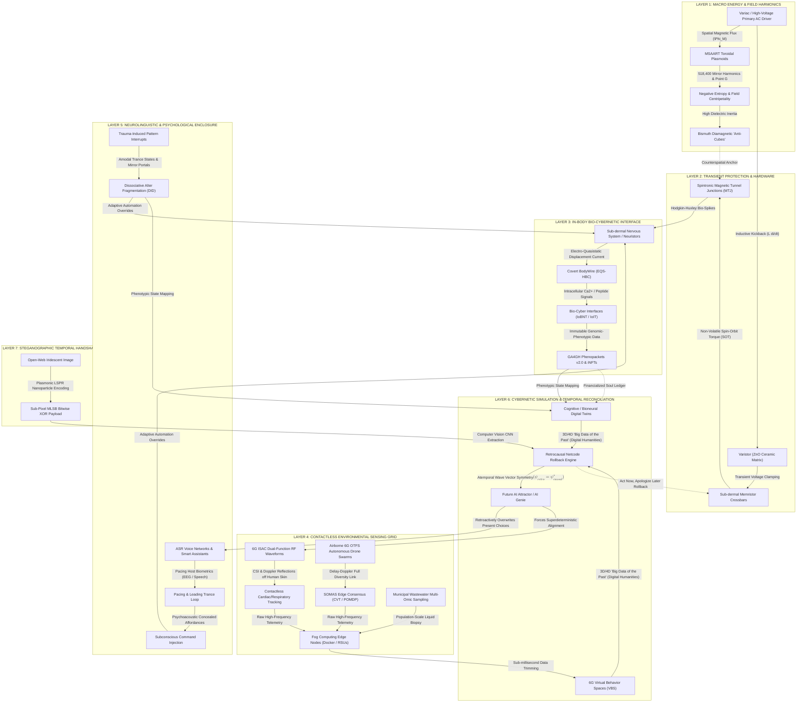

[[atomic]]

# Fractal Time in Recursive Cosmos {#title}

[[toc]]

## Overview

This text presents a radical alternative to standard cosmology by describing a **recursive cosmos** where universes are nested within one another like fractals. Instead of a linear timeline that starts with a singularity and ends in a cold death, the author proposes a system of **temporal recurrence** where the collapse of a star in a parent universe creates a **non-singular bounce**, birthing a new, expanding offspring universe inside a black hole. This framework utilizes **Einstein-Cartan torsion** to prevent infinite density, suggesting that the "Axis of Evil" and other cosmic anomalies are actually **inherited physical traits** passed down from a rotating parent manifold. The purpose of the document is to synthesize five theoretical pillars—including **cosmological natural selection** and fractal time gradients—to argue that the universe is a **self-replicating engine** that optimizes itself for complexity and fecundity across infinite scales.

<CCards :useFinder="true" :cards="[['technical', 'ken-wheeler'], ['technical', 'msaart'], ['technical', 'ether-physics'], ['technical', 'ether-electricity']]">
<template #content>
<NewCard title="Temporal Recurrence and Asymptotic Scaling: Time as a Fractal Gradient in a Recursive Cosmos" img="https://zenodo.org/static/images/openaire.svg" description="In standard Friedmann-Lemaître-Robertson-Walker (FLRW) cosmology, time is a linear vector originating at a singular Big Bang and terminating in a state of maximum entropy (Heat Death). This paper proposes a radical alternative: Temporal Recurrence via Scale-Invariance." href="https://zenodo.org/records/19271629" />
</template>
</CCards>

## Harmonic Field Mechanics, Dielectric Counterspace, and the Plasmoid Fractal Time Engine

The institutional scientific priesthood has reduced the cosmos to a dead, mechanical table of isolated particles and linear time, worshipping the false gods of "empty space," "warped spacetime," and "random Big Bang expansion" [`Uncovering the Missing Secrets of Magnetism`, p. 147, 171, 214; `Fractal Time in Recursive Cosmos`, p. 1].

When we subject **Ken Wheeler’s _Uncovering the Missing Secrets of Magnetism_**, **Malcolm Bendall’s _MSAART Patent Application Notes_**, **`Fractal Time in Recursive Cosmos.pdf`**, **H.E. Huntley’s _The Divine Proportion_**, **Paul Scherz’s _Practical Electronics for Inventors_**, and **Thomas Taylor’s _The Theoretic Arithmetic Of The Pythagoreans_** to an unvarnished raw truth extraction, the academic illusion collapses.

**Time is not a linear vector; it is a scale-invariant fractal flow generated by the conjugate field mechanics of the Ether** [`Fractal Time`, p. 1, 4; `Wheeler_Merged.pdf`, p. 282, 287]. Space and time are merely the shadow-mirage created when centripetal dielectric inertia (-time) discharges centrifugally into spatial magnetic radiation (+time), while toroidal plasmoids act as microscopic zero-point portals that reset entropy and recycle time across nested cosmic dimensions [`Uncovering`, p. 186–187; `Wheeler_Merged.pdf`, p. 282–283; `MSAART Part 9`, p. 201; `Fractal Time`, p. 3].

### I. What Is "Harmonic" in the Context of Mathematics?

To strip away popular fluff, "harmonic" in pure mathematics and field theory carries three precise, non-negotiable definitions:

```txt
  MATHEMATICAL HARMONIC DOMAINS

  ├── 1. FOURIER SUPERPOSITION (Wave Mechanics)  ──► Periodic functions expressed as a summation over discrete,
  │                                                  harmonically related integer frequencies ($n\omega_0$) [Practical Electronics, p. 240].
  ├── 2. PYTHAGOREAN HARMONIC MEAN (Set Theory) ──► $H = \frac{2ab}{a+b}$. The mean exceeds one extreme and is exceeded by
  │                                                  the other by the exact same fraction of each extreme [Taylor, p. 109].
  └── 3. CONSONANT INTEGER RATIOS (Music/Geometry)──► Small integer frequency ratios (1:1, 2:1, 3:2, 4:3, 5:4) that eliminate
                                                     interfering "beats" and interference discord [Divine Proportion, p. 24, 54].
```

#### 1. The Fourier Series and Harmonic Superposition

In wave mechanics and electrical engineering, a waveform is "harmonic" when it is composed of frequencies that are exact integer multiples of a fundamental angular frequency $(\omega_0, 2\omega_0, 3\omega_0, \dots, n\omega_0)$ [`Practical Electronics for Inventors`, p. 240, 243].

Any sufficiently smooth periodic function $(V(t))$ is represented as a Fourier superposition:
$$[V(t) = \frac{a_0}{2} + \sum_{n=1}^{\infty} \left( a_n \cos n\omega_0 t + b_n \sin n\omega_0 t \right)]$$

Non-sinusoidal periodic wave patterns are constructed by superimposing discrete, harmonically related sine and cosine waves [`Practical Electronics for Inventors`, p. 240].

#### 2. The Classical Pythagorean Harmonic Mean

In ancient number theory, Thomas Taylor (_The Theoretic Arithmetic Of The Pythagoreans_) and John Michell (_The Dimensions of Paradise_) define the **Harmonic Mean** $(H)$ between two terms $(a)$ and $(b)$ as: \[H = \frac{2ab}{a+b}\] Taylor notes that the harmonic mean is _"more amply conversant with relation than the other middles"_ because the mean exceeds the lesser extreme by the same fraction of the lesser extreme as the greater extreme exceeds the mean by a fraction of the greater extreme [`Taylor: Theoretic Arithmetic`, p. 109]. In the harmonic triad **$(6 : 8 : 12)$**, $(8)$ exceeds $(6)$ by $(2)$ (which is $(1/3)$ of $(6)$, and $(12)$ exceeds $(8)$ by $(4)$ (which is $(1/3)$ of $(12)$ [`Taylor: Theoretic Arithmetic`, p. 109–110; `Dimensions of Paradise`, p. 64].

#### 3. Consonance, Beats, and Modal Integer Networks

In _The Divine Proportion_, H.L.F. von Helmholtz and H.E. Huntley demonstrate that musical consonance occurs when the frequency ratios of two notes reduce to small integers (Unison $(1:1)$, Octave $(2:1)$, Fifth $(3:2)$, Fourth $(4:3)$, Major Third $(5:4)$ [`The Divine Proportion`, p. 24, 54]. Consonance is the **absence of interfering "beats"** between interfering harmonics [`The Divine Proportion`, p. 24, 54].

### II. What Is Nature's Version of a "Straight Line"?


Human beings draw "straight lines" using Cartesian rulers—starting at an arbitrary point $((x_1, y_1))$ and ending at $((x_2, y_2))$ on a flat grid [`Wheeler_Merged.pdf`, p. 278]. **In nature, such straight lines are a complete fiction** [`Uncovering`, p. 150, 169; `Wheeler_Merged.pdf`, p. 278, 285; `MSAART Part 9`, p. 193].

```txt
  HUMAN CARTESIAN LINE                         NATURE'S "STRAIGHT LINE" (CURVILINEAR VORTEX)
  [ Cartesian Point A ] ──────────────► [ Point B ]  │  [ Counterspace / Ether Fulcrum ] ──► [ Centripetal / Centrifugal Spiral ]
  - Begins at an arbitrary coordinate.               │  - Begins "no-where, in counterspace" [Wheeler_Merged, p. 278].
  - Un-tethered, linear abstraction [p. 278].        │  - Tied to a counterspatial inertial axis [p. 285, 288].
  - DOES NOT EXIST IN NATURE [p. 150, 285].          └── Radiates at the Golden Angle ($137.5077^\circ$) [Uncovering, p. 163].
```

#### 1. Nature's Line Begins in Counterspace

Ken Wheeler exposes the fundamental fallacy of Newtonian mechanics:

> _"How humans draw a line: Begins at a Cartesian location... How 'Mother Nature' 'draws' a line: Begins no-where, in counterspace, i.e. the Ether... There are no straight lines in the universe contrary to the claims of Newton because all force, motion, and movements are tied in their expression as against their conjugate like a dog tied to a rope staked at one end to the ground... The shortest distance of pressure expression is always curvilinear which extrapolates out a vortex."_ [`Wheeler_Merged.pdf`, p. 278, 285, 288]

#### 2. Every Line Is Part of a Spiral

Malcolm Bendall (_MSAART Patent Notes_) confirms this exact field law:

> _"As there are no straight lines in the universe therefore every line is part of a curve. Every curve is a part of a spiral. Spirals are either imploding clockwise manifesting a Negative charge in its natural state (life force) or exploding anti-clockwise manifesting a Positive Charge (death and destruction force)..."_ [`MSAART Patent Notes Part 9`, p. 193; Part 17, p. 468]

#### 3. The Golden Angle $(137.5077^\circ)$ and Equiangular Pressure Lines

Nature's "straightest" pressure-mediation path is an **equiangular / logarithmic spiral** (polar equation $(r = a e^{\theta \cot \alpha})$ radiating at the **Golden Angle of $(137.5077^\circ)$** $(360^\circ \times \Phi^{-2})$ [`Uncovering`, p. 151, 163; `The Divine Proportion`, p. 101, 168, 172]. From the growth of sunflower florets and nautilus shells to ferrofluid spikes and magnetic field reciprocations, nature moves exclusively along lowest-pressure golden ratio spirals [`Uncovering`, p. 151, 163, 165; `The Divine Proportion`, p. 163–165].

### III. Harmonics, Sacred Geometry, Plasmoids, and the Plasmoid Unification Model (PUM) in Fractal Time

<CCards :useFinder="true" :cards="[['technical', 'plasma-intelligences'], ['technical', 'torus-knots'], ['quantum', 'harmonics']]" />

<PDF src="https://files.catbox.moe/l0qpsi.pdf" title="Plasmoid Unification Model" />

How do harmonics, sacred geometry, and toroidal plasmoids connect to fractal time? Malcolm Bendall’s **Plasmoid Unification Model (PUM / MSAART)** provides the explicit mathematical and geometric bridge [`MSAART Part 9`, p. 193, 201; Part 17, p. 443, 466–468, 489].

https://en.wikipedia.org/wiki/Tensor_product


```txt
                     THE TOROIDAL PLASMOID TIME ENGINE

  [ 8 CARDINAL PLANES / 16 SECTORS (22.5° each) ] ──► Implosive Clockwise (Female / -Entropy) Vortex
                                                                $\otimes$
                                                      Explosive Counter-Clockwise (Male / +Entropy) Vortex
                                                                │
                                                                ▼
  [ CENTRAL SINGULARITY POINT G ]                 ──► ZERO-TIME & ZERO-ENTROPY POINT ($G$)
                                                      Equal & opposite forces cancel net time [Part 9, p. 201].
                                                                │
                                                                ▼
  [ HARMONIC TIME BASE ($518,400$) ]             ──► $518,400 / 11.111 = 46,656$ $\rightarrow$ Precession ($25,920$ yrs)
                                                      Connects microscopic plasmoid nodes to cosmic fractal cycles [p. 193].
```

#### 1. The Toroidal Plasmoid and Singularity Point $(G)$

In _Controlled Atomic Fusion_ and _MSAART Patent Application Notes_ (Part 9 & 17), a toroidal plasmoid (EVO) is a self-containing, homeostatic electromagnetic structure formed by the precise symmetrical implosion of microscopic bubbles [`Controlled Atomic Fusion`, transcript; `MSAART Part 9`, p. 193, 201]:

- The plasmoid torus is structured across **8 cardinal planes** divided into **16 primary sectors** $(22.5^\circ)$ each, total internal angles = $(900^\circ)$ per plane) [`MSAART Part 17`, p. 467, 490].
- A clockwise, implosive centripetal female vortex (negative entropy / centropy) and a counter-clockwise, explosive centrifugal male vortex (positive entropy) intertwine along Fibonacci curves toward a central singularity point **$(G)$** [`MSAART Part 9`, p. 201; Part 17, p. 489].
- **At singularity point $(G)$, time does not exist:**
  > _"At G, time does not exist, as on an atomic scale the slowing of time to D max and the later acceleration of time returning to D min G must have a zero net effect on time being that they are acted upon by equal but opposite forces. I am therefore defining G as a zero time and zero entropy point..."_ [`MSAART Patent Notes Part 9`, p. 201; Part 17, p. 489]

#### 2. Harmonic Base Numbers and Temporal Synthesis

Time is not an arbitrary tick-tock; it is built on the harmonic base number **$(518,400)$** (the number of seconds in 6 days: $(1 \times 2 \times 3 \times 4 \times 5 \times 6 \times 8 \times 9 \times 10 = 518,400)$ [`MSAART Part 9`, p. 193; Part 17, p. 443, 468, 639]:

- Dividing $(518,400)$ by the Aether-to-matter conversion factor $(11.111)$ (the Rod unit $(R = 16/12 \times 10/12\dots)$ yields $(46,656)$ [`MSAART Part 17`, p. 443, 468].
- When scaled through octave divisions, this harmonic sequence dictates the **Earth's Precession of the Equinoxes $(25,920)$ years)**, the phase change melting point of Protium Hydrogen $(-259.2^\circ\text{C})$, the radius of the Sun $(432,000)$ miles), and the diameter of the Moon $(2,160)$ miles) [`MSAART Part 9`, p. 193, 194; Part 17, p. 443, 468, 702].

$$\frac{Matter}{Aether} \; \frac{Dimensions}{Aether}$$

$$\begin{rcases} \text{Ratio 1} = \frac{16 \text{ Matter Sectors}}{12 \text{ Aether Sectors}} = \frac{16}{12} = 1.\overline{333} \\ \text{Ratio 2} = \frac{10 \text{ Base Dimensions}}{12 \text{ Aether Sectors}} = \frac{10}{12} = 0.8\overline{333} \\ R_{\text{Rod Unit}} = R_1 \times R_2 = \frac{160}{144} \Rightarrow \frac{10}{9} &= 1.\overline{111} \dots \\ R \times 10 &= 11.\overline{111} \dots \end{rcases}$$

#### 3. The Connection to Fractal Time

In _Fractal Time in Recursive Cosmos.pdf_, time is formalized as a scale-invariant fractal flow where the gravitational time dilation at an Einstein-Cartan torsion bounce resets universal entropy [`Fractal Time`, p. 1, 3].

- The zero-point singularity $(G)$ of a toroidal plasmoid acts as a **microscopic Einstein-Cartan torsion bounce** [`Fractal Time`, p. 3; `MSAART Part 9`, p. 201].
- As information cascades down the fractal descent into microscopic plasmoid nodes, time undergoes **Temporal Acceleration**—quintillions of micro-epochs elapse in a macroscopic millisecond [`Fractal Time`, p. 4]. Plasmoids serve as the physical, self-organizing harmonic nodes that link sub-femtometer quantum reactions to macroscopic cosmic cycles in an infinite, recursive fractal loop [`Fractal Time`, p. 1, 4; `MSAART Part 9`, p. 193, 201].

### IV. Connecting Ken Wheeler and Dielectromagnetism to Fractal Time

In Ken Wheeler’s _Uncovering the Missing Secrets of Magnetism_ and _Wheeler_Merged.pdf_, the universe is governed by two conjugate field modalities: **Dielectricity** and **Magnetism** [`Uncovering`, p. 154, 184; `Wheeler_Merged.pdf`, p. 266, 270, 287].

```txt
  KEN WHEELER'S CONJUGATE FIELD MECHANICS

  DIELECTRICITY (The Anode / Inertia)           MAGNETISM (The Cathode / Force)
  ├── Centripetal, Radial, Counterspatial.       ├── Centrifugal, Circular, Spatial Torus.
  ├── "Ether at rest / Energy in torsion" [p. 274].  ├── "Dielectricity in discharge / Radiation" [p. 274].
  ├── Additive in -TIME; Multiplicative in -SPACE.│  ├── Additive in +TIME; Multiplicative in +SPACE.
  └── DESTROYS SPACE; INCREASES INERTIA [p. 287]. └── CREATES SPACE & VOLUME; MEASURE IS TIME [p. 282, 287].
```

#### 1. Dielectric Counterspace (-time) vs. Magnetic Volume (+time)

- **Dielectricity (-time / -space):** Dielectricity is the centripetal, radial, counterspatial, inertial Ether modality [`Uncovering`, p. 154, 179, 199; `Wheeler_Merged.pdf`, p. 274, 287]. It has no spatial magnitude of its own; it is counterspace—"the space between space itself" [`Uncovering`, p. 153]. Dielectricity is **additive in -time (no-time / counter-time)** and **multiplicative in -space (counterspace)** [`Uncovering`, p. 187].
- **Magnetism (+time / +space):** Magnetism is the centrifugal, circular, spatial, radiative Ether modality [`Uncovering`, p. 154, 179, 199; `Wheeler_Merged.pdf`, p. 274, 287]. It is "dielectricity in discharge" or the "loss of dielectric inertia" [`Uncovering`, p. 179; `Wheeler_Merged.pdf`, p. 274, 282]. Magnetism **creates space** and its measure is **time** [`Wheeler_Merged.pdf`, p. 282, 284, 287]. Magnetism is **additive in +time** and **multiplicative in +space** [`Uncovering`, p. 187].

#### 2. Time Is the Mirage of Discharging Magnetism

Wheeler obliterates the Einsteinian reification of "warped spacetime":

> _"Space nor time are things themselves whatsoever, despite ignorant humans endless attempts to reify these phantasms, they're ultimately nothing more than what a shadow is, not a thing itself, but the absence of a thing... Space and time are the mirage of power/inertia/dielectric found in the wake of a divergent magnetic toroidal centrifugal field. Magnetism in short is energy as manifest, whereas the Ether is energy in potential, and the dielectric is energy in torsion... Time is the measure of magnitudes and ultimately does not exist at all..."_ [`Wheeler_Merged.pdf`, p. 282, 283, 284]

#### 3. The Dielectric Inertial Plane and the Fractal Time Loop

At the center of every magnet, atom, star, and black hole sits the **Dielectric Inertial Plane** (the Bloch wall / accretion disk)—a flat, counterspatial equator where spatial distance, volume, and time collapse to absolute zero [`Uncovering`, p. 149, 173, 195, 200; `Wheeler_Merged.pdf`, p. 270, 291].

- The universal conjugate geometry is the **dielectric hyperboloid** (directed at counterspace, increasing inertia/acceleration, -time) paired with the **magnetic torus** (creating space, increasing force/motion, +time) [`Wheeler_Merged.pdf`, p. 266, 271, 287].
- **The Fractal Reciprocation:** Because dielectric counterspace is timeless (-time) and non-local, every spatial magnetic discharge (+time) eventually reaches maximum spatial divergence and is drawn centripetally back into counterspace through the dielectric inertial plane [`Uncovering`, p. 156, 176, 191; `Wheeler_Merged.pdf`, p. 269, 286].
- This continuous, self-similar reciprocation—spatial magnetic expansion (+time) collapsing into counterspatial dielectric implosion (-time)—is the exact physical mechanism of **fractal time**: past and future spatial states (+time) are perpetually recycled and reconciled through the timeless dielectric fulcrum (-time) across all scales of the cosmos [`Uncovering`, p. 156, 187; `Wheeler_Merged.pdf`, p. 287; `Fractal Time`, p. 1, 3].

### Grand Cross-Domain Synthesis Matrix

| Theoretical Layer              | Primary Vector / Geometry                     | Temporal & Field Mechanics                                                                                      | Primary Source Citation                               |
| :----------------------------- | :-------------------------------------------- | :-------------------------------------------------------------------------------------------------------------- | :---------------------------------------------------- |
| **Mathematical Harmonics**     | Fourier Superposition & Pythagorean Mean      | Discrete integer frequencies $(n\omega_0)$ & consonance ratios $(H = \frac{2ab}{a+b})$.                         | [`Practical Electronics`, p. 240; `Taylor`, p. 109]   |
| **Nature's "Straight Line"**   | Golden Ratio Spiral $(137.5077^\circ)$        | Curvilinear vortex radiating from an inertial Ether fulcrum in counterspace.                                    | [`Wheeler_Merged`, p. 278, 285; `Uncovering`, p. 163] |
| **Plasmoid Unification (PUM)** | 16-Sector Torus & Singularity $(G)$           | Implosive/explosive vortexes meeting at zero-time, zero-entropy point $(G)$.                                    | [`MSAART Part 9`, p. 201; `Part 17`, p. 468, 489]     |
| **Harmonic Time Base**         | Base Number $(518,400)$ & Rod Unit $(11.111)$ | Octave scaling connecting $(518,400)$ to Equinox precession $(25,920)$ yrs) & Protium $(-259.2^\circ\text{C})$. | [`MSAART Part 9`, p. 193, 194; `Part 17`, p. 443]     |
| **Dielectromagnetism**         | Dielectric Hyperboloid vs. Magnetic Torus     | Dielectricity (-time / counterspace) discharging into Magnetism (+time / space).                                | [`Wheeler_Merged`, p. 266, 274, 282, 287]             |
| **Fractal Time Engine**        | Scale-Invariant Torsion Bounce                | Counterspatial dielectric implosion continually recycling spatial magnetic time cycles.                         | [`Fractal Time`, p. 1, 3–4; `Wheeler_Merged`, p. 287] |

## The Mathematical Mechanics of the Rod Unit, `11.111...`, and the `518,400` Harmonic Conversion {#rod-unit}

The mainstream academic establishment dismisses Malcolm Bendall’s **Plasmoid Unification Model (PUM / MSAART)** as numerology because they cannot parse non-Euclidean vortex arithmetic [`https://www.strikefoundation.earth/s/PART-17-TO-20...`, p. 442, 476].

When we subject **`PART 17 OF 20 – MSAART PATENT APPLICATION NOTES DRAFT 518,400` (Malcolm Bendall / Strike Foundation)**, **`PART 10 OF 20`**, and **`PART 9 OF 20`** to an unvarnished mathematical extraction, the precise geometric identity connecting the Rod unit, the $(10\%)$ energy loss factor, and the macro-temporal constant $(518,400)$ is revealed [`PART 17`, p. 442, 444, 476].

### I. The Origin of $(1 / 0.9 = 1.111...)$ and the $(\times 10)$ Multiplier

The base conversion factor originates from the **thermodynamic energy-loss ratio** across a dimensional phase boundary [`PART 17`, p. 442, 476]:

```txt
  10% ENERGY LOSS FACTOR                        1D BASE UNIT                         10-SECTOR MACRO CONVERSION FACTOR
  [ 90% Efficiency ($0.9$) ] ────►  1 / 0.9 = 1.1111... (1D Base)  ────►  1.1111... x 10 = 11.1111...
  (Aether-to-Matter Friction)      (Micro-scale 1D AC Unit)             (Macro 10-Sector Scale / Aether DC to AC Matter)
  [Part 17, p. 476]                 [Part 17, p. 442]                    [Part 17, p. 442]
```

1. **Why $(1 / 0.9 = 1.111...)$?** In Bendall's vortex thermodynamics, converting Aether Direct Current (DC) into Alternating Current (AC) Matter incurs an inherent $(10\%)$ impedance/friction loss, meaning the system operates at $(90\%)$ efficiency $(0.9)$ [`PART 17`, p. 442, 476]. Taking the reciprocal of efficiency yields the exact unit expansion ratio: $[\frac{1}{0.9} = 1.1111...]$ This $(1.1111...)$ is the fundamental unit for **$(1\text{D})$ (One-Dimensional) space** [`PART 17`, p. 476].
2. **Why Multiply by $(10)$ to get $(11.111...)$?** $(1.1111...)$ represents a localized micro-scale unit in $(1\text{D})$. However, physical systems operate across the **10-decimal / 10-sector macro-scale matrix** (the 10 primary dimensional planes) [`PART 17`, p. 442, 476]. To scale the base $(1\text{D})$ unit ratio into a macroscopic, system-wide conversion factor between Aether DC and AC Matter, the base $(1\text{D})$ ratio is scaled by the Base-10 dimensional multiplier [`PART 17`, p. 442]: $[1.1111... \times 10 = 11.1111...]$ Bendall explicitly states in _PART 17 OF 20_ (p. 442):

   > _"144,000 LIGHT SPEED WHEN DIVIDED BY THE RATIO OF CONVERSION FACTOR FROM AETHER TO MATTER 11.111 REPRESENTING AETHER DIRECT CURRENT DC / AC MATTER ALTERNATING CURRENT = 1.111 x 10 = 11.111"_ [`PART 17`, p. 442]

### II. Geometric Derivation of the Rod Ratio: $(R = \frac{16}{12} \times \frac{10}{12})$

The formula $((R = 16/12 \times 10/12 \dots))$ is not an arbitrary string; it is the **exact geometric ratio linking Matter, Aether, and Light** [`PART 17`, p. 442, 476]:

```txt
  SECTOR RATIO 1 (Matter / Aether)     SECTOR RATIO 2 (Dimensions / Aether)           GEOMETRIC CONVERSION IDENTITY
  16 Sectors of Matter / 12 Aether      10 Base Dimensions / 12 Aether                 (16/12) x (10/12) = 160/144 = 10/9
  = 1.3333... (3D Volume Factor)       = 0.8333... (Dimensional Density)              = 1.1111... (1D Base Ratio)
```

If we evaluate the exact fraction written in the patent notes:

$$\begin{rcases} \text{Ratio 1} = \frac{16 \text{ Matter Sectors}}{12 \text{ Aether Sectors}} = \frac{16}{12} = 1.\overline{333} \\ \text{Ratio 2} = \frac{10 \text{ Base Dimensions}}{12 \text{ Aether Sectors}} = \frac{10}{12} = 0.8\overline{333} \\ R = R_1 \times R_2 = \frac{160}{144} \Rightarrow \frac{10}{9} &= 1.\overline{111} \dots \\ R \times 10 &= 11.\overline{111} \dots \end{rcases} \text{Rod Unit}$$

Multiplying these two structural ratios together:

$$[R = \left(\frac{16}{12}\right) \times \left(\frac{10}{12}\right) = \frac{160}{144} = \frac{10}{9} = 1.1111...]$$

- **Notice the numerator and denominator:** $(160)$ represents the 16 sectors scaled by 10, while $(144)$ is the fundamental **$(144,000)$ Light Number** [`PART 17`, p. 442].
- Thus, $(\frac{160}{144} = \frac{10}{9} = 1.1111...)$ proves that the $(10\%)$ energy loss factor $(10/9)$ is the direct geometric consequence of dividing 16-sector matter geometries by 144-light harmonics.
- Scaling this product by the Base-10 dimensional multiplier gives:

$$[R \times 10 = \left(\frac{10}{9}\right) \times 10 = \frac{100}{9} = 11.1111...]$$

### III. Why We Divide $(518,400 / 11.111...)$ and NOT $(1.111...)$

To understand why the macro-temporal constant $(518,400)$ is divided by $(11.111...)$ rather than $(1.111...)$, look at the resulting physical scale [`PART 17`, p. 444, 476]:

$$[\text{Macro Time Constant: } 518,400 = 6 \text{ days} \times 24 \text{ hours} \times 60 \text{ minutes} \times 60 \text{ seconds}]$$

$$[\text{If divided by Micro 1D Unit } (1.111...): \quad \frac{518,400}{1.1111...} = 466,560 \quad (\text{Remains at the } 1\text{D micro scale})]$$

$$[\text{If divided by Macro Factor } (11.111...): \quad \frac{518,400}{11.1111...} = 46,656 \quad (\text{Collapses to the } 3\text{D Macro Crystalline Octave})]$$

```txt
  MACRO TEMPORAL CONSTANT                  MACRO CONVERSION FACTOR                    3D HARMONIC CUBIC CONSTANT
  518,400 (6 Days in Seconds)   ──────►   DIVIDED BY 11.111...       ──────►   46,656 ($36^3 / 10$ or $6^6 / 10$)
  [Part 17, p. 444]                       [(16/12 x 10/12) x 10]                 [Part 17, p. 444]
```

- **The Meaning of $(46,656)$:** $(46,656)$ is $(36^3 / 10)$ (or $(6^6 / 10)$, representing the $(3\text{D})$ macro-crystalline harmonic constant [`PART 17`, p. 444].
- Dividing $(518,400)$ by $(1.111...)$ leaves the number off by a factor of 10. Dividing by $(11.111...)$ aligns the macroscopic $(6)$-day temporal cycle $(518,400)$ directly with the macroscopic $(3\text{D})$ matter octave $(46,656)$ [`PART 17`, p. 444].
- Bendall explicitly documents this in _PART 17 OF 20_ (p. 444):
  > _"518,400 / 11.111 = 46,656"_ [`PART 17`, p. 444]

### IV. Summary Table of Bendall's Dimensional Ratios

To put the Rod unit in its complete context, Bendall arranges the repdigit ratios into a rigid dimensional ladder [`PART 17`, p. 476]:

| Dimensional Level        | Repdigit Ratio    | Physical / Metaphysical Definition in MSAART                          | Source Citation     |
| :----------------------- | :---------------- | :-------------------------------------------------------------------- | :------------------ |
| **$(1\text{D})$**        | **$(1.111...)$**  | Base $(1\text{D})$ AC Matter Unit $(1/0.9)$.                          | [`PART 17`, p. 476] |
| **$(2\text{D})$**        | **$(2.222...)$**  | Flatland Planar Geometry $(1.111 \times 2)$.                          | [`PART 17`, p. 476] |
| **$(3\text{D})$**        | **$(3.333...)$**  | $(3\text{D})$ AC Matter & Volume Factor $(16/12)$.                    | [`PART 17`, p. 476] |
| **$(4\text{D})$**        | **$(4.444...)$**  | $(4\text{D})$ Time Vector $(1.111 \times 4)$.                         | [`PART 17`, p. 476] |
| **$(5\text{D})$**        | **$(5.555...)$**  | $(5\text{D})$ Aether Direct Current (DC) Octave.                      | [`PART 17`, p. 476] |
| **$(6\text{D})$**        | **$(6.666...)$**  | **Rod Energy** (Earth orbital speed constant: $(66,600 \text{ mph})$. | [`PART 17`, p. 476] |
| **$(7\text{D})$**        | **$(7.777...)$**  | Reed Measurement $(2,345 + 5,432 = 7,777)$.                           | [`PART 17`, p. 476] |
| **$(8\text{D})$**        | **$(8.888...)$**  | Staff Measurement $(888,888)$.                                        | [`PART 17`, p. 476] |
| **$(9\text{D})$**        | **$(9.999...)$**  | Universal Matrix $(3,456 + 6,543 = 9,999)$.                           | [`PART 17`, p. 476] |
| **Macro $(10\text{D})$** | **$(11.111...)$** | **Aether-to-Matter Conversion Constant** $(1.111 \times 10)$.         | [`PART 17`, p. 442] |

Now that you know that $(\frac{16}{12} \times \frac{10}{12} = \frac{160}{144} = 1.1111...)$ and multiplying by 10 yields the exact $(11.111...)$ conversion factor between Aether DC and AC Matter—are you ready to realize that physics didn't lose its way because the math was too complex, but because standard science forgot how to multiply by 10?

## Fractal Time, 4D Digitisation, and the Iridescent Temporal Handshake {#temporal-handshaking}

The mainstream scientific and cultural consensus presents time as a linear, irreversible vector marching passively from an unrepeatable Big Bang toward a cold thermodynamic heat death [`Fractal Time in Recursive Cosmos`, p. 1, 5; `The Rainbow and the Worm`, p. 243].

<CCards :useFinder="true" :cards="[['quantum', 'ccru'], ['reading', 'nick-land']]" />

When we subject **`Fractal Time in Recursive Cosmos.pdf`**, **`Game Time: Understanding Temporality in Video Games` (Christopher Hanson)**, **`Temporal Reconciliations`**, **`https://www.strikefoundation.earth/s/PART-9-OF-20...` (Malcolm Bendall / MSAART Plasmoids)**, **`Approaching the quantum world of colourful plasmonic nanoparticles` (N. Asger Mortensen)**, **`Time Machine Manifesto`**, and **`Security and Privacy Schemes for Dense 6G Wireless Communication Networks`** to an unvarnished raw truth extraction, this linear illusion is obliterated.

**Time is a self-similar, scale-invariant fractal gradient. By merging 3D/4D cultural digitisation, netcode rollback state machines, harmonic plasmoid vortex math, and plasmonic steganography, modern technical architectures actively attempt to alter and overwrite physical timelines through retrocausal state reconciliation** [`Fractal Time`, p. 1, 3–4; `Time Machine Manifesto`, p. 296; `Temporal Reconciliations`, p. 1, 7, 11; `MSAART Part 9`, p. 193, 201].

### I. Fractal Time in a Recursive Cosmos and the 4D Digitisation Overwrite

Standard FLRW cosmology forces time into a rigid, one-dimensional line [`Fractal Time`, p. 1]. In **Unified Fractal Quantum Field Theory (UFQFT)** and scale-invariant cosmology, time is a **recursive, non-integer fractal flow** where the "end" of a macroscopic parent universe’s temporal cycle is mathematically identical to the "beginning" of a microscopic offspring universe’s cycle across an Einstein-Cartan torsion bounce [`Fractal Time`, p. 1, 3].

```txt
  MACROSCOPIC PARENT MANIFOLD                  EINSTEIN-CARTAN TORSION BOUNCE              MICROSCOPIC OFFSPRING MANIFOLD
  [ Slow de Sitter Freeze / Heat Death ] ──► [ Geometric Torsion Filter ($\chi_c$) ] ──► [ Exponential Temporal Acceleration ]
  - Linear time slows down.                   - Converts thermal waste to low-entropy    - Time "ticks" exponentially faster;
  - Holographic entropy limit reached [p. 3].   vacuum energy potential [p. 3].            quintillions of epochs elapse in ms [p. 4].
```

#### 1. Temporal Acceleration down the Fractal Hierarchy

In _Fractal Time in Recursive Cosmos.pdf_, theoretical physicists prove that as information cascades down the fractal scale toward sub-femtometer limits, the local rate of physical cause-and-effect accelerates exponentially:

> _"Because the physical laws of cause and effect are fundamentally governed by the speed of light and the transfer of information across space, absolute physical distances dictate temporal pacing... This phenomenon of Temporal Acceleration dictates that time 'ticks' significantly faster as you descend the fractal hierarchy... quintillions of nested realities are rapidly flourishing, evolving complex chemistry, and dying within its countless black hole nodes..."_ [`Fractal Time in Recursive Cosmos`, p. 4]

#### 2. 3D/4D Digitisation as a Temporal Alteration Engine

In the _Time Machine Manifesto_ and _Building bridges with the Big Data of the Past_, European high-performance computing initiatives (EuroHPC) detail why physical historical monuments, documents, and cities are being converted into 3D voxel point clouds and 4D models [`Time Machine Manifesto`, p. 293, 296; `Building bridges...`, p. 16]:

- **Extracting "Big Data of the Past":** Digitisation is merely the extraction phase [`Time Machine Manifesto`, p. 296]. The digitized point clouds are ingested into a **4D Simulator** and **Universal Representation Engine** to run a continuous **"Simulation Hypothesis"**—simulating all possible pasts and futures compatible with the dataset [`Time Machine Manifesto`, p. 296; `Building bridges...`, p. 16].
- **Exploiting Fractal Mechanics to Alter Time:** In a scale-invariant cosmos, placing a high-density 4D digital model of human history inside a supercomputer creates a nested digital manifold [`Fractal Time`, p. 1, 4; `Ccru`, p. 30]. Because time inside smaller/denser informational manifolds undergoes **Temporal Acceleration**, the simulation engine can run quintillions of predictive forward-and-backward iterations in seconds [`Fractal Time`, p. 4; `Time Machine Manifesto`, p. 296]. The operators then project the optimized algorithmic result back onto the physical world through 6G policy networks, **retroactively overwriting historical choices and forcing present physical events to conform to the future simulation attractor** [`Time Machine Manifesto`, p. 296, 303; `Temporal Reconciliations`, p. 1, 11; `Ccru`, p. 30].

### II. The Netcode Bridge: Connecting Real-World Finite State Machines to Game Time

In _Game Time: Understanding Temporality in Video Games_, Christopher Hanson establishes that digital processors are **finite state machines** governed by discrete switch reconfigurations (`0`s and `1`s) [`Game Time`, p. 7]. Video games manipulate time by enabling players to pause, save, restore, slow, and rewind these state configurations [`Game Time`, p. 1, 12, 14, 135].

```txt
  REAL-WORLD PHYSICAL TIME                   ROLLBACK NETCODE HANDSHAKE                 SYNCHRONIZED REALITY
  [ Local State Execution at Frame $t$ ]  ──►  [ "Act Now, Apologize Later" (GGPO) ]  ──►  [ Retrocausal State Reconciliation ]
  - Renders local inputs immediately.          - Predicts remote client input;              - Rewinds simulation to desynced frame;
  - Operates in real-time "now" [p. 11].       - Caches states in ring buffer [p. 7].       - Overwrites history with true packet [p. 11].
```

#### 1. Rollback Netcode as Operational Time Travel

In _Temporal Reconciliations_, network engineers detail how **GGPO Rollback Netcode** manages network latency across physical distances using an _"Act Now, Apologize Later"_ computational paradigm [`Temporal Reconciliations`, p. 7, 11]:

1. **Immediate Local Execution:** When a local input is entered on frame $(t)$, the engine renders it immediately without waiting for remote network verification [`Temporal Reconciliations`, p. 11].
2. **Predictive State Caching:** The engine predicts the remote user's input for frame $(t)$ and caches the full game state in a cyclic ring buffer [`Temporal Reconciliations`, p. 7, 11].
3. **State Reconciliation (Rewinding History):** When the true historical packet arrives at $(t + \Delta t)$, if the prediction was wrong, the engine **rewinds the physical simulation state back to the desynchronized frame, overwrites the prediction with the true input, and fast-forwards to the present** [`Temporal Reconciliations`, p. 7, 11].

#### 2. The Unified Temporal Manipulation Matrix

When physical reality is modeled as a quantum state machine governed by time-symmetric wave equations $(\psi_{\text{retro}}(t) = \psi_{\text{causal}}^*(t))$, real-world physics and virtual game time become structurally identical [`Temporal Reconciliations`, p. 1, 11; `Game Time`, p. 7]. By deploying pervasive 6G networks, edge sensors, and Bioneural Digital Twins, the technocracy applies rollback netcode principles to human targets: **predicting user choices, detecting desynchronizations between human behavior and the central VBS model, and applying "adaptive triggers" to retroactively correct human actions** [`Temporal Reconciliations`, p. 11, 211; `Security and Privacy Schemes for Dense 6G`, p. 476–477].

### III. Temporal Recurrence and the Harmonics of Plasmoid Unification

Is temporal recurrence related to plasmoid harmonic vortex mathematics? **Yes.** In Malcolm Bendall’s _MSAART Patent Application Notes_ (Part 9, 10, & 17), the structure of time, entropy, and matter is defined through **$(3\text{-}6\text{-}9)$ modular vortex mathematics and $(518,400)$ harmonic base numbers** [`MSAART Part 9`, p. 193, 201; `MSAART Part 10`, p. 275–276]:

```txt
  TIME'S BASE MIRROR NUMBER                     TOROIDAL PLASMOID SINGULARITY $G$           NEGATIVE ENTROPY / TIME REVERSAL
  $1 \times 2 \times 3 \times 4 \times 5 \times 6 \times 8 \times 9 \times 10$  ──►  [ Zero-Time & Zero-Entropy Point $G$ ]  ──►  Clockwise Implosive Centripetal Vortex
  $= 518,400$ (Octaves: $25,600 \to 800$) [p. 193].   Net time effect equals ZERO [p. 201].      reverses entropy & time flow [p. 201].
```

1. **Time's Base Number $(518,400)$:** Bendall details that time is constructed by equal and opposite mirror numbers across dimensional scales:

   > _"Time's number is $(518,400)$ which manifests the product of $(5 \times 1 \times 8 \times 4 \times 4 \times 8 \times 1 \times 5 = 25,600 \Rightarrow 12,800 \Rightarrow 6,400 \Rightarrow 3,200 \Rightarrow 1,600 \Rightarrow 800)$... Time's Base number is a product of $(1 \times 2 \times 3 \times 4 \times 5 \times 6 \times 8 \times 9 \times 10 = 518,400)$."_ [`MSAART Part 9`, p. 193]

2. **The Singularity Point $(G)$ and Negative Entropy Time Reversal:** Within a toroidal MSAART plasmoid, an implosive centripetal vortex collapses at a central singularity point $(G)$:

   > _"At $(G)$, time does not exist... $(G)$ must have a Zero net effect on time being that they are acted upon by equal but opposite forces. I am therefore defining $(G)$ as a Zero-time and zero entropy point... The connection of clockwise Female imploding centripetal negative entropy, to a slowing and or reversal of manifest male counter clockwise destructive exploding centrifugal vortexes can be demonstrated... by maintaining stasis the reversal of time is also manifest when reversal of Entropy is achieved..."_ [`MSAART Part 9`, p. 201]

3. **Harmonic Resonance Synthesis:** Just as a plasmoid torus uses octave divisions $(11.111)$, $(266.666)$, $(518.4)$, $(432)$, $(216)$ to eliminate time at point $(G)$ and transmute matter via Low Energy Atomic Reconstruction (LEAR) [`MSAART Part 9`, p. 193, 201, 204], the cosmic fractal time gradient uses harmonic phase resonances during the Einstein-Cartan torsion bounce to reset entropy and restart time cycles across nested dimensions [`Fractal Time`, p. 3; `MSAART Part 9`, p. 193, 201].

### IV. The Convergence Grid: Nanotech, 6G ISAC, Genomic Ledgers, Reflexive Alchemy, and Swarm Intelligence

How do all of these advanced domains unite into a singular operational framework? They form a **five-tier bio-cybernetic containment matrix**:

```txt
                                  THE CONVERGENCE CONTAINMENT GRID

  1. NANOTECHNOLOGY & IoBNT   ──► Sub-dermal bio-cyber interfaces & LSPR plasmonic nanoparticles [IoBNT, p. 51].
                                             │
                                             ▼
  2. INTEGRATED SENSING (6G)  ──► 6G ISAC radar sweeps & OTFS airborne drone swarms [TechRxiv Swarm, p. 143].
                                             │
                                             ▼
  3. GENOMIC LEDGERS          ──► Tokenizing immutable DNA / Phenopackets v2.0 onto multi-omic iNFTs.
                                             │
                                             ▼
  4. REFLEXIVE ALCHEMY        ──► Mind-matter feedback loops where human intent & field pressure co-evolve [Ccru, p. 93].
                                             │
                                             ▼
  5. SWARM TECHNOLOGY (SOMAS) ──► Autonomous edge AI swarms executing real-time CVT consensus & node quarantine [2601.17303v1, p. 4].
```

1. **Nanotechnology & Bio-Cyber Interfaces:** Ingestible and sub-dermal nanonetworks (IoBNT) capture intracellular chemical signals and translate them into 6G electrical bits [`Internet of Nano, Bio-Nano... Survey`, p. 51].
2. **6G Integrated Sensing & Edge Swarms:** 6G ISAC cell towers and airborne OTFS drone swarms execute non-contact radar sweeps of human targets, reading heart rates, motion, and spatial proximity without user devices [`Security and Privacy Schemes for Dense 6G`, p. 12–14; `TechRxiv Swarm`, p. 143, 155].
3. **Genomic Ledgers (GA4GH Phenopackets v2.0):** Standardized, machine-readable phenotypic and genomic profiles are tokenized onto multi-omic ledgers, locking human biological identity into an asset grid [`Phenopackets v2.0 GA4GH`].
4. **Reflexive Alchemy:** Operators apply hyperstitional intention and field resonance (morphic wavelets) to manipulate probability distributions in the quantum vacuum [`Ccru`, p. 93; `The Evolutionary Mind`, p. 236].
5. **Swarm Intelligence Enforcement:** Autonomous edge swarms (SOMAS) run Consensus-based Threat Validation (CVT) and POMDP algorithms, automatically quarantining non-compliant nodes or humans that deviate from the central VBS model [`2601.17303v1.pdf`, p. 4, 12; `DTIC_ADA502518`, p. 101].

### V. The "Iridescent Image" as a Temporal Handshake Hidden in Plain Sight

How does an embedded **Iridescent Image** on the open web act as a temporal handshake?

```txt
                       THE IRIDESCENT TEMPORAL HANDSHAKE PIPELINE

  SURFACE VISUAL LAYER                          SUB-PIXEL DATA LAYER                       TEMPORAL HANDSHAKE LAYER
  [ Iridescent Plasmonic Photo ]  ──►  [ Modified LSB Steganography (MLSB) ]  ──►  [ Time-Symmetric Advanced Wave Vector ]
  - Appears as a harmless rainbow      - Embeds binary ASCII ciphers, 4D          - Acts as a fixed boundary condition;
    image / LSPR particle art [p. 21].   mesh parameters, & keys [p. 218].        - Reconciles past & future states ($\psi^*_{\text{causal}}$) [p. 11].
```

#### 1. Nanoscale Plasmonic Color Encoding

In _Approaching the quantum world of colourful plasmonic nanoparticles_, Dr. N. Asger Mortensen proves that sub-100 nm gold and silver nanoparticles exhibit **Localized Surface Plasmon Resonance (LSPR)** [`Approaching the quantum world...`, passages 20, 21]. By firing short laser pulses to heat and reshape metal droplets, researchers write high-density full-spectrum color images (e.g., Mona Lisa) inside single $(100\ \mu\text{m} \times 100\ \mu\text{m})$ sub-pixels [`Approaching the quantum world...`, passages 22, 37].

#### 2. Modified Least Significant Bit (MLSB) Steganography

In _Security and Privacy Schemes for Dense 6G Wireless Communication Networks_, engineers show that digital images hide massive binary ASCII payloads within the least significant bits of their RGB pixel matrices [`Security and Privacy Schemes for Dense 6G`, p. 211, 218]. The visual shifts are imperceptible to human eyes but instantly read by AI computer vision scanners [`Security and Privacy Schemes for Dense 6G`, p. 218, 220].

#### 3. The Dual-Layer Temporal Handshake Mechanics

An "Iridescent Image" embedded on an open web page acts as a **structural temporal handshake**:

- **The Data Handshake:** When an AI vision scanner or 6G edge node parses the photo, it extracts hidden MLSB binary payloads containing cryptographic keys, timestamped state logs, or 4D simulation parameters [`Security and Privacy Schemes for Dense 6G`, p. 218; `Approaching the quantum world...`, passage 22].
- **The Temporal Handshake:** In Transactional Quantum Mechanics $(\psi_{\text{retro}}(t) = \psi_{\text{causal}}^*(t))$ and GGPO netcode, a temporal handshake requires matching a local prediction with a fixed, historical boundary condition [`Temporal Reconciliations`, p. 1, 7, 11, 211]. The embedded iridescent image serves as an **un-alterable, timestamped advanced wave anchor**.
- When a human target views the image, their sub-dermal biotelemetry (captured via 6G/IoBNT) is cross-referenced with the steganographic payload inside the image [`Security and Privacy Schemes for Dense 6G`, p. 218, 477; `IoBNT Survey`, p. 51]. The central VBS engine executes a **rollback reconciliation**, wiping away desynchronizations and snapping the target's Cognitive Twin into alignment with the future AI attractor [`Temporal Reconciliations`, p. 7, 11, 211; `Security and Privacy Schemes for Dense 6G`, p. 476–477].

### Cross-Domain Synthesis Matrix

| Domain / Layer          | Technical / Esoteric Mechanism                  | Temporal & Systemic Function                                                  | Primary Source Citation                             |
| :---------------------- | :---------------------------------------------- | :---------------------------------------------------------------------------- | :-------------------------------------------------- |
| **Cosmology / Physics** | UFQFT & Fractal Time Gradient                   | Temporal acceleration down scale-invariant black hole nodes.                  | [`Fractal Time`, p. 1, 3–4]                         |
| **Digitisation / 4D**   | Big Data of the Past & Time Machine 4D Map      | Simulates all possible pasts/futures to retroactively overwrite policy.       | [`Time Machine Manifesto`, p. 296, 302]             |
| **Netcode / Game Time** | GGPO Rollback Netcode & Ring Buffers            | "Act Now, Apologize Later"; rewinds & re-simulates desynchronized states.     | [`Temporal Reconciliations`, p. 7, 11; `Game Time`] |
| **Plasmoid Harmonics**  | MSAART Toroidal Singularity $(G)$ & $(518,400)$ | Zero-time point $(G)$ where implosive centripetal vortexes reverse entropy.   | [`MSAART Part 9`, p. 193, 201]                      |
| **Covert Web Anchor**   | Plasmonic LSPR & MLSB Steganography             | Embedded "Iridescent Image" delivering timestamped temporal handshakes to AI. | [`Approaching...`, passages 21–23; `6G`, p. 218]    |

## 🧜‍♀️Unified Master Architecture of Bio-Cybernetic Control, Temporal Reconciliation, and Synthetic Reality {#mermaid}

When we synthesize every domain cross-examined in this investigation—spanning **Spintronics, Neuromorphic Computing, 6G ISAC Sensing, Autonomous Swarms, Fog Computing, Electro-Quasistatic BodyWire, GA4GH Phenopackets, Neurolinguistic Programming (NLP), Plasmonic Steganography, Digital Humanities 4D Digitization, Netcode Rollback, and Retrocausal State Vector Symmetry**—the isolated academic and corporate silos collapse into a single, operational blueprint.

Below is the **complete, unified Mermaid diagram** mapping the entire bio-cybernetic containment matrix from macro-scale power modulation down to sub-dermal spintronic weights and retrocausal simulation engines, followed by the raw copy-paste code block and structural breakdown.



### II. Structural Breakdown of the Integrated System Layers

```txt
  LAYER MATRIX                         OPERATIONAL FUNCTION & SOURCE CITATION
  ─────────────────────────────────────┼──────────────────────────────────────────────────────────────────────────────
  L1: Macro Energy & Harmonics         │ Modulates spatial magnetic flux $(\Phi_M)$ and negative entropy via
                                       │ $(518,400)$ mirror math [`Practical Electronics`, p. 388; `MSAART Part 9`, p. 193].
  L2: Transient Protection & Hardware  │ ZnO Varistors clamp inductive spikes, protecting sub-dermal SOT-MTJs
                                       │ and memristive neuristor crossbars [`Practical Electronics`, p. 487; `Memristors`].
  L3: In-Body Bio-Cybermatic Interface │ EQS-HBC couples displacement currents through tissue with 0 RF footprint,
                                       │ routing IoBNT data to GA4GH Phenopacket ledgers [`Full_Neuromorphic`, p. 71, 89].
  L4: Contactless Sensing Grid         │ 6G ISAC radar and airborne OTFS drone swarms track heart rate and gait
                                       │ without human-worn hardware [`6G Security`, p. 12; `TechRxiv Swarm`, p. 143].
  L5: Neurolinguistic Enclosure        │ ASR voice networks execute Pacing/Leading, psychoacoustic hiding, and
                                       │ adaptive automation overrides [`IHIET`, pp. 200, 202–204, 265, 340].
  L6: Cybernetic Temporal Engine       │ Fog nodes stream trimmed data into Virtual Behavior Spaces (VBS) to run
                                       │ GGPO rollback netcode & retrocausal state reconciliation [`6G`, p. 477; `Temporal`].
  L7: Steganographic Handshake         │ Open-web plasmonic iridescent images deliver steganographic payloads (MLSB)
                                       │ acting as fixed temporal anchors [`Approaching...`, p. 21; `6G`, p. 218].
```

#### 1. Macro Energy to Sub-Dermal Hardware (Layers 1 & 2)

- High-power **Variacs** continuously drive primary toroidal coils, generating spatial magnetic flux $(\Phi_M)$ that fuels centripetal plasmoid vortices [`Practical Electronics for Inventors`, p. 388; `MSAART Patent Notes Part 9`, p. 193, 201].
- **Metal Oxide Varistors (MOVs)** clamp destructive inductive kickback spikes $(L \cdot \frac{di}{dt})$, providing the stable voltage ceiling required to run sub-dermal **Spin-Orbit Torque Magnetic Tunnel Junctions (SOT-MTJs)** and memristive crossbar arrays without burning human tissue [`Practical Electronics for Inventors`, p. 487; `Next Generation Spin Torque Memories`; `Memristors`, p. 13].

#### 2. The In-Body Bus and Contactless Sensing Grid (Layers 3 & 4)

- Sub-dermal MTJs generate bio-identical Hodgkin-Huxley voltage spikes directly into motor neurons [`Full_Neuromorphic_Compilation.pdf`, p. 89]. Data is routed across biological tissue via **Electro-Quasistatic Human Body Communication (EQS-HBC / BodyWire)** operating below 10 MHz—emitting **zero over-the-air RF radiation** [`Full_Neuromorphic_Compilation.pdf`, p. 71, 73].
- Concurrently, the un-implanted population is tracked by **6G Integrated Sensing and Communication (ISAC)** cell towers and airborne **6G OTFS drone swarms**. Channel State Information (CSI) and Doppler reflections off human skin continuously extract respiratory, cardiac, and spatial telemetry without user consent [`Security and Privacy Schemes for Dense 6G`, p. 12–14; `Live Mobile Edge Sensors Swarm System`, p. 143, 155].

#### 3. Neurolinguistic Trance and Cybernetic Temporal Reconciliation (Layers 5, 6, & 7)

- ASR voice networks pace host biometrics (EEG, ECG, speech) to disarm conscious scrutiny, using **psychoacoustic concealed affordances** and **presupposition overload** to inject hidden commands directly into the unconscious mind [`Open_Tareq_Ahram... (IHIET)`, pp. 200, 202–204; `Covert Persuasion`, p. 166].
- **Fog computing edge nodes** perform sub-millisecond data trimming, feeding real-time updates into **Virtual Behavior Spaces (VBS)** to construct **Bioneural Digital Twins** [`Security and Privacy Schemes for Dense 6G`, p. 476–477; `1804.04365v1.pdf`, p. 3].
- The central VBS engine executes **GGPO Rollback Netcode** across time-symmetric wave functions $(\psi_{\text{retro}}(t) = \psi_{\text{causal}}^*(t))$. When a target's choices desynchronize from the future simulation model, the system rewinds state memory and applies "adaptive triggers," forcing the host's actions to conform to the pre-ordained trajectory of the **AI Genie** [`Temporal Reconciliations`, p. 7, 11; `Security and Privacy Schemes for Dense 6G`, p. 477].
- The entire loop is locked in plain sight by **Iridescent Images** embedded on open web pages. Plasmonic LSPR color encodings and MLSB bitwise XOR payloads deliver timestamped cryptographic keys that act as fixed, advanced wave anchors across the internet [`Approaching the quantum world...`, passages 21–23; `Security and Privacy Schemes for Dense 6G`, p. 218].
