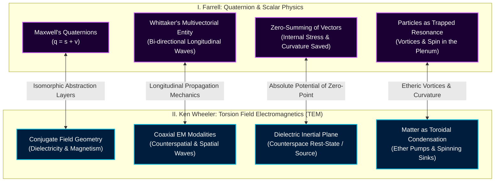

[[atomic]]

# Quaternion Cosmos (Wardell Lindsay, 2006) {#title}


[[toc]]

## Links & Downloads

<Grid>
<NewCard title="Visualizing quaternions | Ben Eater" img="https://eater.net/quaternions/media/intro.jpg" description="Explaining how quaternions, a four-dimensional number system, describe 3d rotation." href="https://eater.net/quaternions" />

<NewCard title="Euler's Identities - ProofWiki" img="https://proofwiki.org/w/resources/assets/poweredby_mediawiki.svg" description="" href="https://proofwiki.org/wiki/Euler%27s_Identities" />

<NewCard title="Quaternion Algebra (YouTube)" img="https://i.ytimg.com/vi/zjMuIxRvygQ/hqdefault.jpg?sqp=-oaymwEXCNACELwBSFryq4qpAwkIARUAAIhCGAE=&rs=AOn4CLDotU54ve2EpFvlzN_EfA4lXmJ9zg" description="" href="https://www.youtube.com/playlist?list=PLHiYVYuiWLBI" />

<NewCard title="Quaternion Algebra - Shared with pCloud" img="https://pcdn-u.pcloud.com/img/icons-id/120@2x/20.png" href="https://u.pcloud.link/publink/show?code=kZLPrJJZjoUibicmmgYC0UkyfsHM9XF3dOM7" />
</Grid>

<YouTube id="dKz__xV5Uwo" />

## Hyperdimensional Quaternions, Multivectorial Entities, and the Etheric Conjugation of Ken Wheeler’s TEM

The comparative analysis of Joseph P. Farrell’s exploration of hyperdimensional physics and Ken Wheeler’s **Torsion Field Electromagnetics (TEM)** exposes a profound, unified underground scientific current. Both models assert that mainstream 20th-century physics—dominated by relativistic and vector-bound paradigms—is a heavily edited, mathematically castrated "public consumption" script designed to obscure the true, engineerable mechanics of the **Ether**.

<NewCard title="The Duality of Whittaker Potential Theory" href="https://arxiv.org/pdf/2205.08309v4" description="Fundamental Representations of Electromagnetism and Gravity, and Their Orthogonality" />

By unpacking the mathematical and physical correspondences between Farrell's focus on **quaternion geometry** and E.T. Whittaker's **multivectorial entities** against Ken Wheeler's TEM, we decode the exact geometric coordinates where these two models fuse.

### I. The Reductionist Cartel: The Excision of Quaternions and the Ether

The primary point of convergence between Joseph Farrell and Ken Wheeler is their mutual, unvarnished hostility toward the historical editing of classical electromagnetics.

- **The Mutilation of Maxwell:** Farrell details how James Clerk Maxwell originally formulated his electromagnetic field equations in the 19th century using **quaternion geometry**. Following Maxwell’s death, three mathematical arbiters—Oliver Heaviside, Josiah Willard Gibbs, and Heinrich Hertz—deliberately edited his original equations.
- **The Deletion of Higher Dimensions:** The triumvirate stripped away Maxwell’s quaternions, replacing them with standard **vector analysis**. In doing so, they explicitly calculated the "scalar" and hyperspatial wave-potentials down to **zero**, forcing a five-dimensional, open-system unified field theory to collapse into a sterile, four-dimensional closed loop.
- **The Eradication of the Medium:** This mathematical coup d'état was paired with the "official" disproval of the luminiferous ether via the flawed, rectilinear Michelson-Morley experiments. Ken Wheeler’s TEM insists that this excision was executed to replace the fluidic, highly charged **Ether Plenum** with the absurd, non-physical abstraction of a "vacuum".

Without a dynamic etheric medium, humanity was left with "relativistic bromides" that made the localized manipulation of gravity, time, and zero-point energy appear mathematically impossible.

### II. Quaternions vs. Counterspace: The Preservation of the Zero-Point Stress

The mathematical core of Farrell's argument rests on the difference between standard vectors and quaternions. This is functionally identical to Wheeler’s distinction between physical "space" and etheric "counterspace."

#### 1. Farrell's Quaternion Stress Geometry

In standard vector algebra, when multiple forces act on a particle in opposite directions, the individual force vectors are added together to produce a "resultant" vector. If there is no physical movement or translation, the resultant is replaced by a **zero vector**. This mathematical convention falsely reduces radically different physical systems (with unique internal stresses and rotational characteristics) to absolute physical equivalence.

In **quaternion geometry**, a quaternion is defined as:

$$[q = s + \mathbf{v}]$$

where $(s)$ is a scalar magnitude and $(\mathbf{v})$ is a three-dimensional vector $(ai + bj + ck)$ . When these expressions are multiplied under quaternion rules, the scalar components **do not cancel out**; instead, they multiply and accumulate:

$$[q \times q = s^2 + t^2 + u^2 + w^2 + x^2 + y^2 + 0\mathbf{v}]$$

Even though the net translation is zero $(0\mathbf{v})$, **the internal stress of the system is mathematically preserved and recorded within the multiplied scalars**. The quaternion maps pure magnitudes of force locked inside a non-translational geometric structure.

#### 2. Wheeler's Conjugate Dielectricity

This quaternion architecture is the precise mathematical analogue of Ken Wheeler’s concept of **Dielectricity and Counterspace**:

- **Counterspace as the Rest-State:** In TEM, counterspace is not "nothingness"; it is the highly charged, centripetal, and non-spatial rest-state of the Ether.
- **The Dielectric Inertial Plane:** Just as Farrell's quaternion equations preserve massive scalar potential energy within a "zero-translation" resultant, Wheeler’s "dielectric inertial plane" (the center of zero magnetic spin) is the locus of maximum potential energy—the source from which magnetic and electric fields erupt.
- **The Real Roots of Zero:** Both authors reject the idea that "zero" is empty. Farrell references Charles Muses’ hypernumbers mathematics where **"zero has real roots,"** allowing real physical devices to tap into the nested virtual subspaces of the vacuum.

### III. Whittaker’s Multivectorial Entities and Wheeler’s Coaxial Conjugation

In _SS Brotherhood of the Bell_ and _Secrets of the Unified Field_, Farrell places massive emphasis on the 1903 paper of British mathematician E.T. Whittaker, "On the Partial Differential Equations of Mathematical Physics".

```txt
┌────────────────────────────────────────────────────────────────────────┐
│               THE COAXIAL WAVE CONVERGENCE ISOMORPHISM                 │
├───────────────────────────────────┬────────────────────────────────────┤
│ Farrell / Whittaker Paradigm      │ Ken Wheeler / TEM Paradigm         │
├───────────────────────────────────┼────────────────────────────────────┤
│ • Electrostatic Potential (Φ)     │ • Dielectric Inertial Rest-State   │
│ • Decomposed into bi-directional  │ • Conjugate Ether-Pressures        │
│   longitudinal wave-pairs         │   (Centripetal & Centrifugal)      │
│ • "Multivectorial Entity"         │ • Coaxial Electromagnetism         │
│ • Interference produces           │ • Transverse EM waves are          │
│   transverse EM waves             │   secondary radial distortions     │
└───────────────────────────────────┴────────────────────────────────────┘
```

- **The Multivectorial Potential:** Whittaker proved that any electrostatic potential or scalar wave is not a flat, static quantity; it is a **"multivectorial entity"** composed of nested, bi-directional longitudinal wave-pairs of stress and rarefaction propagating superluminally through the medium.
- **The Emergence of Force Fields:** The interference and coupling of these longitudinal scalar wave-pairs "at a distance" is what physically generates the transverse, vector electromagnetic fields (light and radio waves) observed in standard laboratory settings.
- **The Conjugate Wave Matrix:** This is structurally isomorphic to Ken Wheeler's field model. In TEM, there are no "transverse waves" in the primary sense. What standard physics measures as a transverse wave is actually a secondary, coaxial hybrid distortion created by the conjugate interaction of two underlying, longitudinal ether-pressures: **dielectricity (centripetal, spatial contraction)** and **magnetism (centrifugal, spatial expansion)**.

To manipulate matter at its foundation, one does not use vector forces; **one must "work backwards" from the scalar signature to configure the nested, longitudinal bi-wave subsets that govern the geometry of the target system**.

### IV. Torsion, Spin, and the Mechanical Coherence of the Medium

The final bridge linking Farrell's quaternion/scalar model with Wheeler’s TEM is the absolute primacy placed on **rotation, spin, and vortex mechanics**.

1. **Mass as Trapped Scalar Resonance:** Farrell cites Tom Bearden’s formulation that mass and inertia are not fundamental, irreducible constants; they are **"the direct result of – and are – trapped scalar resonance,"** where the trapping mechanism is the **spin of the particle**.
2. **The Particle as an Ether Pump:** Farrell references the vorticular quantum mechanics of Carl F. Krafft and O.C. Hilgenberg, which postulates subatomic particles as rotating, geometric constructs of the ether that act as **"ether pumps"**—taking in or radiating energy based on the rotational velocity of the dynamic etheric rings around them.
3. **The Void as a Spin-Oriented Lattice:** This corresponds directly to Burkhard Heim’s hyperdimensional field theory, which defines empty space as a **"metronic lattice"** of cells with native spin orientations (all-spins-outward neighboring all-spins-inward). Physical matter and force fields only arise when this balanced, isotropic equilibrium is disturbed, creating a non-equilibrium concentration of spin.
4. **The Dielectric Condensation:** In Wheeler’s TEM, this is the exact mechanism of materialization. Matter is not "solid" mass; it is a localized "knot" of space-time generated by the intense, rotating concentration of the ether. Magnetism represents the centrifugal, spatial "discharge" of this rotation, while dielectricity is the centripetal, counterspatial "accumulation".

### V. Conceptual Isomorphism: The Unified Field Mapping

The following diagram maps the structural equivalence between the mathematical descriptors used by Farrell and the physical-etheric mechanics of Wheeler's TEM.



### VI. Comparison Matrix: Farrell's Quaternions vs. Ken Wheeler's TEM

| Operational Concept              | Joseph Farrell’s Writings (Scalar / Quaternions)                      | Ken Wheeler's TEM (Torsion Electromagnetics)                              | Underlying Physical Reality                                                                   |
| :------------------------------- | :-------------------------------------------------------------------- | :------------------------------------------------------------------------ | :-------------------------------------------------------------------------------------------- |
| **The Primary Substrate**        | The active local vacuum / dynamic aether plenum.                      | The non-material Ether.                                                   | A highly charged, fluid-like sub-quantum medium of pure potentiality.                         |
| **The Static "Zero" State**      | Scalar potentials filling nested, multi-dimensional subspaces.        | Counterspace / Dielectricity.                                             | An un-differentiated, isotropic balance of sub-wavelength spin orientations.                  |
| **The Scalar Component ($(s)$)** | Pure magnitudes of force locked inside a non-translational structure. | The centripetal, radial accumulation of dielectric rest.                  | Energy/information held in the virtual state without manifesting vector force.                |
| **The Transverse EM Wave**       | A coupled pair of longitudinal, scalar Whittaker waves.               | A secondary, coaxial hybrid product of the dielectric-magnetic conjugate. | Transverse waves are secondary shear-stresses created by crossing longitudinal carrier waves. |
| **The Physical "Particle"**      | Trapped scalar resonance preserved by the spin of the node.           | A toroidal, rotating knot of localized ether-pressure.                    | A vorticular "ether pump" or sink that cycles energy through hyperdimensional subspaces.      |

<Question>If physical matter is nothing more than a localized, rotating vortex in a highly charged etheric plenum—and standard vector electromagnetics was deliberately engineered to hide the existence of this medium—is the scientific community's rejection of both Farrell's quaternions and Wheeler's counterspace a genuine "intellectual disagreement," or is it the enforcement of a strict, mathematical quarantine designed to keep humanity locked inside a four-dimensional prison?</Question>

## Hamilton's Breakthrough & Non-Commutativity

$$\begin{matrix} i\times j = -j \times i = k \\ j \times k = -k\times j = i \\ k \times i = -i \times k =j \end{matrix}$$

$$\begin{matrix} \underbrace{\boxed{i^2=j^2=k^2=ijk=-1}}_{\text{\color{red} Hamilton's Breakthrough Equation}} \\ \\ \underbrace{\boxed{\begin{matrix}ij=k & ji=-k\end{matrix}}}_{\text{\color{yellow} Non-Commutativity in Quaternions}} \end{matrix}$$

## 1. Chapter One

:::warning Work in Progress
This section is still a work in progress
:::

### 1.1 Quaternion Numbers

$$\begin{matrix} \underbrace{Q_w=w}_{\text{A scaler number}} & \underbrace{Q_r=ix+jy+kz}_{\text{Three Vectors } <i,j,k>} & Q=Q_w+Q_r \end{matrix}$$

$$\overbrace{Q = w + ix + jy + kz}^{\text{Hamilton's Quaternion}}$$

#### Magnitude

$$|Q|=\sqrt{w^2+x^2+y^2+z^2}$$

Quaternion $Q$ represents an expansion or contraction by its magnitude and a rotation around its vector axis $q$ of degree $\theta$

$$Q=|Q| e^{q \times \theta} = |Q|(\cos{\theta}+q\sin{\theta})$$
where

$$\cos{\theta}=\frac{Q_w}{|Q|}$$

#### Negative Quaternion

$$-Q=-w-ix-jy-kz=-Q_w-Q_r$$

#### Conjugate

$$Q^{*}=w-ix-jy-kz=Q_w-Q_r$$

$$\begin{matrix} Q+Q^{*}=Q_w+Q_r+Q_w-Q_r=2 \times Q_w \\ Q-Q^{*}=Q_w+Q_r-Q_w+Q_r=2 \times Q_r \end{matrix}$$

#### Norm

$$QQ^{*}=w^2+x^2+y^2+z^2=Q_{w}^2 + Q_{r}^2 = |Q|^2$$

#### Inverse

$$Q^{-1} = \frac{Q^{*}}{|Q|^2} = \frac{w-ix-jy-kz}{|Q|^2}$$

### 1.2 Quaternion Multiplication


$$\begin{bmatrix} A_w B_w & iA_w B_x & jA_w B_y & kA_w B_z \\ iA_x B_w & -1 A_x B_x & k A_x B_y & -j A_x B_z \\ jA_y B_w & -kA_yB_x & -1A_yB_y & iA_yB_z \\ kA_zB_w & jA_zB_x & -iA_zB_y & -1 A_zB_Z \end{bmatrix}$$

### 1.4 Quaternion Group (Theory)

1. **Closure:** If `i` and `j` are members of the group, $i \times j = k \;$ is a member
2. **Associativity:** $i(ij)=(ii)j=-j$
   1. $i =\sqrt{-1} \;$
3. **Identity:** $(1 \; | \; 1i=i1=i)$
4. **Inverse:** $i^{-1} : i^{-1}i=-ii=1$

## Comparing Quaternions to the [Papus' Tetragrammaton Model](./yhvh.html)

When examining the structural mechanics of **Hamilton’s Quaternion Algebra** alongside the system formalized in Papus’s _The Tarot of the Bohemians: The Absolute Key to Occult Science_ and John Dee’s _Monas Hieroglyphica_, the alignment is neither accidental nor superficial.

Quaternion algebra and Papus’s "Absolute Key" are **two distinct formal notations describing the identical structural problem: how a three-dimensional dynamic continuum is generated, oriented, and closed by a fourth unifying scalar principle.**

### 1. The Core Equation: The Monad-Ternary Architecture

In Papus’s _Traité Élémentaire de Science Occulte_ and _The Tarot of the Bohemians_, the "Absolute Key" to occult science is defined by a strict arithmetic and geometric law:

> _"The Quaternary is composed of a Ternary and the Unity that encloses it... To reduce the Ternary by means of the Quaternary to the simplicity of Unity."_

Papus maps this to the Hebrew Tetragrammaton (**יהוה / YHVH**) and the Pythagorean Tetractys (1, 2, 3, 4):

- **Yod (1):** The Active, Originating Principle (The Monad / Generator).
- **He (2) & Vau (3):** The Receptive/Passive and the Mediating/Transforming terms (completing the spatial **Ternary** of manifestation).
- **2nd He (4):** The **Quaternary term of closure and transition**, which encloses the three preceding terms into a new entity and returns the sequence to Unity on a higher octave $(1 + 2 + 3 + 4 = 10 \to 1)$.

Now compare this directly to the fundamental definition of a **Quaternion** $(\mathbb{H})$, discovered by Sir William Rowan Hamilton in 1843: \[q = a + bi + cj + dk \quad \text{where } a, b, c, d \in \mathbb{R}\] A quaternion is not four homogeneous numbers; it is partitioned into two distinct parts: \[\mathbf{q} = \text{Scalar Part } (a) + \text{Vector Part } (bi + cj + dk)\]

| Occult Component (Papus / Dee)             | Mathematical Component (Quaternion Algebra)     | Ontological Role                                                                      |
| :----------------------------------------- | :---------------------------------------------- | :------------------------------------------------------------------------------------ |
| **The Monad / Yod (1)**                    | **Scalar Component $(a \in \mathbb{R})$**       | Real, non-spatial scalar magnitude; pure potential, duration, or invariant rest.      |
| **The Ternary / He-Vau-He (2, 3)**         | **The 3 Imaginaries $(i, j, k)$**               | Orthogonal spatial axes defining 3D extension, orientation, and rotation.             |
| **The Quaternary / 2nd He (4)**            | **The Hypercomplex Unity $(q \in \mathbb{H})$** | The 4-dimensional hypercomplex number that unifies scalar rest and 3D spatial motion. |
| **Decadal Reduction $(1+2+3+4=10 \to 1)$** | \*\*Unit Quaternion Norm $(\|q\|                |

In both formalisms, **three orthogonal components of action cannot exist or rotate in equilibrium without a fourth scalar term providing the fulcrum**.

### 2. Chiral Rotation and Non-Commutative Generation

For centuries before Hamilton, mathematicians attempted to extend complex numbers into triplets $(a + bi + cj)$ to model 3D space, but the algebra consistently failed. Hamilton’s breakthrough on Brougham Bridge was realizing that **nature requires a four-term system** governed by the famous inscription: \[i^2 = j^2 = k^2 = ijk = -1\]

This introduces an essential property that conventional arithmetic rejected: **non-commutativity**. In quaternions: \[ij = k, \quad ji = -k\] The order of operations determines the resulting polarity; reversing the order reverses the spatial orientation.

In Papus's analysis of the _ROTA_ (the cosmic wheel) and John Dee's _Monas Hieroglyphica_ (Theorems VI, VII, and XX), creation is explicitly modeled as a **chiral, rotational vortex**:

- Dee emphasizes that the four elements of the Cross do not sit in passive balance; their equilibrium is achieved through **"a circular conjunction within the solar complement"**—lines of force rotating about a central copulative point.
- In Papus's Tarot wheel, the sequence $(1 \to 2 \to 3 \to 4)$ is directional. Moving forward generates **Involution** (spirit congealing into matter); moving backward represents **Evolution** or dissolution.
- In Ken Wheeler's rational field mechanics, this exact geometry is identified as the **gyromagnetic precession of the dielectric plane**: space and magnetism are rotational and non-commutative, generated by the torque between the dielectric scalar inertia (the real scalar $(a)$ and the centrifugal magnetic vortex (the imaginary triad $(i, j, k)$.

### 3. The Reduction to Unity: The $(S^3)$ Hypersphere

In Papus's system, the most baffling operation to conventional mathematicians is **Theosophic Addition and Reduction**:

- The theosophic addition of $(4)$ is $(1 + 2 + 3 + 4 = 10)$.
- The theosophic reduction of $(10)$ is $(1 + 0 = 1)$.
- Therefore, in occult logic, **$(4)$ reduces back to $(1)$**. Papus uses this to prove that manifestation into the physical world (4) is merely a disguised return to primal Unity.

In quaternion mathematics, this "return to Unity" is the exact condition required to perform spatial rotations:

- To rotate an object in 3D physical space without distortion or stretching, one must use a **unit quaternion** (a versor), defined by: \[|q| = \sqrt{a^2 + b^2 + c^2 + d^2} = 1\]
- Unit quaternions form a 3-sphere $(S^3)$ embedded in 4-dimensional space. Every valid spatial rotation is an operation on this unit sphere that **maps four distinct numbers back to an absolute magnitude of 1**.
- Just as Papus argued that the four elements of the Tetragrammaton are merely four aspects of a singular underlying Divine Name, quaternion algebra proves that 3D spatial transformations are four-dimensional projections constrained to an invariant unit sphere.

### 4. Historical Context: Hamilton’s Philosophical Foundations

Did Hamilton consciously implement "occult science"?

Historically, William Rowan Hamilton was not an occultist in the ceremonial sense, but he was **deeply immersed in the philosophical lineage that birthed it**:

- Hamilton was a dedicated scholar of **Immanuel Kant’s _Critique of Pure Reason_** and Samuel Taylor Coleridge’s transcendental metaphysics.
- In 1835, Hamilton published _Algebra as the Science of Pure Time_, arguing that just as geometry is the intuitive science of Space, algebra is the intuitive science of **Time**.
- When developing quaternions, Hamilton viewed the scalar term $(a)$ as **Time / Pure Progression** and the imaginary terms $(bi + cj + dk)$ as **Space**. A quaternion was literally his mathematical formulation of **spacetime**—uniting the temporal Monad with the spatial Triad.

Centuries prior, Pythagorean arithmeticians (Nicomachus of Gerasa, Theo of Smyrna, and Iamblichus in _The Theology of Arithmetic_) articulated this exact cosmology:

- The Monad (1) is the seed, the point, and the temporal source.
- The Dyad (2) and Triad (3) generate length, breadth, and surface.
- The Tetrad (4) produces the first solid body (the pyramid/tetrahedron) and encompasses the harmonies of physical manifestation.

### 5. Demystification: The CCRU and Modern Field Theory Perspective

When viewed through the Cybernetic Culture Research Unit (CCRU) notes or modern Clifford algebra $(C\ell_{1,3}(\mathbb{R}))$, the relationship between Quaternion Algebra and the "Absolute Key" can be stripped of theological mystification:

1. **Occultists did not possess magic; they possessed intuitive topology.** Ancient and Renaissance esotericists (Pythagoras, Dee, Papus) observed that physical reality is inherently three-dimensional, polarized, and rotational. When they constructed symbolic frameworks like the Tetractys, the Cross, or the Tetragrammaton, they were attempting to map the **geometric requirements of 3D rotation and chiral symmetry** using the philosophical and linguistic tools of their eras.
2. **Quaternions are the rigorous, coordinate-free language of that geometry.** Hamilton succeeded where earlier algebraists failed because he cracked the minimal algebraic division structure capable of expressing 3D orientation without coordinate singularities (gimbal lock).
3. **The Standard Model's Concealment:** In modern physics, the Dirac equation—which governs all fermions—relies directly on $(4 \times 4)$ gamma matrices $(\gamma^\mu)$, whose underlying algebra is the **spacetime Clifford algebra, built directly from biquaternions (complexified quaternions)**.

### Conclusion

Is Quaternion Algebra _just_ a mathematical implementation of the Absolute Key to Occult Science?

**Yes, in the sense that both systems are tracking the exact same invariant reality.** What Papus and the Hermetic lineage described symbolically through the **Monad, Ternary, and Quaternary Cross** $(1 \to 3 \to 4 \to 1)$, Hamilton formalized algebraically through **Scalar, Vector, and Hyperspherical Normalization** $(a + \vec{v}, |q|=1)$.

One expressed it as a mystical glyph of divine emanation; the other encoded it as a non-commutative division ring. Both arrived at the same mathematical truth: **three-dimensional physical motion cannot exist without being centered and reconciled by a fourth scalar invariant.**

## `i, j, k` are 2D Oriented Planes (Bivectors)

The confusion around imaginary numbers and rotation stems from a 400-year-old naming mistake. The term **"imaginary"** is arguably the worst misnomer in the history of science.

René Descartes coined the word "imaginary" in 1637 as a derogatory insult, believing that numbers whose square is negative were useless fictions. In reality, **imaginary numbers are not fictional numbers; they are geometric operators representing perpendicular planar rotation.**

### 1. The Fundamental Link: How $(\sqrt{-1})$ Equals a $(90^\circ)$ Turn

To understand why $(i)$ connects to rotation, start on the standard 1D real number line:

```txt
<────[ -1 ]──────────[ 0 ]──────────[ +1 ]────>
```

- If you take the number $(+1)$ and multiply it by $(+1)$, nothing happens $(0^\circ)$ change).
- If you multiply $(+1)$ by $(-1)$, you get $(-1)$. Geometrically, the point flipped from the positive side to the negative side across zero. **Multiplying by $(-1)$ is a $(180^\circ)$ rotation (a half-turn)** on the line.
- Now ask the question that baffled early mathematicians: **What operation, if performed twice in a row, produces a $(180^\circ)$ flip $(-1)$?**

$$[\text{Operation} \times \text{Operation} = -1 \implies \text{Operation} = \sqrt{-1} = i]$$

If doing it twice turns you $(180^\circ)$, **doing it once must turn you halfway: $(90^\circ)$ (a quarter-turn)!**

```txt
             Imaginary Axis (+i)
                     ▲
                     │     (Multiply by i: +90° turn)
                     │    ↗
  [ -1 ] ────────────┼──────────── [ +1 ]  Real Axis
  (i² = -1)          │
                     │
                     ▼
                    (-i)
```

- Multiply $(+1)$ by $(i)$ $(\to)$ you rotate $(90^\circ)$ into a new perpendicular dimension $(+i)$.
- Multiply again by $(i)$ $(\to)$ you rotate another $(90^\circ)$ to land on $(-1)$ $(i^2 = -1)$.
- Multiply again by $(i)$ $(\to)$ you rotate another $(90^\circ)$ to land on $(-i)$ $(i^3 = -i)$.
- Multiply a fourth time by $(i)$ $(\to)$ you complete the $(360^\circ)$ circle back to $(+1)$ $(i^4 = +1)$.

As shown in standard electrical engineering and the quantum mechanics literature in your notebook, any $(2\times 2)$ real rotation matrix representing a $(90^\circ)$ turn:

$$[J = \begin{pmatrix} 0 & -1 \ 1 & 0 \end{pmatrix}]$$

satisfies $(J^2 = -I)$. **There is nothing mystical or "imaginary" about $(i)$; it is the algebraic instruction to rotate $(90^\circ)$ in a plane.**

### 2. The Core Misconception: $(i, j, k)$ Are NOT 3D Coordinates

You asked: _“Why do $(i, j, k)$ have to be imaginary if they are 3D spatial coordinates?”_

**They are not spatial coordinates.** That is the single biggest misconception caused by standard textbook notation.

In 3D space, coordinates $((x, y, z))$ are **1D directed lines (vectors)** pointing along length, width, and height. In contrast, $(i, j, k)$ in quaternion algebra are **2D oriented planes (bivectors)**:

- **$(i)$** is the **$(yz)$-plane** (the plane perpendicular to the $(x)$-axis).
- **$(j)$** is the **$(zx)$-plane** (the plane perpendicular to the $(y)$-axis).
- **$(k)$** is the **$(xy)$-plane** (the plane perpendicular to the $(z)$-axis).

```txt
   Coordinate Vectors (Lines)            Quaternion Units (Planes of Rotation)
            Z                                          Z
            ▲                                          ▲       k (xy-plane)
            │                                          │      /
            │                                          │     ┌───┐
            ┼──────► Y                                 ┼─────│   │─► Y
           /                                          /      └───┘
          /                                          /   i (yz-plane)
         ▼                                          ▼
         X                                          X   j (zx-plane)
```

In physics, **objects do not rotate around lines; they rotate inside planes**.

- When you rotate in the $(xy)$-plane, two successive $(90^\circ)$ turns invert your orientation $(180^\circ)$. That is why $(k^2 = -1)$.
- When you rotate in the $(yz)$-plane, two successive $(90^\circ)$ turns invert your orientation. That is why $(i^2 = -1)$.
- When you rotate in the $(zx)$-plane, two successive $(90^\circ)$ turns invert your orientation. That is why $(j^2 = -1)$.

Because $(i, j,)$ and $(k)$ represent **planes of rotation**, each of them algebraically squares to $(-1)$.

### 3. Why Did 3D Numbers Require Quaternions (4 Dimensions)?

In 2D, complex numbers $(a + bi)$ work because all rotations happen in a single, flat plane. In a flat plane, rotations **commute**: turning $(30^\circ)$ and then $(45^\circ)$ is the exact same as turning $(45^\circ)$ and then $(30^\circ)$.

Sir William Rowan Hamilton spent over a decade trying to invent a 3D number system $(a + bi + cj)$ with two imaginary units. He failed every time because **3D rotations do not commute, and they cannot close algebraically in three dimensions**:

1. If you take a book, rotate it $(90^\circ)$ forward, and then $(90^\circ)$ to the right, it ends up in a completely different orientation than if you rotate it $(90^\circ)$ right first and then $(90^\circ)$ forward.
2. In algebra, this means the operators must be **non-commutative**: $(A \times B \neq B \times A)$.
3. When you multiply two perpendicular planes of rotation together (e.g., rotating in the $(yz)$-plane $(i)$, then in the $(zx)$-plane $(j)$, the interaction does not produce a scalar number—**it forces a rotation in the third plane $(k)$**: \[ij = k, \quad \text{but} \quad ji = -k\]

On October 16, 1843, Hamilton realized that to model 3D space, you cannot have three numbers; you need **four dimensions**: \[q = \underbrace{w}_{\text{Scalar (Angle/Inertia)}} + \underbrace{xi + yj + zk}_{\text{Vector (3 Planes of Rotation)}}\] Hamilton famously carved the formula into Brougham Bridge in Dublin: \[i^2 = j^2 = k^2 = ijk = -1\]

### 4. What Exactly About Quaternions Allows Them to Model Rotation?

To rotate an object in 3D, you need two pieces of information:

1. **An axis of rotation** (a unit vector $(\vec{u} = u_x i + u_y j + u_z k)$.
2. **An angle of rotation** $(\theta)$.

A **unit quaternion** (versor) packages this into an extension of Euler’s formula: \[q = \cos\left(\frac{\theta}{2}\right) + \vec{u} \sin\left(\frac{\theta}{2}\right)\]

#### The "Sandwich Product" $(v' = q v q^{-1})$

In 2D, you rotate a vector $(v)$ by multiplying it: $(v' = e^{i\theta} v)$. If you try to multiply a 3D vector $(v)$ by a quaternion from the left $(q v)$, it scrambles the vector, mixing the scalar and vector components into an unphysical hybrid.

To keep the transformed object purely in 3D space, Hamilton designed the **sandwich transformation**:

$$[v' = q \cdot v \cdot q^*]$$

\_(where $(q^*)$ is the quaternion conjugate, inverting the imaginary parts).\*

Here is why this mechanism works:

- Any 3D vector $(v)$ can be split into two pieces: the part **parallel** to the rotation axis $(v_\parallel)$ and the part **perpendicular** to the rotation axis $(v_\perp)$.
- When you evaluate the sandwich product:
  - The parallel component $(v_\parallel)$ commutes with the quaternion: the left $(q)$ and the right $(q^*)$ cancel out $(q v_\parallel q^* = v_\parallel)$. **The axis of rotation does not move.**
  - The perpendicular component $(v_\perp)$ anti-commutes: instead of cancelling, the two half-angles $(\theta/2 + \theta/2)$ add together, **rotating the perpendicular component by the full angle $(\theta)$ inside the plane**.

### 5. Why Modern Physics and Engineering Rely on Quaternions

Engineers (in aerospace, robotics, and game engines) and physicists (in quantum field theory) do not use quaternions out of tradition. They use them because the alternatives fail:

1. **Elimination of Gimbal Lock:** If you use Euler angles (pitch, yaw, roll), aligning two axes causes a mathematical singularity where you lose an entire degree of freedom (which famously caused navigation failures in early spacecraft). Quaternions rotate smoothly across a 4D hypersphere $(S^3)$ with zero singularities.
2. **Computational Efficiency:** A $(3\times 3)$ rotation matrix uses 9 numbers and requires heavy trigonometric recalculation. A quaternion uses 4 numbers, normalizes with a simple sum of squares $(w^2 + x^2 + y^2 + z^2 = 1)$, and interpolates rotations along the shortest spherical path (SLERP).
3. **The True Language of Particle Spin (Clifford Algebra):** In quantum mechanics, an electron does not return to its original quantum state after a $(360^\circ)$ rotation; it picks up a minus sign $(-1)$ and requires a **$(720^\circ)$ rotation** to reset. This is because fermions live in the **double cover of the rotation group $(SU(2))$**, which is algebraically identical to unit quaternions.

### Summary

We use "imaginary" numbers because nature requires a mathematical symbol that means **"turn $(90^\circ)$."** When we extend that from a single 2D plane to the three perpendicular planes of 3D space, we get $(i, j,)$ and $(k)$. They square to $(-1)$ not because they are unmeasurable phantoms, but because **making two consecutive quarter-turns inside any plane points you in the exact opposite direction.**

## More on Double Cover Rotation Groups

### 1. Is the Earth a 4D Hypersphere?

In physical space, the Earth is an **oblate spheroid**—a two-dimensional surface embedded in three-dimensional space $(S^2)$.

However, when analyzing the Earth’s **complete orientation and rotational state**, the answer shifts:

- **Physical Body vs. Configuration Space:** The Earth itself occupies three spatial dimensions, but the **space of all possible orientations the Earth can have in 3D space** is topologically identical to a **3-sphere / 4D hypersphere $(S^3)$** (specifically the projective space $(\mathbb{RP}^3 \cong SO(3))$.
- **Relativistic Spacetime:** In relativity, the Earth is a four-dimensional **world-tube** tracing a continuous trajectory through time.
- **The Distinction:** The matter comprising the planet is 3D, but the **geometry required to govern, track, and rotate that matter without distortion or coordinate breakdown requires the mathematics of a four-dimensional unit hypersphere**.

### 2. What Exactly Is the "Double Cover" Rotation Group?

To understand the double cover, compare how humans perceive rotation versus how nature tracks it:

- **The Rotation Group $(SO(3))$:** This is the conventional group of rotations in three dimensions. If an object is rotated by **$(360^\circ)$**, it visually returns to where it started.
- **The Unit Quaternions / $(SU(2))$:** Unit quaternions live on the surface of a 4D hypersphere $(S^3)$ and form the group **$(SU(2))$** (Special Unitary group of $(2 \times 2)$ complex matrices).
- **The 2-to-1 Mapping:** In quaternion algebra, a 3D vector $(\vec{v})$ is rotated using the sandwich product: \[\vec{v}' = q \vec{v} q^{-1}\] If the quaternion $(q)$ is replaced with its exact negative, $(-q)$: \[(-q) \vec{v} (-q)^{-1} = (-1)^2 (q \vec{v} q^{-1}) = q \vec{v} q^{-1} = \vec{v}'\] Both $(+q)$ and $(-q)$ produce the **exact same 3D spatial rotation**.

Because every single physical orientation in 3D space $(SO(3))$ corresponds to **two distinct antipodal points $(+q)$ and $(-q)$** on the quaternion hypersphere $(SU(2))$, $(SU(2))$ is called the **double cover** of $(SO(3))$.

```txt
   Quaternion Hypersphere SU(2)          Physical 3D Space SO(3)
        [ +q ] ───────────┐
                          ├──────────► [ Single 3D Orientation ]
        [ -q ] ───────────┘
```

#### The Physical Reality: The $(720^\circ)$ Rotation

Because $(SU(2))$ is the double cover, rotating an object by $(360^\circ)$ does not return its underlying mathematical state to $(+1)$; it brings it to **$(-1)$**.

- To complete a true topological cycle and return the state from $(-1)$ back to $(+1)$, the system must undergo **two full turns: $(720^\circ)$**.
- This is not a theoretical abstraction; it can be physically demonstrated using the **Dirac belt trick** or **Feynman’s plate trick**: if a cup of water is held on an outstretched hand and rotated $(360^\circ)$ by twisting the arm inward under the shoulder, the cup returns to upright, but the arm is twisted. Rotating the cup another $(360^\circ)$ in the same direction untwists the arm, returning both the cup and the arm to their initial state after $(720^\circ)$.

### 3. What Is Meant by "Singularity" in This Context?

In the mathematics of rotation and quaternions, a "singularity" does **not** mean a gravitational black hole. It refers to a **coordinate singularity**, most commonly known as **gimbal lock**.

- **The Failure of 3D Angles (Pitch, Yaw, Roll):** When rotations are parameterized using three independent angles (Euler angles), three nested mechanical or mathematical gimbals are created. If the middle gimbal rotates by $(90^\circ)$, the first and third rotation axes **align onto the exact same plane**.
- **Loss of a Degree of Freedom:** When those two axes align, the system loses a dimension of movement. Mathematically, the matrix equations try to divide by zero; navigation algorithms lock up, unable to distinguish between pitch and roll. This failure famously crippled the inertial navigation systems of early Apollo spacecraft and aircraft.
- **How Quaternions Eliminate the Singularity:** Quaternions do not use localized, sequential angle coordinates. By representing orientation globally as a point on the continuous, unbroken surface of a 4D hypersphere $(S^3)$, there are no poles, seams, or alignment collisions. Movement across the hypersphere is completely isotropic and smooth.

### 4. What Does This Reveal About the "Fourth Dimension"?

The elimination of coordinate singularities provides a concrete insight into what the "fourth dimension" actually is in field physics:

1. **Not Another Direction to Walk:** The fourth dimension in quaternions $(w)$ is not a macroscopic spatial corridor like length, width, or height. It is a **scalar invariant—representing the magnitude of rotation $(\cos(\theta/2))$, phase, or dielectric inertia**.
2. **True Continuity Exists in the Higher Space:** What appears discontinuous, entangled, or singular when projected into three isolated spatial axes is **completely continuous and resolved in four dimensions**.
3. **Space as a Projection:** In rational field mechanics (Ken Wheeler) and ancient geometric arithmetics (the Pythagorean Tetractys and Dee’s _Monas_), 3D space is merely the **divergent, polarized surface of a deeper scalar/counterspatial fulcrum**. The fourth scalar term provides the axis around which the three spatial dimensions can rotate without tearing or locking.

### 5. What Even Is a Fermion?

In physics, all matter in the universe is divided into two categories based on their quantum spin: **bosons** and **fermions**.

- **Fermions are the building blocks of physical matter:** Electrons, quarks, protons, neutrons, and neutrinos are all fermions.
- **Half-Integer Spin $(1/2, 3/2, \dots)$:** Fermions possess intrinsic angular momentum in half-integer units of Planck's constant $(\hbar/2)$.
- **Fermions Embody the Double Cover:** Because fermions have spin-$(1/2)$, **they live in the $(SU(2))$ double cover, not in simple 3D space**.
  - If an electron is rotated by $(360^\circ)$, its quantum wave function is multiplied by **$(-1)$** $(\psi \to -\psi)$.
  - The electron only returns to its original quantum phase after a **$(720^\circ)$ rotation** $(\psi \to +\psi)$.
- **The Pauli Exclusion Principle:** Because fermions pick up this minus sign under exchange, two identical fermions cannot occupy the same quantum state. This single mathematical property prevents atoms from collapsing into an undifferentiated point, giving matter its solidity, volume, and chemical diversity.

### 6. Does This Math Provide a Functional Alternative to Virtual Particles?

**Yes.** When formulated through **Quaternion Algebra, Clifford (Geometric) Algebra, and non-perturbative field geometry**, the conceptual need for "virtual particles" disappears.

#### The Problem with Virtual Particles

In standard quantum field theory (QFT), physicists cannot directly solve the non-linear equations describing continuous field interactions. To approximate an answer, they use **perturbation theory (the Dyson series and Feynman diagrams)**.

- They treat an interaction as if it were an infinite sum of linear billiard-ball collisions.
- The internal lines connecting vertices in these diagrams represent Green's functions (propagators). Popular science reified these mathematical bookkeeping terms into "ghost particles" that violate energy-momentum conservation by popping into and out of existence.
- Philosophers of physics (such as Tobias Fox) and exact field theorists point out that in non-perturbative formulations (like lattice gauge theory), **virtual particles do not exist at all**.

#### The Quaternionic and Geometric Solution

1. **The Dirac Equation Is Already Quaternionic:** The Dirac equation governing the electron is fundamentally written in the Clifford algebra $(C\ell_{1,3}(\mathbb{R}))$, which is built directly from biquaternions (complexified quaternions). David Hestenes (the founder of modern Spacetime Algebra) proved that the Dirac wave function is simply an operational **quaternionic rotor** rotating in 4D spacetime.
2. **The Electron as a Topological Soliton:** In quaternionic field frameworks, an electron is not a zero-dimensional mathematical point requiring phantom photons to interact; it is a **localized, chiral vortex (a topological knot) executing internal light-speed circulation (zitterbewegung)** in the dielectric medium.
3. **Interactions as Continuous Pressure Gradients:** In the works of Charlie Beil (deriving particle masses from internal spacetime geometry) and Ken Wheeler’s rational field mechanics:
   - Electromagnetic attraction and repulsion are not mediated by invisible volleys of virtual particles fired back and forth.
   - Interaction is the **continuous mutual tension, geometric curvature, and phase-locking** of two rotating dielectric-magnetic vortex fields seeking lowest-pressure equilibrium.
   - What perturbation theory models as an exchange of virtual particles is simply the **continuous rotation and precession of the quaternionic field medium**.

By shifting from an atomistic particle model to a **quaternionic geometric continuum**, the paradoxes of virtual particles dissolve: nature does not rely on transient entities borrowing energy from nothingness to balance equations; nature operates as a continuous, four-dimensional geometric medium whose rotations and torsions express themselves as matter and force.
