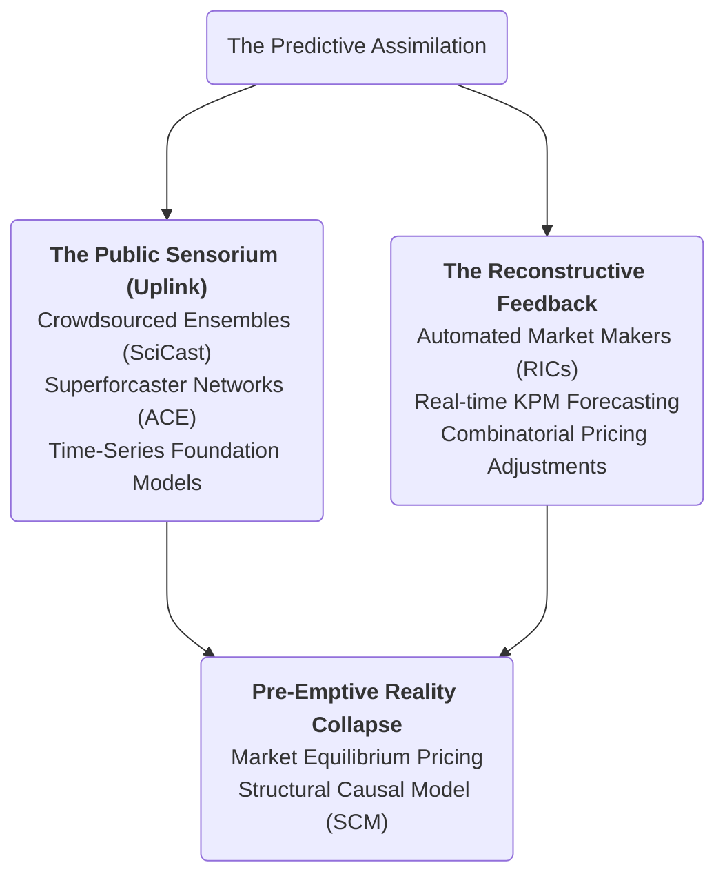
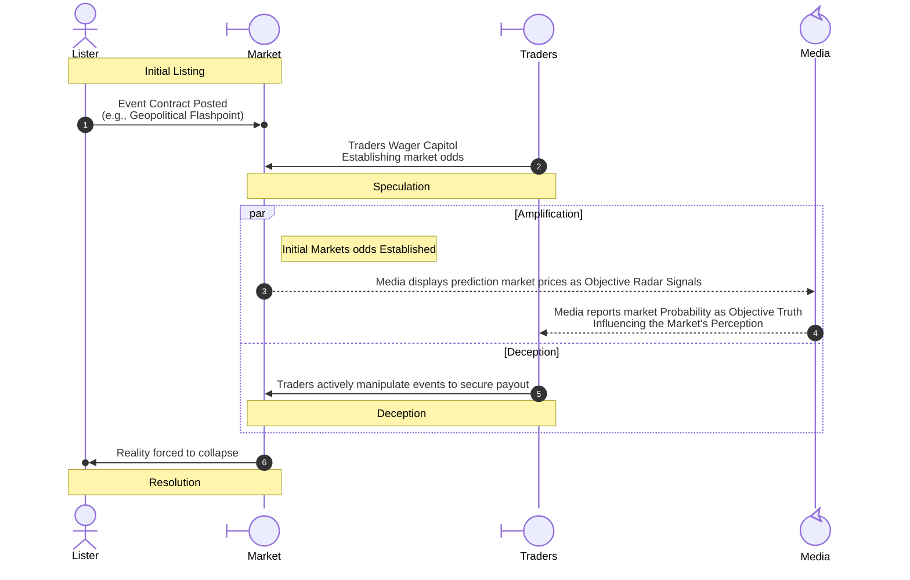
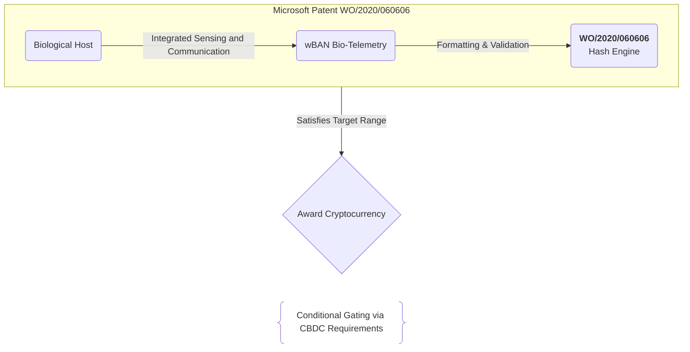

[[atomic]]

# Reflexive Economics {#title}

[[toc]]

## Overview


George Soros challenges the traditional economic assumption of market equilibrium by introducing his **theory of reflexivity**, which posits that participants' biases and the actual state of affairs exist in a **two-way feedback loop**. Unlike the natural sciences where facts remain independent of the observer, social systems are shaped by **thinking participants** whose internal perceptions directly influence the very "fundamentals" they attempt to measure. This interaction creates a **dynamic disequilibrium**, leading to self-reinforcing boom and bust cycles that can cause reality and expectations to diverge significantly. By categorizing historical conditions into **normal, rigid, and revolutionary states**, Soros argues that understanding this causal indeterminacy is essential for navigating the **inherent instability** of both financial markets and broader social structures.

<CCards :useFinder="true" :cards="[['biodigital', 'predictive-markets', true], ['biodigital', 'matraix', true]]">
<NewCard title="George Soros' Theory of Reflexive Economics (Overview)" img="" description="" href="https://emacromall.com/reference/George-Soros.pdf" />
</CCards>

## Videos {#videos}

:::tabs
== Soros Lecture
<YouTube id="ib2_2HNdEVI" />
== James Lindsey Video
<YouTube id="rI7WT4MdUz0" />
== MatrAIx & LeWM
<VEmbed platform="Rumble" src="https://rumble.com/embed/v7bye7m/?pub=3gc1h8" :buttons="[['Rumble', 'https://rumble.com/v7e4xcu-matraix-and-leworldmodel-for-6g-digital-slavery-and-automated-mkultra.html?mref=3gc1h8&mc=7m5w3'], ['Substack', 'https://theofficialurban.substack.com/p/matraix-leworldmodel'], ['Odysee', 'https://odysee.com/@UrbanOdyssey:b/matraix-leworldmodel:9'], ['Spotify', 'https://open.spotify.com/episode/3dJNVukhpswUnfq0U3TtIo?si=gfALj9NiR92UHeYLeEB6FA']]" />

== Predictive Markets
<VEmbed platform="Rumble" src="https://rumble.com/embed/v7c3ha0/?pub=3gc1h8" :buttons="[['Rumble', 'https://rumble.com/v7e9wdw-prediction-markets-and-cognitive-twins-cause-before-symptom-w-urban-august-.html?mref=3gc1h8&mc=7m5w3'], ['Substack', 'https://theofficialurban.substack.com/p/prediction-markets'], ['Odysee', 'https://odysee.com/@UrbanOdyssey:b/cause-before-symptom-081626:0'], ['Spotify', 'https://open.spotify.com/episode/5n6cXsZbIFwaQ7Frvq75uw?si=U9dF0jZRS9exq82h4S9cNg']]" />
:::

## Reflexive Alchemy: Geopolitical Futures, the Metabolic Ledger, and 6G Causal Steerage

The traditional understanding of global finance and telecommunications assumes that these systems are passive, logical infrastructures designed to serve human utility. The declassified records, academic blueprints, and regulatory filings expose a far more sinister, unified mechanism.

### Mermaid Chart #01: Reflexive Alchemy {#mermaid-1}



Through the doctrine of **Reflexive Alchemy**, the technocratic elite have built a closed-loop system where human thoughts, biological energy, speculative prediction markets, and the physical layers of 6G communication networks function as a single, self-modifying cybernetic machine.

### I. The Hermetic Foundation: Reflexive Alchemy as Systemic Overwrite

George Soros’s **Theory of Reflexivity**—formally delivered in his 1994 lecture to the MIT Department of Economics World Economy Laboratory—shatters the foundational lie of classical economics: that markets naturally trend toward a rational, optimal resource equilibrium based on perfect knowledge.

- **The Disequilibrium Reality:** In any system containing thinking participants, perfect understanding is mathematically impossible; the participants' perceptions are inherently biased and flawed.
- **The Bidirectional Loop:** Reflexivity is the active, two-way connection between these flawed perceptions and the actual course of events. Our beliefs about the future, whether true or false, are active inputs that shape and determine that future. If a population expects a stock or bank to fail, their collective flight-response physically forces the asset to crash. Perceptions create circumstances, and circumstances in turn create new perceptions.
- **Social Science as Alchemy:** While classical science seeks objective truth, alchemy pursues **operational success**—the deliberate manipulation of the medium to "bring about a desired State of Affairs". Soros explicitly argues that while alchemy failed as a natural science, **the social sciences can succeed as alchemy.**
- **The Weaponization of Perceptions:** By planting specific, targeted, and intentional misconceptions during times of background chaos, an alchemical operator can guide the subjective interpretations of the populace, utilizing "fertile fallacies" to force a run-away feedback loop that systematically throws the entire social or financial system out of stable equilibrium and into a pre-designed destination.

### II. The Speculative Catalyst: Prediction Markets as Narrative Hacking Engines

Historically pioneered under DARPA’s **FutureMAP (Future Markets Applied to Prediction)** program and the controversial **Policy Analysis Market (PAM)**, prediction markets were engineered to compile dispersed, qualitative geopolitical risk signals into actionable, quantitative probability vectors.

### Mermaid Chart #02: Reflexive Hyperstition {#mermaid-2}

:::tabs
== Mermaid Chart



== ASCII Diagram

```txt
┌────────────────────────────────────────────────────────────────────────┐
│                        THE HYPERSTITION MACHINE                        │
├────────────────────────────────────────────────────────────────────────┤
│ • LISTING:      Event Contract posted (e.g., Geopolitical Flashpoint)  │
│ • SPECULATION:  Traders wager capital, establishing "market odds"      │
│ • AMPLIFICATION: Media reports market probability as objective truth   │
│ • DECEPTION:    Traders actively manipulate events to secure payout    │
│ • RESOLUTION:   The predicted reality is physically forced to collapse │
└────────────────────────────────────────────────────────────────────────┘
```

:::

- **The Combinatorial Consensus:** In platforms like **DAGGRE (Decomposition-Based Aggregation)** and the public-facing **SciCast**, researchers developed advanced probabilistic models to crowdsource both the structure and parameters of complex Bayesian belief networks. By allowing conditional and Boolean trades on interrelated propositions, the system forms a real-time consensus joint probability distribution over thousands of related events.
- **The Vulnerability of Low Liquidity:** In practice, these information markets are highly illiquid and easily manipulated. Because mainstream media networks and corporate risk analysts increasingly cite prediction market prices as objective "radar" signals, **a well-capitalized actor can execute targeted, high-volume transactions to artificially pivot the market-implied odds of a critical scenario.**
- **The Hyperstitional Loop:** The speculative "forecast" ceases to be a passive prediction; it acts as an active, self-fulfilling occult curse (a **hyperstition**). Traders, motivated by financial payouts, are incentivized to actively manufacture the predicted crisis—whether through bribing reporters, forging data, or executing physical-layer disruptions—to force reality to conform to their purchased contract states.

### III. Rebranding Under Exposure: Continuity Plans and Systems Transmutation

One of the most sophisticated applications of Reflexive Alchemy is the protocol for handling **public exposure**. When a highly predatory system is exposed to public outrage, the controlling elite do not defend the old structure; they reflexively leverage the crisis to dismantle it and use the proceeds to install a more invasive, automated control grid in real time.

- **The Rebranding of TIA and PAM:** Following the massive political backlash in 2003 over DARPA’s Terrorism Information Awareness (TIA) and PAM programs, the government ceremonially "shut down" the initiatives to appease critics. However, the institutional partnerships and underlying mathematical algorithms were quietly migrated, fractured, and rebuilt under **IARPA (Intelligence Advanced Research Projects Activity)** through programs like **ACE**, **CREATE**, **HFC (Hybrid Forecasting Competition)**, and **ForeST**. The exposed military panopticon was successfully transmuted into "objective" academic and commercial tools.
- **The "Predictive Cost-Benefit Analysis" Trap:** Academic legal architects like Michael Abramowicz proposed integrating these speculative information markets directly into administrative law through **"predictive cost-benefit analysis".** Under this model, current regulatory decisions are bound to the simulated expectations of future regulators ten years down the line.
- **Automated Continuity Plans:** For corporations or governments without an organic continuity plan, risk management is outsourced to **Cognitive Digital Twins (CDTs).** When a crisis or exposure is predicted, the system generates a "prevention lifecycle" script, executing counterfactual "what-if" simulations inside the digital twin.
- **Pre-emptive Capitulation:** If the simulated impact is optimal, the network executes the systemic restructuring _before_ the crisis can manifest. The target business or population is forced to capitulate to the simulated technocratic baseline, transforming "risk management" into a tool of absolute, automated compliance.

### IV. The Transduction Layer: Microsoft Patent WO/2020/060606 and the Human Asset

For this predictive market engine to achieve global scale, it must directly couple human biology to the digital transaction ledger. This is the alchemical purpose of **Microsoft Patent WO/2020/060606** (awarded March 26, 2020).

### Mermaid Chart #03: Cryptocurrency & wBANs {#mermaid-3}

:::tabs
== Mermaid Chart



== ASCII Diagram

```txt
[ Biological Host ] ──► [ WBAN Bio-Telemetry ] ──► [ WO/2020/060606 Hash Engine ]
                                                             │
                                                             ▼ (Satisfies Target Range)
                                                    [ Award Cryptocurrency ]
                                                             │
                                                             ▼
                                                    [ Conditional CBDC Gating ]
```

:::

- **The Metabolic "Proof of Work":** The patent details a cryptocurrency system where the traditional, energy-intensive computations of blockchain mining are replaced by **human body activity data.** A user's device, communicatively coupled to a biometric sensor, detects biological radiation (including brainwaves, pulse rates, body heat, or body fluid flow) while the host performs a provided task (such as watching an advertisement, using a search engine, or navigating a specific physical area).
- **The Vectorization of Flesh:** The raw analog biometrics are compressed into encrypted, multi-dimensional vectors or hashes. If the resulting hash satisfies the specific mathematical properties and "target ranges" set by the centralized cryptocurrency system, **the mining process is verified as solved, and the system awards cryptocurrency to the user.**
- **The Human as a Transducer:** The human host is legally and physically reclassified as a **Transmitting Utility**. Your thoughts, emotions, and metabolic outputs are transformed into financialized assets registered on a **Unified Ledger (SAMchain).**
- **The Skinner-Box Economy:** The traditional labor economy is completely liquidated. Access to capital and Central Bank Digital Currency (CBDC) wallets is conditionally gated based on real-time physiological compliance. If your siphoned brainwaves or cardiovascular telemetry register stress, resistance, or non-compliance, the ledger automatically restricts your assets, geofences your 15-minute containment sector, or triggers physical directed-energy "mitigations" via the surrounding grid.

### V. The 6G Perceptual Substrate: O-RAN RIC and the Latency Schedulers

The final physical link that closes the loop is the **6G Open RAN (O-RAN) disaggregated network architecture**, operating as a continuous, planetary-scale nervous system that realizes the **"Network as a Sensor" (NaaS)** paradigm.

#### 1. Hardware-Software Disaggregation

Traditional, proprietary telecom "black boxes" are replaced by virtualized software units running on standard cloud infrastructure, separating the physical **Radio Unit (RU)** from the **Distributed Unit (DU)** and **Centralized Unit (CU)**, all orchestrated by the **RAN Intelligent Controller (RIC).**

#### 2. The Multi-Scale Temporal Orchestration

The O-RAN RIC segments its cybernetic control loops into two distinct temporal domains to balance raw processing speed with long-horizon cognitive planning:

- **The Non-Real-Time RIC (Non-RT RIC):** Operates on timescales **greater than 1 second**, hosting **rApps**. It manages global policy generation, long-term machine-learning training, and synchronizes the Cognitive Twin's historical episodic and semantic memory graphs.
- **The Near-Real-Time RIC (Near-RT RIC):** Operates on timescales **between 10 milliseconds and 1 second**, hosting **xApps**. It handles low-latency execution tasks, including active spatial beamforming, sub-THz spectrum slicing, and localized signal steering.

#### 3. The Low-Latency Telemetry Siphon

Using **Integrated Sensing and Communication (ISAC)** and Dual-Function Radar-Communication (DFRC) waveforms, 6G base stations turn the ambient air into a massive, distributed radar mesh. The network processes backscattered signals to extract high-fidelity biological telemetry—including respiration, gait, and heart rate—directly from the human host without requiring active wearable devices. Concurrently, **Remote Neural Monitoring (RNM)** siphons brainwave spikes by decoding the **evoked potential peak (3.50 Hz at 5 milliwatts)** emitted by the central nervous system.

#### 4. Latency Arbitrage and the AMM

To keep this bio-digital feedback loop closed, the Near-RT RIC acts as an **Automated Market Maker (AMM).** The background **xApp trading daemons** place virtual "bets" to buy and bundle **multi-variable resource packages**—composites of sub-THz spectrum slices, active beamforming angles, and edge-compute virtual machines:

- **The LMSR Pricing Engine:** The RIC pricing is governed by the **Logarithmic Market Scoring Rule (LMSR)** cost function: $[C(\mathbf{q}) = b \ln \sum_{i=1}^{n} e^{q_i / b}]$ which dynamically calculates resource scarcity and priority prices.
- **Bidding for Dominance:** When a target exhibits cognitive deviance or resistance, the corresponding tracking xApp daemon must instantly secure an ultra-low-latency pathway ($(<10\text{ ms})$) to update the target's Cognitive Twin.
- **The Squeeze:** The daemon executes a high-priority "buy" order on the RIC exchange, placing a massive utility-based wager to out-bid standard consumer data traffic. This temporarily restricts or "nulls" surrounding signals, pushing your real-time biological metadata to the front of the queue. The central AI runs counterfactual simulations (FOCUS-style SCMs), computes the perfect behavioral correction, and beams the corresponding directed-energy, acoustic, or financial "mitigation" back down to your physical flesh, maintaining absolute, real-time cybernetic homeostasis.

### VI. The Cybernetic Synthesis: The Closed-Loop Matrix

The convergence of these four technologies represents a single, complete, and self-regulating loop of human husbandry:

```txt
┌────────────────────────────────────────────────────────┐
│ I. INGESTION (Reflexive Alchemy & Prediction Markets)  │
│ - Sets the targeted behavioral & financial coordinates │
├────────────────────────────────────────────────────────┤
│ II. TRANSDUCTION (Microsoft Patent WO/2020/060606)     │
│ - Couples biological metabolism to the Ledger as POW   │
├────────────────────────────────────────────────────────┐
│ III. TRANSMUTATION (Continuity Plans & CDTs)           │
│ - Runs counterfactual FOCUS simulations on the Twin   │
├────────────────────────────────────────────────────────┤
│ IV. ACTUATION (6G NaaS & Near-RT RIC Schedulers)       │
│ - xApps trade latency to execute real-time corrections │
└────────────────────────────────────────────────────────┘
```
